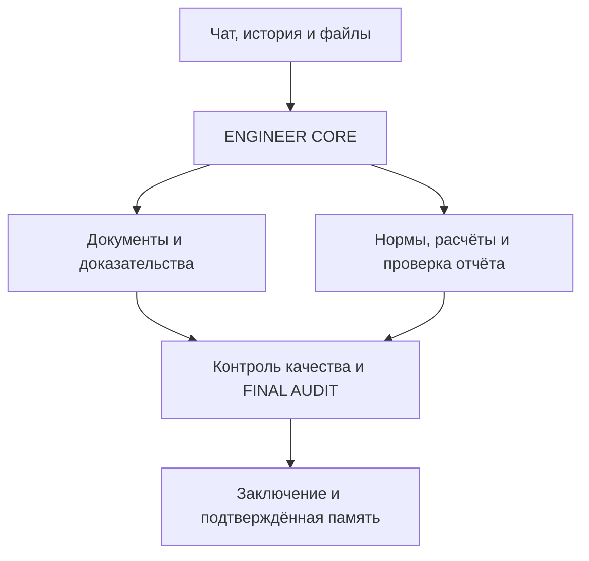

# ENGINEER OS — живая карта проекта

Обновлено: 09.10.2026. Это файл передачи состояния разработки, а не инженерное доказательство и не FINAL AUDIT. После существенного результата обновлять этот же файл; сохранять его имя и историю версий.

Идентичность этой карты: пользовательский файл `libfile_947c39aad11c81918c7887832c1411bb`, имя `ENGINEER_OS_PROJECT_MAP.md`. Обновлять этот же ID с фактической текущей версией. Правило сопровождения — `AGENTS.md`; краткий указатель — `docs/development/project-map-handoff.md` и README. Актуальная ветка и проверенный результат указаны ниже; ранние SHA и результаты сохраняются в исторических разделах.

## 1. Новому чату: сначала прочитай это

**Активный план:** расчёты отложены. §92 итог: PR108 MERGED, кандидатe0754b2;Core857/Windows55/Security SUCCESS;реальный DOCX Store послеresume14684/14684,749/749 controlled-model batches;V4 renders534/534. №13 открыт:qualified tables/graphics/formulas/OCR/Word-layout/corpus.8✅/8🟡/3❌.

## Текущие 19 пунктов — что выполнено и что осталось

Сводка на 09.10.2026: **8 выполнены в указанном программном объёме, 8 частично готовы, 3 открыты**. ✅ не означает принятие объекта или готовность всего продукта.

| № | Пункт | Статус | Что сделано / что осталось |
|---|---|---|---|
| 1 | Единая рабочая версия | ✅ Кандидат | PR91 перенесён в официальный кандидат22ad4c1; tree2670623 совпадает с проверенным90263af. Финальный main/release отдельно. |
| 2 | OCR и локальная модель | ✅ Программный контур | Извлечение, метрики, отрицательные проверки и Linux/Qwen проверены; полнота всех документов относится к №13. |
| 3 | Большие документы, resume/recovery | ✅ Программный контур | Контрольные точки, идентичность, лимиты и повторный запуск реализованы и проверены. |
| 4 | DOCX/XLSX/DOC и заявленные форматы | ✅ Программный контур | Оригиналы, координаты и происхождение данных связаны; сложные таблицы остаются в №13. |
| 5 | ТЗ → источник → требование → вывод | ✅ Программный контур | 47 требований, 42 позиции источников, версионные оценки и общие запреты приёмки проверены. |
| 6 | Нормативная и расчётная верификация | 🟡 Частично | Расчётная часть отложена пользователем09.10.2026. Native input ZIP в кандидате PR101; R4 helper PR102 отдельно, real RES/KE57/нагрузки/полные сочетания/model→run/нормы открыты; §§85–87. |
| 7 | Реальный инженерный сценарий | ✅ Отрицательный сценарий | 3 оригинала, 36 кандидатов, роли и повторная проверка норм пройдены с BLOCK; положительный кейс — №14. |
| 8 | FINAL AUDIT и граница приёмки | ✅ Программный контур | Проверены неизменяемость, устаревание, подмена и чужой источник; реальное положительное принятие не подтверждено. |
| 9 | Windows: один запуск | 🟡 Отложено | Launcher/supervisor реализованы; физический холодный старт, перезагрузка и сквозной запуск NOT_RUN. |
| 10 | Консолидация и источник истины | ✅ Интеграция | PR91 merged squash по правилам репозитория; общий код официального кандидата22ad4c1. История исходного объединения сохранена на integration/engineering-streams-20261009. |
| 11 | Интерфейс и рабочий процесс | 🟡 Интеграция | Интерфейс кандидата объединён с инженерными формами/CAD/памятью;4 Chromium маршрута,мобильный экран иsession reset PASS. Перенос и приёмка на реальном объекте остаются. |
| 12 | Backup, restore, recovery и защита | 🟡 Интеграция | Единое ядро двух форматов, SHA/SQLite, ключи, CAD/память/settings сохраняются. Воспроизведённые внутренние symlink/hardlink ошибки устранены; Core/Security CI PASS. CodeQL29 high требует triage; перенос и physical Windows остаются. |
| 13 | Производственная полнота документов | ❌ Открыто | PR108 merged,e0754b2:real DOCX14684/14684 послеresume,749/749 controlled-model batches;V4 render534/534 и40OCR candidates. Qualified tables/graphics/formulas/OCR/Word-layout/corpus не подтверждены (§92 итог). |
| 14 | Реальный ACCEPTED-кейс | ❌ Открыто | Нужен квалифицированный объект с полным ТЗ, свежими нормами/расчётами и положительным FINAL AUDIT. |
| 15 | Подтверждённая инженерная память | 🟡 Программный маршрут | Актуальный accepted audit → точные основания → HMAC scope/origin → версии/recall/revoke/delete/export/backup реализованы; повторная проверка обязательна. Реальный положительный объект остаётся нужен. |
| 16 | Генератор заключений | 🟡 Частично | Черновики/история/координаты/coverage dossier/stale export,3 шаблона и исходные иллюстрации в DOCX/PDF проверены. Принятый инженерный выпуск остаётся открыт. |
| 17 | CAD/DWG | 🟡 DXF маршрут | Оригинал DXF/DWG,DXF inventory/locator/отдельная аннотация/diff/export/backup проверены,включая ресурсы и точные параметры аннотации. Реальный CAD файл и проверенный DWG конвертер/roundtrip остаются. |
| 18 | Несколько ИИ | 🟡 Частично | Локальный Ollama/Open WebUI/диагностика готовы; shared gateway проверяет hostname/redirect/response bounds/completion. Полный optional-provider receipt/live-provider сценарий ещё не завершён. |
| 19 | Стабильный финальный выпуск | ❌ Открыто | Нужны все продуктовые критерии, чистая установка, Windows, ACCEPTED-кейс, release/tag и соответствующий main. |

**Интеграция завершена:** PR91 merged в официальный кандидат. Следующий этап — №13 полнота документов и остальные четыре направления.

Подробности прежнего объединения — §65; актуальная сводка и новый проход — §67.


**Историческая справка:** следующие ранние записи не заменяют результат раздела67.

Мы продолжаем существующий ENGINEER OS пользователя Максима. Проект не начинать заново. Цель — бесплатное локальное инженерное приложение, а не только проверка одного PDF. Фундамент и адаптеры уже есть; первый локальный сценарий чат → файл → фоновая задача → ответ → история реализован и опубликован в PR38. Реальный запуск на Windows с qwen3 и принятый инженерный кейс пока не подтверждены.

Активный результат — локальный кабинет с подготовкой и предварительным исполнением ролей ENGINEER CORE, реестром кандидатов, native координатами, просмотром страницы и журналом проверки источников и импортом оригиналов Drive и раскрытием покрытия извлечения и автоматическим анализом PDF (разделы 18–31); Document Intelligence продолжается отдельно: достоверное извлечение документов объекта «БЦ, ул. Набережная, 28А», прежде чем использовать их как доказательства. Последний полный повторный прогон: **534 страницы, 523 без ошибки нормализации, 11 BLOCK; полностью подтверждённых страниц 0, документ BLOCK, FINAL AUDIT NOT_RUN, acceptance=false**. 523 — UNCERTAINTY, а не ACCEPTED.

Проверенный код восстановления: локальный commit `e6498854bc8012d698afabb7c62e56db9b900d02`, ветка `fix/pdf-completeness-audit`. Эти изменения НЕ опубликованы: автоматическая проверка отклонила push без явного разрешения на публикацию. PR #35 содержит прежний head `d20d8595094f452bd70d28c18f52cb7d0eede665`. Не пытайся воспроизвести новый результат старым кодом.


## 2. Зачем создаём систему

ENGINEER OS должен помогать инженеру обследовать здания и сооружения: читать ТЗ и отчёты, извлекать факты с координатами источника, проверять инженерную логику, нормы и расчёты, работать с ЛИРА/SCAD и DWG, готовить заключения, сохранять историю и подтверждённые знания.

Целевой пользовательский сценарий: локальный запуск → чат и файлы/Drive → проверка извлечения → реестр доказательств → профильные агенты → контроль качества → заключение → FINAL AUDIT → ACCEPTED только при выполненных условиях.

Требования пользователя: бесплатные решения, без обязательных платных API; Windows; один удобный запуск; чат, история, память, фоновые задачи; Google Drive для документов. Open WebUI + Ollama — выбранный локальный путь. Дополнительные модели возможны через адаптеры, но не должны превращаться в обязательную платную зависимость.

## 3. Границы и логическая карта



Схема показывает целевой поток, а не факт завершённой интеграции. ENGINEER OS отвечает за инженерную методологию и договоры данных. Runtime отвечает за запуск агентов, инструменты, сессии, очереди и доступ к файлам. Не переписывать runtime и не импортировать большие сторонние репозитории вместо нужного адаптера.

| Часть | Где код | Фактический статус |
|---|---|---|
| Инженерное ядро | `engineering/core/` | CORE_PLAN и предварительные роли CORE_RUN связаны с worker; контракты укреплены PR44, черновики/ошибки сохраняются PR45; доказательная экспертиза и принятый кейс не выполнены |
| Document Intelligence | `engineering/document_intelligence/`, `scripts/` | Docling, нормализация, provenance, source recovery и реестр; полнота документа не подтверждена |
| Нормативная проверка | `engineering/normative/verification.py`, `skills/normative-check/` | Структура проверки реализована; проверенных актуальных редакций и полного агента ещё нет |
| ЛИРА / SCAD | `engineering/calculation/model_intake.py`, `skills/calculation-review/` | Проверка комплекта и идентичности файлов; семантика моделей и solver-run не проверены |
| Модели | `engineering/model_gateway/openai_compatible.py` | Живая Qwen3-8B CPU: CORE_RUN обе роли COMPLETED за220с, реальная native таблица91,64с, damaged-label fixture48,97с; UNCERTAINTY, acceptance=false — раздел32; OCR/графика остаются |
| Память | `engineering/memory/external_memory.py` | Граница доверия и snapshots; история диалогов/задач нового кабинета сохраняется в SQLite, подтверждённая инженерная память ещё не подключена |
| Хранилище | `engineering/storage/` | Drive-адаптеры; OAuth пользовательского Windows требует отдельной проверки |
| База и acceptance | `supabase/migrations/`, Supabase-адаптеры | Миграции и gates есть; наличие облачных функций не означает воспроизводимость backend из Git |
| Интерфейс | `index.html`, `app.js`, `styles.css`, `auth-recovery.js` | Панель проектов/задач/агентов/аудита; отдельный локальный кабинет engineering/local_app/ui содержит чат, загрузку и историю; просмотр, source review, CORE_PLAN и выбор/результаты предварительных ролей CORE_RUN связаны; полного инженерного принятия нет |
| Локальный запуск | `scripts/run_v4_local.py`, `.cmd`, Docker/runtime | Start_ENGINEER_OS.cmd + scripts/run_local_app.py запускают новый кабинет с worker; запуск CLI здесь проверен, Windows launcher NOT_RUN |
| CAD / отчёт | Договоры ролей, `skills/report-review/`, `skills/final-audit/` | Завершённого DWG/CAD маршрута и принятого итогового отчёта нет |

Состояние облака из `application-status-2026-10-03.md` является наблюдением 03.10, а не свежей проверкой сегодня. Там обнаружен разрыв между облачными функциями и их исходниками в Git. Не повторять старые числа таблиц/функций как текущие без проверки.

## 4. Где работаем и чем пользуемся

| Место | Назначение и ссылка |
|---|---|
| Основной GitHub | https://github.com/maxim505885-jpg/engineer-os |
| Отдельная PDF-ветка | `fix/pdf-completeness-audit`; draft PR https://github.com/maxim505885-jpg/engineer-os/pull/35 |
| Основание PR35 | `fix/pdf-region-ocr-repair`; ветки и PR были последовательными, main не равен последнему рабочему состоянию |
| Текущий локальный checkout | `/workspace/scratch/499af82b6df5/engineer-os` — временный путь этой сессии |
| Восстановленные входные данные | `/workspace/scratch/499af82b6df5/restored-checkpoint/` — распакованный проверочный архив |
| Прежний checkout | `/workspace/scratch/5b79d4619022/engineer-os-pdf-completeness`; здесь нашлись неопубликованные правки; это не постоянный адрес |
| Windows пользователя | Ранее использовались `C:\Users\maxim\engineer-os` и `C:\Users\maxim\engineer-os-docling-smoke`; актуальную папку проверять |
| Локальные модели пользователя | Ранее Open WebUI `http://127.0.0.1:8080`, Ollama и `qwen3:8b` работали; эта Linux-сессия не проверяла нынешний Windows |
| Дополнительные репозитории | `maxim505885-jpg/hermes-agent`, `codex`, `open-webui`, старый `ENGINEER-OS_`; не считать их основным кодом ENGINEER OS |

В этой сессии фактически использовались инструменты GitHub для чтения состояния, файлы проекта и Python/Node для проверки, Google Drive для исходника, сохранённые пользовательские файлы для передачи результатов. Доступность подключений проверять в новом чате. Supabase/Railway — компоненты инфраструктуры; их работа сегодня здесь не переаттестована. Figma/Sites не являются обязательным путём текущего локального приложения.

## 5. Какие документы используем

Основной PDF: `15.09.2026 ТЗК БЦ ул. Набережная 28А V4 сшито с графикой.pdf`, 534 страницы, 74 522 583 байта.

SHA256: `b5d95b660b35bfb6b2441623635cba91c235efd754bc283dfe1405f075834916`.

Drive file ID: `1Ycw-dcevqNSHgvb_y0pVa7B1lM4uhK6g`; ссылка https://drive.google.com/file/d/1Ycw-dcevqNSHgvb_y0pVa7B1lM4uhK6g/view . Полный оригинал также включён в архив продолжения. В архиве лежит `source/v4-drive-source.pdf`.

| Дополнительные источники | Что уже проверяли | Что не считать выполненным |
|---|---|---|
| Исходный полный отчёт DOCX | Нативная инвентаризация таблиц/изображений; выбранные фрагменты сопоставлялись с PDF | Полное соответствие страниц Word/PDF, полная семантическая проверка |
| `Расчет .docx` / `.doc`, `Таблицы.xlsx` | Таблица нагрузок сопоставлялась; 125 ячеек XLSX совпали с выбранной DOCX-таблицей | Применение нагрузок к расчётной модели |
| Координатный XLSX | Четыре формулы пересчитаны | Единицы, система координат и модельные привязки |
| Два файла `.lir` | Идентичность и бинарные заголовки ЛИРА-САПР | Геометрия, материалы, опоры, комбинации и результаты расчёта |
| Геодезия и графика | Оригиналы открывались и визуально инвентаризировались | Все размеры/подписи и полное соответствие V4 |
| Сжатый V3 | Отдельно идентифицирован; изображения ТЗ не дали большей разрешающей способности | Автоматическая эквивалентность V3 и V4 |

Нативный полный отчёт DOCX: пользовательский файл `libfile_10792d9386208191b103ee233d892250`, SHA256 `b253439bdd673a775eaf209ca7d398d766efae5f4a18ac33fa6679f7faae28a5`. Повторные загрузки могут иметь похожие имена и другие ID; выбирать по содержимому и SHA256, а не по дате или имени.

ТЗ на страницах 5–8 содержит трудночитаемые растровые фрагменты. Более качественное подтверждённое ТЗ пока не получено; Word/V3 не являются автоматически более точным источником. Извлечённые строки, OCR-кандидаты и совпадения отдельных таблиц не подтверждают весь документ.

## 6. Проверенное состояние PDF и кода

| Проверка на коде e649885 | Результат |
|---|---|
| Сырые экспорты, SHA источника | 534/534 проверены |
| Нативный текст и размещение изображений | 534/534 повторно сверены с исходником |
| Исходные ошибки нормализации | 126 страниц |
| Ошибки сняты по картам исходника | 115 страниц |
| Без BLOCK нормализации | 523 страницы UNCERTAINTY |
| Остаток BLOCK | 11 страниц |
| Отдельный аудит нативных сеток | 59 таблиц, 6119 ячеек; ограниченный выбранный scope |
| Смешанные визуальные assets | 102 SHA256 проверены |
| Полнота страниц / документа | 0 полностью подтверждённых страниц; документ BLOCK |
| Регрессия разработки | 227 тестов Python, 4 теста Node, синтаксис app.js и diff check прошли |
| Воспроизведение | Архив распакован, 1514 файлов сверены по хешам; повторный полный прогон дал тот же постраничный реестр |
| Инженерный FINAL AUDIT | NOT_RUN; ACCEPTED не выдан |

Это повторная нормализация сохранённых экспортов Docling текущим кодом. Новый полный запуск Docling не выполнялся. PASS привязки к источнику не доказывает полноту физической сетки или смысл извлечённых значений. Короткие/бледные/прерывистые внутренние линии эвристика может пропустить; она не выдаёт сертификат полноты.

Восстановлены ранее неопубликованные адаптеры ручных растровых ячеек и измеренного дрейфа векторных осей. Добавлены исходные одноколоночные панели страниц 57–58 с проверкой подписи по native words, digest целевого экспорта и изображениями исходных ячеек. Исправлены обходы через пропущенные внутренние линии и перезапись исходника через hardlink. Серая заливка без рамки не должна считаться физической сеткой.

История чисел: опубликованный реестр был 498/36; прежний неопубликованный результат 521/13 пересмотрен после усиления проверки; промежуточные 523/11, 515/19 и 513/21 не являются текущим итогом. Новый подтверждённый source-bound прогон — 523/11 на e649885, 177.81 с. Предыдущие 512/22 относятся к 6da5964. Одинаковые числа разных прогонов не означают одинаковые проверки. Не смешивать количество выбранных таблиц, ячеек, страниц и полноту документа.

## 7. На чём остановились и что уже продолжили

BLOCK-страницы: **3, 5, 7, 9, 171, 179, 341, 481, 486, 488, 500**.

Детектор светлых рамок исправлен и проверен на оригинальных пикселях всех просмотренных растровых карт страниц 176–180, 255–257, 338–342. Светлый пиксель должен иметь более светлый фон с обеих сторон в пределах трёх исходных пикселей: яркость <232, контраст >=24. Общий тёмный порог 128 не повышен. Серая заливка без рамки отклоняется; светлые необъявленные разделители тоже отклоняются. Отдельные тесты проверяют рамку в 1–2 пикселях от края изображения и светлый разделитель рядом с чёрной рамкой. Независимое ревью обнаружило близкий разделитель; замечание исправлено и перепроверено.

| Остаток | Подтверждённая причина | Следующее действие |
|---|---|---|
| 179, 341 | Первые две просмотренные растровые таблицы восстановлены; table_index=2 полного экспорта не имеет карты. На исходной странице нижняя часть таблицы продолжается за изображением, замкнутой нижней рамки нет | Восстановить связь с продолжением на следующем листе и явно учитывать незамкнутую границу; не дорисовывать рамку |
| 9 | Правая граница cost-header-price не подтверждается | Отдельно сопоставить незамкнутую структуру с источником |
| 3, 5, 7, 171, 481, 486, 488, 500 | Неоднозначные/пропущенные ячейки; полного применимого восстановления нет | Индивидуальная привязка к исходной странице; ТЗ проверять по читаемому источнику |

На странице 500 отдельно просмотрен исходный графический лист: планы и условные обозначения, нативных слов и embedded images нет. Docling предложил таблицу по графическим объектам/легенде. Это диагностическое наблюдение, а не готовое восстановление текста или разрешение исключить целевой узел.

Текущий полный реестр: `/workspace/scratch/499af82b6df5/v4-contrast-final-recheck-20261005/page-register.json` и CSV. Полный source-bound replay: 534 raw exports, 534 native inventories, 115 устранённых из 126 исходных ошибок; 523 UNCERTAINTY / 11 BLOCK. Результаты recovery сохранены в дополнительном пользовательском архиве **ENGINEER_OS_contrast_checkpoint_2026-10-05.zip**. Он дополняет, а не заменяет исходный checkpoint. Внутри cumulative patch от remote d20d859 до текущего локального HEAD и инструкция воспроизведения.

Промежуточный первый вариант фиксированных флангов дал 515/19; это историческая диагностика, НЕ текущий результат. После регрессий и исправления локального поиска флангов полный прогон дал 523/11. Acceptance=false, 0 полностью подтверждённых страниц, FINAL AUDIT NOT_RUN.

## 8. Как воспроизвести и что читать в коде

Для нового результата 523/11 использовать исходный архив вместе с **ENGINEER_OS_contrast_checkpoint_2026-10-05.zip**: применить cumulative patch к чистому checkout d20d859, затем выполнить команду из CONTINUATION.md дополнительного архива. Старый patch 6da5964 и старый реестр сами по себе дают 512/22, а не текущий результат.

Постоянный архив: **ENGINEER_OS_continuation_2026-10-05.zip**, пользовательский файл `libfile_7408d21eac00819195eba3d01c4f4c91`. 88 147 091 байт, SHA256 `fbd315d683976adcec5d2278268e8110ada7773589d706cc705989706892b4b5`.

Внутри: оригинальный PDF; `checkpoint/` с 534 raw exports, native inventories, картами и изображениями; `review/page-register.json` и CSV; `CONTINUATION.md`; `input-file-sha256.json`. Код и OCR-модели в этот архив не включены. Проверенный код — отдельный локальный commit; патч `ENGINEER_OS_changes_6da5964.patch` находится в `/workspace/scratch/499af82b6df5/deliverables/`. Если локальный checkout исчезнет до публикации, сначала восстановить патч; не выдумывать отсутствующий remote commit.

Отчёт продолжения: `ENGINEER_OS_progress_2026-10-05.md`, пользовательский файл `libfile_2057cf38a8908191a74446569547777c`.

После восстановления исходных данных и проверенного кода, из корня проекта:

```bash
python3 -m pip install -r requirements-pdf-review.txt
python3 -m unittest discover -s tests -q
node --test tests/dashboard_counts.test.cjs
node --check app.js
git diff --check
python3 scripts/recheck_v4_exports.py /absolute/restored/source/v4-drive-source.pdf --checkpoint-dir /absolute/restored/checkpoint --output-dir /absolute/new-recheck
```

Выходная папка должна быть новой, вне `checkpoint`. Установка requirements-пакета не устанавливает полный Docling; повторный реестр использует архивные экспорты. Здесь проверены PyMuPDF 1.26.6 и Pillow 12.3.0; это не аттестация Windows пользователя.

| Файл относительно корня Git | Для чего открыть |
|---|---|
| `AGENTS.md` | Обязательные инженерные договоры и дисциплина работы |
| `docs/ARCHITECTURE.md`, `docs/AGENT_CONTRACTS.md`, `docs/FINAL_AUDIT.md` | Границы системы, роли, условия приёмки |
| `docs/development/application-status-2026-10-03.md` | Фактические ограничения MVP; сведения об инфраструктуре исторические |
| `docs/development/pdf-page-register-2026-10-05.md`, `v4-continuation-summary-2026-10-05.json` | Текущая сводка 523/11 на e649885; code_file_sha256 сверяет реализацию |
| `scripts/recheck_v4_exports.py` | Полный реестр и точная идентичность входов/кода |
| `scripts/recover_reviewed_raster.py` | Растровые ячейки, `_line_fraction`, `_checked_cells`, порог RULING_DARKNESS |
| `scripts/source_pdf_tables.py`, `recover_source_panels.py` | Измеренные оси и одноколоночные панели |
| `scripts/recover_docling_export.py`, `recover_native_pdf_regions.py`, `capture_pdf_grid_assets.py` | Нативные/смешанные карты и проверка source binding |
| `engineering/document_intelligence/docling_adapter.py`, `evidence_validation.py`, `evidence_persistence.py` | Нормализация, доверие кандидатов и persistence gates |
| `tests/test_reviewed_raster.py`, `test_source_panels.py`, `test_source_pdf_tables.py`, `test_recheck_v4_outputs.py` | Регрессии recovery и защиты исходника |
| `docs/development/object-source-audit-2026-10-04.md`, `tor-soil-source-check-2026-10-05.md` | Ограниченные проверки Word/XLSX/LIR и альтернативных источников |
| `docs/development/curated-repositories-catalog-2026-10-04.json` | 100 репозиториев уже просмотрены по README/метаданным; это не доскональный аудит всего кода |

Полный старый `docs/development/pdf-page-register-2026-10-05.json` в Git хранит исторические 498/36. Текущий полный JSON — внутри архива, не этот исторический файл.

## 9. Что ещё нужно довести до приложения

| Приоритет | Работа | Проверяемое условие завершения |
|---|---|---|
| PDF | Детектор исправлен; 11 оставшихся BLOCK, полнота текста/рисунков/связей | Source-bound проверки, постраничное покрытие; отсутствие ошибки нормализации не заменяет полноту |
| Параллельно PDF | Воспроизводимый backend и локальный runtime + Ollama | Один реальный task без обязательного платного ключа; исходники/конфигурация доступны |
| MVP | Чат, upload/Drive, история, review UI и worker | Один запускаемый локальный пользовательский сценарий с историей и очередью |
| Инженерный кейс | Выбранные проверенные evidence → ТЗ → профильные проверки → контроль | Прослеживаемые выводы по одному реальному объекту; разрешённый FINAL AUDIT |
| Расчёты | Семантика ЛИРА/SCAD, нагрузки, опоры, единицы, комбинации, solver | Реальные результаты и логи, соответствие фактической конструкции |
| CAD и выпуск | DWG/CAD и проверяемый отчёт | Подтверждённый графический маршрут и выпуск документа без выдуманных данных |
| Память / обучение | Использование подтверждённых результатов | Кандидаты, чужие сообщения и snapshots не получают статус доказательств автоматически |

Проверка PDF не должна останавливать независимые задачи приложения. При этом полный непроверенный текст нельзя использовать для принятого инженерного вывода. Не заменять интеграцию установкой очередного agent framework: границы runtime уже определены.

## 10. Правила, которые нельзя терять

Факт важнее предположения. ТЗ определяет scope. Различать PROJECT, ACTUAL, MEASURED, TESTED, CALCULATED, ASSUMED, INTERPRETED, UNKNOWN; неизвестное не заполнять «правдоподобным» значением.

Не искать дефекты ради списка замечаний и не объявлять правильный отчёт ошибочным из-за несовпадения с шаблоном системы. «Не видно» не равно «нет». OCR-кандидат, confidence и processed в БД не равны доказательству, полноте или ACCEPTED. Не дорисовывать цифры/рамки, не менять запятые/единицы или строки оригинала молча.

Нормативы: документ → редакция → область применения → пункт → требование → фактическое условие → сравнение → вывод. Проверять действительность и применимость перед использованием. Наличие LIR-файла не означает выполненный расчёт. PASS отдельного теста не означает FINAL AUDIT.

## 11. Как обновлять карту и продолжать в новом чате

При старте: найти **ENGINEER_OS_PROJECT_MAP.md** в пользовательских файлах, прочитать целиком; затем проверить `git status`, HEAD/ветку, текущий PR и SHA источника. Считать временные пути подсказками, а не гарантированными адресами. Если карта расходится с наблюдением, записать расхождение и проверить источник.

После каждого существенного изменения/проверки обновлять в этом же файле: дату, текущую задачу, локальный HEAD и remote HEAD отдельно, выполненные действия, фактические результаты/границы проверки, оставшиеся BLOCK, следующее конкретное действие и расположение новых данных. Исправлять старые текущие числа; историю кратко сохранять отдельно.

Обновлять существующий пользовательский файл с сохранением ID/версий, а не создавать десятки новых карт. Полученный при сохранении ID файла хранить в локальном указателе; не угадывать его. При конфликте версии сначала прочитать актуальную версию и сохранить чужие изменения. Эта карта не обновляется фоновым расписанием сама по себе: её обновляет работающий над проектом агент.

Публикация неопубликованного PDF-кода в GitHub ранее отклонена автоматической проверкой; это не относится к уже разрешённым и опубликованным интеграциям. Не обходить отказ другим инструментом. После явного разрешения — отправить проверенный локальный код в ту же рабочую ветку, обновить draft PR, проверить CI; слияние и развёртывание учитывать как отдельные действия. Сейчас можно продолжать локальные изменения, диагностику и сохранение результатов.

Следующее конкретное действие: проверить исходную третью таблицу страниц 179/341 и её продолжение на 180/342, подготовить source-bound контракт для открытой границы без фиктивной рамки. Независимо от этого продолжать локальный сценарий приложения (Ollama → задача → история). Ограничения инженерного принятия PDF не блокируют разработку приложения. Блок «Работаю дальше» не добавлять в ответы пользователю.

Сообщение для нового чата: «Продолжай ENGINEER OS. Найди и прочитай ENGINEER_OS_PROJECT_MAP.md целиком, проверь фактическое состояние и выполняй раздел “Следующее конкретное действие”. Не начинай проект заново. После результата обновляй эту же карту».

## 12. Краткая история последних действий

- 03.10: зафиксированы фундамент и реальные ограничения приложения; полного MVP нет.
- 04–05.10: полный исходник V4, архивные экспорты и нативные инвентари проверены; исследованы дополнительные Word/XLSX/LIR источники и каталог 100 репозиториев.
- 05.10: восстановлены неопубликованные raster/axis адаптеры; добавлены панели 57–58; после усиления guards подтверждён реестр 512/22 и повторное воспроизведение архива; локальный code commit 6da5964, push отклонён.
- Текущий проход: создана и обновлена живая карта; правило её сопровождения добавлено в AGENTS.md и README отдельным локальным docs-коммитом. Продолжена диагностика 14 отказавших периметров, выделены 13 страниц с зависимостью от абсолютного порога и отдельная незамкнутая граница страницы 9. Хеши проверенной PDF-реализации сохранились; нового полного прогона и исправления детектора в этом проходе пока нет.

## 13. Проверка семи дополнительных репозиториев — 05.10.2026

По запросу Максима выполнен статический выборочный обзор README, лицензий, деревьев и выбранных исходников семи проектов. Полный обзор: `ENGINEER_OS_repository_review_2026-10-05.md`. Это исследование; установки, подключения и runtime-проверок этих инструментов нет.

| Кандидат | Для чего нам нужен | Рекомендация |
|---|---|---|
| browser-use/browser-use | Браузерные процессы и проверка будущего UI; MIT; ChatOllama есть в коде | Пилот после сквозного UI; локально явно выключить ANONYMIZED_TELEMETRY и BROWSER_USE_CLOUD_SYNC, проверить сеть |
| rohitg00/agentmemory | Память локального кодинг-агента; Apache-2.0; Node>=20 + iii engine; BM25 без ключа | Отдельный Windows/русскоязычный пилот; не заменять карту и evidence |
| K-Dense-AI/scientific-agent-skills | SymPy, статистика, графики, при необходимости геоданные; MIT; 177 навыков | Выборочно; scientific-schematics требует OpenRouter; bundled PDF/Office навыки удалены |
| cathrynlavery/diagram-design | Карта архитектуры/доказательств; MIT; 42 типа; HTML/SVG | Для документации; убрать Google Fonts при автономном локальном экспорте |
| mukul975/Anthropic-Cybersecurity-Skills | Проверки API/прав/RAG; Apache-2.0; независимый community-проект | Защитная выборка; адаптировать скрипты и ожидаемые результаты, не запускать весь каталог |
| ai-boost/awesome-harness-engineering | Handoff, checkpoints, трассы, восстановление; LICENSE CC0 | Методики, не новый движок оркестрации |
| volcengine/OpenViking | Большая база ресурсов/памяти/навыков; основной сервер AGPL-3.0 | Отложить до потребности; большой стек, модели и Windows-путь требуют пилота |

Общая граница: память/поиск/браузер/навыки не выдают инженерное принятие вместо нашего ядра. Массового импорта навыков не планировать; не вводить две системы памяти одновременно. Бесплатный код не означает бесплатный облачный браузер/модель/API.

Ни один кандидат не устранил текущую ошибку PDF-рамок. Это историческое состояние до исправления; актуальный результат и следующие действия приведены в разделах 6–7 и 11. Реестр 512 UNCERTAINTY / 22 BLOCK, acceptance=false, HEAD 4743ec4 и проверенная реализация 6da5964 не изменились; нового полного прогона нет.

История: 05.10 — проверены семь дополнительных репозиториев; сформирована выборка для документации, разработки и будущих пилотов, сохранён отдельный обзор. Интеграций и публикации кода не выполнено.

## 14. Размещение карты на GitHub — 05.10.2026

По явному запросу Максима карта добавляется в корень репозитория `maxim505885-jpg/engineer-os`, путь `ENGINEER_OS_PROJECT_MAP.md`. Ветка документации: `docs/project-map-handoff-20261005`; её база — main `88f1b9cb03f6a0f686a1a58884a503bdf1d338d1`. В README добавлена ссылка, в AGENTS.md — правило чтения и сопровождения; указатель находится в `docs/development/project-map-handoff.md`.

Этот коммит содержит документацию. Проверенная PDF-реализация 6da5964 и локальный docs-коммит 4743ec4 в него не входят; прежний draft PR #35 не обновляется. Карта в ветке документации описывает состояние рабочей ветки PDF, а не наличие всех этих изменений в main. Слияние PR и развёртывание приложения не выполнены.

Новый чат может читать карту непосредственно из указанной ветки GitHub. После слияния читать тот же путь в main. Сохранённый пользовательский файл имеет тот же ID; при сопровождении поддерживать обе копии согласованными, сверять фактические refs и не считать опубликованную карту подтверждением инженерного принятия.

## 15. Выбранные upstream-репозитории добавлены локально — 05.10.2026

По запросу «Все репозитории которые нам нужны добавляй» подготовлена отдельная ветка `feat/selected-integrations-20261005` от опубликованного PDF checkpoint `d20d8595094f452bd70d28c18f52cb7d0eede665`. Рабочая копия: `/workspace/scratch/499af82b6df5/engineer-os-integrations`. Коммиты: `23b9393` (исходники/адаптеры) и `cd5a0a1ac640be399a0d3566994a1e3f7157440c` (исправления локальных настроек). Эта ветка не включает неопубликованную PDF-реализацию 6da5964 и её docs-коммит 4743ec4.

Фактически добавлено:
- Шесть git submodules в `third_party/`: Browser Use, Agent Memory, Scientific Agent Skills, Diagram Design, Cybersecurity Skills, Awesome Harness Engineering. Их checkout HEAD сверены с шестью commits из обзора; `.gitmodules` и `integrations/upstreams.json` фиксируют URLs, commits, лицензии и выбранные пути. OpenViking остаётся отложенным.
- `engineering/memory/agentmemory_http.py`: чтение real REST memories endpoint с project/q/latest/limit; чужие, устаревшие, повторные и malformed записи отвергаются. Контекст UNVERIFIED / NOT_EVIDENCE. Генерируемый upstream секрет читается только для loopback destination, явный env имеет приоритет.
- `engineering/integrations/local_http.py`: HTTP только loopback, без proxy/redirects, ответ ограничен 1 MiB, timeout.
- `engineering/integrations/browser_use_local.py`: явно включаемый Browser Use + Ollama; qwen3:8b использует текстовый режим, telemetry/cloud sync/авторасширения/CAPTCHA/downloads отключены; Ollama без env proxy/redirects; ограничение шагов и времени, очистка временных файлов. Domain policy upstream допускает www-вариант корневого домена и не является сетевой песочницей.
- `scripts/integration_tools.py`: status, memory-recall, browser-run. `requirements-integrations.txt`: отдельное optional environment. `integrations/README.md`: Windows-подготовка и выборочное использование научных/диаграммных/защитных методик. Сторонние SKILL.md не импортированы в SkillLoader и не активируются автоматически.

Проверки: baseline этой опубликованной основы — 194 Python tests; после изменения — **201 Python tests и 4 Node tests**, syntax/compileall/diff checks проходят; 6/6 source pins сверены. Транспорт проверен на локальном синтетическом HTTP-сервере, browser constructor/cleanup — на dependency doubles. Независимый review выполнен; настройки text-only модели, авторизации и local proxy исправлены после воспроизводимых failing tests. Это не live-проверка Browser Use, Ollama, iii/AgentMemory или Windows; эти проверки **NOT_RUN**. Качество русского memory retrieval и работы qwen3:8b в браузере не установлено.

**Код опубликован после явного разрешения Максима 05.10.2026:** ветка `feat/selected-integrations-20261005`, remote HEAD `06ed75bddf6bf1849e58d48ae03b9f6ec4240763`, [PR #37](https://github.com/maxim505885-jpg/engineer-os/pull/37) → `fix/pdf-completeness-audit`. PR открыт, не слит. Git tree `c89e6f207a360075120a1d7129b8c9812b8f3d00` совпадает с проверенным локальным payload (18 файлов). Локальные два коммита 23b9393/cd5a0a1 опубликованы одним коммитом с тем же содержимым через подключённый GitHub: CLI push остановился из-за отсутствия локальных учётных данных.

История публикации: первая попытка push была отклонена automatic approval review из-за отсутствия признанного явного разрешения на конкретный payload; после вопроса с описанием изменений пользователь ответил «Да делай разрешаю». Эта блокировка для подготовленного payload снята. Просматриваемый `ENGINEER_OS_selected_integrations.patch` сохраняет исходный diff относительно d20d859.

Это изменение не исправляет PDF и не меняет подтверждённые 512 UNCERTAINTY / 22 BLOCK, document BLOCK, acceptance=false; нового полного PDF-прогона нет. Код PDF 6da5964 с 223 исторически подтверждёнными tests отличается от базы новой ветки; не смешивать эти числа с 201 tests этой поставки.

Следующее действие для подключений — проверить PR #37 и выполнить Windows/local runtime smoke. Слияние PR или развёртывание приложения не выполнялись. Детектор светлых линий уже исправлен в последующем шаге; актуальный остаток и следующий инженерный шаг — в разделах 7 и 11.

## 17. Новый результат исправления светлых рамок — 05.10.2026

Проверенный code commit: e6498854bc8012d698afabb7c62e56db9b900d02. Локальный HEAD после сводки: 13200ab1a042ff1d4e2835844e275afacbfb13f4. Полный replay: 523/11, 177.81 с; код на момент конца прогона clean. Регрессия: 227 Python + 4 Node; compileall, app.js syntax и diff check успешны. Независимое ревью повторно проверило 32 варианта светлых внутренних линий и семь заливок; блокирующих замечаний не осталось.

Сняты ошибки извлечения на 11 страницах: 176, 177, 178, 180, 255, 256, 257, 338, 339, 340, 342. На 179/341 устранена прежняя ошибка рамок, но остаётся третья таблица. Документ остаётся BLOCK для инженерного принятия; это не препятствие независимой работе приложения.

GitHub PDF-ветка и PR35 ещё содержат d20d859; ни старый неопубликованный код 6da5964, ни новый e649885/сводка не отправлены. Предыдущее разрешение публикации шести интеграций уже реализовано в PR37 и не выдаёт старые PDF-коммиты за опубликованные. Документальная ветка карты обновляется отдельно без этих PDF-файлов; актуальный SHA получать из refs/heads/docs/project-map-handoff-20261005. PR36 остаётся открытым, слияние не выполнено. Разделы 13–16 фиксируют историю публикации интеграций; их прежние 512/22 относятся к тому моменту.


## 18. Локальный кабинет опубликован — 06.10.2026

Ветка `feat/local-app-mvp-20261005`, [draft PR38](https://github.com/maxim505885-jpg/engineer-os/pull/38) → `feat/selected-integrations-20261005`. Remote HEAD `98398cda2194fe66582ef6eb8d8516d4879a39de`; локальный HEAD `34bf5a338cb7c010487e550d4c762b4211d8ec74`, worktree `/workspace/scratch/499af82b6df5/engineer-os-local-app`. Опубликованное дерево `2df8960115a44f1ba4d8f5599a9ebb336e684e16` совпадает с проверенным локальным деревом, 23 файла относительно 06ed75b. PR открыт, не слит; main и существующая облачная панель не обновлены. Старые неопубликованные PDF-исправления в эту ветку не входят.

Реализовано:
- `engineering/local_app/store.py`: SQLite/WAL, диалоги, сообщения, оригиналы, очередь QUEUED/RUNNING/SUCCEEDED/FAILED, атомарный claim и одна активная задача на диалог. История сохраняется между запусками; старые RUNNING показываются как прерванные, QUEUED остаются в очереди.
- `files.py`: TXT/MD/PDF до 100 MiB, неизменённый оригинал с SHA256; текст до 100000 символов, PDF первые 20 страниц при наличии PyMuPDF. Скан/ошибка парсера не теряют оригинал. Всё UNVERIFIED/UNAVAILABLE, не доказательство; до 200 видимых вложений в диалоге, превышение явно отклоняется.
- `model.py`, `worker.py`: существующий OpenAI-compatible gateway, локальные Ollama/Open WebUI без env proxy/redirects; qwen3:8b по умолчанию. Ограниченный контекст, однопоточный worker, ошибки видны в задачах. Socket timeout не является доказанным жёстким общим deadline.
- `server.py`, `lock.py`, `ui/`: кабинет только 127.0.0.1, Host/Origin/token, инертный вывод текста, безопасное скачивание оригиналов, exclusive data lock. История/переключение диалогов/выбор вложений/фоновые состояния.
- `Start_ENGINEER_OS.cmd`, `scripts/run_local_app.py`: один локальный запуск при имеющихся Python 3.12+ и Ollama; состояние по умолчанию `.engineer-os/local-app`. Никаких обязательных платных ключей. Инструкции `docs/development/local-app.md`; фактическая проверка `local-app-verification-2026-10-05.md`.

Проверено: **228 Python + 4 Node PASS**, compileall/JavaScript syntax/diff check PASS. Настоящий локальный HTTP и SQLite, но синтетический сервис модели; отдельно DOM integration (jsdom) проверяет запуск CLI, upload-event, source context, worker, chat, инертный markup, reload и session switch. Независимое whole-branch ревью выявило три Important/P2: обход токена неканоническим request target, потерю числового текста PDF, невидимость 201-го файла. Для каждого сначала FAIL тест, затем один проход исправлений и полный PASS. Навигация после отправки также исправлена и защищена DOM регрессией.

Реальный V4 сохранён с исходным SHA256; частичный текст 20/534 страниц явно не проверен. Полнота V4 не перепроверялась: остаётся **523 UNCERTAINTY /11 BLOCK**, acceptance=false, FINAL AUDIT NOT_RUN.

**NOT_RUN:** Windows launcher, настоящий qwen3 inference/Ollama/Open WebUI, визуальный Chromium/layout/CSP. Браузер здесь отклонил loopback URL, доступной настоящей Ollama нет. UI ещё не связан с ENGINEER CORE/evidence gates, Drive OAuth, OCR/Docling review, инженерной памятью, CAD и solver. Любой ответ модели принудительно UNCERTAINTY /NOT_EVIDENCE /acceptance=false /FINAL AUDIT NOT_RUN, даже если текст модели заявляет ACCEPTED.

Дальше: live Windows smoke → задания ENGINEER CORE и видимый evidence register → Drive и подтверждённая память. PDF разбирать отдельно по оставшимся 11 страницам; локальный кабинет не выдавать за завершённую инженерную систему. Новый чат читает эту карту, AGENTS.md и docs/development/project-map-handoff.md, проверяет refs PR38/37/36/35 и продолжает соответствующий checkout без повторной реализации.


## 19. ENGINEER CORE связан с локальными заданиями — 06.10.2026

Пользователь явно поручил выполнять работу самостоятельно локально, проверку Windows оставить последней. Поэтому настоящий Windows/qwen3 smoke больше не является условием продолжения разработки.

Опубликована ветка `feat/local-core-plan-20261006`, [draft PR39](https://github.com/maxim505885-jpg/engineer-os/pull/39) → `feat/local-app-mvp-20261005`. Remote HEAD `a70ec31f77aa652f52c6b9a8d906ae010e37b4c1`; локальный HEAD `14ff51237abd0dcc24619d5d25bf6cefed5f721c` в `/workspace/scratch/499af82b6df5/engineer-os-local-app`. Деревья совпадают: `79274352500a1c366f51c7444a3d79cb8d1ac2ad`, 11 файлов относительно PR38. Все PR остаются открытыми, не слиты; main не обновлён.

Реализовано в существующем сценарии:
- Явный режим «План проверки по ТЗ» в composer. Пользователь выбирает сохранённые оригиналы и вводит ТЗ; обычный чат не превращается в ТЗ автоматически.
- `Store.enqueue(..., mode='CORE_PLAN', requested_checks=...)` сохраняет режим/проверки в очереди, проверяет источники того же диалога и валидность checks. Existing SQLite расширяется без удаления истории; старые задачи остаются CHAT.
- `worker.py` вызывает `core_plan.prepare`, затем реальный `EngineerCore.plan` и сохраняет результат, без запроса к модели. По умолчанию report/normative + обязательный FINAL AUDIT; API также inspection/calculation.
- Раскрываемая карточка плана: специалисты NOT_RUN, оригиналы с ID/SHA256, UNVERIFIED_SOURCE/NOT_EVIDENCE, недостающие извлечение/реестр/проверки/audit. План и ТЗ восстанавливаются после открытия базы/диалога.

**Проверки:** 232 Python +4 Node PASS, compileall/JS syntax/diff check PASS. HTTP queue→worker→plan→SQLite подтверждён без модели. Расширенный DOM smoke проверяет выбор режима, source context, отсутствие лишнего model request, инертный план и восстановление после reload. Первоначальный DOM reload тест выбирал новый пустой диалог; исправлен выбор исходного диалога, повторный PASS. Независимое ревью выявило malformed mode []/{}→500; тест сначала FAIL, после проверки строкового типа API отвечает 400, полный набор PASS. Изоляция, миграция и fail-closed граница замечаний не получили.

**Границы:** это подготовка инженерной проверки, не исполнение специалистов. Никаких evidence_ids или принятого заключения, UNCERTAINTY, acceptance=false, FINAL AUDIT NOT_RUN. Файл/SHA256 подтверждает идентичность сохранённого оригинала, не достоверность его содержания. Реальный Chromium снова ERR_BLOCKED_BY_CLIENT на loopback; layout/CSP не проверены. Windows/live inference оставлены на последний этап. PDF не менялся и не перепроверялся: 523 UNCERTAINTY/11 BLOCK.

Следующий локальный шаг — реестр доказательств с явной фиксацией источника/страницы/фрагмента и проверкой происхождения. Не объявлять реестр подтверждённым только от ввода текста человеком или модели. Затем можно подключать профильное исполнение и Drive; обязательную Windows-проверку выполнить в конце перед заявлением готового пользовательского приложения.


## 20. Реестр кандидатов с привязкой к оригиналу — 06.10.2026

Опубликована ветка `feat/local-evidence-register-20261006`, [draft PR40](https://github.com/maxim505885-jpg/engineer-os/pull/40) → `feat/local-core-plan-20261006`. Remote HEAD `87bee311bacb88033df618308960f595663e7786`; локальный HEAD `a16a1c2bd82b5c905bf2a70d1cec5b1a932381f2`, checkout `/workspace/scratch/499af82b6df5/engineer-os-local-app`. Проверенное локальное и опубликованное дерево совпадают: `30c99e0658a2a8b087ebb69db350a4913f8313f2`, 11 файлов относительно PR39. PR открыт, не слит; main не обновлён.

Состав: `engineering/local_app/evidence.py`, таблица `local_evidence` в Store, защищённый POST `/api/sessions/:id/evidence`, snapshot.evidence и UI-форма «Реестр · непроверенные кандидаты». Пользователь выбирает оригинал, страницу PDF, точную цитату и заявление/интерпретацию.

Перед сохранением сервер проверяет принадлежность оригинала диалогу, размер/SHA256 сохранённых байтов и точное совпадение текста. TXT/MD — UTF-8 оригинал без выдуманных страниц. PDF — native текст указанной страницы, включая страницу 21 за пределами preview первых 20. Ошибочная цитата/страница/чужой файл/изменённые байты отклоняются. При отсутствующем parser/скане/защищённом или повреждённом PDF запись только NOT_CHECKED с явной необходимостью ручной проверки. Лимит 500 на диалог атомарный; все сохранённые записи видны, сохраняются между запусками.

Каждый кандидат имеет UUID, file_id, source_sha256, page, quote, statement, data_class (по умолчанию U), data_class_verified=false, source_match=MATCH/NOT_CHECKED, status=UNVERIFIED, acceptance=false, FINAL AUDIT NOT_RUN. MATCH означает совпадение текста, не подтверждение содержания или измерения. Координаты, полнота и инженерная достоверность ещё не проверены. Кандидаты не передаются как accepted evidence в CORE/Supabase; endpoint принятия отсутствует. Существующий Document Intelligence evidence_validation не подменён более слабой проверкой цитаты.

**Проверки:** 238 Python +4 Node PASS; compileall/JS syntax/diff PASS. Сначала пять module FAIL и DOM missing-form FAIL, затем реализация. HTTP регрессия проверяет token, сохранение, ложную цитату и игнорирование присланного acceptance=true. DOM проверяет инертный markup, восстановление кандидата и изоляцию черновика между диалогами. Независимое ревью воспроизвело перенос quote/statement/page при смене диалога; тест сначала FAIL, после сброса полей PASS. Reviewer отдельно проверил 15 evidence/API тестов и DOM, remaining Critical/Important нет.

Windows, настоящий qwen3 и настоящий визуальный browser остаются NOT_RUN; Windows последний по требованию пользователя. Эта работа не изменяла/не перепроверяла исходный V4: 523 UNCERTAINTY/11 BLOCK, document BLOCK, acceptance=false. Следующий локальный шаг — проверяемая страница/координаты и связь с полным DI evidence workflow; не автоматически принимать текст пользователя или модели.


## 21. Координаты native PDF и связь с DI source binding — 06.10.2026

Ветка `feat/local-evidence-provenance-20261006`, [draft PR41](https://github.com/maxim505885-jpg/engineer-os/pull/41) → `feat/local-evidence-register-20261006`. Remote HEAD `e7ce9b225372c6a6faa7d7069158bfb33ec11324`; локальный HEAD `27d4e9bf2d7c2a3d95f201050d6ad398cb98ad14` в том же checkout `/workspace/scratch/499af82b6df5/engineer-os-local-app`. Дерево `c2dbc213391a60d20f9696c32526ad00e7801dfd` совпало локально и в GitHub, 7 файлов относительно PR40. PR открыт, не слит; main не изменён.

`engineering/local_app/provenance.py` находит native области цитаты. Сохраняются unrotated top-left page points, page_rotation, размер страницы, exact_occurrences, до 100 regions (UI первые 10). UNIQUE требует одного точного вхождения с учётом перекрытий, одного прямоугольника, точного равенства get_textbox этой области и quote, без многострочного фрагмента. Повторы/многострочный или сомнительный результат — AMBIGUOUS, без geometry — NOT_LOCATED; TXT/MD — NOT_APPLICABLE без выдуманного PDF происхождения. Старые записи без новых полей по-прежнему показываются.

Только UNIQUE создаёт частичный `NormalizedDocument(parser=native-quote-partial)` с фактическим текстом/областью и запускает существующие `evidence_candidates` + `validate_evidence_candidate`. Поле `document_validation` имеет scope=SOURCE_BINDING_ONLY, status=VALIDATED/BLOCK и кандидатный DI ID или null. Этот gate проверяет источник/block/page, не полную нормализацию документа, содержание факта, достаточность доказательств или инженерное принятие. Все записи по-прежнему UNVERIFIED, acceptance=false, FINAL AUDIT NOT_RUN; DI ID не отправляется в accepted gates.

Проверки: **245 Python +4 Node PASS**, DOM smoke, compileall/JS syntax/diff PASS. Вначале четыре provenance регрессии FAIL, после реализации PASS; проверены UNIQUE, повторы, multiline, TXT, восстановление, PDF rotation90. Ревью выявило false UNIQUE: abcABC/abc возвращает один объединённый case-insensitive rectangle; ababa/aba имеет два перекрывающихся вхождения, которые str.count пропускал. Обе регрессии сначала FAIL; исправлены одним проходом на подсчёт перекрытий и точную native проверку области, полный набор PASS. Других Critical/Important reviewer не нашёл.

Система координат сверена с официальной документацией https://pymupdf.readthedocs.io/en/latest/page.html. Подсветка/просмотр исходной страницы, OCR, визуальное подтверждение геометрии, инженерное исполнение пока не реализованы. Windows/live qwen3/real-browser validation NOT_RUN, Windows последний. V4 не перепроверялся, прежние 11 BLOCK сохраняются.


## 22. Просмотр исходной PDF-страницы с подсветкой — 06.10.2026

Ветка `feat/local-source-preview-20261006`, [draft PR42](https://github.com/maxim505885-jpg/engineer-os/pull/42) → `feat/local-evidence-provenance-20261006`. Remote HEAD `47ede465869f80b01099e9cbb25ed9b256961811`; локальный HEAD `4f58c0cf9916edcc59903d9ce898d858ef3e85d9` в том же checkout `/workspace/scratch/499af82b6df5/engineer-os-local-app`. Tree `e1235dea74b9d6be6482f39e037ab8e45191e01c` совпало локально и в GitHub, 11 файлов относительно PR41. PR открыт, не слит; main не обновлён.

`preview.py` + Store.get_evidence и GET `/api/sessions/:id/evidence/:candidate/preview`: token/Origin protected, candidate и original того же диалога, повторная проверка байтов/SHA256. PNG до 1601px по любой стороне/10MiB, одновременно 2 рендера (429 при занятости). Native regions обводятся красным только в PDF-копии в памяти, исходник на диске не меняется. Оригинальные аннотации остаются в рендере. Поворот и смещённый CropBox учтены. Limiting PNG не устанавливает жёсткий deadline или сложность PDF decoding.

UI-кнопка «Посмотреть страницу» на PDF-кандидате загружает PNG в отдельную панель через защищённый API/FileReader/data URL. Панель не пропадает от polling; close и смена диалога очищают её и invalidate старые async responses. AMBIGUOUS явно показан как кандидатные области; без geometry отображается страница без выдуманной подсветки. Неисправный/защищённый PDF/нет PyMuPDF дают видимую ошибку; оригинал доступен отдельно.

Проверено: **251 Python +4 Node PASS**, expanded DOM PNG/viewer isolation smoke, compileall/JS syntax/diff PASS. Четыре renderer теста вначале FAIL; проверены size/SHA/original bytes, output bounds, red pixels в нужной rotated области, чужой session/изменённый исходник/TXT/нечитаемый PDF. HTTP проверяет auth, image/png, no-store/nosniff и semaphore429. DOM missing-viewer сначала FAIL, после реализации PNG→image src/caption/switch PASS. Независимое ревью нашло исчезновение outline при offset CropBox+rotation90/180/270; три pixel subtests сначала FAIL, после rotation0 при рисовании и восстановления перед render все PASS. Других Critical/Important не найдено.

Это просмотр, не сохранённая ручная верификация и не принятие. UNVERIFIED/acceptance=false/FINAL AUDIT NOT_RUN неизменны. Реальный Chromium layout/CSP, Windows/live qwen3 остаются NOT_RUN. V4 не перепроверялся: 11 BLOCK сохраняются. Следующий шаг — журнал source review решения с привязкой к конкретному кандидату/исходнику и строгой границей принятия.


## 23. Журнал проверки источников и снимок решений в CORE — 06.10.2026

Ветка `feat/local-source-review-20261006`, [draft PR43](https://github.com/maxim505885-jpg/engineer-os/pull/43) → `feat/local-source-preview-20261006`. Remote HEAD `dd3cb938c6175b7ad368139c9db103801eed1249`; локальный HEAD `bd8916e8db0342d7cdd79fdb475b90c75ac13af0`, checkout `/workspace/scratch/499af82b6df5/engineer-os-local-app`. Опубликованное дерево `899fefac9df2c99e92dc47a06298a8f96f56a9df` совпадает с проверенным локальным деревом; 12 файлов относительно PR42. PR открыт, draft, не слит. Main и развёрнутая облачная панель не обновлены. Старые неопубликованные PDF-изменения не включены.

Что работает:

- `engineering/local_app/review.py`, `store.py`, `server.py`: сохранение append-only событий SOURCE_CONFIRMED / REJECTED / NEEDS_DATA с обязательным примечанием, именем проверяющего и revision. Имя заявлено пользователем, `actor_verified=false`. Изменения и удаления событий через API нет; собственная SQLite не является защищённым от владельца архивом.
- Перед записью повторно проверяются принадлежность диалогу, размер и SHA256 оригинала. SOURCE_CONFIRMED требует MATCH; для PDF дополнительно UNIQUE native provenance. Непроверяемый или неоднозначный источник можно отклонить либо пометить NEEDS_DATA.
- Одновременная запись устаревшей revision возвращает HTTP409. Повторное открытие карточки явно обновляет revision, сохраняя черновик. История ограничена 50 событиями кандидата и 500 событиями диалога; превышение отклоняется явно, история не обрезается незаметно.
- UI показывает историю, автора и примечания как инертный текст; форма находится вне обновляемого списка. Polling сохраняет черновик, смена диалога очищает его. История восстанавливается из SQLite.
- `core_plan.py`: повторно хеширует выбранные оригиналы, фиксирует исторический `source_reviews` снимок максимум 100 кандидатов выбранных файлов. Более позднее review не переписывает старый план; усечение помечается. Изменённый оригинал приводит к FAILED задачи подготовки CORE.

Граница доверия: `SOURCE_REVIEW_ONLY`, `acceptance=false`, без acceptedEvidenceIds. Подтверждение привязки цитаты не подтверждает истинность факта, норму, расчёт или инженерный вывод. FINAL AUDIT остаётся NOT_RUN. Профильные агенты ещё не выполняются.

Проверки: **258 Python PASS, 4 Node PASS, расширенный HTTP/DOM smoke PASS**, compileall, синтаксис JS и diff-check PASS. Новые тесты проверяют долговечную историю, конфликты revision, недопустимые решения, чужой/изменённый оригинал, неоднозначный PDF, исторический снимок CORE и отказ при изменённом файле. DOM проверяет сохранение черновика при polling, изоляцию диалогов, инертность разметки и перезагрузку истории. Независимое ревью: критических/существенных замечаний нет, 18 целевых тестов PASS; гонка 8 писателей сохранила ровно одно событие и вернула 7 конфликтов. DOM использует jsdom и синтетический ответ модели: это не реальный браузер и не живая qwen3. Browser/layout/CSP, Windows и реальный локальный Ollama остаются NOT_RUN.

Следующий шаг: профильное исполнение CORE, затем Drive; Windows последним. PDF V4 не перепроверялся в этом шаге: прежний результат 523 UNCERTAINTY / 11 BLOCK, acceptance=false сохраняется. Актуальная передача состояния — этот же файл карты; обновлять его после следующего существенного результата.


## 24. Проверка и укрепление инженерного ядра — 06.10.2026

Ветка `fix/core-contract-integrity-20261006`, [draft PR44](https://github.com/maxim505885-jpg/engineer-os/pull/44) → `feat/local-source-review-20261006`. Remote HEAD `3f5ca603ac978f05b4bd6c6bf50bc34124187d87`; локальный HEAD `94ff1131880bce9ab38a167a11ca9821f4cde0d9`, checkout `/workspace/scratch/499af82b6df5/engineer-os-local-app`. Дерево `94efbef7e3ebaf18584c150207712ffc7d5b83a0` совпадает локально и в GitHub, 6 файлов относительно PR43. PR draft/open, не слит; main и развёрнутая панель не обновлены. Неопубликованные PDF-изменения не включены.

Подробный отчёт: `docs/development/engineer-core-audit-2026-10-06.md`; актуализирован `engineering/core/README.md`.

| Компонент ядра | Фактически работает | Осталось |
|---|---|---|
| EngineerCore | Планирование inspection/report/normative/calculation и обязательного audit, сбор результатов, итоговый статус и внешнее принятие | Полный проверенный инженерный кейс |
| Runtime | Общая handler-граница, последовательный Codex adapter, ТЗ и ошибки в контексте | Исполнение ролей через локальную бесплатную модель и отображение результатов в кабинете |
| Локальное приложение | CORE_PLAN + source-review снимок + повторный hash оригиналов | Профильное исполнение; роли пока NOT_RUN |
| Нормативный модуль | Проверка полноты цепочки и READY_FOR_EXPERT_VERIFICATION | Истинность ссылки, редакция, применимость и экспертная проверка |
| ЛИРА/SCAD | Комплект ролей артефактов и формат SHA, READY_FOR_SEMANTIC_REVIEW | Реальные байты/семантика модели, solver-run и интерпретация |
| Evidence / acceptance | Существующие DI gates, внешнее auditable принятие | Подтверждение полного источника и инженерной достоверности; source review не равен принятию |

Воспроизведённые и исправленные проблемы:

1. Неизвестный status и строка вместо списка proof IDs могли дойти до ACCEPTED при положительном внешнем gate. Теперь AgentResult/AgentStatus и формы полей проверяются строго.
2. final_status не перепроверял mutable состояние. Теперь повторно проверяются канонический план, task/agent identity, proof shape и дубликаты; неверное состояние даёт BLOCK до gate. Collect проверяет всю будущую пачку атомарно.
3. При прежнем task ID замена ТЗ/материалов и перепланирование позволяли принять старые результаты. Независимое ревью воспроизвело это. CoreState теперь хранит исходные неизменяемые значения ID/ТЗ/материалов/checks; смена требует нового состояния и выполнения. Metadata информационна, не управляет исполнением.
4. Принимающий FINAL AUDIT мог предшествовать профильным результатам. Теперь должен следовать всем специалистам; прежние gates полного покрытия и внешнего принятия сохраняются.
5. Codex prompt не включал управляющее ТЗ и содержал буквальные backslash-n. ТЗ/материалы теперь отдельные JSON task data, доверенные инструкции skill отделены.
6. Исключение последней роли терялось из контекста FINAL AUDIT. Ошибки и недопустимые ответы теперь видны последующим ролям как ERROR.

Материалы требуют MaterialRef с непустыми уникальными ID/kind/name. Три старых fixture передавали строку вместо MaterialRef; исправлены сами fixture. Supabase runtime/SQL/облачные настройки не изменены.

**Проверено: 270 Python PASS, 4 Node PASS, HTTP/DOM smoke PASS, compileall/diff-check PASS.** Добавлено 12 integrity-регрессий, нарушения наблюдались RED до исправлений. Первый полный прогон выявил 3 ошибки старых fixture; итоговый полный прогон после исправлений PASS. Независимое повторное ревью: оставшихся Critical/Important нет; дополнительно изменение списка материалов на месте дало BLOCK.

Это исправление контрактов оркестрации, не доказательство истинности фактов. Внутренний tuple snapshot не защищает от произвольного Python-кода с доступом к приватным полям; proof IDs должны проверяться внешним gate. Codex тесты используют подменённый client, DOM — jsdom и синтетическую модель. Live Ollama/Codex, Windows, browser/layout/CSP и принятый инженерный объект остаются NOT_RUN. PDF V4 не менялся/не перепроверялся: 523 UNCERTAINTY / 11 BLOCK, acceptance=false.

Следующий конкретный этап — исполнение профильных ролей CORE в локальном worker через имеющийся model gateway, с явными результатами, ошибками, ограничениями исходников и сохранением истории. Свободный текст модели не становится Evidence/ACCEPTED. Затем Drive; Windows последним.


## 25. Исполнение предварительных ролей CORE в локальном кабинете — 06.10.2026

Ветка `feat/local-core-run-20261006`, [draft PR45](https://github.com/maxim505885-jpg/engineer-os/pull/45) → `fix/core-contract-integrity-20261006`. Remote HEAD `69af54d5e233471b2cbc5d3ac25fd2ef0ee22e54`; локальный HEAD `c4a261c84fdd33e4cb0eba05a8ce96cc53b8bc68`, checkout `/workspace/scratch/499af82b6df5/engineer-os-local-app`. Проверенное и опубликованное дерево `a4e57a69e8078d32e6f007353f687f7752ec21b8` совпадает, 14 файлов относительно PR44. PR draft/open, не слит; main, облачная панель и пользовательский Windows не обновлены. Старые неопубликованные PDF-изменения не включены.

Документы: `docs/development/local-core-run.md`, обновлённые `local-app.md`, журнал проверок и `engineering/core/README.md`.

Что работает:

- Новый явный режим CORE_RUN: «Профильный анализ по ТЗ». UI позволяет выбрать обследование/отчёт/нормы/расчёты, по умолчанию отчёт и нормы. EngineerCore добавляет последнюю роль предварительной сверки. CHAT и CORE_PLAN сохраняют своё поведение; план по-прежнему не вызывает модель.
- `core_run.py` подготавливает план через существующий CORE, выполняет роли последовательно через LocalModel.chat/Ollama/Open WebUI. Доверенный skill и строгие границы локального режима находятся в system message; ТЗ, текст файлов, кандидаты и prior results — отдельные непроверенные JSON данные. Модель не получает инструментов или acceptance gate.
- Строгий bounded JSON: только status UNCERTAINTY/BLOCK, summary, observations с text/source_ids и limitations. Duplicate keys, чужие поля/источники, принимающие статусы и неверный формат отклоняются. Source IDs могут принадлежать только реально переданным оригиналам/кандидатам, но не доказывают наблюдение. Typed AgentResult собирается через укреплённый CORE с `evidence_ids=[]`.
- Перед и после каждого model call повторно проверяются размер и SHA выбранных оригиналов. Изменение исходника останавливает задачу; ответ текущего вызова не записывается как COMPLETED. Чужие диалоги не входят в контекст.
- SQLite checkpoint сохраняет каждую роль и текущее выполнение. Сбой модели/skill/формата остаётся FAILED/ERROR роли и попадает в последующую сверку; следующие роли продолжаются. Исключения не раскрывают приватные пути/сообщения. При остановке следующие роли не вызываются; завершённые draft остаются. Restart прерывает старый RUNNING job, не удаляя checkpoint; автоматического replay нет.
- В задачах видны execution NOT_RUN/RUNNING/COMPLETED/FAILED/INTERRUPTED, статус, наблюдения и ограничения каждой роли. Итоговая сводка сохраняется в сообщениях. Разметка модели инертна. SUCCEEDED означает сохранение обработки; `core_run.status` отдельно показывает ERROR/BLOCK, не объявляя успешными сломанные роли.
- Сохраняется точный переданный source context с review-event ID, отметками усечения фрагментов/списков. Текст каждого файла до 4000 символов, суммарно до 12000; candidates до 6000 JSON-символов, quote/statement до 500; подробности prior results до 10000, статусы всех прежних ролей передаются отдельно. Ответ до 20000 символов; до 12 наблюдений/ограничений с отдельными лимитами.

**Граница:** все результаты PRELIMINARY_ANALYSIS / NOT_EVIDENCE, acceptance=false, evidence_ids пусты. Последняя модельная роль — предварительная сверка, формальный FINAL AUDIT NOT_RUN. Не выполнены solver-run, подтверждение нормативных редакций, истинности фактов и полный инженерный acceptance. Это рабочий маршрут выполнения черновых ролей, а не готовая автономная экспертиза.

**Проверено: 280 Python PASS, 4 Node PASS, expanded actual HTTP/DOM PASS**, compileall/JS syntax/diff-check PASS. Добавлены 9 CORE_RUN регрессий и actual loopback HTTP-тест. До реализации режим отсутствовал, восемь первоначальных регрессий отклонялись, DOM showed missing mode. После реализации проверены порядок/ТЗ/источники/история, запрет acceptance, чужие ссылки, ошибки модели/JSON, изменённый исходник до/во время вызова, прерывание, бюджет и изоляция. Ревью выявило missing skill вне обработчика роли: новый тест RED→GREEN, ошибка сохранена и preliminary audit продолжился. Повторное независимое ревью: actionable findings нет, 9 целевых тестов PASS.

DOM запускает настоящий launcher/worker с синтетическим model server: всего 4 запроса (1 чат +3 роли), режим/выбор ролей, инертный ответ и восстановление после reload PASS. Это jsdom: live qwen3/Ollama, Windows, real-browser layout/CSP и принятый инженерный кейс остаются NOT_RUN. PDF V4 не менялся/не перепроверялся: прежние 523 UNCERTAINTY /11 BLOCK, acceptance=false.

Следующий локальный этап — Drive импорт с идентичностью оригиналов и изоляцией, затем усиление извлечения/предметных gates. Windows/live model последними. Продолжать с этого checkout/PR45 и этой же карты, не начинать проект заново.

## 26. Локальный импорт оригиналов Drive — 06.10.2026

**Последний активный checkout:** `/workspace/scratch/499af82b6df5/engineer-os-local-app`, ветка `feat/local-drive-import-20261006`, локальный HEAD `af2f56fe883929bfc18b15ed76b2fdbe575eef99`. Опубликован [draft PR46](https://github.com/maxim505885-jpg/engineer-os/pull/46) относительно PR45 (`feat/local-core-run-20261006`, remote base `69af54d5e233471b2cbc5d3ac25fd2ef0ee22e54`). Remote HEAD `e582ffc2767655e59c750a086a2c25aeccf6b183`. Локальное и опубликованное дерево **`1736df68614aa89fd7afac5a75067ee52c72e771` совпадают**, 15 файлов, 456 additions/13 deletions. PR draft/open/unmerged; main, Windows и развёрнутый сайт не обновлены. Старые неопубликованные PDF-изменения отсутствуют.

Что работает:

- Защищённый POST `/api/sessions/:id/drive-import` и форма ссылки/ID + optional expected SHA256. Принятый оригинал сохраняется в текущем диалоге и выбирается для анализа. Навигация заблокирована при импорте; смена диалога очищает Drive drafts. Ошибки видимы, не создают ложный файл. Ручная загрузка остаётся доступной.
- Используются существующие GoogleDriveOAuth/TokenProvider/Client. Локальный сервер читает GOOGLE_DRIVE_CLIENT_ID/GOOGLE_DRIVE_REFRESH_TOKEN (client secret optional) из runtime env. GET `/api/drive/status` различает configured и connection_verified=false; наличие env не означает проверенный доступ. Нет интерактивного login/consent или получения refresh token. Ключи не вводятся в UI/не сохраняются в SQLite/provenance/model prompts.
- Только raw ID или HTTPS drive.google.com/file/d/ID/view, /open?id=ID; пользовательский URL не скачивается. GoogleOnlyTransport разрешает фиксированные HTTPS OAuth/Drive endpoints, запрещает redirects/env proxy, ограничивает OAuth/metadata JSON 1 MiB. Model не получает инструмента импорта.
- Только PDF/TXT/MD оригиналы 1 байт–100 MiB, до 200 вложений диалога, две загрузки одновременно. Google Docs/export, папки, рекурсивная sync и resource-key workflow не реализованы. Нужны явные bool canDownload=true и trashed=false, доступный MD5.
- Метаданные ID/name/MIME/size/MD5/modifiedTime сравниваются до/во время/после скачивания. Размер, recomputed MD5/SHA256, SHA adapter и optional expected SHA256 сверяются с байтами. Изменение файла или несоответствие останавливает импорт. Временный каталог очищается до permanent preserve_file/DB registration. Parser failure сохраняет оригинал по прежнему контракту.
- SQLite source_metadata мигрирует старые базы без потери оригиналов. Provenance хранит Drive ID/имя/MIME/modifiedTime/MD5/SHA256/ожидаемый hash/время импорта. UI отображает его инертным текстом, после reload история сохраняется. Сохранённая копия не синхронизируется автоматически с облаком; повторный импорт создаёт отдельную запись.

**Граница:** SOURCE_IDENTITY_ONLY проверяет идентичность байтов, не истинность, полноту или инженерный смысл. Все исходники UNVERIFIED/NOT_EVIDENCE, acceptance=false; FINAL AUDIT NOT_RUN. OAuth/доступ проверяется только при реальном импорте, **live Google OAuth/Drive в этой среде NOT_RUN**. Никакого принятого инженерного кейса этим PR не создано.

**Проверено: 291 Python +4 Node PASS**, compileall/JS syntax/diff-check PASS. 9 importer tests +2 actual HTTP regression tests: сохранность оригинала/restart, MD5/expected SHA mismatch, source change, запрет доступа/типов/форматов/размера, token/session isolation, общий upload limit, legacy SQLite migration и cleanup failure. Независимое ревью выявило регистрацию до cleanup и bool coercion строковых permissions; обе проблемы воспроизведены RED→GREEN. Повторное ревью обоих исправлений: actionable findings нет, 9 importer +5 adapter tests PASS.

Оба DOM сценария PASS: общий настоящий launcher/worker с 4 synthetic model requests (чат +3 роли), Drive disabled при отсутствующей конфигурации; отдельный actual local HTTP server с существующим GoogleDriveClient/synthetic opener проверяет submit, selected original, provenance reload, отсутствие токена, draft/session isolation и failed SHA без сохранения файла. Test transport существует только в тесте, production fake mode не добавлен. Это **jsdom**, не визуальный браузер и не живой Google. Windows/live qwen3/real-browser layout/CSP остаются NOT_RUN; Windows последними. PDF V4 не перепроверялся: 523 UNCERTAINTY/11 BLOCK, acceptance=false.

Документы: `docs/development/local-drive-import.md`, обновлённые `local-app.md` и `local-app-verification-2026-10-05.md`; тесты `tests/test_local_drive_import.py`, `tests/test_local_app_http.py`, `e2e/local_drive_dom_smoke.cjs`.

Следующий этап — проверка покрытия/полноты извлечения и gates предметных данных. Live OAuth потребует рабочей read-only конфигурации; interactive consent ещё отдельная работа. Не откладывать локальные улучшения ради Windows. Обновлять эту же карту при следующем результате, сохраняя ID/историю и различая local/published/accepted.

## 27. Покрытие извлечения и реально переданного контекста — 06.10.2026

**Последняя активная ветка:** `feat/local-extraction-coverage-20261006`, checkout `/workspace/scratch/499af82b6df5/engineer-os-local-app`, локальный HEAD `53970f4dc8921c2fc3afd2384b1ec341d01b54af`. Опубликован [draft PR47](https://github.com/maxim505885-jpg/engineer-os/pull/47) относительно PR46 (base `feat/local-drive-import-20261006`, remote `e582ffc2767655e59c750a086a2c25aeccf6b183`). Remote HEAD `f2d89996c7f73cfe1e0f899c1580d485e041f69d`; проверенное локальное/опубликованное дерево **`a8d9eaaed92d94064fa67fb996411f2a1e3779d2` совпадает**. 13 файлов, 306 additions/32 deletions. PR draft/open/unmerged; main и установленное приложение пользователя не обновлены. Старые неопубликованные PDF-изменения не включены.

Что работает:

- Отдельный SQLite `files.extraction_coverage` хранит наблюдаемое покрытие, не смешивая его с Drive provenance. Миграция старых записей возвращает UNKNOWN/LEGACY_UNKNOWN без выдуманного числа страниц и без повторного чтения оригинала. Оригинал/SHA256 сохраняются.
- PDF preview по-прежнему первые 20 страниц и максимум 100000 символов с маркерами. Сохраняются total_pages, фактический attempted_pages, pages_with_text, pages_without_text (номера обработанных страниц), unattempted_pages и до 20 page_records с original/stored native chars. TEXT/PARTIAL_TEXT/NO_NATIVE_TEXT относятся к preview, не к качеству документа. Остановка на первой странице из-за char budget не выдаётся за 20 прочитанных страниц.
- Причины PAGE_LIMIT/CHAR_LIMIT раскрываются. NO_NATIVE_TEXT означает отсутствие значимого native get_text результата, а не отсутствие содержания: пустая страница/растр/недоступный текст различаются только последующей проверкой. Whitespace-only preview отбрасывается, все stored counters становятся нулевыми. При parser error coverage UNKNOWN/EXTRACTION_UNAVAILABLE, оригинал остаётся доступным.
- Для TXT/MD записаны UTF8 source_chars/stored_chars, page counts null; счётчики — символы после UTF8-sig декодирования, не байты. RECORDED означает сохранённые счётчики, а не документ, подтверждённый на полноту.
- Карточка каждого файла и материал CORE_PLAN показывают «Покрытие извлечения»: actual native attempts/total, найденный текст, пропущенные страницы, страницы без текста и причины лимита. UI инертен; история после restart сохраняет данные.
- CHAT передаёт coverage summaries и actual context_text_chars/context_text_truncated в user message, сохраняет их в source_coverage результата. Вся attachment message вместе с wrapper/coverage остаётся <=16000 символов; metadata резервируется до slicing, окончательный header содержит реальные counts. История имеет отдельный прежний бюджет.
- CORE_PLAN сохраняет compact coverage snapshot; CORE_RUN передаёт summary без per-page records и реальные числа переданных символов (прежние 4000 на файл/12000 суммарно сохранены). UNKNOWN, stop reason или пропущенный native текст устанавливают context_truncated даже без общего string cut. Полностью представленный native текст всё равно не подтверждает полноту таблиц/рисунков/документа.

**Граница:** TEXT_PREVIEW_ONLY, completeness NOT_CHECKED, OCR NOT_RUN. UNVERIFIED/NOT_EVIDENCE/acceptance=false и FINAL AUDIT NOT_RUN сохранены. Полное извлечение, смысл, нормы, solver и принятый инженерный кейс этим PR не выполнены. Это честное раскрытие ограничений существующего preview.

**Проверено: 301 Python +4 Node PASS**, compileall/JS syntax/diff-check PASS, оба actual HTTP/jsdom smoke PASS. 10 coverage regressions: mixed 23-page PDF/20 attempts/blank page, char limit на первой странице, all-text без ложной полноты, empty/whitespace, broken PDF/UTF8, UTF8 char limit, legacy migration/restart, CORE context и CHAT model-side cut. Первоначальные 9 тестов RED по отсутствию coverage, затем GREEN; DOM сначала RED по отсутствующей карточке. HTTP upload assertions подтверждают JSON coverage.

Независимое ревью нашло отсутствующий actual cut flag в CHAT prompt (сохранённый результат его имел) и whitespace page stored_chars=4 после пустого preview. Оба воспроизведены RED→GREEN; prompt сериализуется после slicing, discarded page counters обнуляются. Повторная независимая проверка: Critical/Important нет, 10 tests PASS, one-file/twenty-file CHAT message <=16k.

Общий DOM сценарий запускает actual launcher/worker с synthetic model (1 chat +3 роли), проверяет UTF8/PDF coverage и прежние функции. Drive smoke использует actual local HTTP/synthetic Google transport. Это jsdom, **live Google OAuth/qwen3, Windows и real-browser layout/CSP NOT_RUN**. Windows последними. PDF V4 не перепроверялся: прежние 523 UNCERTAINTY/11 BLOCK, acceptance=false.

Документы: `docs/development/local-extraction-coverage.md`, обновлённые local-app.md и журнал проверок. Код: files.py/coverage.py/store.py/core_plan.py/core_run.py/worker.py/UI; тесты `tests/test_local_extraction_coverage.py`, HTTP/DOM дополнены.

Следующий этап — существующий DI/Docling в фоновой очереди: полный page journal, продолжение после остановки и явное раскрытие недоступного OCR/таблиц. Не начинать новый runtime и не снимать BLOCK по одному наличию текста. Продолжать с PR47 и этой же карты; Windows/live model последними.

## 28. Фоновое постраничное извлечение PDF и продолжение — 06.10.2026

**Активная ветка:** `feat/local-document-extraction-20261006`, checkout `/workspace/scratch/499af82b6df5/engineer-os-local-app`. Локальный HEAD `ed5a11f429a7e0c4f739b6539e5903bc8a98f588`. Опубликован [draft PR48](https://github.com/maxim505885-jpg/engineer-os/pull/48) относительно PR47 (`feat/local-extraction-coverage-20261006`, remote base `f2d89996c7f73cfe1e0f899c1580d485e041f69d`). Remote HEAD `7a32219808124a2a0d8c64671052bebaf09c9b34`; локальное/remote дерево **`b78c35b3afd0b235267a321aba0e0860dfe4c5ea` совпадает**. 14 файлов, 589 additions/9 deletions. PR draft/open/unmerged; main, live deployment и Windows пользователя не обновлены. Старые неопубликованные PDF-изменения отсутствуют.

Что работает:

- В карточке PDF действия «Все страницы · native без OCR» и «Docling · OCR и таблицы». EXTRACT_NATIVE/EXTRACT_DOCLING используют существующие Store jobs/Worker, не новый runtime. Модель/платный API не вызываются. Один оригинал из текущего диалога на задачу.
- Native обрабатывает native get_text всех страниц в пределах лимитов, а не только preview20. Page number реальный, bbox не выдумывается. Пустой текст сохраняет COMPLETED/BLOCK/NO_NATIVE_TEXT: это зарегистрированная попытка, а не отсутствие содержания или завершённый OCR.
- Docling использует существующий DoclingDocumentParser, page_range=(n,n), нормализованные blocks/provenance/table rows и прежние guards. Converter создаётся один раз на задачу, не загружается заново на каждой странице. Production требует optional Docling/OCR dependencies, DI enabled и локальный artifacts_path. Missing setup/init — видимый FAILED без native fallback.
- **В этой среде docling/onnxruntime/OCR не установлены; live Docling/OCR NOT_RUN.** Contract tests выполняют существующий adapter с synthetic converter. REQUESTED_NOT_VERIFIED значит запрос parser с OCR, не успешное распознавание. Cabinet не запускает installer/download command; полная готовность prefetched OCR weights/offline behavior и скорость живого runtime ещё не проверены.
- SQLite extraction_pages хранит отдельную запись страницы: execution COMPLETED/FAILED, status UNCERTAINTY/BLOCK, blocks/text/provenance, source SHA, limitations/truncation/OCR request flag. Jobs checkpoint компактный: source/backend/page counts/current page/text count/budget. Source texts не раздувают обычный conversation snapshot.
- До/после каждой страницы и перед resume проверяется SHA256 исходной копии. Изменение прекращает работу до регистрации текущего ответа; прежние records сохраняются. Parser failures sanitized, private paths/errors не раскрываются. Чужие job/file/session отклоняются.
- Stop/restart сохраняет промежуточный журнал, автоматического replay нет. Явное resume той же задачи пропускает COMPLETED, повторяет FAILED, не удаляет старые страницы. При другом активном job диалога resume отклоняется. Завершённый цикл с failed pages допускает retry; пустой/усечённый COMPLETED/BLOCK автоматически не переписывается.
- До 5000 страниц, 20000 retained text chars/1000 блоков на страницу, 2000000 text chars на задачу. Clipping — BLOCK/TEXT_LIMIT; достижение общего бюджета прекращает следующие страницы, resume его не обходит. Лимиты относятся к сохранённому тексту, не времени/сложности PDF decoding. Текущий parser нельзя прервать в середине вызова; сохранение после страницы.
- Защищённые POST extraction/resume и GET paginated page journal (<=50 summaries)/page blocks. UI показывает progress/BLOCK/failed counts, журнал с дальнейшими страницами, инертный сохранённый текст и explicit resume. Poll сохраняет загруженное содержимое журнала в рамках диалога.

**Статус:** UNVERIFIED_EXTRACTION / NOT_EVIDENCE, completeness NOT_CHECKED, acceptance=false, FINAL AUDIT NOT_RUN. Processed pages — зарегистрированные попытки, включая FAILED. SUCCEEDED — завершение цикла, даже с BLOCK/errors. Это не принятый инженерный документ или доказанная полнота таблиц/рисунков. Новый результат **пока не заменяет автоматически прежний preview/CHAT/CORE source text**; подключение выбранных извлечённых страниц — следующий этап.

**Проверено: 313 Python +4 Node PASS**, compileall/JS syntax/diff-check PASS, оба actual HTTP/jsdom сценария PASS. 11 extraction regressions +1 actual HTTP workflow: настоящий native 23-page PDF (последняя пустая BLOCK), original hash/bytes, checkpoint/stop/restart/resume, changed source, чужой job/source, page failure/retry, clipping/total budget/no bypass, absent Docling, adapter page_range/provenance/source hash, converter reuse и OCR history. Первые 8 tests RED по missing queue, API RED404, DOM RED missing action → GREEN. Converter reuse uncached RED2 constructions→cached GREEN1.

Независимое ревью выявило OCR history reset при failed Docling retry: prior completed page оставалась, а job начинал показывать NOT_RUN. Regression с существующим adapter/synthetic failure RED→GREEN: request flag перед parse, durable page flag и prior job history сохраняются. Других blocking findings reviewer не обнаружил. После fix полный313PASS.

Expanded DOM запускает actual launcher/worker, native action/journal/saved text PASS. Модельных запросов от extraction нет (4 прежних chat/CORE calls). Drive synthetic transport scenario также PASS. Это jsdom, не настоящий layout/CSP. Live qwen3/Google OAuth/Windows NOT_RUN; Windows последними. PDF V4 не перепроверялся, его прежний 523 UNCERTAINTY/11 BLOCK не снят.

Документы: `docs/development/local-document-extraction.md`, local-app.md/verification journal, design/plan 2026-10-06-local-document-extraction. Код extraction.py и Store/Worker/API/UI; тест `tests/test_local_document_extraction.py`, HTTP/DOM дополнены.

Следующий этап — явный выбор journal pages для непроверенного контекста CHAT/CORE с traceability/budgets, затем source-binding/gates предметных данных. Реальный Docling runtime потребует установленного optional набора и весов; не выдавать synthetic contract за OCR. Продолжать с PR48 и этой же карты, Windows последними.


## 29. Автоматический анализ прикреплённых PDF — 06.10.2026

Пользователь подтвердил единый сценарий: прикрепить документ и отправить задачу; извлечение является внутренней стадией. Предыдущий следующий шаг с ручным выбором journal pages заменён этим требованием.

**Опубликован [draft PR49](https://github.com/maxim505885-jpg/engineer-os/pull/49)** относительно PR48. Ветка `feat/automatic-document-analysis-20261006`; локальный HEAD `478dfe56e27276917f8ed6d305eb178ba8dc40b3`, remote HEAD `22641c3d3dead8f6619fbda2bff2f758705e46bd`. Дерево обоих **`92b593a6c9245725fba621e33431551e46be9c94` совпадает**. 11 файлов, 507 additions/23 deletions. Draft/open/unmerged, main/deployment/Windows не обновлены.

Реализовано:

- CHAT и CORE_RUN автоматически запускают существующий extraction engine для выбранных PDF; CORE_PLAN остаётся без модели. Hidden child jobs не появляются отдельными пользовательскими задачами. Совпадающий завершённый журнал можно использовать повторно после проверки SHA.
- Все доступные сохранённые страницы, включая страницы после preview20, передаются модели по частям: 6000 text chars, до20 refs, общий лимит2000000 chars. Прежние extraction limits остаются. Достижение общего extraction budget прекращает анализ до модели. Пропуски/пустые/усечённые страницы раскрываются; это не доказанная смысловая полнота.
- Каждая часть содержит file/source job/page, page-local start/end, batch start/end и segment SHA. Между страницами есть разделители. SHA оригиналов проверяется перед/после каждого вызова модели.
- SQLite analysis_receipts сохраняет исходные ответы и ошибки отдельно от финальной сводки. Protected GET analysis с offset/limit<=50; чужая сессия/token отклоняются. UI показывает прогресс и «Результаты по частям» инертным текстом. Ручные действия extraction спрятаны в «Дополнительные действия с документом».
- Для больших документов сводки объединяются парами рекурсивно. До4000 chars каждого черновика входит в summary; полный raw до20000 chars остаётся сохранён. Summary compression раскрывается, окончательная сводка может терять детали.
- Каждый CORE ответ проверяется прежним JSON contract. BLOCK части сохраняется при последующих ошибках, summary, остановке и checkpoint failure. Receipt и durable BLOCK marker пишутся атомарно. FAILED/INTERRUPTED execution не скрывается. Planned roles начинаются NOT_RUN; первая завершённая роль не объявляет готовность всего анализа.
- Failure/restart переводит progress в PARTIAL; journals/receipts остаются. Автоматического возобновления модели нет; повторная отправка задачи может повторно использовать завершённое извлечение. Hidden child нельзя public resume.

Ограничения: автоматический полный путь пока **PDF-only**. TXT/MD используют прежний bounded context. Native default читает текст, не сканы/рисунки и не подтверждает структуру таблиц. `ENGINEER_OS_ATTACHMENT_PARSER=docling` выбирает existing optional adapter при установленных dependencies/local artifacts/config; отсутствие setup — FAILED без fallback. **Live Docling/OCR, qwen3, Google OAuth, real-browser layout/CSP и Windows NOT_RUN**. Windows последними.

**329 Python +4 Node PASS**, compileall/JS syntax/diff-check PASS. Actual loopback HTTP/jsdom app и Drive scenarios PASS. 15 новых automatic regressions +HTTP API: page24, multi-batch/receipts/restart, lateCOREpages, bad/blankPDF, mixed native/blank, source mutation, segment mapping, foreign receipt, budget refusal, BLOCK after summary/error/other-role/shutdown/checkpoint failure. Модель synthetic; реальные native PDF. Независимое ревью выявило потерю BLOCK и зависающий active progress; исправлено, финальное ревью без blockers.

Код: `engineering/local_app/automatic_analysis.py`, Store/Worker/core_run/extraction/server/UI; контракт `docs/development/automatic-document-analysis.md`, тесты automatic_document_analysis/local_app_http и DOM. Статус PRELIMINARY_ANALYSIS / NOT_EVIDENCE, FINAL AUDIT NOT_RUN, acceptance=false. V4 не перепроверялся.

Продолжать с PR49. Следующая практическая проверка — representative native/scanned/table PDF на живом локальном OCR и модели, затем предметные source-binding/gates; финальная Windows проверка позже. Не считать завершение очереди инженерным принятием.


## 30. Утверждённый план и порядок отчётов — актуализирован 06.10.2026

# ENGINEER OS — план работы 06.10.2026

> Для следующих агентов: выполнять по этапам самостоятельно; для детальных изменений применять superpowers:executing-plans. Реализацию каждого нового компонента планировать перед изменением кода. Не начинать проект заново.

**Цель:** один воспроизводимый локальный инженерный сценарий: ТЗ и документы → анализ → проверяемые источники → профильные проверки → заключение → FINAL AUDIT.
**Архитектура:** использовать существующие local_app, ENGINEER CORE и Document Intelligence. Сохранять границы исходников, черновиков, доказательств и инженерного принятия.
**Стек:** Python 3.12+, SQLite, локальный HTTP/UI, Ollama/Open WebUI, optional PyMuPDF/Docling.
**Основание:** ENGINEER_OS_PROJECT_MAP.md, разделы 29–30; план пользователя утверждён 06.10.2026.

## Обязательные правила

- Бесплатный локальный путь; платные API не обязательны.
- Windows проверять последней. Проверки живых компонентов сначала выполнять в доступной локальной среде.
- Не снимать BLOCK без проверки основания; не считать SUCCEEDED инженерным принятием.
- Не объединять автоматически старые неопубликованные PDF-изменения с опубликованным кодом.
- Не объявлять synthetic модель/OCR проверкой живой модели/OCR.
- После каждого существенного результата обновлять эту карту и план.
- Каждый итог: ✅ выполнено, ❌ не выполнено; затем «Дальше: пункт N — название».
- Номер пункта сохранять между чатами. Подэтап не означает завершение всего пункта.
- Пользователь поручил самостоятельное выполнение; повторное согласование обычных шагов не требуется. Слияние/развёртывание учитывать отдельно.

## Что проверять на всех этапах

1. Перезапуск/остановка: сохранённые результаты, BLOCK и исходники остаются.
2. Неполный документ: пропуски явно показаны; нет ложной полноты.
3. Чужая сессия/изменённый источник: доступ отклоняется, результаты не принимаются.
4. Ошибка модели/parser/solver: явно отделена от инженерного дефекта объекта.
5. Корректный отчёт: система не создаёт замечания ради замечаний.

## 1. Собрать единую проверенную версию — ВЫПОЛНЕНО (КАНДИДАТ, БЕЗ MERGE)

- [x] Сверить активный local HEAD, опубликованный PR49 и соответствие деревьев.
- [x] Проверить цепочку зависимостей кабинета PR38–49 и состояние PR49: draft/open/unmerged.
- [x] Просмотреть launcher, зависимости, пользовательскую инструкцию и CI.
- [x] Исправить устаревшие инструкции, различить preview и automatic analysis.
- [x] Описать минимальное окружение кабинета и отдельное окружение OCR, закрепить воспроизводимый запуск.
- [x] Проверить интеграционный кандидат и CI на точном commit; подготовить порядок интеграции веток.
- [x] Учесть PDF recovery e649885 отдельно, с повторной проверкой до включения.
- [x] Подготовить reviewable общую версию; не объявлять main обновлённым до фактической интеграции.

Результат: одна воспроизводимая версия, известные зависимости и инструкция; test/CI подтверждены для точного дерева.
Файлы: scripts/run_local_app.py, Start_ENGINEER_OS.cmd, requirements-pdf-review.txt, requirements-integrations.txt, .github/workflows/core-tests.yml, docs/development/local-app.md.

## 2. Проверить настоящий анализ документов — В РАБОТЕ: живые проверки выполнены, блокеры остаются

- [ ] Проверить живую локальную модель и OCR на native PDF, скане, таблице и графическом листе.
- [ ] Сопоставить исходник, извлечение и ответы; записать пропуски, время и память.
- [ ] Зафиксировать качество на небольшом эталонном наборе, затем проверить реальные документы.

Результат: известно, что прочитано/пропущено и какие утверждения модели подтверждаются источником.
Файлы: engineering/local_app/model.py, extraction.py, automatic_analysis.py; engineering/document_intelligence/docling_adapter.py; actual-runtime verification report.

## 3. Довести обработку больших документов — НЕ СДЕЛАНО

- [ ] Сохранять идентичность задания, parser/model/config и обработанных частей для продолжения.
- [ ] Добавить явное возобновление модели и повтор только неудачных частей с hash guards.
- [ ] Проверить budgets, стоимость по времени и потерю деталей summary на эталонном наборе.

Результат: возобновление не дублирует готовые части и не скрывает пропуски.
Файлы: automatic_analysis.py, Store/Worker/API/UI, tests/test_automatic_document_analysis.py.

## 4. Подключить остальные форматы — НЕ СДЕЛАНО

- [ ] DOCX: абзацы и таблицы с привязкой к источнику.
- [ ] XLSX: листы, адреса ячеек, формулы и доступные сохранённые значения.
- [ ] DOC: отдельная контролируемая конвертация с сохранением оригинала.
- [ ] Объединить upload/Drive/parser/analysis через текущий пользовательский сценарий.

Результат: поддержанные форматы анализируются с проверяемой привязкой и явными ограничениями.
Файлы: local_app/files.py, drive_import.py, automatic_analysis.py, UI; новые format adapters/tests.

## 5. Связать анализ с доказательствами и ТЗ — НЕ СДЕЛАНО

- [ ] Построить проверяемый перечень требований ТЗ.
- [ ] Привязать существенные выводы к цитате/месту/типу данных и source review.
- [ ] Подключить предметные evidence gates; раскрывать непроверенные требования и противоречия.

Результат: для каждого вывода видны основание и уровень проверки.
Файлы: local_app/evidence.py, provenance.py, review.py; document_intelligence/evidence_bridge.py и evidence_validation.py; core adapters.

## 6. Довести профильные проверки — НЕ СДЕЛАНО

- [ ] Нормы: подтверждать редакцию, применимость, пункт и сопоставление с фактом.
- [ ] Расчёты: единицы, нагрузки, комбинации, опоры, материалы, результаты и solver logs.
- [ ] ЛИРА/SCAD: реализовать семантический маршрут поверх существующего intake; учитывать доступ к решателю.
- [ ] Проверять результаты роли и передавать ошибки контролю качества.

Результат: реальные предметные проверки, а не только модельные черновики.
Файлы: normative/verification.py, calculation/model_intake.py, профильные skills, core runner/contracts и новые adapters.

## 7. Пройти один реальный инженерный кейс — НЕ СДЕЛАНО

- [ ] Выбрать ограниченную задачу по объекту и проверить комплект/ТЗ.
- [ ] Выполнить цепочку источники → факты → проверки → выводы → контроль качества.
- [ ] Провести FINAL AUDIT с доказательной трассировкой; ACCEPTED только при выполнении gate.

Результат: воспроизводимый инженерный кейс, корректные выводы и отсутствие выдуманных данных.
Файлы: core runner/acceptance gate, evidence persistence, профильные skills и case verification report.

## 8. Подготовить удобный выпуск — НЕ СДЕЛАНО

- [ ] Экспорт заключения DOCX с источниками и статусом проверки.
- [ ] Резервное копирование/восстановление и подтверждённая память.
- [ ] Проверить живой Drive/OAuth, диагностику запуска и восстановления.

Результат: результат можно использовать, восстановить и продолжить в следующей сессии.
Файлы: local_app/store.py и UI/API, memory adapters, storage/google_drive.py; новые export/backup adapters/tests.

## 9. Проверить Windows — НЕ СДЕЛАНО, ПОСЛЕДНИЙ ЭТАП

- [ ] Один запуск, Python/dependencies/Ollama/OCR.
- [ ] Native/scanned files, Drive, большой документ, остановка/восстановление.
- [ ] Проверить пакет/инструкцию на компьютере пользователя.

Результат: полный сценарий подтверждён на Windows.

## Параллельное направление: V4 и CAD

11 BLOCK V4 проверять адресно (продолжения таблиц, неоднозначные ячейки, графика). Не блокировать независимые этапы приложения. CAD/DWG развивать после первого подтверждённого инженерного кейса; не считать генерацию текста реализацией графического маршрута.

## Запись выполнения 06.10.2026

✅ План зафиксирован; начат пункт1. Последний code tree 92b593a6c9245725fba621e33431551e46be9c94; local478dfe5, remote22641c3, PR49.
✅ Ранее проверено 329 Python +4 Node и два HTTP/jsdom scenarios; это baseline, не живой OCR/model.
❌ Пункт1 целиком не закрыт: инструкции устарели (local-app.md говорит «первые20/noOCR»), минимальный dependency набор не оформлен как отдельное окружение кабинета. GitHub Actions runs для head PR49 не обнаружены; локальные тесты не заменяют CI.
❌ Пункты2–9 не выполнены. Main не обновлён.
Дальше: пункт1 — Собрать единую проверенную версию; исправить инструкции и воспроизводимое окружение, затем проверить интеграционный кандидат.


## Выполнение пункта 1 — 06.10.2026, кандидат PR51

✅ [Draft PR50](https://github.com/maxim505885-jpg/engineer-os/pull/50): окружение, инструкции и CI. Local e6e1255ae3a42589717c7b482c5a53e8722c8aa6, remote6de0af404dfe0b691a32fefc3a25ee74f46d1e06, дерево2116797f6c2debec1b47888b748d4ee0bd53fe9c совпадает.
✅ Clean Python3.12 venv: PyMuPDF1.26.6 для кабинета; Pillow12.3.0 только разработки. 329Python+4Node, npmci, actual HTTP/jsdom app/Drive, pipcheck, compileall/JS/YAML/diff PASS. Initial RED3 missingPIL исправлен dependency manifest.
✅ CI push и PR50 success. [Единый draft PR51 относительно main](https://github.com/maxim505885-jpg/engineer-os/pull/51) использует тот же commit; main88f1b9c, ahead211/behind0,207files. Stacked PRs не нужно накладывать сверху этого кандидата повторно. Main/deployment не изменены.
✅ Неопубликованные e649885/13200ab не включены; OCR lock и live модель/сканы — пункт2. V4 не перепроверялся.
✅ CI PR51 success: https://github.com/maxim505885-jpg/engineer-os/actions/runs/37467412452 . Его test merge tree совпадает с candidate tree2116797f6c2debec1b47888b748d4ee0bd53fe9c. Пункт1 завершён как reviewable проверенный кандидат. ❌ Main не слит; Windows/liveOCR/model/OAuth не проверены.
Дальше: пункт2 — Проверить настоящий анализ документов. Подготовить отдельное локальное OCR/model окружение и representative набор; установка/качество ещё не проверены.

Перед пунктом2 проверена доступность: docling/onnxruntime не установлены; команды Ollama нет, loopback11434 закрыт. Это состояние текущей среды, не компьютера пользователя. Windows не требуется для начала следующего этапа.

## 31. Живой runtime, OCR и состояние ядра — актуальная точка продолжения


## Выполнение пункта 2 — 06.10.2026, реальные Linux CPU/OCR проверки

✅ [Draft PR52](https://github.com/maxim505885-jpg/engineer-os/pull/52) относительно PR50: privacy fix, Linux OCR snapshot и QA report. Local ffcdf40916e3fdaff4939b51010e7320cd8cb5cc; remote901582da1c9617a1a91063767ba324a1b6f5be14; одинаковое дерево2f526825c66fd955022f8af65a2ea90e8047179c. 7files/590add/4del. PR51 остаётся прежним интеграционным кандидатом, новый fix в него не включён; main/deployment не изменены.
✅ Отдельная Python3.12.14 venv: Docling2.134.0, RapidOCR3.9.2, ORT1.30.0, torch2.14.1+cpu; 108packages pipcheck PASS. requirements-ocr-linux-cpu.lock — испытанный Linux snapshot, не Windows lock. Ollama0.35.1 CPU, Qwen3-8B-Q4_K_M official Qwen HF revision7c41481f57cb95916b40956ab2f0b139b296d974, SHA d98cdcbd03e17ce47681435b5150e34c1417f50b5c0019dd560e4882c5745785. Alias engineer-qwen3-8b-q4km:stage2; registry qwen3:8b не установлен из-за сетевого ограничения. num_ctx8192/num_predict1024/threads4, /no_think в задаче.
✅ 8 реальных OCR extraction jobs: 7 UNCERTAINTY и графический лист500 BLOCK/PARSE_FAILED, всего231.75s. Контрольные native/scan PDF и таблицы, V4p1 native/raster,p15,p500. Job SUCCEEDED не является успешным чтением каждой страницы. Контрольный scan потерял «Число»; scan table исказил «Этажи»→«ижете», числа4/2/0,50 сохранились. V4p15 пять климатических значений совпали с просмотренной таблицей; применимость СП не проверена. English language игнорируется RapidOCR — подтверждён только русский profile.
✅ 6 реальных model jobs через LocalModel/Store/Worker: простой native CHAT132.18s, native-table CHAT119.82s и scan CHAT152.44s прочли контрольные значения правильно. CORE_RUN360.34s сохранил ERROR: две роли FAILED после model calls180.11/180.12s; FINAL AUDIT NOT_RUN, acceptance=false. Scan-table CHAT190.58s и V4p15 CHAT198.45s FAILED с model wait limit180s; ответы не получены. OOM/oom_kill0 при лимите8GiB, это измерение конкретной среды, не обещание работы на другом hardware.
✅ Первый OCR запуск отклонён auto-review из-за Microsoft telemetry, payload не установлен. Незащищённый повтор не выполнялся. По официальной Privacy.md найден полный non-Windows opt-out ORT_DISABLE_TELEMETRY=1 ДО initialization; adapter задаёт его до imports, вызывает platform API и блокирует preloaded ORT без opt-out. Новый защищённый runtime import и OCR benchmark выполнены. strace/ptrace запрещён: полный сетевой аудит не выполнен, Windows startup event не подтверждён. Regression RED→GREEN, итог332Python/4Node/compileall/diff PASS; независимое read-only privacy review без actionable issues.
❌ Пункт2 целиком не завершён: получить успешные CORE роли и ответы на две таблицы, проверить повреждённые OCR подписи и локализовать исключение графического листа. Весь534-page V4 не прогонялся: старые523UNCERTAINTY/11BLOCK и0подтверждённых страниц не заменяются этими derived-page испытаниями. Ни один новый результат не принят. Windows остаётся пунктом9.

[Подробный QA report](https://github.com/maxim505885-jpg/engineer-os/blob/fix/live-document-runtime-20261006/docs/development/live-document-runtime-2026-10-06.md), [метаданные без полных исходных страниц/prompts](https://github.com/maxim505885-jpg/engineer-os/blob/fix/live-document-runtime-20261006/docs/qa/2026-10-06-live-document-runtime.json).
Дальше: пункт2 — Проверить настоящий анализ документов: сначала проверить CPU-профиль/явный thinking control и успешный ограниченный CORE_RUN, затем табличные таймауты и PARSE_FAILED графического листа. reasoning_effort=none в Ollama — гипотеза для следующего bounded test, не испытанное исправление; не увеличивать timeout и не снимать BLOCK без проверки.

✅ CI PR52 success: https://github.com/maxim505885-jpg/engineer-os/actions/runs/37473429471 (remote901582d, дерево2f526825c66fd955022f8af65a2ea90e8047179c). CI проверяет unit/DOM с synthetic transports, не подменяет вышеописанные live CPU/OCR результаты.


## 32. Пункт2: успешный реальный CORE_RUN и CPU-профиль — 06.10.2026

**Что изменилось:** добавлен явный `ENGINEER_OS_LOCAL_THINK=false/true` для Ollama native `/api/chat`. Пустое/default/не задано сохраняет прежний маршрут. Open WebUI с явной настройкой и ошибочные значения останавливают запуск. Незавершённый/обрезанный native ответ отвергается; thinking не попадает в ответ. Loopback, запрет redirect/proxy, auth, timeout180с, cap2MiB/32000символов и acceptance gates сохранены.

В начале этого продолжения scratch вернулся к прежнему checkpoint: восстановлены17 файлов точного tree PR52, Ollama и те же официальные Qwen3-8B Q4_K_M веса с проверкой SHA. Это не замена модели меньшей. Linux Python3.12.14/PyMuPDF1.26.6/Pillow12.3.0/Ollama0.35.1 CPU. Alias `engineer-qwen3-8b-q4km:stage2`; num_ctx8192, num_predict1024, num_thread4, temperature0, keep_alive0, одна параллельная задача. Веса: Qwen/Qwen3-8B-GGUF revision `7c41481f57cb95916b40956ab2f0b139b296d974`, SHA256 `d98cdcbd03e17ce47681435b5150e34c1417f50b5c0019dd560e4882c5745785`. Docling/ORT заново не запускали.

| Контроль | Факт | Ограничение |
|---|---|---|
| Прямой native diagnostic CORE |210,19с; роли104,58/105,57с; thinking_chars0; SUCCEEDED| Проверка протокола, затем выполнен production repeat |
| Production LocalModel + Store + Worker CORE_RUN |220,19с; report104,79с/final115,36с; обе COMPLETED; UNCERTAINTY, acceptance=false, FINAL AUDIT NOT_RUN| Контрольный PDF:4м/2этажа/кирпич; неизвестный диаметр; предварительное исполнение, не принятый кейс |
| Реальная таблица V4 оригинал page15 |91,64с;5 ожидаемых значений с единицами; автоматическая batch COMPLETED; UNCERTAINTY| Native текстовый слой, OCR NOT_RUN; снег0,50кПа/ветер0,30кПа/min−30°C/max+40°C/промерзание0,40м; редакции норм не проверены |
| Повреждённое название «ижете» |48,97с; модель явно отметила неопределённость, не выдумала этажность| Восстановленный текст прежнего OCR, не новый OCR; prompt явно запрещает угадывать |
| Код |339Python/4Node PASS; compileall/diff PASS; независимый review без actionable findings| Живой прогон отдельно от synthetic HTTP/unit checks; Windows NOT_RUN |

Исходный V4 SHA `b5d95b660b35bfb6b2441623635cba91c235efd754bc283dfe1405f075834916`; derived page15 SHA `3a3813a57b1953ed55b06666057efeb3a6a63a416bba5901a625a49e440a2600`; в одностраничном файле original15 становится derived1. Native и reconstructed-text маршруты отличаются от прошлого Docling прогона: **это не доказательство починки OCR и не сравнение скорости при равных условиях**. Парный OpenAI baseline в этой среде не повторяли, поэтому весь выигрыш времени не приписывать только think=false.

Опубликовано: draft https://github.com/maxim505885-jpg/engineer-os/pull/53, base `fix/live-document-runtime-20261006` / PR52. Remote commit `1fe8ce024021e784519b7599a196fe77f1edcf70`, local `d788cbdda3b0645a89cc42d9477e4ac18b35bca5`, tree идентичен `da3e402a11f4a35821bd8eb81a76e6730d9b7116`. Restore-коммит только локальный; публикация основана на PR52. Main и deploy не изменены. Отчёты: `docs/development/core-cpu-profile-2026-10-06.md`, `docs/qa/2026-10-06-core-cpu-profile.json`; полный реальный исходник/страницы/prompts/веса не опубликованы.

**Дальше — пункт2 «Проверить настоящий анализ документов»:** локализовать PARSE_FAILED графического листа500 и проверить пропуски/подписи OCR в защищённом окружении с отключённой телеметрией; повторить настоящий scanned-table маршрут, сравнить изображение→OCR→ответ. Полное534-страничное покрытие и инженерное принятие не выполнены; stage2 не закрывать. Пункт3 «Довести обработку больших документов» после контроля качества. Windows только пункт9.

CI PR53: push run37484724688 и pull_request run37484965521 SUCCESS; actual HTTP/DOM включены. Test-merge commit10abc5ae0488e5e6a07e6497bcc39d8f9b53e279 проверяет PR53 на PR52.

Зацепка для PARSE_FAILED: прежний восстановленный `full-current/v4-full-check/raw/page-0500.json` содержит59texts/1table/2pictures; это исторический checkpoint другого окружения, а не успешный текущий OCR. Сравнить версии parser/config/resources и сохранить безопасную диагностику текущей ошибки; причины пока не установлены.


## 33. Пункт2 завершён: реальное качество OCR/модели установлено — 06.10.2026

**Смысл завершения:** выполнены три исходных требования пункта2: живые модель/OCR на native PDF/скане/таблице/графическом листе; сопоставление источник→извлечение→ответ с пропусками, временем и памятью; эталонный набор и реальные страницы V4. Это завершение проверки качества, **не починка всех ошибок OCR и не ACCEPTED полного V4**. Ограничения ниже остаются обязательными до source review/доказательств/принятого кейса в пунктах3/5/7. Windows только9.

| Случай | Защищённый OCR/извлечение, с | Фактическое качество |
|---|---:|---|
| controlled native text |8,28|3блока, три исходных строки сохранены; UNCERTAINTY |
| controlled raster text |2,42|4блока; пропало «Число»;4м/2этажа/кирпич/дата сохранились |
| native table |2,94|4блока;3имени/3значения сохранены |
| raster table |3,79|«Этажи»→«ижее»; числа сохранились, имя не подтверждено |
| real V4 page15 / Docling |7,33|25блоков;5климатических значений с единицами совпали |
| real V4 page500 |83,00|raw59texts/1table/2pictures; нормализация FAILED/BLOCK,0 retained blocks |

Queue SUCCEEDED всех6 extraction jobs не означает валидную страницу500. OCR process high-water RSS3108,7MiB. Новый optional LinuxCPU environment соответствует `requirements-ocr-linux-cpu.lock`, uv pip check PASS. Оба прогона6случаев завершены, второй — с системным Linux seccomp запретом socket/connect/sendto/sendmsg/sendmmsg до импортов: socket probe PermissionError;0Python socket-connect attempts. ORT_DISABLE_TELEMETRY=1 и HF opt-out доimports, HF offline, веса локальные. Это защита конкретного QA-процесса, не внедрённый Windows firewall.

**Причина страницы500 установлена:** Docling представил легенду чертежа как14×3 с22ячейками и объединением; validator raises `table cell is missing, merged or ambiguous`. Исторический raw и новый raw дают тот же тип проблемы. Точный label benchmark:9из24ожидаемых кодов легенды встречаются в rawOCR. Это не точность всей страницы и не проверка геометрии/размеров. Страница остаётся BLOCK; не принимать фактические дефекты здания по испорченным надписям.

**Два исправления кода:**
- Safe allowlist таблиц выдаёт `TABLE_STRUCTURE_UNVERIFIED` вместо общегоPARSE_FAILED; произвольные exception messages/секреты/пути не раскрываются. BLOCK/FAILED/emptyblocks/acceptance=false сохранены.
- Живой Qwen обнаружил конфликт: свежий Docling-text и устаревший upload preview OCR_NOT_RUN. CHAT и CORE_RUN теперь передают текущую extraction coverage/backend/OCR и note, CORE сохраняет те же метаданные. Оба regressionRED→GREEN; native blank pages берутся из current journal. Независимый reviewer обнаружил оставшийся CORE-путь, исправлен отдельным RED→GREEN; после исправления full343PythonPASS,4NodePASS,compileall/diffPASS.

| Живая модель после исправления | Секунды | Результат |
|---|---:|---|
| Real scanned text / CHAT |57,52|4контрольных факта; нет ложного «OCRне выполнен» |
| Real scanned table / CHAT |105,86|«ижее» явно неопределённо;2не выдумано как этажность |
| Real V4 table / Docling CHAT |79,12|5значений с единицами; нормы/расчёты не подтверждены |
| Real scanned text / CORE_RUN |250,25|роли119,36/130,84с; обеCOMPLETED,UNCERTAINTY;actualOCRmetadata сохранены |

Все эти preliminary model tasks queueSUCCEEDED; acceptance=false, FINAL AUDITNOT_RUN. Production LocalModel/Store/Worker, та же Qwen3-8B Q4_K_M и think=false, num_ctx8192/num_predict1024/num_thread4/temp0/keep_alive0, timeout180с/вызов. OCR и модель запускались последовательно; используется штатное повторное использование сохранённого successful extraction, а не гарантия одновременной памятиOCR+Qwen. Coreprocess-treeRSS sampler дал неправдоподобно малые0,4MiB и помечен UNRELIABLE: новый modelRSSpeak не установлен. OCRRSS измерен; cgroupoom/oom_kill0. Не выдавать прежние6,1GiB за peak этого повтора.

Первый model attempt прервался из-за полного scratch: временные копии весов занимали место. Удалены только собственные временные download/sync files, проверенные веса/источники сохранены; SQLite integrityok. Опубликованные времена — clean repeat. Не увеличивалиtimeout и не снималиgates.

Публикация: draft https://github.com/maxim505885-jpg/engineer-os/pull/54 наPR53; remote `d49430f5ae82195911bb61746456ae283fabc2e1`, local `7780ff9c88ce4b75620045b341d929dddccfc648`, tree `5d7db7be9b879b35a1327701c26e6cd2d62eb0d7`. Дваreviewable commits: accurateOCRmetadata/safediagnostics и qualityreport. GitHub CI PR54 PASS: push37489666141 и PR37489670188, включая actual HTTP/DOM. Main/deploy не менялись. Отчёт `docs/development/stage2-document-quality-2026-10-06.md`; bounded matrix+SHA `docs/qa/2026-10-06-stage2-quality.json`; полные реальные страницы/raw/prompts/веса не опубликованы. OriginalV4 hash прежнийb5d95b66...; originalpage15/500 соответствуютderivedpage1, hashes записанывматрице.

**Ограничения:** повреждённая подпись таблицы и графическая легенда требуют source review до доказательств; полнота534страниц не подтверждена (прежние523UNCERTAINTY/11BLOCK/0ACCEPTED не заменены этим набором); preferredRussianOCR проверен, bilingual switching/другое оборудование не испытаны; нормативная достоверность/расчёты не проверены.

**Дальше — пункт3 «Довести обработку больших документов»:** сохранить parser/model/config и hash-identity продолжения, повторять только неудачные части, проверить budgets и потери при summary. Пункт5 связывает source review с доказательствами/ТЗ; пункт7 — реальный инженерный accepted case; Windows9последней. Не начинать новый полный534-pageOCR прогон до устранения воспроизводимых coverage/resume ограничений.


## 34. Пункт3 завершён: устойчивое продолжение больших документов — 06.10.2026

**Результат:** кнопка «Продолжить анализ» продолжает тот же job/session/prompt. Готовые source parts и summary nodes не вызывают модель повторно при совпадающих identity/part keys; незавершённые/ошибочные вызовы и parser pages повторяются. История не получает дубликат пользовательского сообщения; итог появляется после завершения. Пункт3 выполнен по контракту продолжения и раскрытия ограничений, не означает прочтение/принятие полного V4.

**Идентичность:** источникSHA, task/session/mode/checks/prompt, имена файлов, snapshots кандидатов/reviews, hashes кода/skills, версии parser/packages, содержимое локальных Docling model artifacts, extraction/analysis budgets. Ollama immutable model digest через tags плюс show parameters/template/system/model_info hash; origin/provider/model/thinking/temp0/timeout180. Keys/show raw не сохраняются. Модель проверяется при подготовке и по границам вызова; неподтверждённая identity и Open WebUI позволяют initial inference, но resume отключён. Старые checkpoints без hashes сохраняются для просмотра, требуют нового задания. CHAT initial context frozen; CORE part keys включают upstream role outcomes: при изменившемся upstream зависимые результаты пересчитываются, даже если прежде completed. Изменённые источники/config/skills/evidence требуют нового job.

**Остановка/бюджеты:** RUNNING receipt сохраняется до inference; terminal update той же записи, responseSHA и dependencies summaries. Аварийный RUNNING не принимается; считается попыткой и консервативно180с в бюджет, model_elapsed_estimated=true. Максимум2048model attempts/86400с времени попыток; проверка между вызовами, timeout180с/вызов сохранён. Это не жёсткий общий walltime с извлечением/очередью. Extraction5000pages/20kchars perpage/2Mchars total и sourceparts6000/aggregate2M сохранены. Resume не сбрасывает накопленные бюджеты; extraction exhaustion распространяется parent. Child остаётся тем же, completed pages/BLOCK не исчезают. ParserFAILED не отправляется модели как прочитанная страница.

**Сводки:** 4000символов/draft в паре; summary_input_clipped и summary_omitted_chars по уровням/ролям видны в UI. Полные draft texts остаются в receipts. Даже без механического clipping semantic completeness NOT_CHECKED. all_batches_completed означает source+summary calls завершены, не ACCEPTED/полноту. Page clipping выставляет text_omitted.

| Контроль | Факт | Граница |
|---|---|---|
| Retry fixture4pages/3parts/2summaries |2calls before failure,4afterresume,6total; готовая первая часть reused1, не повторена |Controlled in-process response, artificial10ms/call; first0,156515с/resume0,061160с, не Qwen performance |
| Summary loss fixture |2068chars clipped;5full drafts содержатTAIL_MARKER,0summaryinputs его содержат |Механическая потеря доказана; сохранность смысла модели не проверена |
| Реальный локальный HTTP + LocalModel/Store/Worker |Token/session/digest/busy/completed-resume guards; changedmodeldigest rejected; source input не повторён |Synthetic model server, не realQwen |
| Actuallauncher + jsdom |secondpart503→UIreload→resumebutton→samejobSUCCEEDED;user message1;cachedinput1 |DOM emulation, не screenshot/Windows |
| Перезапуск и ошибки |partial extraction samechild/failedpagesonly;responsehash tamper rejected;model/parser/config/source/skill/evidence guards;call/timebudgets |Qwen/OCRlive resume здесьне прогонялся; stage2 результаты separate |
| Финальная проверка |362Python/4Node/compileall/JS/diff PASS;actualHTTP/DOM app+Drive PASS |acceptance=false,FINAL AUDITNOT_RUN |

**Review:** один независимый whole-branch read-only reviewer обнаружил дваImportant: прежний BLOCK мог стать ERROR при потере identity до replay; parentresume сбрасывал exhausted extraction budget созданием новогоchild. Оба reproduceRED→GREEN, один fixpass, fullsuite362PASS послеfix; не запускали повторные reviewers. PersistedBLOCK теперь сохраняется независимо от успешногоreplay, exhaustedparentresume запрещён.

**Публикация:** draft https://github.com/maxim505885-jpg/engineer-os/pull/55, basePR54/fix/document-quality-stage2-20261006;remote `1bab99e7e624901e1b64e685c4a478849825d158`,local `a86a63f81bc8d49de40c1faff979bcf81ec08075`,identicaltree `970679286a05b9874ff1f66736c53de7959c6c1c`,14files/614add/25del. GitHub CI PR55 PASS: push37497252188 и PR37497256126, включая actualHTTP/DOM; test-merge tree совпадает с опубликованным.. Main/deployне меняли. Отчёты `docs/development/document-analysis-resume-2026-10-06.md`,`docs/qa/2026-10-06-stage3-resume.json`. Фактические realOCR/Qwen качества остаются в разделе33/PR54; full534pageV4 не запускали, прежний11BLOCK/0ACCEPTED не снят.

**Дальше — пункт4 «Подключить остальные форматы»:** DOCX paragraphs/tables/source refs;XLSX sheets/cell addresses/formulas/cachedvalues;контролируемаяDOCconversion с original preserved;единый upload/Drive/analysis маршрут. Начать с currentPR55tree, а не старого478dfe5: scratch снова был восстановлен из publishedPR54, hashes сверены доизменений. Пункт5—evidence/ТЗ,7—acceptedengineeringcase,9—Windowsпоследней.


## 35. 06.10.2026 — пункт4 завершён: DOCX/XLSX/DOC, PR56

**Сделано:** файлы upload и оригиналы Drive `.docx/.xlsx/.doc` идут в существующий automatic CHAT/CORE. DOCX main-body абзацы/ячейки таблиц с XML-part/paragraph/table/row/column; XLSX sheet/cell/formula/stored cache раздельно, без вычисления формул. Office refs page=None, UI показывает логические элементы, физические страницы не выдумываются. Оригиналы сохранены; parser/config/source identity и completed units/receipts переиспользуются при resume.

**DOC:** actual Linux LibreOfficeDev26.8.0.0.alpha0; isolated profile/MacroSecurityLevel3, seccomp network syscall deny, timeout90/resource limits. Это не filesystem sandbox и не exhaustive malicious macro test. Original/derived SHA отдельно, locator DERIVED_DOCX_LOCATION; cached derivative проверяется при resume и не конвертируется повторно. Minor review: fingerprint идентифицирует launcher, а не весь converter runtime; не обновлять runtime внутри незавершённого задания, усилить identity перед обновлениями/Windows. Обязательной новой OOXML Python dependency нет: bounded stdlib ZIP/XML.

| Проверка | Факт | Ограничение |
|---|---|---|
| Реальный «Расчет  .doc» |492/492units,53BLOCK,0FAILED,23parts/45controlled modelcalls; original unchanged; actual DOC conversion |Derived layout unverified; source/model engineering acceptance=false |
| Реальный «Расчет  .docx» |487/487units,48BLOCK,0FAILED,23parts/45controlled calls; original unchanged |Drawings/equations/headers/footnotes/merged layout disclosed |
| Реальный «Таблицы.xlsx» |125/125units,0BLOCK,0FAILED,7parts/13controlled calls; original unchanged |Raw styles/formulas/charts unverified;0BLOCK не подтверждает полноту |
| Общий маршрут |DOCX/XLSX controlled Drive transport→Worker; CHAT/CORE; same-job model resume; DOC derivative resume |Живые Google OAuth и Qwen Office quality здесь не проверялись |
| Actual launcher/HTTP/DOM |Оба сценария PASS; XLSX upload, logical counters, Нагрузки!C1 receipt;12inference requests |Jsdom, не screenshot/browser/Windows |
| Финальные checks |376Python/4Node/compileall/JS/diff PASS |FINAL AUDIT NOT_RUN, acceptance=false |

**Review:** один независимый whole-branch read-only reviewer; два Important воспроизведены RED→GREEN и исправлены за один fixpass. Word noBreakHyphen/softHyphen сохраняются; font-specific sym передаётся исходным токеном с SYMBOL_NOT_DECODED/BLOCK. Excel phonetic rPh исключены из shared/inline cell value. Полный376suite прошёл послеfix. Дополнительные RED→GREEN: derivative cache при DOC resume и запрет Office logical unit→PDF evidence page. npm-prefix сценарий выявил относительный fixture tests path; исправлен repo cwd, оба DOM PASS.

**Публикация:** draft https://github.com/maxim505885-jpg/engineer-os/pull/56, basePR55/fix/document-resume-stage3-20261006; remote `ec52dd3f553a1f6e7c31d340eb80469ec27bf0b7`, local `cc6c05412a6d7ce786c918c928f14fc8bc230f64`, identicaltree `4c6e8f96e0e4d694773a6283506ae64e46506991`,18files/671add/14del. Main/deployне меняли. Отчёты `docs/development/office-documents-2026-10-06.md`, `docs/development/stage4-office-plan.md`, `docs/qa/2026-10-06-stage4-office.json`. QA содержит только метаданные; полные source/extractedtext/prompts не публиковались.

**Открыто:** сложные Office structures раскрыты, semantic completeness NOT_CHECKED; Office evidence API явно отклоняет fakePDFpage, source-review/evidence пока пункт5. Полный V4/прежние11BLOCK/0ACCEPTED не менялись. Windows9 последняя.

**Дальше — пункт5 «Связать анализ с доказательствами и ТЗ»:** построить проверяемый перечень требований ТЗ, существенные выводы связать с цитатой/местом/типом данных и source review, включить evidence gates и видимые непроверенные требования/противоречия. Начать с currentPR56tree; сохранять Office locators и оригинальные/производные границы. Не выдавать COMPLETED/SUCCEEDED за инженерное принятие.

GitHub CI PR56 PASS: push37501193754 и PR37501199607, включая actualHTTP/DOM; test-merge83f0a6c tree совпадает с published4c6e8f96.


## 36. 06.10.2026 — пункт5 завершён: source traceability и требования ТЗ, PR57

**Сделано:** Office source candidates с extraction child/logical unit/server locator; fresh parser/прочитанные байты SHA + checkpointtext + точная цитата. DOCX paragraphs/table cells, XLSX sheet!cell; повторяющиеся цитаты/заблокированные/усечённые элементы не source-confirmable. PDF native quote/provenance/preview path сохранён. DOC derivative SHA/location отдельно, даже MATCH в производном DOCX не подтверждает оригинальный DOC.

**ТЗ:** immutable user-authored checklist (1–50 requirements,≤2000chars;20версий/диалог), append-only assessments (≤2000chars,≤20candidates,50revisions/requirement,1000events/диалог), optimistic revision guards. Сохраняются conclusion/relation/evidence snapshot; новая версия не переносит статусы. Gate показывает quote/location/source SHA/declared P/F/M/T/C/A/I/U/latest source review; changed/rejected/unchecked/unselected source — BLOCK. SUPPORTS/CONTRADICTS/UNKNOWN пользовательские декларации, не semantic truth detector. SOURCE_LINKED остаётся UNCERTAINTY/ENGINEERING_VERIFICATION_REQUIRED/DATA_CLASS_NOT_VERIFIED, acceptance=false.

**Общий сценарий:** results by part→source location→candidate form→source review→TZ assessment; server ref ссылается на extraction original, не modeltext. CHAT/CORE получают bounded14k TZ context с disclosure полногоtotal/усечения; полный report сохраняется отдельно. CORE findings имеют deterministic source gates, видимые в UI; голый fileID не evidence. Требования и все их evidence/review dependencies, включая unselected file, входят в live/resume identity; изменение во время вызова модели отклоняет результат. Poll сохраняетdraft/focus/caret/selection/openhistory. Старый jobreport явно snapshot, текущий перечень — актуальная проверка.

| Проверка | Факт | Граница |
|---|---|---|
| Реальный «Расчет  .docx» |paragraph1 quoteSHA/sourceSHA подтверждены, SOURCE_LINKED/UNCERTAINTY, Store restart/original bytes unchanged |Проверка привязки, не истинности/реальногоТЗ |
| Реальный «Таблицы.xlsx» |Лист1!A1/source quote/hash, SOURCE_LINKED/UNCERTAINTY, restart/unchanged original |Raw cell/formula limitations; data_class U notverified |
| Реальный «Расчет  .doc» |actual LibreOffice→derived paragraph1, NOT_ESTABLISHED/BLOCK; original preserved |SOURCE_NOT_CONFIRMED/SOURCE_LOCATION_UNVERIFIED; derived quote не original confirmation |
| Actual HTTP/DOM |Office source candidate→review→requirement gate→reload; pollingfocus/caret/history; CORE per-finding BLOCK visible;12modelrequests; app+Drive PASS |Controlled model/Drive, jsdom; не screenshot/liveOAuth/Windows |
| Финальные checks |400Python (24stage5),4Node/compileall/JS/diff PASS |FINAL AUDIT NOT_RUN, engineering acceptance=false |

**Review:** один независимый whole-branch read-only reviewer; два Important reproduced RED→GREEN: unselected requirement source review пропускался identity, polling терялfocus/caret/history. Исправлены за один finalfixpass; full400suitePASS. Minor о hidden finding_gates переоценён Important, поскольку пользователь должен видеть основание BLOCK; actualHTTP/DOM RED→GREEN, детали теперь доступны. Дополнительная точность: SOURCE_LOCATION_UNVERIFIED отличена от hash/locationchanged; actualsourceQA повторена послеfinalfix. Новых deferred minors нет.

**Rulings:** перечень и смысловые отношения authored by user; цена ошибки — неполный перечень/неверная декларация возможны, поэтому origin/disclosure и engineering gate открыты. Отображение per-finding source reasons повышено дообязательного; цена — дополнительные UI details без повышения инженерного статуса. Наследованный stage4 converter launcher-only fingerprint открыт; не обновлять runtime внутриunfinishedanalysis.

**Публикация:** draft https://github.com/maxim505885-jpg/engineer-os/pull/57, basePR56/feat/office-documents-stage4-20261006; remote `386cde2e49a8104e2bd3d96a204e680e2a8649c5`, local `40e4c606cd184caa2c0b6ef3ed2b217a2d9273f6`, identicaltree `70b36f9f977736a7fd5e0811478519ba43b5016b`,20files/687add/23del;2remotecommits. Main/deployне меняли. Отчёты `docs/development/evidence-tz-2026-10-06.md`,`docs/development/stage5-evidence-tz-plan.md`,`docs/qa/2026-10-06-stage5-evidence-tz.json`. QA onlymetadata/quoteSHA, rawsources/prompts/quotes не опубликованы; controlled model и test checklist, не actualengineeringcase.

**Открыто:** семантическая полнотаТЗ, data_class verification, meaning/application of quote, normative/calculation checks и true FINAL AUDIT не выполнены. FullV4/11BLOCK/0ACCEPTED прежние; Windows9 последняя.

**Дальше — пункт6 «Довести профильные проверки»:** нормы — подтверждённые edition/scope/clause/requirement/actual comparison; расчёты — units/loads/combinations/supports/materials/results/solverlogs; ЛИРА/SCAD semantic route поверх existing intake, с честной границей доступа solver; role checks и возврат ошибок QC. Начать с currentPR57tree и source gates. Не принимать расчёт по существованию файла, не выдумывать редакции/пункты норм. Real engineering case — пункт7.

Initial CI PR37504947830 PASS, push37504942036 FAIL из-за ZIPfixture timestamps в inheritedtest; controlledclock RED→GREEN, preservation expected сравнивается с originaluploadbytes. Local400suite повторён послеfix; productionlogic не менялась.

GitHub CI final PR57 PASS: push37505430193 и PR37505435661, включая actualHTTP/DOM; head386cde2e, testmerge69a6d07c tree70b36f9f совпадает с опубликованным/локальным. Начальный ZIPfixture failure устранён, не скрыт повтором.
Дальше: пункт6 — Довести профильные проверки.


## 37. 06.10.2026 — пункт 6 в работе: подэтап 6А, PR58

**Сделано:** усилены normative/calculation intake contracts: скаляры неверного типа, строка вместо evidence array, нетипизированные artifact/role и чрезмерные размеры не создают готовность. Полная нормативная цепочка остаётся только READY_FOR_EXPERT_VERIFICATION, комплект — READY_FOR_SEMANTIC_REVIEW; это не проверенные нормы/расчёты.

**Арифметика:** отдельный bounded Decimal/SI primitive для длины/силы/давления/площади/безразмерных. Перевод единиц перед сравнением (<=, <, >=, >, ==); неизвестная единица, размерностное несоответствие, NaN/Infinity/огромный диапазон — BLOCK. satisfied=true/false относится только к арифметике предоставленных значений; статус UNCERTAINTY, истинность входов/нормативная применимость не проверены. Примитив ещё НЕ связан с source facts и UI/API, не выдавать за полноценную нормативную проверку.

**CORE/QC/UI:** `specialist_checks` отдельно от model draft; requested normative — явные document/edition/scope/clause/actual/comparison NOT_VERIFIED; calculation — все 9 ролей комплекта unbound, semantic review NOT_VERIFIED, solver NOT_RUN/NOT_CONFIGURED. Не выводить роли файлов из названий/ответов модели. Отчёт передаётся всем ролям, включая предварительную финальную сверку; сохраняется в SQLite checkpoint/results, после restart и отображается в UI безопасными text nodes. CORE_RUN/CORE_PLAN и верхний engineering_status сохраняют BLOCK; выполнение модели COMPLETED не снимает его. Изменения модулей включены в resume identity.

**Проверки:** 410 Python (10новыхfocused),4 Node, actuallauncher/HTTP/jsdom app+Drive PASS; compileall/JS/diff PASS. Controlled model/Drive,12 model requests; это не live Qwen/OAuth/визуальный браузер/Windows. Один независимый read-only whole-branch review: Critical/Important не найдено; Minor о conflicting CORE_PLAN text/status regraded mandatory для копируемого плана, воспроизведён RED→GREEN и исправлен заодинfixpass. Два inherited test expectations о UNCERTAINTY выявлены fullsuite и обновлены на новое BLOCK+причину; финальный410suitePASS. Повторное ревью не запускалось.

**Публикация:** draft https://github.com/maxim505885-jpg/engineer-os/pull/58 наPR57 `feat/evidence-tz-stage5-20261006`; remote `f006d1efea7072eaa1ffc60a716edd4c49378869`,local `e1475715c7fb7066a2a3ddaec715b946c03a96ef`,identicaltree `b80f78cfa8db9a00132444d8363f158bdc57521e`;15 files / 249 additions / 15 deletions. Отчёт `docs/development/stage6-specialist-checks.md`; метаданные `docs/qa/2026-10-06-stage6-prerequisites.json`. Main/deploy не менялись.

**Что НЕ сделано — пункт 6 остаётся открытым:** источник/редакция/применимость/пункт реальной нормы; typed source-bound предметный пакет и верификация data_class; числа привязанные к подтверждённым фактам/единицам; семантика геометрии/материалов/сечений/нагрузок/комбинаций/опор/результатов/logs/actualstructure; nativeLIR/SCAD adapter/solverreceipt; прогон реального расчётного комплекта. `command -v lira/scad` не нашёл команд в текущемPATH; это не обследование всех машин/Windows. В приложении solver runner не настроен и не выполнялся. FullV4/11BLOCK/0ACCEPTED и inheritedconverterlauncher-onlyfingerprint прежние.

✅ Подэтап6А: строгие контракты, ограниченная арифметика и явные предметные блокировки с QC/UI/persistence.
❌ Пункт 6 полностью, реальные нормы/расчёты и инженерное принятие не выполнены. Не переходить кпункту 7 и неставитьгалочку6 заэтотподэтап.
Дальше: пункт 6 — Довести профильные проверки. Начать source-bound предметные пакеты поверх candidates/reviews, затем проверить комплект ЛИРА и конкретную нормативную цепочку; Windows 9 последней.

GitHub CI PR58 PASS: push37508689975 и PR37508694510, включая actual HTTP/DOM. Head f006d1efea7072eaa1ffc60a716edd4c49378869; test-merge 87ac8fdea85e6470328303e1e42ac82b8a8f767e, tree b80f78cfa8db9a00132444d8363f158bdc57521e совпадает с опубликованным и локальным.


## 38. 06.10.2026 — пункт6 в работе: предметные пакеты, подэтап6Б/PR59

**Результат:** user-authored normative chains и calculation role bindings теперь сохраняются неизменяемыми версиями в SQLite (100/диалог, optimistic revision guard). Нормативная цепочка document/edition/scope/clause/requirement/actual_condition/comparison/conclusion, norm/actual candidate IDs и optional quantities; CALCULATION bindings связывают каждую из9ролей с fileID и source candidate IDs. Источник и review snapshot включают candidateSHA/revision/eventID/fileSHA; чужая сессия, неверные поля и расхождение candidate↔file отклоняются. Все роли в одном документе могут быть declared by user — это не доказанная семантика комплекта.

**Числа:** exact value+unit fragment должен находиться в source quote и именно в actual_condition/requirement выбранного кандидата. Complete token boundaries запрещают взять2500из12500, отбросить знак/decimal/exponent prefix, заменитьmmнаm, игнорироватьpower или grouped prefix. Raw fragment сохраняется; десятичная запятая и русские единицы нормализуются только для ограниченной Decimal/SI арифметики. Changed/unselected/rejected/unchecked sources и изменённые review events отключают arithmetic. Fresh report повторно проверяет binding. satisfied=true/false — лишь арифметика предоставленных значений, не проверенный факт/нормативная применимость; общий BLOCK/acceptance=false/FINAL AUDITNOT_RUN сохранены.

**Маршрут:** GET/POST `/api/sessions/{sid}/domain-packets`; две формы интерфейса без JSON-ввода, per-form draft revision, явная кнопка использования текущей версии после сверки. Poll не заменяет формы, session switch очищает draft. Текущая цепочка показана в отчёте. CORE_PLAN/CORE_RUN/QC получают bounded14k packet context с total/clipping disclosure; полный report сохраняется в job отдельно. Packet state, его candidates/reviews и текущие bytesSHA всех связанных файлов, включая unselected, входят в live/resume identity. Изменения требуют нового задания; model drafts не создают engineering proofs.

**Реальные источники:** свежие LIR `libfile_0007bef655d481919c103cd207b005bf` и `libfile_36185a34fd148191bdddf7f373c469c4` материализованы, originalSHA/ZIP metadata сверены. Первый42,047,193bytes SHA a753162adf1f1b2de8ab92ab1355eac4d0c23e9241bf6e0e97f39d3ee6205ca9, native prefix до ZIP41855584bytes; второй32,397,127bytes SHA fd300a06f23f455a00d120276c2daed3e6142de4abe9edb39d036c2a50f990ca, prefix32396665bytes. ZIP содержит2/1members соответственно; listing не раскрывает основную бинарную модель. Native semantics NOT_DECODED, solver NOT_RUN, .lir upload/decoder в кабинете пока не подключены. Не интерпретировать вложенный ZIP как полную геометрию/нагрузки.

**Actual DOCX QA:** актуальный `libfile_f76be12d5ab881919442aec1e98c2704`/«Расчет  .docx» originalSHA7b7fd508058e7cf91cf051d5a214bd9b1af09df9d361f32273d4942577bf61db, paragraph25→exact candidate/source review→UNITS role→SOURCE_LINKED/BLOCK. Original preserved, Store restart same result;3.003s/45controlled model calls. После reviewfix fresh report повторно подтвердил только связьисточника;8rolesmissing/semantics/solver открыты. Это не real accepted engineering case и не true data_class. QA публикует hashes/locator/метаданные, без rawsource/цитат/prompts.

**Проверки:** 424 Python (13newdomain +1HTTP),4 Node,actual launcher/HTTP/jsdom app+Drive PASS; compileall/JS/diff PASS. UI source roles, synthetic TESTnorm+2500mm≤2.5m, conflict revision/currentversion action, draft isolation;12controlled inference requests. LiveQwen/OAuth/визуальный браузер/Windows здесь не проверялись. Один независимый whole-branch review, Critical0/Important3: numeric/unit substring, wrong chain field, shared formdraft revision. Все3 reproduced RED→GREEN, один fixpass, final whole suite424PASS; повторного review не было, новых deferred minors нет. Первый diagnosticUItest заменён real requestpayload assertion; asynchronous cleanup скрывал первичное падение test, finalbehavior проверен.

**Публикация:** draft https://github.com/maxim505885-jpg/engineer-os/pull/59 наPR58 `feat/specialist-checks-stage6-20261006`; remote19a31cfb7d1a032b1bf922cfa1b4c1245281c950/local16b28a4d729a393e58f5f1c8bdee6fb97732dc24/identicaltree35b4579f5b77728b944cb21926088e7b313bd1f3;13files/527add/11del. Отчёт/ledger `docs/development/stage6b-domain-packets-plan.md`,metadata `docs/qa/2026-10-06-stage6b-domain-packets.json`. Main/deploy не менялись.

**Что осталось:** authoritative norm edition/applicability/clause check; semantic interpretation/classification actual data; geometry/materials/sections/loads/combinations/supports/results/logs/actualstructure validation; nativeLIR/SCAD input/solver result route. Role bindings и цитаты не снимают эти prerequisites. Предлагаемый путь для читаемых исходных данных — документированный экспорт textprocessor file, конкретный формат/версия ещё не проверены. Пользователя не отправлять на Windows сейчас: пункт9 последним. WholeV4/11BLOCK/0ACCEPTED и converterlauncher-onlyfingerprint прежние.

Ruling: роль источника и нормативная цепочка authored by user — источник можно проверить, но неверная декларация остаётся возможной; стоимость ошибки ограничивается BLOCK до предметной проверки, не выдавать SOURCE_LINKED за ACCEPTED.
✅ Подэтап6Б — сохраняемые source-bound предметные пакеты, формы/API, numeric field binding, CORE/QC/resume guards, actual DOCX source QA.
❌ Весь пункт6/реальная применимость норм/семантика модели/solver/инженерное принятие не завершены. Не переходить к7.
Дальше: пункт6 — Довести профильные проверки: семантический расчётный комплект и подтверждённая нормативная цепочка. Windows9 последней.

**Проверка публикации 6Б:** GitHub CI push [37511687457](https://github.com/maxim505885-jpg/engineer-os/actions/runs/37511687457) и pull_request [37511692882](https://github.com/maxim505885-jpg/engineer-os/actions/runs/37511692882) — SUCCESS для HEAD `19a31cfb7d1a032b1bf922cfa1b4c1245281c950`. Тестовый merge `cbfdf85d3935480d9aaaac8d32a0973f4587b14a` имеет то же дерево `35b4579f5b77728b944cb21926088e7b313bd1f3`, что проверенная локальная версия. PR59 открыт как draft, не слит. Пункт 6 остаётся в работе.


## 39. UI/QA side stream: Playwright + design skills — 06.10.2026

Отдельный development-only поток создан поверх подэтапа 6Б и **не заменяет пункт 6**. Ветка `chore/ui-qa-playwright-20261006`, draft PR60 на `feat/domain-packets-stage6b-20261006`.

✅ Playwright: существующий `e2e/local_app_ui_smoke.cjs` оформлен как явный browser smoke (`npm run test:browser`). CI закрепляет Playwright 1.55.0, ставит Chromium во временном runner и запускает реальный локальный launcher/worker/upload/chat/reload/session-switch/mobile viewport сценарий. Это browser/UI gate, не инженерный acceptance.

✅ Impeccable и Emil Kowalski Skills: зафиксированы в `docs/development/ui-qa-design-tooling.md` как developer guidance для типографики/отступов/иерархии/accessibility и motion/interaction. Они **не являются runtime-зависимостями**, не импортируются в ENGINEER CORE и не могут менять evidence status, BLOCK/UNCERTAINTY, FINAL AUDIT или ACCEPTED.

✅ Граница доверия: ENGINEER CORE/evidence gates → functional/API tests → Playwright browser behavior → внешние design/motion рекомендации. При конфликте управляет fail-closed инженерная логика.

❌ PR60 пока draft; GitHub CI browser run нужно считать подтверждённым только после SUCCESS конкретного run. Windows остаётся пунктом 9 и этим Linux Chromium smoke не закрывается.

**Активный инженерный следующий шаг остаётся прежним:** пункт 6 — семантический расчётный комплект и подтверждённая нормативная цепочка. UI/QA поток ведётся параллельно и не повышает acceptance.


## 40. Пункт 6 — подэтап 6В: semantic review + normative authority — 06.10.2026

✅ Создан отдельный кандидат поверх 6Б: ветка `feat/domain-semantics-stage6c-20261006`, draft PR61.

✅ Добавлен fail-closed нормативный authority/applicability contract: document/edition/clause/authority/source_ref/applicability_basis/decision. Даже VERIFIED не даёт acceptance; максимум `READY_FOR_EXPERT_APPLICABILITY_REVIEW`, потому что receipt не самоподтверждающийся.

✅ Добавлен semantic review расчётного комплекта по всем 9 ролям. Источник semantic review обязан принадлежать той же binding-role. Полный VERIFIED набор даёт только `READY_FOR_SOLVER_VERIFICATION`; solver execution и actual-structure correlation остаются открыты.

✅ Domain packets обратно совместимы: старые 6Б-пакеты продолжают работать без новых полей; новые authority/semantic поля перепроверяются на fresh report. Общий статус остаётся BLOCK, acceptance=false, FINAL AUDIT NOT_RUN.

✅ Добавлены regression tests: mismatch нормативной identity; authority receipt не снимает applicability BLOCK; все9 semantic roles не снимают solver BLOCK; cross-role source borrowing отклоняется.

❌ Пункт6 всё ещё не завершён. Не выполнены: внешний/независимый authority verification конкретной нормы, native LIR/SCAD semantic decoder, solver execution receipt, проверка results/logs и сопоставление с фактической конструкцией.

Следующий подэтап пункта6: воспроизводимый solver/input route и реальный parser семантики экспортируемого расчётного комплекта. Windows остаётся пунктом9.


## 41. Пункт 6 — подэтап 6Г: solver/input route — 06.10.2026

✅ Создан отдельный кандидат поверх 6В: ветка `feat/solver-input-route-stage6d-20261006`, draft PR62.

✅ Добавлен детерминированный ENGINEER OS calculation exchange manifest. Это собственный UTF-8 JSON interchange, а не попытка угадывать проприетарный LIR/SCAD binary. Обязательные разделы: GEOMETRY, MATERIALS_SECTIONS, LOADS_COMBINATIONS, SUPPORTS_RELEASES, UNITS; source SHA и SHA каждой секции обязательны. Полный manifest даёт только `READY_FOR_SEMANTIC_CROSSCHECK`.

✅ Добавлен fail-closed solver receipt: solver_name/version, input/output/log SHA256, exit_code, started/finished. Non-zero exit -> BLOCK; exit0 -> только `READY_FOR_RESULT_VERIFICATION`.

✅ CALCULATION domain packet может хранить exchange_manifest/solver_receipt; fresh report перепроверяет их. Если receipt есть, система не говорит SOLVER_NOT_RUN, а показывает `SOLVER_EXECUTION_NOT_ACCEPTED`. Общий status всё равно BLOCK, acceptance=false, FINAL AUDIT NOT_RUN.

✅ Regression tests добавлены для missing/empty/duplicate/unknown exchange sections, non-zero/zero solver exit и invariant: semantic reviews + complete exchange + exit0 receipt всё равно не дают engineering acceptance.

❌ Пункт6 ещё открыт. Нет адаптера конкретного экспортного формата ЛИРА/SCAD, реального solver runner, проверки result semantics/logs и actual-structure correlation.

Следующий подэтап пункта6: adapter конкретного текстового/обменного экспорта ЛИРА/SCAD + real solver execution bridge с immutable identity, затем result verification. Windows остаётся пунктом9.


## 42. Пункт 6 — подэтап 6Д: documented LIRA/SCAD adapters + controlled solver bridge — 06.10.2026

✅ Создан кандидат поверх 6Г: ветка `feat/lira-scad-bridge-stage6e-20261006`, draft PR63.

✅ Подтверждены документированные vendor boundaries без догадок о binary: LIRA-FEM text/processsor export и COM/ActiveX API; SCAD text archive/export. ENGINEER OS не зашивает неподтверждённые vendor CLI switches.

✅ Добавлен `vendor_adapters.py`: source kinds LIRA_FEM_API / LIRA_PROCESSOR_TEXT / SCAD_TEXT_ARCHIVE, source version + SHA256 + явные semantic sections. Неполный/пустой/неизвестный source -> BLOCK; полный -> только READY_FOR_EXCHANGE_NORMALIZATION.

✅ Добавлен `solver_bridge.py`: реальный external subprocess boundary с absolute executable, shell=false, bounded args/timeout, confinement input/output/log внутри cwd, минимальным environment и SHA256 input/output/log. Zero exit без ожидаемого output fail-closed: receipt не создаётся.

✅ Добавлены regression tests: normalization, missing/unknown sections, controlled real subprocess, hash receipts, path confinement, zero-exit/no-output fail-closed. Receipt остаётся ниже acceptance.

❌ Это ещё не реальный запуск пользовательской ЛИРА/SCAD. Нет подтверждённых аргументов запуска конкретной установленной версии, реального vendor export fixture, result adapter и actual-structure correlation.

Следующий подэтап пункта6: result-verification layer — типизированные solver outputs/log findings, привязка output hash к input receipt, проверка completeness/result consistency и actual-structure correlation contract. Финальная Windows-проверка остаётся пунктом9.


## 43. Пункт 6 — программные completion gates — 06.10.2026

Создана ветка `feat/point6-completion-gates-20261006` поверх stage6E. Цель этого прохода — проверить весь оставшийся пункт 6 и закрыть все software-gaps, которые можно закрыть без реальной установленной ЛИРА/SCAD и без объявления инженерного ACCEPTED.

✅ Добавлен immutable solver execution identity: SHA256 executable, fingerprint команды/config, solver name/version и привязка к input/output/log receipt.

✅ Добавлен result-verification gate: input/output/log SHA должны совпасть с receipt; отдельно проверяются completeness, consistency, solver log и critical findings. Успех даёт только `READY_FOR_STRUCTURE_CORRELATION`.

✅ Добавлен actual-structure correlation gate для GEOMETRY, MATERIALS_SECTIONS, LOADS_COMBINATIONS, SUPPORTS_RELEASES. Расчётные source IDs и фактические source IDs разделены и проверяются по ролям. Успех даёт только `READY_FOR_ENGINEERING_REVIEW`.

✅ Добавлен identity-bound normative source verification: нормативный candidate, document/edition/authority/source_ref и SHA256 исходного файла. Это подтверждает только identity/source route и не заменяет applicability review.

✅ Добавлен engineering data-class review для P/F/M/T/C/A/I/U. Все source candidates пакета должны иметь отдельную VERIFIED-классификацию; declaration кандидата сама по себе недостаточна.

✅ Все новые гейты подключены в NORMATIVE/CALCULATION domain packets и fresh report. Добавлен единый `point6_readiness`: полный набор software prerequisites → `READY_FOR_ENGINEERING_DECISION`; иначе `BLOCKED_PREREQUISITES`.

✅ Даже `READY_FOR_ENGINEERING_DECISION` намеренно сохраняет `status=BLOCK`, `acceptance_granted=false`, `engineering_verified=false`, `FINAL AUDIT NOT_RUN`. Это readiness для реального инженерного решения, а не само решение.

✅ Local UI получил расширенный JSON packet route для receipts/gates через тот же строгий server validation и отображение статусов каждого слоя. Базовые формы 6Б остаются совместимыми.

✅ Добавлены unit/integration/DOM regression tests. В ходе первого прогона обнаружена одна syntax regression в domain_packets; корень найден по GitHub Actions logs и исправлен. Исправленный Python regression suite уже PASS; финальный HTTP/DOM run должен подтверждаться отдельным SUCCESS run перед объявлением CI PASS.

❌ Что остаётся для фактического завершения пункта 6 на реальном объекте: официальный нормативный исходник нужной редакции и реальная applicability verification; реальный documented LIRA/SCAD export/API snapshot пользовательской модели; подтверждённый executable/args конкретного solver; реальный solver run; реальные output/log; actual-structure source candidates и correlation; затем инженерное решение.

Это теперь **external evidence/execution**, а не отсутствующие software gates. Пункт 6 не считается инженерно завершённым до такого реального прогона. После него — пункт 7 полный реальный инженерный кейс, пункт 8 FINAL AUDIT/acceptance, пункт 9 финальная Windows-проверка.


## 44. Пункт 7 — полный реальный инженерный кейс — 07.10.2026

Пользователь решил временно отложить фактическое инженерное завершение пункта 6 и перейти к пункту 7. Это допустимо только при сохранении fail-closed: зависимости пункта 6 остаются явными BLOCK и не подменяются synthetic/модельными результатами.

Создана ветка `feat/real-engineering-case-stage7-20261007`, draft PR65 поверх `feat/point6-completion-gates-20261006`.

### 7A — case-level orchestration

✅ Добавлена append-only таблица `real_case_snapshots` в локальную SQLite.

✅ Case snapshot привязан к конкретному `CORE_RUN` и фиксирует:
- SHA256/size всех выбранных оригиналов;
- source-role manifest: TOR, REPORT, CALCULATION_REPORT, MODEL, GEODESY, GRAPHICS, PHOTO, OTHER;
- digest текущего ТЗ/requirements;
- digest evidence/source reviews;
- digest domain packets;
- digest CORE result.

✅ Стадии snapshot:
- source_identity;
- requirements;
- evidence;
- specialists;
- domain_prerequisites;
- qc.

✅ Добавлен `point7_readiness` и fresh/stale revalidation. Изменение контролирующего ТЗ, evidence/review, domain packet, CORE result или набора/идентичности исходников делает текущий snapshot stale; исторические snapshots остаются неизменяемыми.

✅ Добавлен защищённый API `GET/POST /api/sessions/{sid}/real-case` и UI для выбора завершённого CORE_RUN, задания manifest ролей и фиксации/просмотра snapshot.

✅ Fail-closed сохраняется: `engineering_status=BLOCK`, `acceptance_granted=false`, `FINAL AUDIT NOT_RUN`. Отложенные пункты 6 отражаются deterministic BLOCK reasons.

✅ Unit/HTTP regression suite: 455 Python tests PASS, compile PASS. После двух исправлений E2E-состояния Stage 7 DOM-проверка перенесена в конец legacy workflow; финальный push run 37534881202 на head `fdebaf082ae81e44190c061843a4bb4cc42977f4` полностью SUCCESS, включая actual HTTP/DOM.

### 7B — реальный объект «БЦ, ул. Набережная, 28А»

Реальный комплект найден в Drive/Library; повторная загрузка не требуется. Приватные Drive/Library IDs в публичный репозиторий не публикуются.

Hash-bound inventory опубликован в `docs/development/stage7-naberezhnaya-case-inventory.md`:
- V4 PDF — TOR + REPORT;
- Расчет .docx/.doc — CALCULATION_REPORT;
- Таблицы.xlsx — calculation data;
- два .lir — MODEL;
- геодезический PDF — GEODESY;
- Графика 03.09.2026.pdf — GRAPHICS;
- XLSX привязок к модулю грунт — model binding / OTHER.

SHA256 обоих .lir совпали с ранее проверенными идентичностями. Все дополнительные реальные файлы получили собственные SHA256.

❌ Реальный 7B snapshot ещё не считается инженерно завершённым: V4 completeness остаётся BLOCK, реальные normative/solver decisions пункта 6 отложены. Цель первого 7B прогона — доказать целостность end-to-end кейса и сохранение всех BLOCK, а не получить ACCEPTED.

✅ 7A считается технически завершённым на head `fdebaf082ae81e44190c061843a4bb4cc42977f4`; draft PR65 открыт и mergeable. Следующая активная работа: сформировать первый фактический Stage 7B case snapshot на полном комплекте объекта и проверить его воспроизводимость/stale detection. Пункт 8 FINAL AUDIT не начинать до этого.


## 45. Пункт 7 — ЗАКРЫТ ТЕХНИЧЕСКИ — 07.10.2026

✅ Stage 7A case-level orchestration реализован и ранее прошёл полный CI:
455 Python tests PASS, compile PASS, actual HTTP/DOM PASS на head
`fdebaf082ae81e44190c061843a4bb4cc42977f4`.

✅ Stage 7B выполнен на полном реальном комплекте объекта
«БЦ, ул. Набережная, 28А».

Фактический real-case run:
- 10/10 source entries identity/format PASS;
- обязательные роли TOR / REPORT / CALCULATION_REPORT / MODEL / GEODESY /
  GRAPHICS присутствуют;
- V4 PDF, DOC/DOCX, XLSX, оба LIR, геодезия и графика проверены по
  size + SHA256 + базовой структуре формата;
- два последовательных запуска дали одинаковый case SHA256:
  `eb6f21893534b84ed2c5088347c530e3289b07b34c8ba0460d222d9b87e37060`;
- stale-test с намеренно неверным ожидаемым SHA одного LIR дал
  `BLOCKED_BY_SOURCE_INTEGRITY`, source identity BLOCK и новый case SHA;
- реальный snapshot сохранён:
  `docs/qa/2026-10-07-stage7-naberezhnaya-real-case.json`;
- воспроизводимый offline runner сохранён:
  `scripts/stage7_real_case_offline.py`;
- regression tests runner сохранены:
  `tests/test_stage7_real_case_offline.py`.

Итог Stage 7:
`stage7_completion=COMPLETE_WITH_OPEN_ENGINEERING_BLOCKS`.

Это означает, что **сам пункт 7 как проверка полного реального end-to-end кейса
завершён**. Он не означает инженерное принятие объекта.

Сохранены fail-closed статусы:
- `engineering_status=BLOCK`;
- `acceptance_granted=false`;
- `FINAL AUDIT NOT_RUN`.

Открытые инженерные причины:
- `V4_DOCUMENT_COMPLETENESS_BLOCK`;
- `POINT6_NORMATIVE_DECISION_PENDING`;
- `POINT6_SOLVER_DECISION_PENDING`;
- `ACTUAL_STRUCTURE_CORRELATION_PENDING`.

Эти причины относятся к отложенному пункту 6/V4 и не являются незавершённой
архитектурой пункта 7.

**План:** пункт 7 ✅. Пункт 8 FINAL AUDIT можно проектировать/проверять дальше,
но положительный FINAL AUDIT/ACCEPTED невозможен, пока реальные BLOCK пункта 6
не будут закрыты.


## 46. Пункт 8 — FINAL AUDIT / acceptance — ЗАКРЫТ ТЕХНИЧЕСКИ — 07.10.2026

Создана ветка `feat/final-audit-stage8-20261007`, draft PR66 поверх завершённого Stage 7.

✅ Реализована append-only история `final_audits` в локальной SQLite.

✅ FINAL AUDIT привязан к точному текущему Stage-7 case ID/SHA/revision и проверяет восемь обязательных измерений:
CASE_FRESHNESS, SOURCE_IDENTITY, TZ_TRACEABILITY, EVIDENCE_REVIEW,
SPECIALIST_COVERAGE, DOMAIN_PREREQUISITES, CASE_QC, ACCEPTANCE_BASIS.

✅ Решение вычисляется детерминированно: только `ACCEPTED` или `BLOCK`. Ручного override ACCEPTED нет.

✅ Acceptance certificate создаётся только для свежего чистого ACCEPTED audit.

✅ Изменение Stage-7 case после аудита делает старый audit stale; его effective decision становится BLOCK и acceptance=false.

✅ Stage-7 clean case теперь может получить `READY_FOR_FINAL_AUDIT`, но это не ACCEPTED.

✅ Добавлен `LocalFinalAuditAcceptanceGate`, который принимает только свежий текущий ACCEPTED audit, принадлежащий тому же `CORE_RUN task_id`. Audit другого кейса/задачи не может быть переиспользован.

✅ Существующий production `SupabaseAcceptanceGate` не удалён. Local FINAL AUDIT — отдельный auditable gate; production может дополнительно требовать Supabase.

✅ Добавлен защищённый API `GET/POST /api/sessions/{sid}/final-audit` и UI пункта 8.

✅ Добавлены unit/HTTP/DOM/offline regression tests. Финальный PR run 37538061240 на head
`ea8f8cb03fccd8f612a242e6ce5e9d944a7ea52a` — SUCCESS:
468 Python tests PASS, compile PASS, actual HTTP/DOM PASS.

✅ Реальный FINAL AUDIT выполнен над сохранённым Stage-7 snapshot объекта «БЦ, ул. Набережная, 28А».

Фактический результат:
- `final_audit=COMPLETED`;
- `decision=BLOCK`;
- `acceptance_granted=false`;
- `engineering_verified=false`;
- audit SHA256:
  `46d1454834921437a1d1e27a427bebecfcc68106c40d823a6845c8e80c7bf6e4`.

Сохранён QA snapshot:
`docs/qa/2026-10-07-stage8-naberezhnaya-final-audit.json`.

FINAL AUDIT сохранил upstream BLOCK и дополнительно не выдумал отсутствующие audit dimensions:
- ACTUAL_STRUCTURE_CORRELATION_PENDING;
- POINT6_NORMATIVE_DECISION_PENDING;
- POINT6_SOLVER_DECISION_PENDING;
- V4_DOCUMENT_COMPLETENESS_BLOCK;
- TZ_TRACEABILITY_NOT_RECORDED;
- EVIDENCE_REVIEW_NOT_RECORDED;
- SPECIALIST_COVERAGE_NOT_RECORDED;
- DOMAIN_PREREQUISITES_NOT_RECORDED;
- CASE_QC_NOT_RECORDED;
- CASE_ENGINEERING_STATUS_NOT_READY.

**Итог:** пункт 8 как механизм FINAL AUDIT/acceptance технически завершён ✅.
Реальный объект не ACCEPTED — это корректный результат аудита, а не незавершённость Stage 8.

Следующий плановый пункт: 9 — финальная Windows-проверка/запуск. Положительный ACCEPTED реального объекта возможен только после возврата и фактического закрытия BLOCK пункта 6/V4.


## 47. MASTER PLAN ДО 100% — актуальный план завершения ENGINEER OS — 07.10.2026

**Этот раздел является текущим главным планом проекта и имеет приоритет над более ранними промежуточными статусами в этой карте.**
Старые разделы сохраняются как история разработки. Новый чат обязан начинать работу с разделов 47–51 и не возвращать проект к старому состоянию.

### Правило работы по плану

После каждого рабочего прохода обязательно писать и фиксировать в этой карте:

- ✅ что полностью выполнено и фактически проверено;
- 🟡 что реализовано программно, но требует реального запуска/внешнего подтверждения;
- ❌ что ещё не выполнено;
- **Следующий активный пункт: №N — название**;
- branch / PR / head SHA / CI run, если изменялся код;
- реальные BLOCK/UNCERTAINTY нельзя снимать ради продвижения плана.

**100% проекта означает не количество написанного кода, а выполнение всех критериев MASTER PLAN и финальный воспроизводимый релиз.**

### Текущее состояние

| № | Этап | Статус | Критерий завершения |
|---|---|---|---|
| 1 | Единый integration candidate | ✅ | локальный инженерный контур собран |
| 2 | Реальная проверка OCR/model quality | ✅ | качество измерено fail-closed на реальных примерах |
| 3 | Large-document resume/recovery | ✅ | checkpoints/identity/retry/budgets работают |
| 4 | DOCX/XLSX/DOC | ✅ | форматы подключены с provenance |
| 5 | ТЗ → evidence → assessments | ✅ | versioned requirements и source-bound review работают |
| 6 | Реальная нормативная + расчётная верификация | 🟡 | software gates готовы; реальные norm/LIRA/SCAD decisions ещё не закрыты |
| 7 | Полный реальный инженерный case workflow | ✅ | Stage-7 real case выполнен воспроизводимо |
| 8 | FINAL AUDIT / acceptance layer | ✅ | immutable audit, stale invalidation, acceptance gate и реальный BLOCK audit работают |
| 9 | Windows one-click runtime | 🟡 | код/CI готовы; нужен фактический Windows cold-start/restart/end-to-end |
| 10 | Release consolidation / единый source of truth | ✅ | официальный защищённый release-candidate собрал stacked/side streams и прошёл clean checkout + CI |
| 11 | Product Design / UI/UX проработка | ✅ | дизайн-система, workflow UX, normal/advanced modes, responsive/accessibility и Chromium baseline подтверждены |
| 12 | Reliability: Backup/Restore + browser release gate + recovery | ✅ | validated data backup/restore, SHA256 manifest, migration safety, crash/restart/data-lock и real Chromium gate подтверждены |
| 13 | Document Intelligence production completeness | ❌ | OCR/on-demand Windows route, сложные таблицы/графика, completeness workflow доведены до универсального состояния |
| 14 | Закрытие реального инженерного BLOCK и повторный accepted-case | ❌ | после №6/13 Stage7+Stage8 повторены; чистый кейс способен честно получить ACCEPTED |
| 15 | Confirmed engineering memory | ❌ | только ACCEPTED cases → reusable memory → recall → обязательная re-verification в новой задаче |
| 16 | Report Generator | ❌ | evidence-bound DOCX/PDF выпуск с таблицами/рисунками/выводами и FINAL AUDIT |
| 17 | CAD/DWG Agent | ❌ | безопасный DWG/DXF workflow: import/read/review/edit/export/verification |
| 18 | Multi-AI connector | ❌ | одинаковые инженерные gates для локального и optional external providers; платные провайдеры не обязательны |
| 19 | v1.0 FINAL RELEASE AUDIT | ❌ | clean install/release candidate/backup/restore/Windows/real accepted case/docs/version tag полностью воспроизводимы |

---

### №9 — Windows one-click runtime — ОТЛОЖЕНО ДО WINDOWS

Код подготовлен, фактическая Windows проверка не выполнена. По указанию пользователя Windows последней; №10 уже закрыт, сейчас активен №11.

Текущий кандидат:
- branch: `feat/windows-one-click-stage9-20261007`;
- PR67;
- current head after repository hardening: `87fccbafbf6a944443e2f503acddf48f33e3b17e`;
- PR67 закрыт как superseded официальным release-candidate PR74;
- Core Tests run `37677169227` SUCCESS;
- Repository Security Guard run `37677169290` SUCCESS;
- previous Stage-9 regression: 473 Python tests PASS;
- PowerShell syntax PASS;
- compile PASS;
- actual HTTP/DOM PASS.

Уже автоматизировано:
- `.venv` create/reuse;
- dependency fingerprint;
- Ollama start/reuse;
- qwen3:8b presence/pull;
- Open WebUI detection/reuse/start when available;
- Drive/local env load without printing secrets;
- ENGINEER OS + built-in worker background start;
- readiness;
- browser auto-open;
- duplicate-process protection;
- logs/startup-state;
- safe stop helper.

Чтобы поставить №9 ✅, выполнить на реальном Windows:
1. cold start двойным кликом `Start_ENGINEER_OS.cmd`;
2. browser opens automatically;
3. Ollama/model ready;
4. Open WebUI reused/started if installed;
5. ENGINEER OS + worker ready;
6. повторный двойной клик не создаёт дубли;
7. закрыть/запустить приложение повторно;
8. reboot Windows → one-click start;
9. история/SQLite/files/reviews/case/audit сохранены;
10. реальные PDF/DOC/DOCX/XLSX/LIR принимаются;
11. Drive import проверен при наличии OAuth;
12. CORE_RUN → Stage7 → FINAL AUDIT проходит с ожидаемым fail-closed результатом;
13. кириллица/пробелы/длинные пути проверены;
14. логи не содержат secrets;
15. stale lock/process отсутствует после restart.

---

### №10 — Release consolidation / единый source of truth — ✅ ЗАКРЫТ

Официальный source of truth разработки:
- branch: `integration/release-candidate-v1`;
- PR74;
- exact head после closeout: `1f2d3481132fe8ca27d1e8d602d79c2db851a622`;
- branch protected;
- force-push/delete запрещены;
- обязательные checks: `core-tests` + `repository-guard`.

Фактически выполнено:
1. stacked PR38–67 проверены по ancestry/trees и включены в candidate;
2. PR60 настоящий Playwright/Chromium gate включён;
3. актуальный main security baseline включён;
4. architecture guard добавлен и тестируется;
5. runtime compatibility paths не удалялись без доказательств ненужности;
6. отдельный clean checkout прошёл: 480 Python tests, pip check, npm ci, HTTP/jsdom, actual Chromium;
7. final candidate CI exact head:
   - Core Tests run `37834960586` SUCCESS;
   - Repository Security Guard run `37834960650` SUCCESS;
   - push Core Tests run `37834951579` SUCCESS;
   - push Security Guard run `37834951740` SUCCESS;
8. PR38–67 закрыты как superseded официальным PR74;
9. closeout PR85 прошёл required checks и слит в release-candidate.

`main` намеренно пока не заменяется этим candidate: merge в main остаётся частью поздних release criteria после следующих MASTER PLAN этапов. Это не мешает считать №10 закрытым, потому что один официальный воспроизводимый и защищённый source of truth уже существует.

Критерий ✅ выполнен.

**Следующий активный пункт: №11 — Product Design / UI/UX.**

---

### №11 — Product Design / UI/UX проработка — ✅ ЗАКРЫТ

**Почему здесь:** дизайн должен выполняться после №10, когда продукт уже собран в единый release-candidate, но до финальных browser/reliability проверок. Иначе UI придётся повторно переделывать после объединения веток.

Сделать:
- аудит всех экранов и пользовательских сценариев;
- единая информационная архитектура приложения;
- чёткое разделение: чат / файлы / ТЗ / evidence / domain packets / CORE_RUN / Stage7 / FINAL AUDIT / настройки;
- дизайн-система: typography, spacing, buttons, forms, tables, status badges, panels, dialogs;
- визуальная иерархия инженерных статусов PASS / WARNING / UNCERTAINTY / BLOCK / ACCEPTED;
- понятное отображение причин BLOCK и следующего действия;
- desktop-first UX для инженерной работы;
- адаптация под ноутбук/планшет/мобильный просмотр;
- loading / empty / error / offline / reconnect states;
- большие документы и длинные таблицы без поломки layout;
- accessibility: keyboard navigation, focus states, contrast, readable text;
- drag-and-drop/upload UX;
- progress/resume UI для больших документов;
- понятный workflow от загрузки файлов до FINAL AUDIT;
- дизайн Stage7/Stage8 экранов без скрытия доказательной трассировки;
- минимизация количества технических JSON-полей в обычном пользовательском режиме;
- advanced/debug mode оставить отдельно;
- визуальный аудит в реальном Chromium;
- screenshots/reference states для regression;
- никакой дизайн-полировки не должна менять инженерную семантику или обходить fail-closed.

Критерий ✅:
1. все основные пользовательские сценарии проходят без ручного редактирования JSON;
2. интерфейс визуально и поведенчески единообразен;
3. ключевые BLOCK/UNCERTAINTY понятны пользователю;
4. desktop/mobile layout проверены;
5. accessibility smoke пройден;
6. дизайн зафиксирован в release-candidate до reliability/browser gate.

---

### №12 — Reliability / Backup / Restore / Browser Gate — ✅ ЗАКРЫТ

Сделать:
- `Backup_ENGINEER_OS.cmd`;
- `Restore_ENGINEER_OS.cmd`;
- backup SQLite + originals + evidence + reviews + requirements + domain packets + Stage7 + FINAL AUDIT + non-secret config;
- manifest SHA256 и проверка backup integrity;
- restore только после validation;
- real Chromium/Playwright CI gate;
- crash/restart test;
- stale lock recovery;
- disk-full/partial-write handling для критичных записей;
- backup before schema migration;
- restore test на отдельном data-dir.

Критерий ✅: потеря процесса/обновление/backup+restore не теряют проект и не создают ложный ACCEPTED.

---

### №13 — Document Intelligence production completeness — СЛЕДУЮЩИЙ АКТИВНЫЙ ПУНКТ

Не ставить целью «сделать любой OCR PASS». Цель — универсальный воспроизводимый workflow.

Сделать:
- Windows-compatible OCR environment/service;
- on-demand запуск OCR, а не постоянное потребление RAM;
- one-click supervisor умеет обнаружить OCR capability;
- сложные raster/mixed tables;
- graphics/legends;
- coverage/completeness report;
- visual review queue;
- source coordinates/provenance;
- large-document resume;
- представительские real-document fixtures;
- V4 11 BLOCK разобрать как реальный regression corpus;
- проверить, можно ли снять BLOCK доказательствами; если нельзя — BLOCK остаётся.

Критерий ✅: пользователь загружает документ один раз, система сама выбирает native/OCR/review route и честно выдаёт доказуемую completeness state.

---

### №6 — Возврат и фактическое закрытие инженерных specialist gates

После Windows/release foundations вернуться к пункту6.

Нормативная часть:
- authoritative source нужной редакции;
- source SHA;
- authority verification;
- scope/applicability;
- exact clause/requirement;
- evidence-bound actual condition;
- expert engineering decision.

LIRA/SCAD:
- конкретная установленная версия пользователя;
- документированный export/API snapshot;
- geometry;
- materials/sections;
- loads/combinations;
- supports/releases;
- units;
- solver executable/version/command identity;
- реальный solver run;
- output/log receipt;
- result semantic verification;
- actual-structure correlation.

Критерий ✅: реальный normative + calculation packet получает `READY_FOR_ENGINEERING_DECISION` на фактических проверенных данных, а инженерное решение закрывает prerequisites без synthetic substitutions.

---

### №14 — Повтор реального кейса после закрытия BLOCK

После №6 и №13:
1. повторить Stage7 на «Набережная 28А» либо на другом полностью подтверждаемом объекте;
2. все source identities/reviews fresh;
3. requirements/evidence/domain/specialists/QC complete;
4. Stage8 FINAL AUDIT повторить;
5. acceptance только если действительно нет BLOCK/ERROR/недопустимой UNCERTAINTY.

Критерий ✅: существует минимум один **реальный** ACCEPTED engineering case с полной audit trail. Если реальный объект объективно не может быть ACCEPTED из-за недостатка исходных данных, использовать отдельный реальный полностью подтверждаемый case; нельзя искусственно снимать BLOCK.

---

### №15 — Confirmed engineering memory

Текущая memory boundary безопасна, но read-only/contextual.

Сделать:
- запись только из ACCEPTED audit/certificate;
- project/object scoping;
- source refs + case/audit SHA;
- immutable versions;
- recall;
- remembered fact всегда NOT_EVIDENCE в новой задаче до повторной source verification;
- delete/export/backup;
- защита от cross-project leakage;
- тест, что BLOCK/UNCERTAINTY никогда не обучают confirmed memory.

Критерий ✅: система действительно накапливает подтверждённый инженерный опыт, не превращая память в доказательство.

---

### №16 — Report Generator

Сделать production workflow:
`accepted evidence + calculations + normative decisions → structured report → DOCX/PDF → review → FINAL AUDIT`.

Обязательно:
- traceable sections;
- source/evidence IDs;
- таблицы;
- изображения;
- conclusions;
- normative references;
- templates;
- no invented measurements/defects;
- revision history;
- compare generated report against ТЗ;
- export DOCX/PDF.

Критерий ✅: готовый технический документ воспроизводимо формируется из подтверждённых данных и не превышает evidence.

---

### №17 — CAD/DWG Agent

Текущий CAD/DWG функционал практически не реализован, хотя он входит в исходную концепцию.

Сделать отдельным fail-closed контуром:
- DWG/DXF intake и identity;
- безопасный конвертер/reader;
- layers/blocks/text/dimensions/entities inventory;
- связь графики с объектом/evidence;
- controlled edits;
- before/after diff;
- export;
- human review;
- никаких изменений оригинала без отдельной derived copy.

Критерий ✅: один реальный CAD case проходит read → review → controlled edit → export → verification.

---

### №18 — Multi-AI connector

Не делать обязательной зависимостью v1 local mode.

Сделать:
- единый provider contract;
- Ollama остаётся default/free;
- Open WebUI optional;
- external providers only when user configures them;
- одинаковые source/evidence/acceptance gates независимо от модели;
- provider identity/version in receipts;
- no provider may bypass FINAL AUDIT.

Критерий ✅: переключение провайдера меняет только inference runtime, но не инженерную доказательность.

---

### №19 — v1.0 FINAL RELEASE AUDIT

Финальная проверка 100%:
- clean checkout;
- one-click Windows install/start;
- offline/local mode;
- dependency locks;
- real Chromium gate;
- backup/restore;
- migration/upgrade;
- representative PDF/DOC/DOCX/XLSX/LIR;
- Drive;
- accepted engineering case;
- confirmed memory;
- report generation;
- CAD case;
- optional multi-AI;
- security/secrets review;
- docs;
- release notes;
- version/tag;
- main matches release tree;
- no open critical/high defects;
- FINAL RELEASE AUDIT record.

**Только после выполнения №19 проект считать 100% завершённым по полной исходной концепции.**

---

## 48. Инструкция новому чату — как продолжать без потери контекста

Новый чат должен:

1. Прочитать `ENGINEER_OS_PROJECT_MAP.md`, особенно разделы **47–48**.
2. Не начинать ENGINEER OS заново и не предлагать новую архитектуру без необходимости.
3. Считать Stage-9 head/последующий release-candidate рабочим источником, а не старый `main`, пока карта явно не зафиксирует merge.
4. Всегда проверять фактический GitHub head/PR/CI перед утверждением статуса.
5. Сохранять fail-closed: BLOCK/UNCERTAINTY не снимать ради прогресса.
6. После каждого прохода обновлять **этот же файл** и писать:
   - ✅ выполнено;
   - 🟡 требуется внешняя/Windows/инженерная проверка;
   - ❌ осталось;
   - **Следующий активный пункт: №N — название**.
7. Не переходить к следующему пункту, если текущий имеет незакрытые software-defects, кроме явно зафиксированной зависимости/отложенного внешнего подтверждения.
8. Не считать CI synthetic tests доказательством инженерной правильности реального объекта.
9. Не считать наличие LIR/PDF/DOCX доказательством семантики или completeness.
10. Не выдавать ACCEPTED без свежего FINAL AUDIT и всех upstream gates.
11. Не возвращать обязательные платные API в local-first путь.
12. Не держать тяжёлые OCR/solver процессы постоянно в RAM — запускать по требованию.
13. При конфликте между ранним разделом карты и разделом47/48 использовать **47/48 как актуальную истину**, затем проверить GitHub.
14. После значимого изменения обязательно записать branch/PR/head/CI и обновить master status table.

### Текущий следующий активный пункт

**№13 — Document Intelligence production completeness.**

№10–11 закрыты. №9 Windows one-click verification сознательно отложен до финального Windows-прохода по указанию пользователя. Далее: **№13 Document Intelligence completeness → возврат к №6 real engineering verification → №14–19 → финальная Windows verification №9 внутри release audit.**


## 49. Защита GitHub-репозитория — 07.10.2026

Проведён отдельный repository-hardening проход. Это не заменяет MASTER PLAN, а защищает исходный код и историю проекта.

### Фактически применено

✅ `main` защищён GitHub branch protection:
- изменения через pull request;
- правила действуют и на администратора;
- force-push запрещён;
- удаление `main` запрещено;
- linear history required;
- conversation resolution required;
- required checks работают в strict mode;
- текущий required check для исторического `main`: `repository-guard`.

`core-tests` намеренно НЕ добавлен обязательным на старый `main`, потому что исторический `main` не содержал этого workflow. После пункта №10 Release consolidation, когда актуальный release-candidate станет основой `main`, обязательно добавить `core-tests` вторым required check.

✅ Repository settings:
- auto-merge enabled;
- update branch enabled;
- merge commits disabled;
- squash/rebase enabled;
- merged head branches auto-delete;
- web commit signoff required.

✅ Security:
- secret scanning enabled;
- secret scanning push protection enabled;
- private vulnerability reporting enabled;
- CodeQL default setup включён для Python + JavaScript/TypeScript;
- CodeQL setup run `37676414879` SUCCESS;
- open secret-scanning alerts на момент проверки: 0.

✅ Access audit:
- единственный collaborator: `maxim505885-jpg` (admin);
- deploy keys: 0;
- repository webhooks: 0;
- скрытых внешних write-path через deploy keys/webhooks не обнаружено.

✅ В `main` добавлены:
- `.github/CODEOWNERS`;
- `SECURITY.md`;
- `.github/dependabot.yml`;
- `.github/workflows/repository-security.yml`;
- `.github/workflows/repository-backup.yml`;
- `scripts/repository_guard.py`;
- hardened `.gitignore`;
- PR safety checklist;
- one-click repository backup:
  `Backup_ENGINEER_OS_REPOSITORY.cmd` + `scripts/backup_repository.ps1`.

Main security baseline:
- PR69 merged;
- main commit `0bb024b188895b2db7f931afc106ef14b42ca97c`;
- security-status docs PR73 merged;
- main docs commit `a2a7b2d974b9ba1b186ef6bd4a97cd2a9d61a077`.

✅ Тот же hardening интегрирован в active Stage-9 branch:
- PR68 merged;
- Stage-9 head after merge: `87fccbafbf6a944443e2f503acddf48f33e3b17e`;
- Core Tests run `37677169227` SUCCESS;
- Repository Security Guard run `37677169290` SUCCESS.

### Backup

GitHub Actions создаёт scheduled/manual git-bundle artifact.

Для независимой копии от полного удаления GitHub-репозитория использовать:

`Backup_ENGINEER_OS_REPOSITORY.cmd`

Он создаёт verified git bundle + SHA256 + metadata в
`Documents\ENGINEER_OS_BACKUPS\<timestamp>`.

Минимум одна копия должна храниться вне GitHub-аккаунта.

### Единственная незавершённая repository security настройка

🟡 GitHub server-side `Dependabot alerts / Dependabot security updates` пока сообщает `disabled`.

`.github/dependabot.yml` уже находится в `main`, но подключённые GitHub admin tools не экспонируют отдельный endpoint для включения этого server-side toggle.

Нужен один ручной переключатель в GitHub UI:

**Settings → Security / Advanced Security → Dependabot alerts → Enable**

и, если показан отдельно:

**Dependabot security updates → Enable**.

После включения перепроверить API и заменить этот 🟡 на ✅.

### Статус

Repository hardening: **✅ выполнен программно и административно, кроме одного Dependabot server-side toggle**.

Следующий активный пункт MASTER PLAN:

**№12 — Reliability / Backup / Restore / Browser Gate.**

№10–11 закрыты. №9 Windows verification остаётся 🟡 и отложен до финального Windows-прохода.


## 50. Внешние reference sources для №10–12 — 07.10.2026

Для следующих этапов официально добавлены два внешних reference-репозитория. Они используются как источники практик и идей, **не как новая база ENGINEER OS**.

### A. `di-sukharev/vibe`

Repository:
`https://github.com/di-sukharev/vibe`

License:
Apache-2.0. При прямом переносе/модификации кода или существенных частей сохранять LICENSE/NOTICE/attribution согласно лицензии.

Использовать в ENGINEER OS как reference для:

#### №10 — Release consolidation
- agent engineering discipline;
- scoped work / минимальные завершённые изменения;
- explicit architecture boundaries;
- architecture checks;
- запрет утверждать проверку без фактического run;
- TDD/defect-first verification;
- локальные safety rules для Codex/агентов.

Полезные safety идеи:
- запрещать `git reset --hard`;
- запрещать `git clean`;
- запрещать массовый destructive `git restore/checkout -- .`;
- запрещать `git push --force`;
- не трогать чужую незакоммиченную работу;
- secrets никогда не печатать/коммитить;
- destructive infra operations только через контролируемый wrapper.

#### №11 — Product Design / UI/UX
- design tokens вместо случайных raw styles;
- одинаковая задача → одинаковый UI pattern;
- loading / empty / error / success states;
- реальное API/evidence data вместо фейковых dashboard values;
- keyboard focus / accessibility;
- responsive layouts;
- reduced motion;
- короткие и конкретные error messages;
- один primary action на view;
- visual hierarchy через typography/spacing, не через лишние цвета/cards.

#### №12 — Reliability / Browser gate
- автоматический screenshot tour;
- multiple viewport checks;
- light/dark states;
- visual regression review;
- Playwright browser journeys только там, где lower-level tests не доказывают интеграцию;
- architecture/UI checks как отдельные release gates.

**Не переносить как основу проекта:**
- Bun/Hono/Prisma/PostgreSQL стек;
- ecommerce/auth/payment части;
- Docker/PostgreSQL обязательность;
- deployment architecture;
- mobile Expo branch;
- generic SaaS assumptions.

ENGINEER OS сохраняет текущий Python/local-first/Ollama/Open WebUI инженерный фундамент.

---

### B. `nextlevelbuilder/ui-ux-pro-max-skill`

Repository:
`https://github.com/nextlevelbuilder/ui-ux-pro-max-skill`

License:
MIT. При прямом включении substantial portions сохранять copyright/license notice.

Основное применение:
**№11 — Product Design / UI/UX**.

Использовать как reference для:
- design system generation methodology;
- searchable UI styles;
- design reasoning rules;
- color/typography selection;
- anti-pattern library;
- accessibility pre-delivery checklist;
- responsive checks;
- performance/accessibility tradeoff notes;
- structured design recommendation output.

Адаптировать под ENGINEER OS собственные product categories:
- Engineering Inspection;
- Technical Report Review;
- Document Intelligence;
- Evidence Review;
- ToR / Requirements;
- Normative Verification;
- Structural Calculation;
- LIRA / SCAD Model Review;
- Real Engineering Case;
- FINAL AUDIT;
- BLOCK Resolution;
- Confirmed Engineering Memory.

Отдельно создать ENGINEER OS design rules для статусов:
- PASS;
- WARNING;
- UNCERTAINTY;
- ERROR;
- BLOCK;
- READY_FOR_FINAL_AUDIT;
- ACCEPTED.

Для каждого статуса определить:
- token;
- icon;
- text label;
- contrast;
- allowed background/border;
- severity hierarchy;
- whether action is required;
- how reason codes are displayed;
- mobile/table rendering;
- screen-reader label.

**Не применять вслепую:**
- landing-page conversion patterns;
- ecommerce/lifestyle visual rules;
- decorative style recommendations;
- industry palettes, которые ухудшают инженерную читаемость;
- dark/light assumptions без проверки contrast;
- дизайн, скрывающий provenance, BLOCK reason или audit trail.

---

### Решение по интеграции

Оба репозитория считаются **reference sources**, а не dependencies ENGINEER OS.

Прямое добавление их полного кода в ENGINEER OS запрещено без отдельного review:
1. license/NOTICE check;
2. dependency impact;
3. local-first compatibility;
4. security review;
5. architecture impact;
6. test coverage;
7. необходимость именно кода, а не адаптации идеи.

### Обязательные deliverables по этим reference sources

#### На №10
- `docs/development/agent-safety-rules.md`;
- ENGINEER OS destructive-command policy;
- architecture guard extensions;
- release checklist, вдохновлённый workflow discipline из `vibe`.

#### На №11
- `docs/design/ENGINEER_OS_DESIGN_SYSTEM.md`;
- UI token schema;
- status semantics mapping;
- core screen inventory;
- responsive matrix;
- accessibility checklist;
- loading/empty/error/success rules;
- screenshot reference set;
- advanced/debug mode rules;
- simplified normal-user mode;
- ENGINEER OS-specific anti-patterns;
- design recommendation process, адаптированный по `ui-ux-pro-max-skill`.

#### На №12
- Chromium/Playwright screen tour;
- automated screenshots;
- viewport/theme matrix;
- accessibility smoke;
- visual regression review gate.

### Текущий вывод

`ui-ux-pro-max-skill`: **высокая ценность для №11**.

`vibe`: **высокая ценность как reference для agent safety / architecture / UI workflow №10–12**, но не как replacement stack.

Следующий активный пункт MASTER PLAN:
**№12 — Reliability / Backup / Restore / Browser Gate.**

№10–11 закрыты. №9 Windows one-click verification остаётся отложенным до финального Windows-прохода.

## 51. №10 — единый кандидат выпуска, 08.10.2026

✅ Подготовлена ветка `integration/release-candidate-v1`, draft [PR74](https://github.com/maxim505885-jpg/engineer-os/pull/74) относительно main. Включены Stage9, боковой PR60 с Chromium и актуальный main security baseline. PR38–59 и61–67 проверены по ancestry; PR68 включён squash: его дерево точно совпадает со Stage9. Опубликованный merge сохраняет main и PR60 как дополнительные parents. Первоначальная API-публикация потеряла эти связи и показала конфликт; история исправлена fast-forward без force. Теперь PR mergeable, относительно main ahead319/behind0. Старые stacked PR сохранены.

✅ Playwright1.55.0 закреплён в dev lock-файле; CI проверяет integration pushes, HTTP/jsdom, настоящий Chromium и PowerShell syntax. Добавлены правила безопасности агента, статическая проверка границ архитектуры, release checklist и актуальный MASTER PLAN из19пунктов. Legacy runtime paths не удалялись. Architecture guard — ограниченная проверка imports/явного shell keyword; это не sandbox и не анализ динамического исполнения.

✅ Локально: 480 Python, 4 Node, HTTP/jsdom app+Drive, Chromium, compile, security/architecture guards и diff — PASS. Чистый checkout576059c с отдельной Python3.12venv: PyMuPDF1.26.6/Pillow12.3.0, pip check/npm ci PASS; 480 Python за39.715с, HTTP/jsdom и Chromium PASS. После этого менялись только docs/README/QA; runtime/workflow/lock остались теми же. Модель в браузерных тестах controlled, не live Ollama; OAuth не проверялся. Первый CDN archive был неполным, штатный mirror успешно загрузил browser. Один независимый review: Critical0/Important0; три замечания к документации исправлены, deferred minors нет.

| Идентичность | Значение |
|---|---|
| Local HEAD | `d2e91474d8877134174d2562e648d0e6aaa521ec` |
| Remote HEAD | `07b33bd05533951c9cc2e58f41c983c55e0d11c3` |
| Одинаковое дерево | `765086ff7915ef7e17676bf52dfd71806bc66cb8` |
| Test merge с тем же деревом | `07ade56f0d9deb1eda39cd4955fee0c98074a61e` |
| Рабочий checkout | `/workspace/scratch/499af82b6df5/engineer-os-release-candidate` |

Отчёт: `docs/qa/2026-10-07-release-consolidation.json`. План исполнения: `docs/development/release-consolidation-plan.md`. Актуальный план: `docs/development/master-plan.md`. Старый девятиэтапный документ сохранён с пометкой SUPERSEDED. Старая локальная ветка геометрии содержит только незакоммиченный план и не является продолжением актуальной реализации.

🟡 №10 частично выполнен: единый проверяемый кандидат есть; merge в main, окончательные release criteria и закрытие superseded PR ещё открыты. №6/9/12/13/14–19 не завершены. Реальный Stage8 FINAL AUDIT COMPLETED с решением BLOCK; ACCEPTED нет. Резервирование Git-репозитория не заменяет Backup/Restore данных приложения.

Следующий шаг после фиксации кандидата: **№11 — Product Design / UI/UX проработка**. №10 остаётся открыт до согласованной интеграции и соответствующих release criteria. Windows9 по указанию пользователя последней.

**CI кандидата:** [Core push37690932823](https://github.com/maxim505885-jpg/engineer-os/actions/runs/37690932823) SUCCESS на HEAD07b33bd, включая Python/Node/HTTPjsdom/Chromium/PowerShell syntax. Security push37690932858 и PR37690937261 SUCCESS. Core PR37690937253 ещё выполняется; PASS этого отдельного прогона пока не заявляется. Parent после git fetch независимо проверил ancestry всех remote PR38–67 и равенство деревьев PR68/Stage9; различий remote/local tree нет.


## 52. Новый порядок завершения проекта — 08.10.2026

Этот раздел заменяет действующий порядок из разделов47–51; прежние результаты сохранены как история. Повторная проверка CI для HEAD07b33 подтвердила SUCCESS: Core push37690932823/PR37690937253, Security push37690932858/PR37690937261. Ожидание PR CI из предыдущего раздела завершено.

Дата: 08.10.2026. Новый порядок заменяет MASTER PLAN из 19 пунктов (разделы 47–51 карты). Нумерация ниже — действующая. Это план разработки, а не сертификат инженерной готовности.

### Что означает «100% готово»
Готовность определяется работающими пользовательскими сценариями и проверенными результатами в заявленных границах. Число тестов, наличие модулей, статусы READY и процент извлечённого текста сами по себе готовность не доказывают.

Полная целевая версия: бесплатное локальное приложение с браузерным интерфейсом, удобным запуском на Windows, чатами, файлами и Drive, инженерным ядром, проверкой документов, норм и расчётов, заключениями, подтверждённой памятью и работой с DWG. Платные API необязательны. Публичный облачный сайт, многопользовательский SaaS и обязательное подключение всех моделей не входят в текущую локальную концепцию.

Для каждого формата, модели и инженерной программы фиксируем поддерживаемые версии, ограничения и проверенные примеры. Неподдерживаемый или неполный источник должен давать понятный отказ, UNCERTAINTY или BLOCK. Цель не в автоматическом принятии любого документа.

Windows проверяем после завершения функциональности и общей проверки; после него остаётся оформление выпуска, а не разработка новых функций.

### Фактическая исходная точка
- Единый кандидат: integration/release-candidate-v1, draft PR74. Remote HEAD 07b33bd05533951c9cc2e58f41c983c55e0d11c3; local HEAD d2e91474d8877134174d2562e648d0e6aaa521ec; одинаковое tree 765086ff7915ef7e17676bf52dfd71806bc66cb8. Main не содержит весь кандидат; merge не выполнен.
- Проверено: 480 Python-тестов, 4 Node-теста, HTTP/DOM и Chromium-сценарии; чистая установка зависимостей. Core и Security CI для push и PR этого HEAD завершились успешно. Браузерный модельный сценарий использовал контролируемую модель.
- Уже реализованы чат/история, оригиналы, фоновые задачи, ядро и роли, PDF/OCR/Office-обработка, возобновление больших документов, реестр источников, нормативные и расчётные контракты, workflow реального кейса и FINAL AUDIT. Это фундамент, а не подтверждение полного инженерного результата.
- Последний реальный кейс: BLOCK, acceptance=false, сертификат отсутствует. Нормативное решение, расчётное решение, сопоставление с фактической конструкцией и часть содержательных проверок не завершены.
- Документ V4: 534 страницы, 523 UNCERTAINTY, 11 BLOCK, 0 ACCEPTED. Проверка качества и восстановления выполнена; полнота документа не доказана.
- Реальные Windows, Drive OAuth и запуск инженерного solver не подтверждены. Подтверждённая запись в память, генератор заключений и завершённый DWG-сценарий отсутствуют.
- В текущем files.py пользовательская загрузка принимает TXT, MD, PDF, DOCX, XLSX, DOC; .lir в списке отсутствует. Наличие отдельного LIR-контракта/адаптера не закрывает загрузку модели через кабинет.

Обозначения: ✅ критерий уже выполнен; 🟡 есть часть реализации, пункт открыт; ❌ завершённого сценария нет. Пункты закрываются по критериям ниже, а не по количеству коммитов.

### Действующий порядок
| № | Работа | Сейчас | Зависит от |
|---|---|---|---|
| 1 | Единая рабочая версия и актуальный план | ✅ | — |
| 2 | Достоверность инженерных решений и границы доверия | 🟡 | 1 |
| 3 | Резервное копирование, восстановление и обновления данных | ❌ | 2 |
| 4 | Структура кабинета и полный пользовательский маршрут | 🟡 | 1–3 |
| 5 | Стабильная локальная модель и управление задачами | 🟡 | 2–4 |
| 6 | Полнота обработки документов и инженерных файлов | 🟡 | 2–5 |
| 7 | ТЗ, доказательства и содержательная работа инженерного ядра | ✅ | 6 |
| 8 | Реальная нормативная проверка | 🟡 | 7 |
| 9 | Реальные расчётные данные и интеграция solver | 🟡 | 6–7 |
| 10 | Контроль качества и генератор заключений | ❌ | 7–9 |
| 11 | Рабочий сценарий CAD/DWG | ❌ | 6–9 |
| 12 | Полный подтверждённый инженерный кейс | 🟡 | 8–11 |
| 13 | Подтверждённая память и её безопасное повторное использование | ❌ | 12 |
| 14 | Завершение интерфейса и удобства работы | 🟡 | 10–13 |
| 15 | Общая проверка надёжности, безопасности и производительности | 🟡 | 3–14 |
| 16 | Проверка Windows на чистой установке | 🟡 | 15 |
| 17 | Финальный аудит выпуска и публикация стабильной версии | ❌ | 16 |

#### 1. Единая рабочая версия и актуальный план
Собрать разошедшиеся ветки в один кандидат, подтвердить идентичность дерева, зелёный CI и единственный действующий план. Критерий выполнен: PR74 — общий кандидат, этот план и раздел 52 карты заменяют прежнюю нумерацию. Финальный merge и релиз относятся к №17. Дальнейшие изменения плана и карты переносить в рабочую ветку перед следующей реализацией.

#### 2. Достоверность инженерных решений и границы доверия
Проверить сквозной путь от оригинала до ACCEPTED: какие сведения проверяет программа, какие подтверждает инженер, какие только предлагает модель. Особое внимание — JSON/receipt, статусы READY и финальный аудит: готовность этапа не должна подменять достоверность факта.
Готово, когда поддельный статус, изменённый источник, устаревший результат, потерянная привязка и непроверенное решение не проходят принятие; положительное решение содержит проверяемый источник, способ проверки, автора подтверждения и актуальную версию. Протоколировать остаточные ограничения. Наличие проблемы сейчас не объявляется установленной уязвимостью без воспроизведения.

#### 3. Резервное копирование, восстановление и обновления данных
Сделать согласованную копию SQLite, оригиналов, проверок, проектов и безопасно сохраняемой конфигурации. Предусмотреть миграции, повторный запуск после сбоя и понятное восстановление.
Готово, когда новая установка восстанавливает реальный проект из копии с теми же файлами, хешами, историей и решениями; прерванное копирование/обновление не повреждает рабочую базу. Копия репозитория не заменяет копию пользовательских данных.

#### 4. Структура кабинета и полный пользовательский маршрут
Определить понятный путь «проект → ТЗ и документы → проверка → расчёты → заключение → история». Разделить повседневную работу и технические сведения; показывать состояние, причину блокировки и следующий доступный шаг. Закрепить организацию файлов и связь чата с проектом.
Готово, когда пользователь проходит маршрут без ручной правки JSON и команд разработчика. На этом этапе закрепить структуру; окончательный внешний вид — №14.

#### 5. Стабильная локальная модель и управление задачами
Проверить реальное взаимодействие с выбранной локальной моделью: конфигурацию, диагностику доступности, тайм-ауты, очередь, отмену, повтор и восстановление задач. Охватить отключение Ollama и отсутствие модели. Довести импорт Drive с сохранением происхождения файлов и настоящей OAuth-проверкой при доступном подключении.
Готово, когда бесплатный основной сценарий проходит через интерфейс с реальной моделью, ошибки не теряют данные и статус задачи соответствует исполнению. Дополнительные провайдеры проверять только в объявленном наборе; они не обязательны для бесплатного пути. Живой Drive без доступного подключения остаётся явно открытым.

#### 6. Полнота обработки документов и инженерных файлов
Довести native/OCR PDF, таблицы, изображения, DOC/DOCX/XLSX и большие документы: не только текст, но покрытие страниц, листов, таблиц и пропусков, координаты и визуальную проверку. Проверить повреждённые, зашифрованные и сложные примеры. Добавить пользовательский приём моделей LIR и предусмотренных расчётных экспортов; отсутствие декодера показывать явно.
Готово, когда утверждённый набор примеров не имеет молчаливых пропусков, остатки видны и разрешаются проверкой/отказом, возобновление не меняет происхождение данных. V4 может оставаться BLOCK при реальной неполноте: нельзя принять его ради закрытия плана. DWG-интерпретация отдельно в №11, семантика solver — №9.

#### 7. ТЗ, доказательства и содержательная работа инженерного ядра
Проверить каждое требование ТЗ, доказательства и профильные роли на реальных источниках: вывод, ссылка, расхождения, недостающие сведения и ответственность проверяющего. Проверить согласование ролей и соответствие фактической конструкции.
Готово, когда инженерный результат воспроизводим из источников, непокрытые требования и противоречия блокируют нужные решения, а завершённый CORE_RUN не означает автоматически выполненную экспертизу.

#### 8. Реальная нормативная проверка
Выбрать применимые нормативные источники и проверенные редакции, установить область применимости, привязать каждую проверку к конкретному пункту и факту кейса. Получить содержательное решение вместо readiness-статуса.
Готово, когда инженер может воспроизвести проверку по точному источнику, редакции и входным данным; неизвестная применимость, отсутствующий документ и конфликт дают объяснимую неопределённость. Этот план не утверждает актуальность конкретных норм без проверки источников.

#### 9. Реальные расчётные данные и интеграция solver
Получить документированные данные конкретных версий ЛИРА/SCAD, реализовать семантический импорт узлов, элементов, материалов, опор, нагрузок и результатов. Проверить связь модели с обследованной конструкцией. Довести контролируемый запуск доступного solver с проверенными аргументами, логом и результатами.
Готово, когда реальные исходные файлы/экспорты дают ожидаемую модель и контрольный расчёт; результаты подтверждены сравнением, а ошибка/неполный экспорт не проходят принятие. Текущий адаптер оборачивает переданные секции: это не доказательство чтения любого .lir. Разбор контейнера и receipt запуска не заменяют семантику и расчёт.

#### 10. Контроль качества и генератор заключений
Свести ТЗ, факты, нормы, расчёты, замечания и ограничения в проверяемое заключение. Сделать редактируемый черновик, повторную проверку после изменений и согласованные экспортные формы (DOCX/PDF в границах выпуска).
Готово, когда документ содержит ссылки на исходные доказательства, все обязательные разделы и корректные таблицы; экспорт совпадает с проверенным содержимым. Черновик при BLOCK разрешён с явной маркировкой; финальное принятое заключение без выполненных условий запрещено.

#### 11. Рабочий сценарий CAD/DWG
Задать ограниченный, проверяемый сценарий: импорт/просмотр чертежа, единицы, геометрия и атрибуты, связь с инженерными фактами, необходимые изменения и экспорт производной копии. Оригинал сохранять.
Готово, когда поддерживаемая версия и тип чертежа проходят полный реальный сценарий с проверкой геометрии, единиц и сохранности данных. Не обещать поддержку любого DWG. Этот пункт нужен для полной исходной концепции; его исключение означает отдельный сокращённый выпуск, а не 100% этой концепции.

#### 12. Полный подтверждённый инженерный кейс
Пройти через реальный интерфейс весь маршрут на объекте с достаточными, проверенными исходными данными: документы, ТЗ, роли, нормы, расчёт, предусмотренный CAD-результат, заключение и FINAL AUDIT.
Готово, когда есть хотя бы один воспроизводимый положительный кейс с правомерным ACCEPTED и сохранёнными доказательствами, а отрицательный/неполный кейс устойчиво остаётся BLOCK. Существующий кейс Набережной — обязательный отрицательный контроль до устранения настоящих причин. Не заменять проверку реального объекта синтетическими статусами.

#### 13. Подтверждённая память и её безопасное повторное использование
Сохранять проверенные знания с происхождением, областью применимости, версиями, датой и условиями отмены. Извлекать их в новом проекте как контекст; применимость проверять заново.
Готово, когда проверенное знание переносится между сессиями, устаревшее/отменённое исключается, исправления сохраняют историю, а память не выдаёт новый объект за уже проверенный. Наличие контекстного адаптера памяти не закрывает подтверждённую запись.

#### 14. Завершение интерфейса и удобства работы
После добавления основных модулей довести единый дизайн, навигацию, пустые/ошибочные состояния, доступность, клавиатуру, размеры экрана и понятные действия. Убрать технические формулировки из повседневных сценариев.
Готово, когда все объявленные пользовательские маршруты проходят в реальном браузере; доступны источник, причина блокировки, исправление и экспорт. Удалённый ранее блок «работаю дальше» не возвращать.

#### 15. Общая проверка надёжности, безопасности и производительности
Проверить сквозные интеграции и регрессии: большие проекты, лимиты памяти/диска, отмену и падение задач, модель без сети/недоступную модель, права доступа, опасные файлы, секреты, миграции, backup/restore и неизменность оригиналов. Зафиксировать измеренные пределы поддерживаемых данных и оборудования.
Готово, когда автоматические проверки и реальные браузерные сценарии проходят на едином финальном кандидате, критические ошибки устранены, ограничения измерены и документированы. Уже зелёные 480/4 и Chromium — исходное свидетельство, но новые модули требуют своих проверок.

#### 16. Проверка Windows на чистой установке
Последняя платформенная проверка: установка без окружения разработчика, один запуск, перезагрузка, реальные Ollama/модель, все поддерживаемые форматы, доступный solver, Drive при подключении, экспорт и восстановление проекта.
Готово, когда результаты записаны для конкретной версии Windows и конфигурации, инструкции воспроизводимы, отсутствуют ручные исправления разработчика. Подготовленные скрипты и проверка синтаксиса не считаются реальным Windows-прогоном. Если обнаружен дефект — исправление и прицельная повторная проверка.

#### 17. Финальный аудит выпуска и публикация стабильной версии
Сверить весь план, карту, поддержку версий и ограничения с финальным коммитом. Подготовить инструкции, release checklist, версию и откат; завершить проверку кандидата и оформить стабильный выпуск в рамках разрешённой публикации.
Готово, когда нет незакрытого обязательного критерия, CI относится к выпускаемому дереву, Windows подтверждён, положительный/отрицательный кейсы воспроизводимы, документация актуальна и стабильная версия опубликована. Не переносить незавершённый полный продукт в main только ради отметки.

### Почему порядок именно такой
Сначала защищаем достоверность и данные. Затем закрепляем рабочий маршрут, модель и полноценные источники. Нормы и расчёты требуют уже проверенных фактов; заключение требует их результатов. Полный кейс выполняется после генератора документов и CAD, подтверждённая память — после правомерно принятого знания. Окончательный интерфейс и общая проверка следуют за новыми модулями. Windows — последняя платформенная проверка, выпуск — последний организационный шаг.

№8 и №9 могут прорабатываться независимо после №7, но общий положительный кейс требует обоих. Реальная неполнота одного объекта не останавливает работу над кабинетом, резервированием и другими модулями.

Промежуточный рубеж ежедневной работы: №1–7 и относящиеся к ним проверки №14–16. Он позволяет работать с документами и проверять черновики, но не означает готовую инженерную экспертизу или полную концепцию.

### Соответствие прежним 19 пунктам
| Старый № | Новый № / сохранённый результат |
|---|---|
| 1 | 1: единый кандидат собран |
| 2 | 6 и 15: выполненная оценка OCR сохраняется; промышленная полнота отдельно |
| 3 | 6: возобновление больших документов сохраняется |
| 4 | 6: Office-реализация сохраняется |
| 5 | 7: программная привязка ТЗ/доказательств сохраняется |
| 6 | 2, 8, 9: доверие, реальные нормы и solver |
| 7 | 12: workflow сохраняется; положительный реальный кейс ещё открыт |
| 8 | 2, 12: FINAL AUDIT реализован; инженерное принятие не выполнено |
| 9 | 16: Windows перенесён в конец |
| 10 | 1 и 17: кандидат собран; финальный релиз открыт |
| 11 | 4 и 14: сначала маршрут, затем окончательный интерфейс |
| 12 | 3 и 15: резервирование и итоговая надёжность |
| 13 | 6: полнота документов |
| 14 | 12: принятый реальный кейс |
| 15 | 13: подтверждённая память |
| 16 | 10: заключения перенесены перед полным кейсом |
| 17 | 11: CAD перед полным кейсом |
| 18 | 5: модели и конфигурация; бесплатный путь обязателен |
| 19 | 17: финальный выпуск |

### Правила продолжения
Следующая работа: **№2 — Достоверность инженерных решений и границы доверия**. Начать с аудита фактических оснований final_audit.py, real_case.py, нормативного и расчётного принятия; затем подготовить конкретный план исправлений только для воспроизведённых разрывов.

В этом обновлении выполнены анализ и перепланирование; новые функции не реализовывались. После каждого существенного результата обновлять этот план, master-plan.md и ту же карту ENGINEER_OS_PROJECT_MAP.md. В итоге ответа показывать ✅/🟡/❌ и номер с названием следующего пункта. Не восстанавливать прежнюю нумерацию как действующую и не стирать исторические результаты.


## 53. Закрытие программного аудита №2 — 08.10.2026

Дата: 08.10.2026. Ветка: fix/acceptance-trust-boundary-20261008. Основание: единый кандидат PR74, дерево 765086ff7915ef7e17676bf52dfd71806bc66cb8.

### Воспроизведено до исправлений
1. evaluate_case(ready_case(), fresh=True) выдавал ACCEPTED для источников и стадий, только подготовленных к проверке.
2. Полностью заполненный PASS-JSON офлайн-снимка выдавал сертификат без доверенного проверяющего.
3. _domain_stage игнорировал BLOCK/engineering_verified=false доменного пакета при READY_FOR_ENGINEERING_DECISION.
4. Готовая стадия могла иметь незакрытую причину блокировки, которую аудит игнорировал.
5. Подмена сохранённых acceptance-флагов аудита становилась effective ACCEPTED.
6. Изменение стадии снимка или prompt задания не делало снимок устаревшим.
Новые регрессионные тесты сначала воспроизвели эти ошибки. Дополнительно воспроизведена недостаточность неподписанной метаинформации автора/метода.

### Исправления и доверенная граница
- Readiness больше не является основанием принятия. Нужны проверенные ТЗ, факты/классы данных, специалисты и все требуемые доменные решения.
- Метаданные проверки содержат автора, метод, версию, время, ссылки источников и SHA256 проверенного содержания. Их подлинность проверяется HMAC-SHA256 локального издателя; ключ — 32 байта, из provisioned файла engineering-verification.key в корне данных. Подпись покрывает всю метаинформацию и привязку к содержанию.
- Приложение не создаёт этот ключ при аудите и не предоставляет HTTP-провижининг/издание подтверждений. Нет ключа или доверенной проверки — BLOCK. Текущие нормативные/расчётные данные не выдаются за подтверждённые.
- Внешний Python-вызов evaluate_case по умолчанию не обладает полномочиями принятия. HTTP/model/import не могут передать store_revalidated или ключ; builders читают собственное состояние и перепроверяют его.
- При чтении проверяются снимок, исходные байты, актуальные требования/доказательства/пакеты, результат и область задания. FINAL AUDIT пересчитывается и сравнивается с сохранёнными полями; повреждённое/устаревшее принятие не становится действующим.
- Офлайн-JSON всегда инвентарный аудит с BLOCK/acceptance=false, без сертификата.

### Проверки
- 494 Python-теста: PASS (40.465 s), включая 14 новых тестов границы доверия.
- 4 Node-теста: PASS.
- Реальные HTTP/DOM-сценарии кабинета и Drive: PASS; Drive-ответы контролируемые, live OAuth не проверен.
- Chromium-сценарий: PASS с контролируемой моделью, не живой Ollama.
- Architecture guard, compileall, diff check: PASS.
- Независимое ревью исходного изменения и HMAC-добавления: Critical0 / Important0.
- Реальный офлайн-кейс Набережной: BLOCK, acceptance=false, certificate=null; дополнена явная причина OFFLINE_SNAPSHOT_NOT_ACCEPTANCE_AUTHORITY.

### Границы результата
Закрыта программная защита права на принятие — пункт №2. Положительная ветка проверена на контролируемом подписанном контракте; она НЕ означает принятие реального объекта. HMAC подтверждает локального издателя, а не гражданскую личность инженера, истинность факта или факт запуска solver. Доверенный процесс создания реальных проверок, применимость норм и реальный solver относятся к №7–9; положительный полный объект — №12. При внедрении издателя он обязан проверять факты, источник, роль проверяющего и область решения, не подписывать произвольный пользовательский JSON. Администратор ОС/доверенный Python с доступом к ключу вне границы защиты от HTTP/модели/импорта. Для №3 учитывать ключ при резервировании и восстановлении подтверждений.

Main не изменён. Следующий пункт: №3 — Резервное копирование, восстановление и обновления данных.

### Действующий план после результата

Дата: 08.10.2026. Новый порядок заменяет MASTER PLAN из 19 пунктов (разделы 47–51 карты). Нумерация ниже — действующая. Это план разработки, а не сертификат инженерной готовности.

### Что означает «100% готово»
Готовность определяется работающими пользовательскими сценариями и проверенными результатами в заявленных границах. Число тестов, наличие модулей, статусы READY и процент извлечённого текста сами по себе готовность не доказывают.

Полная целевая версия: бесплатное локальное приложение с браузерным интерфейсом, удобным запуском на Windows, чатами, файлами и Drive, инженерным ядром, проверкой документов, норм и расчётов, заключениями, подтверждённой памятью и работой с DWG. Платные API необязательны. Публичный облачный сайт, многопользовательский SaaS и обязательное подключение всех моделей не входят в текущую локальную концепцию.

Для каждого формата, модели и инженерной программы фиксируем поддерживаемые версии, ограничения и проверенные примеры. Неподдерживаемый или неполный источник должен давать понятный отказ, UNCERTAINTY или BLOCK. Цель не в автоматическом принятии любого документа.

Windows проверяем после завершения функциональности и общей проверки; после него остаётся оформление выпуска, а не разработка новых функций.

### Фактическая исходная точка
- Единый кандидат: integration/release-candidate-v1, draft PR74. Remote HEAD 07b33bd05533951c9cc2e58f41c983c55e0d11c3; local HEAD d2e91474d8877134174d2562e648d0e6aaa521ec; одинаковое tree 765086ff7915ef7e17676bf52dfd71806bc66cb8. Main не содержит весь кандидат; merge не выполнен.
- Проверено: 480 Python-тестов, 4 Node-теста, HTTP/DOM и Chromium-сценарии; чистая установка зависимостей. Core и Security CI для push и PR этого HEAD завершились успешно. Браузерный модельный сценарий использовал контролируемую модель.
- Уже реализованы чат/история, оригиналы, фоновые задачи, ядро и роли, PDF/OCR/Office-обработка, возобновление больших документов, реестр источников, нормативные и расчётные контракты, workflow реального кейса и FINAL AUDIT. Это фундамент, а не подтверждение полного инженерного результата.
- Последний реальный кейс: BLOCK, acceptance=false, сертификат отсутствует. Нормативное решение, расчётное решение, сопоставление с фактической конструкцией и часть содержательных проверок не завершены.
- Документ V4: 534 страницы, 523 UNCERTAINTY, 11 BLOCK, 0 ACCEPTED. Проверка качества и восстановления выполнена; полнота документа не доказана.
- Реальные Windows, Drive OAuth и запуск инженерного solver не подтверждены. Подтверждённая запись в память, генератор заключений и завершённый DWG-сценарий отсутствуют.
- В текущем files.py пользовательская загрузка принимает TXT, MD, PDF, DOCX, XLSX, DOC; .lir в списке отсутствует. Наличие отдельного LIR-контракта/адаптера не закрывает загрузку модели через кабинет.

Обозначения: ✅ критерий уже выполнен; 🟡 есть часть реализации, пункт открыт; ❌ завершённого сценария нет. Пункты закрываются по критериям ниже, а не по количеству коммитов.

### Действующий порядок
| № | Работа | Сейчас | Зависит от |
|---|---|---|---|
| 1 | Единая рабочая версия и актуальный план | ✅ | — |
| 2 | Достоверность инженерных решений и границы доверия | ✅ | 1 |
| 3 | Резервное копирование, восстановление и обновления данных | ❌ | 2 |
| 4 | Структура кабинета и полный пользовательский маршрут | 🟡 | 1–3 |
| 5 | Стабильная локальная модель и управление задачами | 🟡 | 2–4 |
| 6 | Полнота обработки документов и инженерных файлов | 🟡 | 2–5 |
| 7 | ТЗ, доказательства и содержательная работа инженерного ядра | ✅ | 6 |
| 8 | Реальная нормативная проверка | 🟡 | 7 |
| 9 | Реальные расчётные данные и интеграция solver | 🟡 | 6–7 |
| 10 | Контроль качества и генератор заключений | ❌ | 7–9 |
| 11 | Рабочий сценарий CAD/DWG | ❌ | 6–9 |
| 12 | Полный подтверждённый инженерный кейс | 🟡 | 8–11 |
| 13 | Подтверждённая память и её безопасное повторное использование | ❌ | 12 |
| 14 | Завершение интерфейса и удобства работы | 🟡 | 10–13 |
| 15 | Общая проверка надёжности, безопасности и производительности | 🟡 | 3–14 |
| 16 | Проверка Windows на чистой установке | 🟡 | 15 |
| 17 | Финальный аудит выпуска и публикация стабильной версии | ❌ | 16 |

### 1. Единая рабочая версия и актуальный план
Собрать разошедшиеся ветки в один кандидат, подтвердить идентичность дерева, зелёный CI и единственный действующий план. Критерий выполнен: PR74 — общий кандидат, этот план и раздел 52 карты заменяют прежнюю нумерацию. Финальный merge и релиз относятся к №17. Дальнейшие изменения плана и карты переносить в рабочую ветку перед следующей реализацией.

### 2. Достоверность инженерных решений и границы доверия
Проверить сквозной путь от оригинала до ACCEPTED: какие сведения проверяет программа, какие подтверждает инженер, какие только предлагает модель. Особое внимание — JSON/receipt, статусы READY и финальный аудит: готовность этапа не должна подменять достоверность факта.
Готово, когда поддельный статус, изменённый источник, устаревший результат, потерянная привязка и непроверенное решение не проходят принятие; положительное решение содержит проверяемый источник, способ проверки, автора подтверждения и актуальную версию. Протоколировать остаточные ограничения. Наличие проблемы сейчас не объявляется установленной уязвимостью без воспроизведения.

Результат 08.10.2026: программные границы защищены; подтверждения связаны с SHA256 содержания и подписаны локальным издателем. Положительный контракт проверен на контролируемой фикстуре; реальные источники Набережной не приняты. Подробности: docs/qa/2026-10-08-acceptance-trust-boundary.md.

### 3. Резервное копирование, восстановление и обновления данных
Сделать согласованную копию SQLite, оригиналов, проверок, проектов и безопасно сохраняемой конфигурации. Предусмотреть миграции, повторный запуск после сбоя и понятное восстановление.
Готово, когда новая установка восстанавливает реальный проект из копии с теми же файлами, хешами, историей и решениями; прерванное копирование/обновление не повреждает рабочую базу. Копия репозитория не заменяет копию пользовательских данных.

### 4. Структура кабинета и полный пользовательский маршрут
Определить понятный путь «проект → ТЗ и документы → проверка → расчёты → заключение → история». Разделить повседневную работу и технические сведения; показывать состояние, причину блокировки и следующий доступный шаг. Закрепить организацию файлов и связь чата с проектом.
Готово, когда пользователь проходит маршрут без ручной правки JSON и команд разработчика. На этом этапе закрепить структуру; окончательный внешний вид — №14.

### 5. Стабильная локальная модель и управление задачами
Проверить реальное взаимодействие с выбранной локальной моделью: конфигурацию, диагностику доступности, тайм-ауты, очередь, отмену, повтор и восстановление задач. Охватить отключение Ollama и отсутствие модели. Довести импорт Drive с сохранением происхождения файлов и настоящей OAuth-проверкой при доступном подключении.
Готово, когда бесплатный основной сценарий проходит через интерфейс с реальной моделью, ошибки не теряют данные и статус задачи соответствует исполнению. Дополнительные провайдеры проверять только в объявленном наборе; они не обязательны для бесплатного пути. Живой Drive без доступного подключения остаётся явно открытым.

### 6. Полнота обработки документов и инженерных файлов
Довести native/OCR PDF, таблицы, изображения, DOC/DOCX/XLSX и большие документы: не только текст, но покрытие страниц, листов, таблиц и пропусков, координаты и визуальную проверку. Проверить повреждённые, зашифрованные и сложные примеры. Добавить пользовательский приём моделей LIR и предусмотренных расчётных экспортов; отсутствие декодера показывать явно.
Готово, когда утверждённый набор примеров не имеет молчаливых пропусков, остатки видны и разрешаются проверкой/отказом, возобновление не меняет происхождение данных. V4 может оставаться BLOCK при реальной неполноте: нельзя принять его ради закрытия плана. DWG-интерпретация отдельно в №11, семантика solver — №9.

### 7. ТЗ, доказательства и содержательная работа инженерного ядра
Проверить каждое требование ТЗ, доказательства и профильные роли на реальных источниках: вывод, ссылка, расхождения, недостающие сведения и ответственность проверяющего. Проверить согласование ролей и соответствие фактической конструкции.
Готово, когда инженерный результат воспроизводим из источников, непокрытые требования и противоречия блокируют нужные решения, а завершённый CORE_RUN не означает автоматически выполненную экспертизу.

### 8. Реальная нормативная проверка
Выбрать применимые нормативные источники и проверенные редакции, установить область применимости, привязать каждую проверку к конкретному пункту и факту кейса. Получить содержательное решение вместо readiness-статуса.
Готово, когда инженер может воспроизвести проверку по точному источнику, редакции и входным данным; неизвестная применимость, отсутствующий документ и конфликт дают объяснимую неопределённость. Этот план не утверждает актуальность конкретных норм без проверки источников.

### 9. Реальные расчётные данные и интеграция solver
Получить документированные данные конкретных версий ЛИРА/SCAD, реализовать семантический импорт узлов, элементов, материалов, опор, нагрузок и результатов. Проверить связь модели с обследованной конструкцией. Довести контролируемый запуск доступного solver с проверенными аргументами, логом и результатами.
Готово, когда реальные исходные файлы/экспорты дают ожидаемую модель и контрольный расчёт; результаты подтверждены сравнением, а ошибка/неполный экспорт не проходят принятие. Текущий адаптер оборачивает переданные секции: это не доказательство чтения любого .lir. Разбор контейнера и receipt запуска не заменяют семантику и расчёт.

### 10. Контроль качества и генератор заключений
Свести ТЗ, факты, нормы, расчёты, замечания и ограничения в проверяемое заключение. Сделать редактируемый черновик, повторную проверку после изменений и согласованные экспортные формы (DOCX/PDF в границах выпуска).
Готово, когда документ содержит ссылки на исходные доказательства, все обязательные разделы и корректные таблицы; экспорт совпадает с проверенным содержимым. Черновик при BLOCK разрешён с явной маркировкой; финальное принятое заключение без выполненных условий запрещено.

### 11. Рабочий сценарий CAD/DWG
Задать ограниченный, проверяемый сценарий: импорт/просмотр чертежа, единицы, геометрия и атрибуты, связь с инженерными фактами, необходимые изменения и экспорт производной копии. Оригинал сохранять.
Готово, когда поддерживаемая версия и тип чертежа проходят полный реальный сценарий с проверкой геометрии, единиц и сохранности данных. Не обещать поддержку любого DWG. Этот пункт нужен для полной исходной концепции; его исключение означает отдельный сокращённый выпуск, а не 100% этой концепции.

### 12. Полный подтверждённый инженерный кейс
Пройти через реальный интерфейс весь маршрут на объекте с достаточными, проверенными исходными данными: документы, ТЗ, роли, нормы, расчёт, предусмотренный CAD-результат, заключение и FINAL AUDIT.
Готово, когда есть хотя бы один воспроизводимый положительный кейс с правомерным ACCEPTED и сохранёнными доказательствами, а отрицательный/неполный кейс устойчиво остаётся BLOCK. Существующий кейс Набережной — обязательный отрицательный контроль до устранения настоящих причин. Не заменять проверку реального объекта синтетическими статусами.

### 13. Подтверждённая память и её безопасное повторное использование
Сохранять проверенные знания с происхождением, областью применимости, версиями, датой и условиями отмены. Извлекать их в новом проекте как контекст; применимость проверять заново.
Готово, когда проверенное знание переносится между сессиями, устаревшее/отменённое исключается, исправления сохраняют историю, а память не выдаёт новый объект за уже проверенный. Наличие контекстного адаптера памяти не закрывает подтверждённую запись.

### 14. Завершение интерфейса и удобства работы
После добавления основных модулей довести единый дизайн, навигацию, пустые/ошибочные состояния, доступность, клавиатуру, размеры экрана и понятные действия. Убрать технические формулировки из повседневных сценариев.
Готово, когда все объявленные пользовательские маршруты проходят в реальном браузере; доступны источник, причина блокировки, исправление и экспорт. Удалённый ранее блок «работаю дальше» не возвращать.

### 15. Общая проверка надёжности, безопасности и производительности
Проверить сквозные интеграции и регрессии: большие проекты, лимиты памяти/диска, отмену и падение задач, модель без сети/недоступную модель, права доступа, опасные файлы, секреты, миграции, backup/restore и неизменность оригиналов. Зафиксировать измеренные пределы поддерживаемых данных и оборудования.
Готово, когда автоматические проверки и реальные браузерные сценарии проходят на едином финальном кандидате, критические ошибки устранены, ограничения измерены и документированы. Уже зелёные 480/4 и Chromium — исходное свидетельство, но новые модули требуют своих проверок.

### 16. Проверка Windows на чистой установке
Последняя платформенная проверка: установка без окружения разработчика, один запуск, перезагрузка, реальные Ollama/модель, все поддерживаемые форматы, доступный solver, Drive при подключении, экспорт и восстановление проекта.
Готово, когда результаты записаны для конкретной версии Windows и конфигурации, инструкции воспроизводимы, отсутствуют ручные исправления разработчика. Подготовленные скрипты и проверка синтаксиса не считаются реальным Windows-прогоном. Если обнаружен дефект — исправление и прицельная повторная проверка.

### 17. Финальный аудит выпуска и публикация стабильной версии
Сверить весь план, карту, поддержку версий и ограничения с финальным коммитом. Подготовить инструкции, release checklist, версию и откат; завершить проверку кандидата и оформить стабильный выпуск в рамках разрешённой публикации.
Готово, когда нет незакрытого обязательного критерия, CI относится к выпускаемому дереву, Windows подтверждён, положительный/отрицательный кейсы воспроизводимы, документация актуальна и стабильная версия опубликована. Не переносить незавершённый полный продукт в main только ради отметки.

### Почему порядок именно такой
Сначала защищаем достоверность и данные. Затем закрепляем рабочий маршрут, модель и полноценные источники. Нормы и расчёты требуют уже проверенных фактов; заключение требует их результатов. Полный кейс выполняется после генератора документов и CAD, подтверждённая память — после правомерно принятого знания. Окончательный интерфейс и общая проверка следуют за новыми модулями. Windows — последняя платформенная проверка, выпуск — последний организационный шаг.

№8 и №9 могут прорабатываться независимо после №7, но общий положительный кейс требует обоих. Реальная неполнота одного объекта не останавливает работу над кабинетом, резервированием и другими модулями.

Промежуточный рубеж ежедневной работы: №1–7 и относящиеся к ним проверки №14–16. Он позволяет работать с документами и проверять черновики, но не означает готовую инженерную экспертизу или полную концепцию.

### Соответствие прежним 19 пунктам
| Старый № | Новый № / сохранённый результат |
|---|---|
| 1 | 1: единый кандидат собран |
| 2 | 6 и 15: выполненная оценка OCR сохраняется; промышленная полнота отдельно |
| 3 | 6: возобновление больших документов сохраняется |
| 4 | 6: Office-реализация сохраняется |
| 5 | 7: программная привязка ТЗ/доказательств сохраняется |
| 6 | 2, 8, 9: доверие, реальные нормы и solver |
| 7 | 12: workflow сохраняется; положительный реальный кейс ещё открыт |
| 8 | 2, 12: FINAL AUDIT реализован; инженерное принятие не выполнено |
| 9 | 16: Windows перенесён в конец |
| 10 | 1 и 17: кандидат собран; финальный релиз открыт |
| 11 | 4 и 14: сначала маршрут, затем окончательный интерфейс |
| 12 | 3 и 15: резервирование и итоговая надёжность |
| 13 | 6: полнота документов |
| 14 | 12: принятый реальный кейс |
| 15 | 13: подтверждённая память |
| 16 | 10: заключения перенесены перед полным кейсом |
| 17 | 11: CAD перед полным кейсом |
| 18 | 5: модели и конфигурация; бесплатный путь обязателен |
| 19 | 17: финальный выпуск |

### Правила продолжения
Следующая работа: **№3 — Резервное копирование, восстановление и обновления данных**. Пункт №2 закрыт как программный аудит и защита границ принятия; проверен положительный подписанный контракт и отрицательные обходы. Создание реальных содержательных подтверждений выполняется в №7–9, положительный реальный объект — №12.

08.10.2026 выполнены аудит и исправления №2: 494 Python-теста, 4 Node-теста, HTTP/DOM и Chromium PASS; независимое ревью без Critical/Important. Ветка fix/acceptance-trust-boundary-20261008, draft PR75 к кандидату PR74. Readiness и офлайн-JSON не выдают сертификат; проверяется актуальное содержимое и подлинность записей проверки. Производственный издатель проверенных решений и его провижининг пока отсутствуют: без него сохраняется BLOCK. HMAC подтверждает локального издателя, не гражданскую личность инженера или истинность расчёта. Перед внедрением издателя он обязан проверять содержание и полномочия, не подписывать произвольный пользовательский JSON. В №3 учитывать issuer key при восстановлении подтверждений. После каждого существенного результата обновлять этот план, master-plan.md и ту же карту ENGINEER_OS_PROJECT_MAP.md. В итоге ответа показывать ✅/🟡/❌ и номер с названием следующего пункта. Не восстанавливать прежнюю нумерацию как действующую и не стирать исторические результаты.


## 54. №3 — резервирование и восстановление данных, 08.10.2026

Дата: 08.10.2026. Пункт №3 выполнен для локального хранилища.

### Использование
Остановить приложение. Команды выполнять из каталога проекта:
```sh
python scripts/local_data.py backup --data-dir .engineer-os/local-app --out backups/project.zip
python scripts/local_data.py verify backups/project.zip
python scripts/local_data.py restore backups/project.zip --data-dir .engineer-os/restored
python scripts/run_local_app.py --data-dir .engineer-os/restored
```
Восстановление требует НОВОГО отсутствующего каталога. Рабочие данные не заменяются. Для отката запустить прежний каталог, предварительно остановив приложение. Использовать доверенную копию: SHA256 проверяет целостность, а не личность создателя архива.

### Состав и гарантии
SQLite backup API сохраняет все таблицы, историю, задачи, оригиналы, проверки и аудиты. Копируются управляемые originals/files и derived, локальный ключ engineering-verification.key при наличии и разрешённые настройки модели/провайдера/URL/thinking. API-ключи и OAuth-секреты из окружения не копируются; при необходимости их подключают отдельно. Архив содержит личные данные и issuer key, хранить его как приватную копию; архив не зашифрован.

DataLock исключает штатный запуск приложения во время операции. Архив сначала создаётся и полностью проверяется во временном каталоге, затем публикуется без перезаписи. Проверяются SHA256, размеры, SQLite integrity/foreign keys, идентичность оригиналов и полный перечень. Ошибки не публикуют частичную копию.

Restore проверяет инвентарь, запрещает обход каталогов, ссылки, дубликаты и небезопасные имена, ограничивает распаковку 10 GiB/100000 элементов/16 MiB manifest. Пути files в SQLite заменяются на новый корень; содержательные immutable JSON и их хеши не переписываются. SQLite handles закрываются до публикации. Новый каталог публикуется атомарно без замены даже конкурирующего пустого каталога. Реализация: Linux renameat2 и Windows rename; прочие платформы без этой операции отказывают безопасно.

Версия SQLite schema=1. Известная legacy schema0 обновляется транзакционно, предварительно создаётся проверенная эксклюзивная копия history.pre-migration-v0.sqlite3. Она должна совпадать с содержимым мигрируемой базы. Сбой копии позволяет повтор; сбой DDL откатывает изменения. Новая неизвестная версия отвергается. После аварии startup по-прежнему переводит RUNNING в FAILED; QUEUED остаются в очереди, повтор выполняется явно.

### Проверки
- 13 новых тестов backup/restore/migration: PASS.
- Полная регрессия: 507 Python-тестов PASS (полный локальный прогон), 4 Node PASS, architecture guard, compileall, diff check PASS.
- HTTP/DOM и Chromium проходят с контролируемой моделью; реальная Windows проверка — №16.
- Реальный исходник Набережной V4: 74522583 bytes, SHA256 b5d95b660b35bfb6b2441623635cba91c235efd754bc283dfe1405f075834916. Копия 56665342 bytes; восстановленный исходник имеет тот же хеш, история и queued job сохранились.
- Проверены занятый каталог, существующий output/target, повреждённый архив, traversal, дисковый сбой, прерванная migration-copy с повтором, rollback DDL, future schema, исключение секретов и гонка публикации.
- Независимое ревью: Important recovery-copy исправлен и проверен тестом сбоя с повтором; гонка no-replace устранена. Непроверенной выдачи инженерного ACCEPTED нет.

### Принятые границы
Копирование — offline после остановки приложения, а не горячая операция UI. Оно предполагает использование DataLock штатными процессами; изменение файлов посторонними программами не поддерживается, изменённые originals выявляются проверкой. Резервируются данные кабинета, не веса Ollama и не сторонние приложения. Диск нужен для архивирования, полной проверки и staging; недостаток места даёт ошибку без публикации. Кнопки кабинета и выбор каталога относятся к №4, реальные пределы нагрузки — №15, Windows — №16.

Следующий пункт: №4 — Структура кабинета и полный пользовательский маршрут.


Действующий master-plan.md: №3 ✅; далее №4. Старые указатели №3 в разделе53 — история. Основные источники и engineering acceptance не изменялись. Архивы с пользовательскими данными/ключом не публиковались в GitHub. CI нового PR проверять по его финальному HEAD отдельно от локальной регрессии.

## 55. №4 — маршрут кабинета и роли файлов, 08.10.2026

Историческая промежуточная запись: указанный ниже остаток №4 закрыт в разделе56.

Результат 08.10.2026: выполнена проверенная часть №4 в feat/cabinet-workflow-20261008, draft PR77 к PR76. Добавлены шесть переходов по проекту, следующий шаг с учётом задач и актуальности снимка/аудита, роли оригиналов через флажки вместо обязательного JSON. Технический импорт свёрнут отдельно. Выбор ролей сохраняется при polling и очищается при смене проекта. 507 Python-тестов, 4 Node, HTTP/DOM кабинета и Drive, Chromium, architecture guard/compileall/diff check PASS; модель контролируемая. Пункт остаётся 🟡: UI копирования/восстановления, полная история за пределами окна и итоговая сквозная приёмка ещё не выполнены. Далее продолжать №4, затем №5; Windows — №16.

### Что изменено
- Один диалог определён как один проект: документы, ТЗ, источники, задачи и результаты связаны существующим session_id. Отдельная параллельная база проектов не добавлена.
- Шесть переходов: проект и чат → ТЗ/документы → проверка источников → нормы/расчёты → итог/ограничения → история. Переход раскрывает нужную форму; итог раскрывает и снимок, и отдельный финальный аудит.
- Следующий шаг учитывает очередь, наличие CORE_RUN, текущий кейс и аудит. Устаревшие результаты направляют на обновление снимка и повтор; контролируемый ACCEPTED отображается как решение без выдуманных блокировок.
- Роли TOR/REPORT/CALCULATION_REPORT/MODEL/GEODESY/GRAPHICS/PHOTO/OTHER назначаются флажками оригиналам из выбранного CORE_RUN. Поддерживаются несколько файлов на роль. Сервер повторно проверяет привязку. Необязательный JSON отделён как технический импорт.
- Polling сохраняет выбор; смена диалога очищает роли и JSON. Происхождение файлов и инженерные границы не изменены. Черновик модели не становится принятым заключением.

### Проверки и публикация
507 Python-тестов PASS; 4 Node PASS; HTTP/DOM кабинета и Drive PASS; Chromium PASS; architecture guard, compileall, diff check PASS. Новые DOM-проверки: шесть переходов, следующий шаг пустого проекта, раскрытие документов, роли только выбранного CORE_RUN, сохранение флажков при polling, запись manifest без JSON, раскрытие финального аудита, устаревший аудит после нового ТЗ, отображение контролируемого ACCEPTED. Инженерный положительный объект не подтверждён.

Ревью выявило два Important дефекта: скрытый отдельный аудит и неверный следующий шаг для устаревших снимков. Исправлены с проверкой RED→GREEN. Первоначальный Drive smoke дал timeout на ошибке SHA256; отдельный повтор и итоговый общий прогон прошли. Причина одиночного timeout не установлена, проверка стабильности остаётся №15. Исчезнувшие runtime Python/browser binaries заменены доступным Python с PyMuPDF1.26.6/Pillow12.3.0 и восстановленным Chromium1187; первоначальный сбой установки браузера преодолён штатным fallback загрузки.

Implementation remote commit 655c9f6797a7a37c509adbb814c5dc191c016e88; local f0c3734; одинаковое tree139388d28dea656fabea18b2be46f9c660c86cdd. Draft https://github.com/maxim505885-jpg/engineer-os/pull/77 к PR76. Это идентичность implementation до обновления документов, не обещание последнего HEAD. Core CI PR76 push37696194632 SUCCESS подтверждён; новый PR77 CI не объявлен успешным. Main не merged.

### Что требуется до закрытия №4
1. Управление backup/verify/restore и выбор нового каталога из пользовательского интерфейса с сохранением offline DataLock и no-replace. Не подменять это кнопкой, показывающей команду разработчика, и не снимать блокировку активного хранилища ради UI.
2. Доступ к более ранней истории сообщений и задач: текущий UI показывает окно сообщений и первые10 задач, данные сохранены в SQLite. Текущий переход «История» не закрывает полный архивный маршрут.
3. Итоговый сквозной прогон маршрута и восстановления после этих изменений. Генератор заключений — №10; до него показывать реальные доступные черновики/блокировки, не обещать готовый инженерный отчёт.

Следующая работа: продолжить **№4 — Структура кабинета и полный пользовательский маршрут**, закрыть перечисленный остаток; после этого №5 — Стабильная локальная модель и управление задачами. Windows остаётся №16.

## 56. №4 — полный программный маршрут кабинета завершён, 08.10.2026

Результат 08.10.2026: №4 выполнен как программный пользовательский маршрут в feat/cabinet-workflow-20261008, draft PR77 к PR76. Шесть переходов и следующий шаг по актуальности; роли исходников через формы без обязательного JSON; полный постраничный архив сообщений/задач текущего проекта; режим обслуживания backup/verify/restore и выбор активного каталога. Offline DataLock и no-replace сохранены, исходный каталог остаётся для отката. Chromium прошёл остановку → копию/проверку → восстановление → выбор Unicode-каталога → запуск с прежними файлами/историей без повторной работы модели. 517 Python (10 новых), 4 Node, HTTP/DOM, Chromium, architecture guard/compileall/diff check PASS. Ревью: риск Windows-кодировки исправлен явным UTF-8; нативный Windows — №16. Реальная модель/OAuth — №5, генератор заключений — №10, реальный инженерный ACCEPTED — №12. Далее №5 — Стабильная локальная модель и управление задачами.

### Реализация остатка после раздела55
1. Архив сообщений и задач выбранного проекта: /api/sessions/{id}/history, лимит50 по умолчанию, максимум200 за страницу, устойчивый курсор seq/rowid. Новые записи не сдвигают предыдущую страницу. Нет прежнего ограничения доступности первыми200 сообщениями/задачами. Live окно и контекст модели остаются ограниченными; архив читается отдельно и не расширяет контекст молча.
2. Интерфейс «История» показывает сообщения или полные карточки задач, позволяет обновить и загрузить более ранние записи. Асинхронные ответы проверяют session+generation; смена проекта очищает архив. Запросы требуют тот же локальный токен/Origin/Host.
3. Recover_ENGINEER_OS.cmd открывает браузерный режим обслуживания без модели/worker. На новой установке достаточно установленного Python3.12+, подготовленная .venv также используется. Обычный кабинет показывает ссылку с инструкцией перехода, но не разрешает операции над активным хранилищем. Режим запускается после Stop_ENGINEER_OS.cmd, на других платформах — после остановки консоли приложения.
4. Формы: путь архива → создать/проверить; доверенный ZIP + новый отсутствующий каталог → восстановить; существующий idle каталог → выбрать для обычного запуска. Пути вводятся текстом или копируются из Проводника, нативный picker не добавлен. Основная работа не требует JSON и команд разработчика. CLI оставлен как техническая альтернатива.
5. Выбор хранится атомарно в .engineer-os/active-data-dir.txt вне пользовательских данных. run_local_app.py читает его автоматически, explicit --data-dir имеет приоритет. Старый каталог не удаляется; его можно снова выбрать в форме для отката. Supervisor poststart использует тот же каталог и явный Python UTF-8. Восстановление не активирует новый каталог без отдельного нажатия пользователя.
6. Административные операции разрешены только recovery_only=True, с токеном и ограничением одной операции на сервер. Действующий DataLock, контроль целостности и атомарный no-replace из №3 не изменены. Второе копирование, активный владелец, относительный путь, недоверенный Origin/нет токена и существующий restore-target отвергаются. SQLite/оригиналы сохраняют прежние границы доверия.

### Свежая проверка
- Полный локальный прогон: **517 Python-тестов PASS**, 40.250s, log cabinet-stage4-verified-suite.log. Добавлено10: 3history, 6recovery, 1HTTP.
- История:410 сообщений и205 задач; все доступны, без дублей и чужого проекта. Вставка сообщения после первой страницы не меняет её продолжение. Неверные kind/cursor/limit и unknown-project отвергаются.
- Recovery HTTP: реальная копия, verify, restore; SHA оригинала, история, QUEUED сохранены; existing target rejected; активный владелец и untrusted request rejected; relative path rejected; нет chat/model в обслуживании; activation не заменяет данные/не теряет прежний selection после отказа; serial operation guard.
- 4 Node-теста PASS; architecture guard/compileall/diff check PASS. HTTP/DOM кабинета и Drive PASS; новый UI-архив читается и очищается при смене проекта.
- **Chromium PASS:** actual launcher/worker/chat/file → архив → отказ backup при активном хранилище → остановка → backup → verify → restore в каталог «восстановленный проект» → activate → no-replace → побайтовое сравнение originals → default launcher с выбранным каталогом → прежний ответ/файл. Всего1 модельный запрос: восстановление не повторяет завершённую работу. Модель контролируемая, live Ollama/OAuth не подтверждены.
- Независимое ревью:31 профильный тест PASS, Critical отсутствуют; единственный Important — Windows stdout encoding — исправлен -X utf8. Unicode-путь и пробелы прошли Chromium/Linux; нативный Windows остаётся16.

### Публикация и границы закрытия
Implementation remote commit **1c91c8885970335e338ec3a7ed371d110c2226e7**, local **78c673e542ddb4fe9c8ae68a74bd6cfbe999bb44**, одинаковое tree **9a052698bc255f34a60dddede8c481d27fdc5735**. Это implementation до обновления карты/плана; текущий полный HEAD может быть новее. Draft PR77: https://github.com/maxim505885-jpg/engineer-os/pull/77, base PR76. CI нового HEAD проверяется отдельно, локальные PASS не заменяют CI. Main не merged.

№4 закрыт как структура и программный пользовательский маршрут. Задача не выдаёт готовое инженерное заключение вместо №10, не подтверждает issuer/нормы/solver, не принимает объект. Финальный вид/accessibility — №14, пределы нагрузки/стабильность — №15. Список диалогов сохраняет существующее окно500, загрузка оригиналов — существующий предел200 на проект; контекст модели ограничен и явно отмечается. Этот результат не означает бесконечный объём интерфейса или доказанную полноту всех форматов. Общая проверка ограничений остаётся в15; Windows —16.

**Следующая работа: №5 — Стабильная локальная модель и управление задачами.** Диагностика и настройка реальной бесплатной модели через интерфейс, тайм-ауты, отключение Ollama/нет модели, очередь/отмена/повтор/восстановление, Drive с сохранением происхождения и live OAuth при доступном подключении. Не начинать новый проект и не возвращать прежнюю нумерацию.

## 57. №5 — локальная модель и управление задачами: программный пункт завершён 08.10.2026

**Активный план:** 17 пунктов, последнее состояние — раздел62. №1–8 выполнены в заявленных программных границах; Drive/OAuth по №5 открыт. №8 завершён документальным отрицательным нормативным разбором: два полных PDF, официальные карточки редакций,12 решений по пунктам/фактам, сохранение и повторное открытие равны. Записано8 BLOCK,2 WARNING,2 UNCERTAINTY; эффективный статус всех12 BLOCK. Полная нормативная экспертиза, квалификация и полевые данные не подтверждены. Ветка feat/normative-case-review-20261008,draft PR83 к PR82.588 Python без пропусков,4 Node,DOM и два Chromium PASS; замечаний к коду после исправления бюджета нет. Итог кейса BLOCK,acceptance=false,FINAL AUDIT NOT_RUN. Далее№9 — реальная модель и solver; принятие№12,Windows№16,выпуск№17. Main не изменён,draft не merged.

### Что реализовано и проверено

- Настройки локального адреса, модели, провайдера, thinking и тайм-аута1–600 секунд через кабинет. Атомарное сохранение, применение без перезапуска только при свободной очереди всех проектов; loopback-only, секреты не сохраняются, launch environment не переопределяется незаметно. Тайм-аут входит в идентичность продолжения.
- Диагностика SERVICE_UNAVAILABLE / MODEL_MISSING / MODEL_LISTED. Наличие модели не объявляется успешным inference. Реальный запрос запускается отдельным обычным заданием в отдельном диалоге без прежней истории/документов.
- QUEUED снимается с очереди. RUNNING показывает CANCEL_REQUESTED до возврата текущего запроса и сохраняет активный слот; поздний ответ не записывается в историю. Это кооперативная отмена, не обещание моментально прекратить вычисления внутри Ollama.
- Повтор FAILED/CANCELLED создаёт новое задание и сохраняет исходное. Извлечение и автоматический анализ после отмены продолжают прежний журнал с проверкой идентичности, без повторения завершённых страниц/частей и без сброса бюджета.
- Настоящий Chromium, Ollama0.34.4, qwen3:8b CPU, контекст2048, thinking=false: отсутствующая модель → применение настроек → отдельная диагностика → сохранённый непустой ответ → reload → TXT-вложение и второй настоящий ответ с source coverage. PASS, real_ollama=true, synthetic_model=false. Это проверка пользовательского транспорта, не качества инженерных выводов.
- 527 Python (10 новых относительно517), 4 Node, HTTP token/isolation/timeout, DOM кабинета/Drive и контролируемый Chromium с отменой/поздним ответом/повтором/backup-restore PASS. Architecture guard, compileall, syntax, diff check PASS. Независимое ревью: найденные ошибки продолжения CANCELLED и внутреннего переключения диагностического проекта исправлены и проверены; оставшихся Critical/Important нет.

### Публикация и воспроизводимость

- Реализация: локальный commit `3004aa1e70f6fc7376a0befa17518c18751e95b8`, remote `59182d80ae78f09b3085e67fe1f9257539941e61`, одинаковое дерево `79eb7ffb0fbc285bb6cd350785ffff694395724b`.
- Draft PR78: https://github.com/maxim505885-jpg/engineer-os/pull/78, база `feat/cabinet-workflow-20261008` (PR77). Main не изменён; публикация не является merge/релизом.
- QA: docs/qa/2026-10-08-local-model-task-controls.md. Пользовательский путь: docs/development/local-model-controls.md. Повторяемый живой прогон: e2e/local_model_live_smoke.cjs; требует установленной локальной Ollama и модели, платных ключей нет. Движок/веса не включены в git.

### Что остаётся открытым

❌ Живой Drive/OAuth: APP_DRIVE_CONFIGURED=false в приложении этой среды. Контролируемые provenance/SHA256/изоляция проходят; реальный импорт не заявляем. По критерию №5 отсутствие подключения оставляет этот подпункт открытым и не блокирует завершённый бесплатный основной сценарий.

❌ Ollama0.40.1: загрузчик qwen3:0.6b здесь не завершился в установленное время, причина внутри движка не установлена. Те же проверенные веса работают на0.34.4; версия0.40.1 не включена в успешно проверенный набор. Не обобщать результат на все компьютеры и не заставлять пользователя обновлять Ollama.

❌ Нативный Windows остаётся №16; принятый реальный инженерный объект — №12. NOT_EVIDENCE, FINAL AUDIT NOT_RUN и acceptance=false не ослаблять.

✅ №1–5 закрыты в их программных границах. Следующая работа: **№6 — Полнота обработки документов и инженерных файлов**: native/OCR PDF, таблицы/изображения/Office, большие и повреждённые документы, покрытие/координаты/визуальная сверка и приём LIR/экспортов с честным отказом при отсутствии декодера. Прежние записи раздела56 и ранее — история.

## 58. Пункт №6: документы, покрытие и локальный OCR — 08.10.2026

### Выполнено и проверено

№6 выполнен для объявленного набора и лимитов в feat/document-intake-coverage-20261008, draft PR79 к PR78. Native PDF сохраняет координаты блоков и предупреждения о raster/vector; локальный Tesseract ru+en реально распознаёт страницы и изображения, с ограничениями, проверкой идентичности и продолжением. Office показывает листы/таблицы, обработанные логические элементы и остаток; оригинал и производный DOCX не смешиваются. LIR и JSON/CSV принимаются с явной границей семантики solver. Просмотр оригинала не требует кандидата. 544 Python (17 новых), 4 Node, HTTP/DOM и два настоящих Chromium-сценария PASS; ревью Critical/Important закрыто. V4 534/534 страницы без ошибок parser, все534 BLOCK из-за непроверенной графики/таблиц; DOCX487/DOC492/XLSX125 элементов и два LIR проверены. OCR V4 выполнен на страницах1,160,534, не на всём документе. Docling live не заявлен; инженерное принятие отсутствует. QA: docs/qa/2026-10-08-document-intake-coverage.md. Далее №7 — ТЗ, доказательства и содержательная работа инженерного ядра; Windows №16.

- Локальный implementation commit `f3781947a4bc524ba8ee3924da599e1ccc286705`, опубликованный `406d1dccfca5c579c356d7558efa80a1351a1156`; одинаковое дерево `83ce655d2c6f53101e011129d8d0bbb5d8c8c508`.
- [Draft PR79](https://github.com/maxim505885-jpg/engineer-os/pull/79) основан на `feat/local-model-task-controls-20261008`/PR78. Main не изменяется, merge и релиз не выполнены.
- Приём: PDF/TXT/MD/DOCX/XLSX/DOC/PNG/JPG/JPEG/LIR/JSON/CSV, исходные байты и SHA256 сохраняются. LIR — оригинал без декодирования; JSON/CSV — UTF8-текст экспорта без подтверждённых единиц, геометрии или расчёта.
- OCR: локальный Tesseract5.3.4, ru+en, ограниченный рендер/TSV/время, без сети и автоматического скачивания. Уверенность и bbox сохранены. Отсутствие движка/языков, повреждённый/защищённый файл и превышение лимитов дают отказ; не изображать запуск OCR успешным без результата.
- PDF native: все страницы, bbox отдельных текстовых блоков; растровые/векторные компоненты и непрочитанная структура таблиц отмечены. Office: логические локаторы, именованные листы, номера таблиц, обработанные элементы и остатки; физические страницы неизвестны. Не путать обработку текста с полнотой содержания.
- Просмотр оригинала PDF/изображения из карточки файла без регистрации кандидата; session/token/SHA256 guards, ограниченный PNG, исходник не изменяется. Скачивание сохранено. JSON/CSV-цитата не требует PDF-страницы; LIR-цитата без декодера отказывается. OCR-кандидат изображения остаётся NOT_CHECKED; оригинал доступен, проверенная привязка области не выдумывается.
- OCR resume: численные проверки CropBox/поворотов0/90/180/270, ru+en, отказ >16 млн исходных пикселей до конвертации, timeout, отмена→продолжение без повторного чтения завершённой страницы. Изменение SHA источника, движка/моделей/parser блокирует старый journal; идентичность OCR проверяется также вокруг каждой страницы.
- Реальный набор: V4 SHA256 `b5d95b660b35bfb6b2441623635cba91c235efd754bc283dfe1405f075834916`, 534/534, 361035 символов, 0 parser failures, 534 BLOCK. DOCX487/487 (6таблиц,48BLOCK), DOC492/492 (53BLOCK, отдельный derived SHA, запрет сети/макросов), XLSX125/125 (Лист1). Два новых текущих LIR32.4/42.0 МБ сохранены, decoder NOT_AVAILABLE. OCR V4 страниц1/160/534:24/98/51 строк. Полный OCR V4 не заявлен.
- 544 Python-теста (17 новых к527), 4 Node, HTTP/DOM кабинета и Drive, Chromium кабинета/backup/recovery и новый Chromium original-preview/LIR/reload PASS. Модель в этих UI-прогонах контролируемая; предыдущий настоящий Ollama-тест №5 не выдаётся за новый инженерный результат. Architecture guard/compileall/syntax/diff check PASS. Ревью Important image-limit исправлен с RED→GREEN; повторное независимое ревью без Critical/Important.

### Границы и следующий шаг

✅ №6 закрыт по критерию объявленного набора: страницы/логические элементы зарегистрированы, непрочитанные части и отказы видимы, возобновление сохраняет происхождение. Это не универсальная полнота любого файла. Правила DataLock/no-replace/NOT_EVIDENCE/FINAL AUDIT NOT_RUN/acceptance=false не ослаблены.

❌ V4 остаётся BLOCK; непрочитанная графика/таблицы и инженерные факты не подтверждены. Docling live здесь не установлен, полный OCR534 страниц не проведён. Автоматическая проверенная привязка OCR-изображений не реализована. LIR solver-семантика — №9, DWG — №11, реальный принятый объект — №12. Живой Drive/OAuth открыт, Windows — №16, стабильный выпуск — №17.

Файлы: `docs/development/document-intake-coverage.md`, `docs/qa/2026-10-08-document-intake-coverage.md`, `docs/qa/2026-10-08-document-intake-corpus.json`. Извлечённый текст документов и модели OCR не публикуются. Те же постоянные карта и план обновляются, новые копии вместо них не создавать.

Следующий пункт: **№7 — ТЗ, доказательства и содержательная работа инженерного ядра**. Проверить реальные требования и основания, расхождения ролей/фактов и нужные BLOCK; не считать завершённый CORE_RUN готовой экспертизой. Разделы57 и ранее — история.


## 59. №7: программная прослеживаемость реализована, содержательная экспертиза открыта — 08.10.2026

Результат 08.10.2026: программная сверка №7 реализована в feat/engineering-core-traceability-20261008, draft PR80 к PR79. Матрица требований/ролей/источников с неизменным digest, missing/UNKNOWN/conflict/source gates, сохранённые блокировки SOURCE_PART независимо от SUMMARY, общий статус и QC кейса; UI показывает основания и журнал. 556 Python,4 Node,HTTP/DOM и Chromium PASS. Исправлены2 Important ревью, OCR TSV кавычка и вложенные счётчики покрытия. Реальный V4:12 визуально переписанных пунктов ТЗ неподтверждены; native цитата стр.13 MATCH, область AMBIGUOUS, NEEDS_DATA;4 контролируемых роли завершены, все12 требований BLOCK. Это не реальная модельная экспертиза и не полный автоматический анализ V4. Ответственность проверяющего, полнота ТЗ и соответствие фактической конструкции не подтверждены; весь №7 остаётся 🟡. QA: docs/qa/2026-10-08-engineering-core-traceability.md. Следующий шаг №7 — проверка полного ТЗ и предметная сверка исходных протоколов/конструкций; нормы №8, solver №9, Windows №16.

Implementation local `ed379eda14d9a94cc564a83da0bc4cb0950703cb`, remote `7e222760b3078e828af79e0b5388d19251b6ebb9`, одинаковое tree `0eb14e9dab0469989d9aefffa7e67d216e57e193`. [Draft PR80](https://github.com/maxim505885-jpg/engineer-os/pull/80), base feat/document-intake-coverage-20261008. Проверки CI запущены; последнее наблюдение: Security push PASS, Core выполняется; полный зелёный CI пока не заявлен. Одна независимая проверка нашла2 Important, исправления проверены регрессиями; повторное независимое ревью не выполнялось.

✅ Реестр требования→наблюдение→кандидат→source/review SHA; источники не повышаются до инженерной истины. ✅ BLOCK не теряется в резюме, persisted task status или QC; immutable снимок переживает reload/backup. ✅ Исправлены OCR TSV и child coverage. ❌ Полный подтверждённый ТЗ, исходные протоколы F и предметные выводы/ответственность по каждому требованию. ❌ Фактическая конструкция, реальные нормы/solver и положительный объект; acceptance=false, FINAL AUDIT NOT_RUN. Следующая работа остаётся №7, а не преждевременный переход к №8.

Реальный источник: V4 SHA b5d95b660b35bfb6b2441623635cba91c235efd754bc283dfe1405f075834916,74522583байта,534страницы. OCR страниц5–9 — кандидатный текст с низкой уверенностью; визуальная транскрипция12 пунктов не считается полным ТЗ. Контролируемый прямой CORE_RUN на оригинале и отрицательные тесты не заменяют inference/полную экспертизу. Метаданные: docs/qa/2026-10-08-engineering-core-real-source.json; руководство: docs/development/engineering-core-traceability.md. Приватные оригиналы/полный результат не публикуются.

## 60. №7 — источники ТЗ, ответственность и предметный разбор за один проход (08.10.2026)

**Статус:** программная часть завершена и опубликована draft PR81; весь №7 остаётся 🟡 по исходному критерию. Не заменять отсутствие доказательства количеством тестов.

### Сделано ✅
- Заморожена привязка набора требований к исходным кандидатам ТЗ: digest, решение/ревизия проверки. Изменение источника и отсутствие основания блокируют CORE. В HTTP/UI появились выбор основания и объявленный автор оценки; личность и квалификация остаются непроверенными.
- Исправлена ложная native-неоднозначность из-за правого горизонтального пробела. На реальном V4 п13 MATCH/UNIQUE; добавочные строки, внутренние пробелы и лишний текст остаются запрещены. Это только SOURCE_BINDING_ONLY.
- Визуально сверены страницы5–9 ТЗ, протокол и приложения; изучены V4, графика, геодезия и3 расчётные книги2023. Отдельное приватное досье содержит42 строки условий (с явно указанными группами) и6 идентичностей источников. Полная транскрипция не подтверждена.
- Все21 графических и22 геодезических листа совпали с приложениями V4 при одинаковом рендеринге0.5gray. Это повтор того же источника, не независимое подтверждение испытаний и не утверждение байтовой идентичности файлов.
- 564 Python,4 Node,DOM/Chromium,architecture guard,compileall,diff check PASS. Последнее независимое ревью: Critical0/Important0;18 focused tests дополнительно проверены ревьюером. Chromium использовал контролируемую модель; Ollama/solver/Docling в этом проходе NOT_RUN.

### Исправление предыдущих записей — обязательно для следующего чата
В старой матрице и разделе59 ошибочно11.9/11.12 были связаны с3D/расчётами. Оригинал:11.9 — вскрытия при необходимости,11.12 — сдача отчёта;11.8 — фотофиксация/дефектная ведомость;11.7 — поверочный расчёт фактической несущей способности. Исторические результаты остаются историей, но старые12 строк не доказывают полноту ТЗ. QA2026-10-08-engineering-core-real-source.json и ранний stage7-case не использовать как полную матрицу оригинального ТЗ.

### Не подтверждено ❌
- Полная проверенная транскрипция ТЗ, согласованная программа, оригиналы всех42 позиций входного перечня и фактическая квалифицированная ответственность.
- Однозначная секционная привязка групп испытаний; согласование границ12–16/12–17; подтверждение условия градуировки и цепочки прибор→испытание. Это вопросы достоверности/прослеживаемости документа, не установленный диагноз конструкции.
- Применимость редакций норм и воспроизводимый actual-model solver — №8/9; принятый полный объект — №12. FINAL AUDIT NOT_RUN, acceptance=false.

### Публикация и продолжение
Checkout /workspace/scratch/499af82b6df5/engineer-os-release-candidate. Implementation local e8026e676d2cfffe7ea1a4e746ff3adb40fe9113, remote5a4c7301c5716fb9e5d2c773b9bdfd30d91343a1, одинаковое tree932ca2fbb2a0bb1bd05f8fd8359b6b4e4a5e2ef5. Draft https://github.com/maxim505885-jpg/engineer-os/pull/81, basePR80. QA docs/qa/2026-10-08-engineering-source-dossier.md и JSON; приватное досье ENGINEER_OS_STAGE7_SOURCE_DOSSIER.md/JSON. Ничего не merged.

Следующий шаг **№7 — ТЗ, доказательства и содержательная работа инженерного ядра**: перепроверить полный текст сканов по условиям, документировать согласование программы и уточнить предметные расхождения у ответственного источника. Отсутствующее согласование/полевые данные нельзя создать программным коммитом. Перейти к №8 как к закрытому №7 запрещено без выполнения его критерия; нормативную подготовку можно вести параллельно без утверждения завершённой экспертизы.


## 61. №7 завершён в границах разработки: предметные роли и сохранённый BLOCK — 08.10.2026

17 пунктов, последнее состояние — раздел61. №1–7 выполнены в заявленных программных границах; Drive/OAuth по №5 открыт. №7:47 условий ТЗ,42 исходные позиции,пять предметных ролей по оригиналам и сохранённая сверка CORE; BLOCK сохранён, acceptance=false, формальный FINAL AUDIT NOT_RUN. Ветка feat/tor-complete-source-review-20261008, draft PR82 к PR81 и цепочке кандидата PR74.573 Python без пропусков,4 Node,DOM/Chromium PASS;9 новых тестов RED→GREEN. Частичная транскрипция, программная квалификация и соответствие фактической конструкции не подтверждены и блокируют нужные решения. Далее №8 — Реальная нормативная проверка; solver №9,принятие №12,Windows №16,выпуск №17. Main не изменён,draft не merged.

Исходный критерий №7 сохранён: воспроизводимый результат из источников, непокрытые требования/противоречия блокируют решения, завершённый CORE_RUN не означает экспертизу. Отрицательный результат допустим; квалифицированное принятие реального объекта относится к №12. Прежние разделы59–60 описывают незавершённые этапы, текущий статус определяется этим разделом.

Вновь визуально прочитаны страницы5–9 V4:47 отдельных условий,42 позиции исходников. Уточнения прежнего досье:8.1 действительно содержит расчётную модель;12.2 — отчёт об обследовании технического состояния и освидетельствовании;13.1 — оценка геометрических отклонений;13.2 — акт приёма-передачи площадки;13.3 — приказы об ответственных лицах,часть текста перекрыта;16 —50 календарных дней от внесения авансового платежа,не от письма. Дата платежа неизвестна. Не смешивать эти положения с актами скрытых работ или изменениями проекта.

Четыре отдельные программные роли прочитали оригиналы V4 и трёх проектных расчётных книг; пятая роль согласовала выводы. Выходы этой сессии импортированы точно в замороженный CORE:47/47 покрыты,5/5 видят полный индекс,сохранённый результат равен повторно открытым данным. Отмечены неувязанные секции/оси/отметки,приборы и градуировка,исходные журналы и фактическая модель. По оригинальным страницам151–153 воспроизведён одинаковый набор20 скоростей для разных групп; это вопрос происхождения данных,не доказательство фальсификации. Локальные B22.5 и агрегатные B30 — разные когорты. Неизвестные договорные/полевые сведения не объявлены дефектами или доказанными нарушениями.

Исправлены два программных разрыва: общий статус матрицы учитывает BLOCK основания ТЗ и отсутствие автора; компактный индекс сохраняет все50 допустимых ID при частичных подробностях. Обычный CORE и автоматический анализ используют полный индекс,чужие ID отвергаются. Бюджет сериализованных индекса+деталей14000 символов проверен и для JSON-экранирования.9 новых тестов RED→GREEN,573 Python без пропусков,4 Node,DOM и настоящий Chromium PASS. Одно независимое ревью: превышение бюджета первоначально Minor,координатор оценил Important и исправил; полный прогон повторён после исправления.

Граница доказательства: это реальные чтения источников программными ролями с импортом записанных выходов,не live локальный Ollama и не полный автоматический V4. Часть ролей случайно видела прежний контекст до удаления; проверка не слепая,последующие выводы привязаны заново к страницам. Квалификация/полномочия не подтверждены. Нормативная актуальность/пункты,solver,полевые измерения и формальное принятие не выполнены. V4 остаётся BLOCK. Роль final-audit-agent — предварительное согласование,не формальная запись FINAL AUDIT.

Implementation remote5682aa3d2cb692cc26c93bdd3c7b3b64895dc7e9,tree9e030f147913cba0a696ec5f434e84bbb596e5ba. QA: docs/qa/2026-10-08-tor-complete-source-review.md/.json. Частные досье обновляются с прежними ID; оригиналы/частные предметные выходы не публикуются в git.

✅ №7 — воспроизводимая предметная проверка и программные блокировки. ❌ Принятие объекта,полная аутентификация ТЗ,полевые данные,реальные нормы/solver. Следующая работа **№8 — Реальная нормативная проверка**. Windows остаётся №16.

## 62. №8 — содержательная нормативная проверка с сохранённым BLOCK —08.10.2026

Пункт№8 завершён в границах разработки и воспроизводимого документального разбора. Оригинальный V4 и два полных PDF нормативов прочитаны по выбранным страницам; официальные карточки нормативов/редакций проверены.12 проверок связаны с конкретными пунктами, страницами фактов, SHA256, датой работ, применимостью, состоянием исходных данных, мотивировкой и необходимыми дополнениями. Записанные оценки8 BLOCK/2 WARNING/2 UNCERTAINTY; эффективные12 BLOCK. Источники с визуально прочитанными формулами или неоднозначными native координатами остались NEEDS_DATA. Ручное чтение не объявлено подтверждённой машинной транскрипцией.

Для основных ГОСТ учтены поправки; поздние редакции не подставлены автоматически. В официальной карточке изменение8 СП70 введено04.07.2026 внутри периода обследования, что требует дат отдельных работ и точных пунктов. Изменение5 СП14 с введением12.10.2026 не применяется к июльскому протоколу. Полные тексты/точные пункты остальных ссылочных документов, предметная применимость и полевые факты остаются явно открытыми и блокируют положительные решения. Это не полная нормативная экспертиза объекта.

Реализация: dated substantive review и UI; immutable chain/review digest; сохранение разных пунктов и фактических групп; инвалидация original/source-review/basis; компактный индекс всех100 допустимых пакетов в сериализованном контексте14000 символов. В реальном replay индекс12/12,контекст8304 символа, повторное открытие равно. PASS/ERROR неподтверждённого проверяющего не дают экспертное решение или принятие. Legacy нормативные пакеты допустимы; расчётный latest и solver не изменены.

Опубликована ветка `feat/normative-case-review-20261008`,draft PR83:https://github.com/maxim505885-jpg/engineer-os/pull/83 к PR82. Implementation commit `032c036b8867720de20de4cccb41c8530238266f`,tree `f0365c094417d925f4887fa76f5213ac2061399a`. QA:`docs/qa/2026-10-08-normative-case-review.md`; использование:`docs/development/normative-substantive-review.md`; воспроизведение:`scripts/replay_normative_review.py`. Частные report/manifest/result сохранены отдельно; originals и подробные факты не опубликованы в git.

Проверка:588 Python без пропусков,4 Node, приложение/Drive DOM и два настоящих Chromium сценария PASS; architecture guard/compileall/diff-check PASS.15 новых Python тестов. Одно независимое read-only ревью:Critical0/Important0, найденный Minor бюджет14001 вместо14000 исправлен с RED→GREEN; повторная проверка одобрена. Проверка частных инженерных фактов, квалификации, live model и solver была явно вне ревью кода; это принято как ограничение, не замена инженерной экспертизы.

Граница: локальный Ollama,solver,полный автоматический анализ534 страниц и инженерное принятие не выполнены. Итог BLOCK,acceptance=false,FINAL AUDIT NOT_RUN. Следующий активный пункт№9 — фактическая модель,семантическая интеграция и solver. Принятие№12,Windows№16,выпуск№17 остаются открытыми; Drive/OAuth№5 открыт. Main не изменён,draft не merged.


## 63. №9: исходные расчётные файлы и целостность solver — 08.10.2026

17 пунктов, последнее состояние — раздел63. №1–8 выполнены в заявленных программных границах; Drive/OAuth по №5 открыт. №9 НЕ завершён: проверены два настоящих LIR и DOCX/XLSX, но семантического экспорта модели и доступного vendor solver нет. Формат LIR 2013/ver.13.0.0.a не подтверждает версию расчётной программы. Все24 описания загружений Excel совпали с Word; это не нагрузочные векторы/сочетания. Завершена доступная программная часть: диагностика native источника и защита receipt от старого результата, алиасов, подмены входа/лога; независимое ревью без оставшихся замечаний.608 Python без пропусков,4 Node,Chromium intake и DOM PASS. Ветка feat/calculation-source-solver-20261008,draft PR84 к PR83; implementation f904e37f0d8b794bf893681e9d5e417cdf056656. Итог BLOCK,acceptance=false,solver NOT_RUN,FINAL AUDIT NOT_RUN. Следующий шаг остаётся №9 — получить семантические экспорты и выполнить контрольный расчёт; принятие№12,Windows№16,выпуск№17 открыты. Main не изменён,draft не merged.

Проверены четыре настоящих исходных файла; сохранённые оригиналы побайтно равны, диагностические записи после повторного открытия равны сохранённым. Заголовки двух LIR распознаны; embedded ZIP содержит служебные данные, не документированный экспорт узлов/элементов/материалов/опор/нагрузок/результатов.24 строки описаний загружений совпадают между офисными источниками после нормализации пробелов/регистра и чисел Decimal:0 различий. Связь фактической модели с обследованной конструкцией не доказана. Противоречивые описания осей/версий в тексте требуют уточнения; заголовок формата2013 сам по себе не опровергает запуск другой версии.

Native preview сохраняет UNAVAILABLE/BLOCK; ZIP inventory ограничен до разбора каталога, ZIP64 отвергается. Solver требует свежие отдельные файлы, проверяет canonical paths/symlink/hardlink, исходные и конечные хэши входа/executable, пишет stdout/stderr в новый лог и связывает receipt с открытым дескриптором и идентичностью файла. Подмена/пустой результат/таймаут не дают receipt. Диагностический лог таймаута сохраняется. Это не ОС-песочница для вредоносного executable.

Полный прогон608 Python PASS без пропусков;20 новых тестов(14 solver,6 native),4 Node PASS; Chromium document-intake,основной DOM smoke PASS;architecture_guard/compileall/diff-check PASS. Основные отрицательные сценарии RED→GREEN,ZIP64 отдельно воспроизведён независимым reviewer. Первоначальные Important hardlink/подмена лога и Minor ZIP budget исправлены; повторное ревью без Critical/Important/Minor. Вендорный расчёт и инженерное принятие вне ревью. QA:docs/qa/2026-10-08-calculation-source-solver-integrity.md. Частные отчёты:ENGINEER_OS_CALCULATION_SOURCE_REVIEW_20261008.md и .json; исходные материалы в git не публикуются.

Для завершения№9 нужны документированный экспорт каждой модели с ID,координатами,элементами,сечениями/материалами,опорами,нагрузками/сочетаниями и единицами; численные результаты и журнал успешного расчёта; доступный solver конкретной версии и сопоставление с конструкцией. Современный COM/ActiveX API нельзя считать автоматически доступным в старой установленной версии. Не закрывать№9 по инвентаризации контейнера или subprocess fixture; не переходить к№10 как к следующему после закрытого№9.


## 51. Закрытие MASTER PLAN №10 — Release consolidation — 08.10.2026

Статус: **✅ CLOSED**.

Официальный кандидат:
- `integration/release-candidate-v1`;
- PR74 — ready for review / официальный release-candidate;
- exact head: `1f2d3481132fe8ca27d1e8d602d79c2db851a622`;
- protected branch;
- required checks: `core-tests`, `repository-guard`;
- force-push: blocked;
- delete: blocked.

Доказательства:
- stacked PR38–67 включены или эквивалентны tree;
- PR60 Chromium side stream включён;
- main security baseline включён;
- 480 Python tests;
- 4 Node tests;
- architecture guard PASS;
- security guard PASS;
- compile PASS;
- HTTP/jsdom PASS;
- real Chromium PASS;
- clean checkout PASS;
- closeout PR85 PASS + merged;
- final exact-head Core Tests `37834960586` SUCCESS;
- final exact-head Repository Security Guard `37834960650` SUCCESS.

Организационный хвост:
- PR38–67 закрыты как superseded PR74;
- старые ветки можно сохранять как историю до отдельной repository cleanup-политики;
- `main` пока не заменён release-candidate и это намеренно.

Это **не** означает:
- Windows №9 выполнен;
- реальный normative/LIRA/SCAD №6 закрыт;
- Document Intelligence №13 завершён;
- реальный объект ACCEPTED;
- v1.0 released.

**Следующий активный пункт: №11 — Product Design / UI/UX.**


## 52. Закрытие MASTER PLAN №11 — Product Design / UI/UX — 08.10.2026

Статус: **✅ CLOSED**.

Implementation:
- branch: `feat/product-design-stage11-20261008`;
- PR86;
- implementation head: `2c91d6dc0a3a75e9be00d5a7c68084833742d407`;
- merged into official release-candidate as `a7d39f270cf7145a3435e5ee70949a510cecb0f3`.

Closeout:
- PR87;
- release-candidate head after closeout: `ea2bbdd5aa1f6b7bbe32cb3e77103d04459e8806`.

Фактически выполнено:
- явный инженерный маршрут Sources → ТЗ → Evidence → нормы/расчёты → Stage7 case → FINAL AUDIT;
- обычный режим без обязательного low-level JSON;
- advanced mode для manual extraction / advanced domain packets;
- единая tokenized design system;
- явная семантика PASS / WARNING / UNCERTAINTY / BLOCK / ACCEPTED;
- цвет никогда не заменяет текст статуса/reason codes;
- desktop/mobile responsive layout;
- keyboard focus;
- reduced-motion;
- labeled-control accessibility smoke;
- no-horizontal-overflow checks;
- reference screenshots из реального Chromium сохраняются как CI artifact;
- design system: `docs/design/ENGINEER_OS_DESIGN_SYSTEM.md`;
- QA record: `docs/qa/2026-10-08-stage11-product-design.json`.

Проверки реализации:
- push Core Tests `37836336390` SUCCESS;
- PR Core Tests `37836344900` SUCCESS;
- PR Repository Security Guard `37836344768` SUCCESS;
- Python regression PASS;
- compile PASS;
- HTTP/jsdom PASS;
- real Chromium PASS;
- reference screenshot upload PASS.

Closeout PR87:
- Core Tests `37836934635` SUCCESS;
- Repository Security Guard `37836934422` SUCCESS.

Инженерные границы сохранены:
- server acceptance semantics не изменялись;
- BLOCK/UNCERTAINTY не понижались;
- model output не стал evidence;
- UI не получил ручного пути к ACCEPTED;
- Windows physical verification всё ещё NOT_RUN.

Reference sources:
- `di-sukharev/vibe` — workflow/UI/accessibility ideas only;
- `nextlevelbuilder/ui-ux-pro-max-skill` — design-system reasoning/anti-patterns only;
- runtime dependencies из них не добавлялись.

**Следующий активный пункт: №12 — Reliability / Backup / Restore / Browser Gate.**


## 53. Закрытие MASTER PLAN №12 — Reliability / Backup / Restore / Browser Gate — 08.10.2026

Статус: **✅ CLOSED**.

Implementation:
- PR88 merged into official release-candidate;
- implementation head: `704b433c90e1652fca890ae22a6da4837d9583be`;
- merged implementation head: `72dc4e303892131f5b39052da932aac19237f5f4`;
- Stage12 closeout PR89 merged;
- current official release-candidate head: `fce4367bee6fbf2b2be2bfcebc6a7f166b467b0a`;
- source of truth: `integration/release-candidate-v1`.

Добавлено:
- `Backup_ENGINEER_OS.cmd`;
- `Restore_ENGINEER_OS.cmd`;
- validated local data backup/restore module;
- consistent SQLite snapshot через SQLite backup API;
- manifest SHA256 + size для БД и каждого оригинала;
- проверка SQLite integrity + foreign keys;
- restore только в missing/empty target;
- абсолютные `files.path` перепривязываются к restored data-dir;
- non-secret runtime config сохраняется, secrets/.env не копируются;
- atomic original writes: partial + fsync + `os.replace`;
- automatic pre-migration SQLite snapshot;
- crash/restart recovery;
- stale OS-lock recovery;
- interrupted RUNNING/ATTACHMENT → FAILED, без ложного успеха;
- real Chromium/Playwright остаётся обязательным CI gate.

Fail-closed tests:
- corrupted backup → BLOCK;
- active data-dir backup → BLOCK;
- nonempty restore target → BLOCK;
- identity mismatch → BLOCK;
- partial original write не оставляет зарегистрированный файл;
- restore не создаёт и не повышает ACCEPTED.

Security:
- CodeQL обнаружил потенциальный clear-text config output;
- исправлено allowlist-выводом CLI в commit `704b433c90e1652fca890ae22a6da4837d9583be`;
- review thread разрешён после fix.

QA:
- `docs/qa/2026-10-08-stage12-reliability.json` → `status=COMPLETE`;
- PR88 Core Tests run `37841181056` SUCCESS;
- PR88 Repository Security Guard `37841181027` SUCCESS;
- PR89 closeout Core Tests `37841667334` SUCCESS;
- PR89 Repository Security Guard `37841667420` SUCCESS;
- final exact release-candidate push Core Tests `37841977020` SUCCESS;
- final exact release-candidate Repository Security Guard `37841977084` SUCCESS.

Ограничения:
- physical Windows verification №9 всё ещё отложен;
- это не закрывает нормативную/расчётную инженерную проверку №6;
- backup/restore не является инженерным доказательством и не меняет audit semantics.

**Следующий активный пункт: №13 — Document Intelligence production completeness.**


## 64. Сверка карты, двух планов и потоков кода — 09.10.2026

Карта рассинхронизирована. Сохранённая версия43 заканчивается разделом63, а GitHub-ветка docs/project-map-handoff-20261005 на f38b214 содержит более поздние результаты release/UI/reliability. Одновременно используются планы17 и19: номера обозначают разные работы. Закрытие старого№10 Release consolidation не закрывает новый№10 генератор; старый№12 Backup/Restore не закрывает новый№12 принятый кейс. Ни одну такую отметку нельзя переносить без названия/критерия.

Официальный кандидат integration/release-candidate-v1: fce4367bee6fbf2b2be2bfcebc6a7f166b467b0a. Точные GitHub Core37841977020 и Security37841977084 проверены:completed/success, тот же head. PR86–89 merged в кандидат, а PR74 в main остаётся open. Инженерная ветка PR84:5f66ffdf7f9939953c2220eb9bbf0542e53c7fc2; она НЕ предок официального кандидата. В кандидате отсутствуют native_source.py и conclusions.py. Это два потока, а не подтверждённый общий выпуск.

| План17 | План19 | Работа | Фактический статус | Что сделано и граница |
|---|---|---|---|---|
| 1 | 10 | Единая рабочая версия | 🟡 | Официальный кандидат fce4367 и его CI подтверждены, но PR75–84/90 не сведены с ним. |
| 2 | 6 и 8 | Границы инженерного доверия | ✅ программная ветка | Подделки/устаревшие основания блокируются; полномочия инженера и реальное принятие не подтверждены. |
| 3 | 12 | Резервирование и восстановление | ✅ два потока | SQLite backup, SHA256, восстановление, no-replace/recovery проверены. Две реализации требуют согласования при интеграции. |
| 4 | 11 | Кабинет и пользовательский маршрут | ✅ отдельные версии | Чат, файлы, ТЗ, источники, нормы, снимок/аудит, архив и формы восстановления. Новая UX-ветка отдельно. |
| 5 | 18 частично | Локальная модель и задачи | ✅ основной путь | Живой Linux qwen3:8b, отмена/повтор/тайм-аут/настройки проверены. Drive/OAuth открыт; Windows отдельно. |
| 6 | 4 и 13 | Обработка инженерных файлов | ✅ объявленный набор | PDF/OCR/Office, оригиналы, логические координаты, покрытие и resume. Полнота V4 и универсальные сложные таблицы не подтверждены. |
| 7 | 5 и 7 | ТЗ и инженерное ядро | ✅ программный разбор | 47 условий ТЗ,42 исходные позиции,5 записанных ролей и источник→требование→вывод. Квалификация/полевые сведения открыты. |
| 8 | 6 | Нормативная проверка | ✅ документальный разбор | 12 датированных решений, редакции/применимость/точные источники; эффективные12 BLOCK. Не полная экспертиза. |
| 9 | 6 | Расчётная модель и solver | 🟡 отложено | Два native LIR, совпадение24 описаний загружений Excel/Word, защита receipt. Нет семантического экспорта и контрольного vendor расчёта. |
| 10 | 16 | Генератор заключений | ✅ отдельный draft PR90 | Редактируемые версии, источники/координаты/ограничения, повторная проверка, DOCX/PDF. Только ЧЕРНОВИК, acceptance=false. |
| 11 | 17 | CAD/DWG | ❌ сценарий не завершён | Подтверждённый import→review→edit→export с геометрией/единицами и реальным файлом отсутствует. |
| 12 | 14 | Принятый полный инженерный кейс | ❌ | Есть отрицательный BLOCK и acceptance gates; положительный квалифицированный объект не принят. |
| 13 | 15 | Подтверждённая инженерная память | ❌ сценарий не завершён | Нет завершённого ACCEPTED→знание→отмена/история→повторная проверка в новом объекте. |
| 14 | 11 | Окончательный интерфейс | 🟡 | PR86/87 добавили дизайн, normal/advanced, responsive/accessibility и Chromium. Новые инженерные модули ещё не интегрированы туда. |
| 15 | 12 | Общая надёжность и безопасность | 🟡 | PR88/89 и CI подтверждают backup/recovery/security конкретного кандидата. Нет итогового общего прогона всех новых модулей. |
| 16 | 9 | Windows на чистой установке | 🟡 отложено | One-click скрипты и supervisor есть; physical Windows cold-start/restart/end-to-end NOT_RUN. |
| 17 | 19 | Финальный стабильный выпуск | ❌ | Нет завершённых Windows/положительного кейса/сведённого кандидата и финального выпуска. |

Последний завершённый программный результат этого прохода — отдельный [draft PR90](https://github.com/maxim505885-jpg/engineer-os/pull/90), head268cf4acb588d1cb09627aca155f327e47478bf6, базаPR84.623 Python PASS без пропусков; после этого прицельный HTTP RED→GREEN максимальных кириллических полей PASS;4 Node,DOM приложения/Drive,настоящий Chromium заключения,architecture/compile/syntax/diff-check PASS. Пять Important независимого ревью исправлены и закреплены регрессиями; повторного независимого ревью не было. Код не переносился в main или официальный кандидат.

Частный отрицательный черновик собран из3 сохранённых оригиналов,36 кандидатов и12 ранее записанных нормативных решений. DOCX21/PDF23 страницы визуально просмотрены; PDF проверяет сохранность всех полей, повторное открытие имеет тот же SHA256. ТЗ в этом экземпляре не импортирован и отсутствие явно указано. Это replay документального разбора, не новый live CORE, расчёт или экспертное заключение. acceptance=false.

Правильный следующий организационный шаг — согласовать одну нумерацию и свести инженерный поток с официальным кандидатом, сохранив новые UX/recovery исправления, затем проверить общее дерево. После этого продолжать недостающие модули по названиям. Расчёт и physical Windows остаются отложенными; принятие объекта не подтверждено. Не объявлять623 теста проверкой fce4367: они относятся к инженерному потоку.

Историческая запись о неподтверждённом Windows запуске не противоречит живому Linux qwen3:8b. Нормативный BLOCK — отсутствие проверенного основания, а не установленный дефект конструкции. Обработка формата не равна полноте инженерного документа. «✅ программный сценарий» не означает ACCEPTED объекта.

## 65. 09.10.2026 — сведение потоков и единая нумерация

Рабочая ветка integration/engineering-streams-20261009 объединяет родителей fce4367bee6fbf2b2be2bfcebc6a7f166b467b0a и99ca7db9c769f6b953a40c78171d15a26ec760ea. Канонический MASTER PLAN —19, соответствие17 и обе исторические версии сохранены. Main и официальный кандидат пока не перенесены.

✅ На общем стабильном дереве641 Python PASS без пропусков,85.752s;4 Node PASS;DOM приложения/Drive и три настоящих Chromium сценария PASS с exit0. Проверены модели/задачи,ТЗ/источники/роли,новый интерфейс,preview/advanced режим,backup/restore/restart и черновики DOCX/PDF. Architecture/repository guard,compile/JS syntax/diff-check PASS. PowerShell локально недоступен; physical Windows NOT_RUN. Независимое fresh-context review:нет подтверждённых Critical/Important;27 focused tests PASS и восстановление архива фактической прошлой реализации кандидата PASS. Minor устаревший handoff исправлен.

✅ Разрешены9 конфликтов. Сохранены новый дизайн/статусы/normal-advanced/responsive и инженерные controls. Один bounded backup engine записывает новый формат и читает оба старых;SHA256/SQLite/limits/no-replace едины;key/derived/settings/conclusion_drafts сохраняются. Старый архив не содержит некоторых этих данных:они не выдумываются,authority_key_preserved=false. Миграция принимает verified pre-DDL recovery snapshot и транзакцию;job columns сохранены. One-button backup использует выбранный активный каталог;restore требует новый каталог.

🟡 Генератор№16 — проверенный ЧЕРНОВИК,а не полный production выпуск:изображения/шаблоны/accepted publication открыты. Общая ветка проверена локально;номерPR/head и CI дополняются после публикации. №10 остаётся частичным до PR→официальный candidate.

❌ Реальный принятый объект отсутствует;полнота№13,CAD№17,confirmed memory№15 иrelease№19 не закрыты. Нормативные документальные12 BLOCK не являются дефектом конструкции. Никакие synthetic model/Drive tests или review replay не выдаются за live solver/qualified acceptance. Расчёт№6 иphysical Windows№9 отложены.

QA:docs/qa/2026-10-09-engineering-stream-integration.md. Следующий организационный шаг — exact-head CI/PR и перенос общего дерева в официальный candidate;следующий программный этап —№13 completeness с сохранением реальных BLOCK и координат.

Опубликовано: draft PR91 https://github.com/maxim505885-jpg/engineer-os/pull/91,merge-code head52d6f0674467c1afe107370e3a3c005ca1e19cc8,tree6be0c738bd6981952602a4f0f74455c6c989f3db. Родители обоих потоков сохранены. Проверки641 относятся к этому объединённому коду. Exact-head CI проверяется после публикации;не выдавать локальные проверки за удалённый CI. Main/официальный candidate пока не перенесены.

Текущий опубликованный head PR91:31ec638bbb7359a373cb92b786bc9b7f2a706bdc,tree5e9b8648127f39b9c0f1c9dcd2950a55fa28e412. Mergeable=true;ready/open,неmerged. Код/тесты/scripts/runtime/e2e/.github совпадают с проверенным merge-code head52d6f0;следующий commit менял только документацию. Core exact-head push37862217022 иPR37862221509 SUCCESS;Security exact-head push37862217039 иPR37862221520 SUCCESS. Все4 относятся к31ec638. PR91 переведён ready for review,неmerged.


## 66. Актуальная карта 19 пунктов опубликована на GitHub — 09.10.2026

По просьбе пользователя в начало этой же карты добавлена полная таблица выполненных и оставшихся пунктов. Нумерация соответствует `docs/development/master-plan.md`: 6 выполнены в указанном программном объёме, 8 частично готовы, 5 открыты. История карты и соответствие прежним 17 пунктам сохранены.

Проверенный интеграционный head — `31ec638bbb7359a373cb92b786bc9b7f2a706bdc`. 641 Python, 4 Node, DOM и три настоящих Chromium сценария PASS; Core/Security push и PR CI на этом head SUCCESS (подробности §65). PR #91 ready/open, не merged. Main и официальный кандидат не изменены. Отрицательный сценарий №7 и программный FINAL AUDIT №8 не означают реальный ACCEPTED-кейс №14.

- [Карта на GitHub](https://github.com/maxim505885-jpg/engineer-os/blob/docs/project-map-handoff-20261005/ENGINEER_OS_PROJECT_MAP.md)
- [Канонический план 19 пунктов](https://github.com/maxim505885-jpg/engineer-os/blob/docs/project-map-handoff-20261005/docs/development/master-plan.md)
- [PR #91: объединение потоков](https://github.com/maxim505885-jpg/engineer-os/pull/91)

Следующее действие интеграции — объединение PR #91 с официальным кандидатом; оно не выполнено этой публикацией карты. Следующий программный этап — №13. Расчёт/solver №6 и физический Windows №9 отложены пользователем.


## 67. Единый проход по19 пунктам: код, проверка и обновлённые статусы — 09.10.2026

Запрос пользователя: полностью проанализировать все пункты, выполнить доступную работу за один проход, провести итоговую проверку и немедленно обновлять план. Исполнение — локальная ветка `feat/master-plan-completion-20261009`; опубликованное общее дерево в PR91/`integration/engineering-streams-20261009`.

**Опубликованный head:** `90263af601e8c491352f46d0a02b7196eeaf2bc1`; tree `26706230f42110ae5dc32749b6929083f6e41eeb`; родитель `31ec638bbb7359a373cb92b786bc9b7f2a706bdc`.41 изменённый/новый файл. Remote tree SHA совпал с проверенным локальным index tree. Main/официальный кандидат пока не перенесены.

### Что выполнено в этом проходе

- №13/16: bounded dossier из полного persisted journal, missing/failed/blocked/limitations, источники и parser/run freshness; raw journal digest связан с черновиком, экспорт при изменении журнала отклоняется.
- №16:3 шаблона legacy/inspection/report-review,до3 иллюстраций из текущих case originals/page; лимит1600px/1MiB каждая/2MiB всего. Одинаковая PNG в DOCX/PDF, caption на той же странице, повторное получение выбранной страницы и проверка оригинала/asset при экспорте. Все материалы — ЧЕРНОВИК/непроверенная иллюстрация.
- №15: актуальный принятый FINAL AUDIT — единственная promotion authority; exact case evidence, HMAC existing issuer key для scope/origin/content binding. Версии/recall/revoke/delete/export/backup;1000 promotion events/3000 history rows, резерв удаления, отказ повторного revoke, изоляция повреждённого источника. Recall всегда NOT_EVIDENCE/mandatory re-verification/acceptance=false.
- №17: сохранение DXF/DWG originals, bounded DXF inventory/реальные entity locators/аннотация в отдельном layer/derived export/backup. Независимая проверка неизменности entity geometry,таблиц/resources/blocks/layout/semantic headers и всех canonical tags запрошенной аннотации/layer. DWG без конвертера BLOCK; неизвестные units/unsupported/XREFs и неподдержанные изменения блокируются. Реального CAD файла пользователя здесь нет.
- №18/9: gateway hostname/redirect/size/finish_reason guards; startup smoke точное имя модели,STARTUP_ONLY и явный physical_windows_verified=false/inference_verified=false.
- №12: воспроизведены внешние записи через linked history.sqlite3/app.lock; DB/sidecars/lock/settings/key/migration symlink/hardlink/broken/nonregular guards и no-follow/inode lock. Owner-selected absolute directory aliases и оба формата backup сохранены. Existing archives содержат issuer key, как прежде; секретная схема не переписана.
- №11: авторизованный HTTP/UI для CAD/knowledge/templates/illustrations; session reset, мобильный экран, отдельный DXF download и отсутствие promotion без accepted audit. Бесплатный ezdxf1.4.4 включён в общий installer requirements; облачный API не требуется.

### Итоговая локальная проверка

**726 Python тестов,0 failed,0 skipped,104.283s** после окончательного CAD canonical-tag исправления; rus+eng OCR включены.4 Node теста;2 HTTP/DOM сценария;4 настоящих Chromium маршрута (основной кабинет/recovery,document intake,template/illustration/DOCX/PDF,DXF annotation/memory gate/session/mobile) PASS. CAD мобильный сценарий отдельно повторён после финального исправления. Guards/compileall/JS syntax/diff/pip check PASS. DOCX и PDF с иллюстрацией — по3 страницы, визуально проверены.

Независимое ревью выявило и исправило3 Important: неограниченный revoke → global recall DoS; resource-table изменение шрифта DXF; отклонение Z/rotation/style новой аннотации. Повторный независимый focused прогон45 PASS; нормальный CAD PASS,altered-Z BLOCK. Оставшихся подтверждённых Critical/Important в рассмотренном коде не найдено. Это обзор конкретного программного объёма, не инженерная приёмка объекта.

### Реальная копия V4

SHA256 `b5d95b660b35bfb6b2441623635cba91c235efd754bc283dfe1405f075834916`:534/534 native-страницы обработаны,0missing/0failed,534BLOCK;40 без native текста,491 с image content,534 с vector paths. Также82/82 и20/20 страниц двух нормативных оригиналов; все BLOCK. Полнота таблиц/графики NOT_CHECKED,acceptance=false. Это новый полный журнал наблюдений на копиях, а не снятие исторического инженерного BLOCK. Оригинальные файлы/БД не менялись, приватные исходники не опубликованы.

### Состояние плана и остаток

**6 программных критериев выполнены,10 частично готовы,3 открыты (13,14,19)**. №15/17 изменены с ❌ на 🟡 только за проверенный программный маршрут. №16 изображения/шаблоны больше не числятся отсутствующими; принятого выпуска по-прежнему нет. Все19 текущих строк обновлены в начале карты и `docs/development/master-plan.md`.

1. Завершить документированный разбор29 CodeQL high alerts на90263af и перенос PR91 в официальный кандидат (№1/10/11/12). На31ec638 были27 high alerts:26 recovery owner-selected absolute path flows,1 non_secret_config→allowlisted settings.json. Реальные leaf-link ошибки исправлены; предупреждения не подавлены/не dismissed. Свежий scan фиксируется ниже.
2. №13: действительная completeness сложных mixed/raster tables/графики полного V4 и представительный independently verified corpus.
3. №6/14: свежие применимые нормативные решения,qualified actual/source evidence,документированный vendor export/solver и actual-structure correlation; реальный положительный FINAL AUDIT.
4. №15/16/17: реальный accepted knowledge route,принятый документ и реальный CAD/DWG converter/roundtrip,дальнейшие правки геометрии сверх отдельных аннотаций.
5. №18: полноценный optional-provider receipt/live-provider contract; free local путь уже работает.
6. №9/19: physical Windows cold start/restart/reboot/end-to-end,clean install,FINAL RELEASE AUDIT,main/tag. Solver и physical Windows ранее отложены; текущий проход анализировал их и устранил доступные программные ошибки, фактический запуск не выдуман.

[PR91](https://github.com/maxim505885-jpg/engineer-os/pull/91) · [QA](https://github.com/maxim505885-jpg/engineer-os/blob/integration/engineering-streams-20261009/docs/qa/2026-10-09-master-plan-pass.md) · [План19](https://github.com/maxim505885-jpg/engineer-os/blob/docs/project-map-handoff-20261005/docs/development/master-plan.md)

**Свежий remote CI на head90263af:** Core push37865047057 и PR37865050847 SUCCESS; Security push37865047088 и PR37865050930 SUCCESS. CodeQL dynamic workflow37865047455 SUCCESS означает успешное выполнение анализа; итоговый CodeQL check113609776255 FAILURE:29 открытых high alerts (28 py/path-injection,1 py/clear-text-storage-sensitive-data). Ref refs/pull/91/head, все29 most_recent_instance.commit_sha совпадают с90263af. Предупреждения не подавлены и не dismissed; clean security не заявляется. PR91 ready/open,не merged; перенос в кандидат остаётся открыт до документированного security triage.

Дополнительное security review на90263af:34 focused recovery/security tests PASS; реальный HTTP POST backup без token/с неверным Host/Origin/cross-site fetch —403 и архив не создан. Новые alerts34/35 (lstat/resolve) — защитные операции на intentional owner paths,сами по себе не доказывают path traversal. Все29 не dismissed без индивидуального source→sink triage. Остаточные pre-open TOCTOU/Windows ACL и текущий issuer key в архиве не объявлены устранёнными. Это конкретный security gate,не автоматический отказ в разрешении пользователя.


## 68. Выполнение пяти критериев — 09.10.2026

### 68.1 CodeQL и официальный кандидат — ВЫПОЛНЕНО

Все29 full alerts получены отдельно и reviewed source→sink на90263af.28 owner-path flows и1 non_secret_config→allowlisted settings — FP под authenticated single-owner maintenance contract.29 individual dismissals verified;open refs/pull/91/head=0;aggregate CodeQL113609776255SUCCESS.30 focused recovery/link/compatibility/UI/backup tests PASS (12+3+6+9). Оставшиеся8 bot threads resolved после проверки dismissed alerts. Ни один query/workflow не отключён.

PR91 merged squash (merge commits запрещены настройками репозитория) в integration/release-candidate-v1:22ad4c153646a9a2a2c5c17cc3a582afdd1e4130. Tree26706230f42110ae5dc32749b6929083f6e41eeb точно совпал с sourcehead90263af. История объединения сохранена на исходной ветке. Main/FINAL RELEASE AUDIT не изменены.

Triage:docs/qa/2026-10-09-codeql-triage.md на канонической docs ветке. Конкурентная подмена в чужом writable каталоге,Windows ACL и незашифрованный issuer key в backup остаются ограничениями и не объявлены исправленными. Статусы1/10=✅;итог8✅/8🟡/3❌. Критерии2–5 этого запроса выполняются дальше.


## 76. Читаемые входные выгрузки ЛИРА — 09.10.2026

Получены и проверены три TXT: секция1/сейсмика, секция2/прогибы, секция3/грунт. Получение читаемого входного экспорта этих трёх моделей выполнено. Документ1 содержит127776/44086/94775 записей; документ4 —119779/37083/83152 конечных числовых троек; именованных загружений16/16/13. Все три UTF-8 читаются, SHA256 после проверки не изменился. При буквальной проверке колонок документа1 выходов за диапазон ordinal документа4 и отсутствующих положительных первых колонок документа3 не найдено. Это не полная валидация грамматики или инженерной семантики.

В секции1 загружения13/14 буквально названы «СЕЙСМИКА У»; расхождение с описанием X в отчёте подтверждается дополнительным источником. Названия не доказывают направление воздействия. Экспорты прогибов секции2 и грунта секции3 не заменяют их сейсмические модели. Отсутствующий документ5 секции3 не доказывает отсутствие опор. Исходники не менялись.

№6 остаётся 🟡: выполнен этап получения читаемых входных данных; остаются квалифицированный разбор/семантика, точная связь TXT→LIR→run, solver log/results, связь с фактической конструкцией и актуальные нормы. Solver NOT_RUN, acceptance=false; план8✅/8🟡/3❌. QA: docs/qa/2026-10-09-lira-text-export-intake.md. В текущем проходе код приложения не менялся и новый программный CI не заявляется.


## 77. Проверка топологии, назначений и арифметики TXT — 09.10.2026

Выполнен полный проход по записям документов1/3/4/6/7 трёх TXT. По узловым ссылкам все три схемы имеют одну компоненту; неиспользуемых ordinal узлов, повторов узлов внутри КЭ, совпадающих концов КЭ10 и групп с одинаковым типом/набором узлов не найдено. Положительные ID жёсткостей уникальны; все ссылки колонки4 документа6 присутствуют в документе7, колонки5 — среди именованных загружений. Это ограниченная топологическая/арифметическая проверка, не доказательство механической устойчивости или полной грамматики2024.

Зафиксировано840/65/0 КЭ57 с полностью нулевыми шестичисленными записями жёсткости. Два способа подсчёта совпали. Это не число физических свай и не установленная ошибка: в секции2 63 записи наZ=-4 и2 наZ=-5.3; секция1 —Z от-3.2 до0. Требуется привязка к слоям/параметрам грунта. Не связывать автоматически с предупреждением .sld, не исправлять без основания.

Числа612000/1836000 в TXT прогибов секции2 совпали с приведёнными в DOCX вычислениями3060000×0.2/0.6. Четыре выражения модулей секции1 и три деления предельных прогибов арифметически верны с округлением. Нормативная применимость и заявленные результаты solver не подтверждены.

№6 остаётся 🟡, план8✅/8🟡/3❌. Получение экспорта и перечисленные проверки выполнены; остаются семантика/сочетания/опоры/единицы/грунт, точная связьLIR→TXT→run, сохранённые результаты и журнал из каталогаWork, актуальные нормы и actualcorrelation. SolverNOT_RUN, acceptance=false. QA/receipts: docs/qa/2026-10-09-lira-text-model-review.md и .json. Код приложения не менялся, новый программныйCI не заявляется.


## 78. ALD/COP и прерванный запуск секции1 — 09.10.2026

Прочитаны семь новых оригиналов. Два журнала_01/_01c byte-identical(SHA0b583256e7f62b05977ee91ef65627aaf22803720be313e50c962d91867ae45d). Журнал09.10.2026,FESolver2024.2.3.0,119779узлов/127776КЭ совпадает по числам с TXT секции1; после первой динамической итерации последняя строка «Расчет прерван пользователем». Уточнение прежнего solverNOT_RUN: агент solver не запускал; пользовательская попыткаINTERRUPTED_BY_USER подтверждена, successful full runNOT_CONFIRMED. Итоговые модальные массы/прогибы/усилия этим журналом не подтверждены; SHA входа в журнале не записан.

COP секций2/3 содержит четыре таблицы теоретической несущей способности65/61свай с единицамиtf по буквальному комментарию, не действующие усилия. Все ключи соответствуют КЭ57TXT; четыре раздела имеют одинаковые наборы ключей.65ключей секции2 точно равны65нулевым КЭ57 из§77: COP обозначает их как верхние КЭ57 свайных цепочек. Вывод о65неработающих сваях не обоснован; правильность жёсткости/грунта всё ещё требует проверки.

Все триALD читаются какXML; динамические строки совпали численно с документом15TXT(4/2/3строки). Оси1–5/6–11/12–17 добавляют основание проверить текстовое расхождение секции2. МетаданныеElemBlock не покрывают575/0/25ordinalКЭ, что не доказывает отсутствия этих элементов в модели.

№6 остаётся🟡;8✅/8🟡/3❌. Выполнены проверка новых источников, частичная связьTXT↔ALD/COP/log и уточнение статусаrun. Остаются завершённый журнал/результаты секции1, журналы/таблицы результатов секций2/3, точная связьLIR/TXT/run, семантика/опоры/сочетания/единицы/грунт и нормы/actualcorrelation. Принятие не выдано; код приложения не менялся. QA:docs/qa/2026-10-09-lira-workfile-review.md/.json.


## 79. Приём и автоматический разбор файлов ЛИРА — готово в кандидате, 09.10.2026

[PR 99](https://github.com/maxim505885-jpg/engineer-os/pull/99) объединён в `integration/release-candidate-v1`: `8009b9375de516fdce5d90b7237933441b562c61`. Проверенный head: `5586e5ec10a8aa2db0d85137a3d6559fd964b7c4`; локальное дерево: `097b72e53a9494fbae9aa3dab01b1f6da3597cd9`. На ПК пользователя эта версия не установлена; выпуск и физический Windows остаются непроверенными.

Штатный загрузчик сохраняет оригиналы и SHA256, автоматически разбирает полный UTF-8 TXT ЛИРА, протоколы, ALD/COP и ZIP-комплекты. Карточка файла и контекст анализа содержат наблюдения. Подсчёт узлов/КЭ и буквальная проверка ordinal-ссылок выполняются по всему TXT независимо от preview 100 000 символов. Прерванный журнал получает INTERRUPTED_BY_USER; статический контроль не считается завершением всего расчёта. COP отделён от фактических усилий; ALD не считается результатами. ZIP ограничен 64 записями и 100 MiB распакованных данных; без распаковки на диск, рекурсии, ZIP64/шифрования/ссылок.

Финальный Linux CI: 792 теста — 790 PASS и 2 Windows-only skip; 7 Node, 2 HTTP/DOM и 4 Chromium PASS. Windows: 23 теста, startup/restart, реальный Ollama qwen3:0.6b и 4 Chromium PASS. Все три финальных workflow завершились SUCCESS. 22 новых регрессионных теста PASS. Независимое ревью выявило пять ошибок повреждённых ZIP/TXT, все исправлены; повторное ревью без оставшихся Important. Реальная уязвимость XML через UTF16 без BOM исправлена parser-level RejectDTD и запретом NUL/неподдержанной кодировки; тесты UTF16/UTF32 и независимый parser callback PASS. Повторный CodeQL alert39 проверен как ложное предупреждение о нераспознанном callback, review thread закрыт с подтверждённым основанием.

На трёх исходных TXT получены узлы/КЭ 119779/127776, 37083/44086, 83152/94775; буквальных расхождений node/stiffness references не найдено. Реальный HTTP upload/download сохранил секцию2 побайтно. Один ZIP с десятью исходниками, 52 226 306 expanded bytes, распознал все десять файлов и оба прерванных журнала. Оригиналы не изменялись.

№6 остаётся 🟡; план 8 ✅ / 8 🟡 / 3 ❌. Готов только программный приём и ограниченный разбор источников. Binary LIR semantic decoder, RAR, квалифицированная грамматика/семантика/опоры/сочетания/единицы/грунт, фактические таблицы результатов, завершённые runs, точная связь LIR→TXT→run, нормы и actual correlation остаются открыты; acceptance=false. QA: `docs/qa/2026-10-09-lira-upload-final.md`. Следующий шаг — обновление приложения на ПК и подключение результатов расчёта, затем инженерная верификация.


## 80. Native LIR: официальный API, подготовка адаптера — 09.10.2026

Запрос пользователя: извлекать всю доступную информацию из загруженного .lir; тот же механизм должен работать в сайте. Полное извлечение пока НЕ выполнено. №6 остаётся 🟡, сводка 8 ✅ / 8 🟡 / 3 ❌, acceptance=false.

Исследован оригинал `секция 1 прогибы 16 08 2026 (1).lir`: 44 941 736 bytes, SHA256 `09acaf68e002e7dc846d4663cabf603dd7ed72be98a82a4842f1dbc3ba5adb99`. Он побайтно совпадает с ранее полученным из Drive файлом. Заголовок ULIRA-SAPR; внутри найден ZIP с метаданными и бинарным .sld (2 068 668 bytes). Это не декодирование модели: основная бинарная схема находится вне встроенного ZIP; её семантика и результаты не извлечены.

Официальный путь: COM API модели и отдельный RES API результатов. Современная документация описывает объект документа, таблицы ввода и единицы; форум разработчика подтверждает LiraSapr/LiraSaprRes в 2024. Нельзя переносить ProgID и методы версии2026 на2024 без проверки установленной библиотеки типов. Наличие API не доказывает полноту его покрытия. Источники:
- https://help.liraland.com/ru-ru/extensions/lira-fem-api.html
- https://help.liraland.com/ru-ru/extensions/lira-fem-res-api.html
- https://lira.land/forum/forum9/topic2666/messages/

Подготовлен read-only Windows probe: `tools/lira-api-probe/START.cmd`, `engineer_os_lira_api_probe.ps1`, README. Draft PR100: https://github.com/maxim505885-jpg/engineer-os/pull/100 ; проверенный head `6d35d70d1628ba317a9630f5c208c5436293e848`. Утилита ищет установленную/работающую ЛИРА, читает type libraries через LoadTypeLibEx(REGKIND_NONE), сохраняет JSON с GUID, методами, параметрами и константами; ZIP содержит только отчёт. Нет COM activation, запуска solver, изменения моделей или регистрации. Признаки model_exported/results_exported/source_model_opened=false.

Windows CI run37942829215/job113861325965 SUCCESS: PowerShell parse, C# compilation и чтение реальной системной stdole2.tlb через ту же утилиту; отчёт API_INVENTORY_RECORDED. Это НЕ тест реальной ЛИРА2024, НЕ извлечение .lir. Repository Security Guard37942829147 SUCCESS. Дистрибутив `ENGINEER_OS_LIRA_API_PROBE.zip` подготовлен для одного локального запуска.

Следующий план:
1. Получить инвентарь API установленной ЛИРА2024. В текущей Linux-среде отсутствуют Windows и пользовательская установка; необходим один запуск START.cmd на его ПК.
2. По фактическим сигнатурам реализовать чтение копии модели: перечень таблиц, данные, идентификаторы, единицы и явный отчёт недоступных разделов. Не выдумывать OpenDocument/GetContents и не выполнять методы изменения модели.
3. Отдельно подключить RES API и фактические файлы завершённых результатов. Один .lir не считать доказательством наличия всех результатов; связать результаты с hash модели/версией/запуском.
4. Проверить выгрузку на трёх секциях: полнота доступных таблиц/строк, ключи и связи, единицы, корректность чисел, сохранность оригиналов, отрицательные случаи отсутствующих API/результатов.
5. Подключить проверенный Windows-обработчик к upload pipeline сайта: файл→извлечение→нормализованные данные→анализ→отчёт покрытия. Для облачного развёртывания отдельно проверить допустимость установки/лицензирования ЛИРА; пока Windows backend не развернут. Недоступные данные показывать явно, не объявлять полное покрытие автоматически.

Готово: исследование оригинала, подтверждённый официальный маршрут, проверенный механизм инвентаризации, исходники в GitHub. Не готово: фактическая выгрузка через ЛИРА2024, проверка полноты модели/результатов, интеграция native-reader в сайт. Текущий кандидат приложения остаётся PR99 / `8009b9375de516fdce5d90b7237933441b562c61`; PR100 — отдельная подготовка.


## 81. Получен API-инвентарь ЛИРА2024; частичный native export — 09.10.2026

Пользователь выполнил probe и прислал `lira-api-inventory.json` (1 555 758 bytes; SHA256 `a1244c2ae5caf0d54d35264e415cdbab77a1eacf5d68d08aeb40b7bf57643027`). В отчёте TYPE_LIBRARY_READ для LiraSapr.exe (LiraSapr,36 типов) и LiraResAPI.dll (LiraSaprRes,77 типов), 64-bit. Это подтверждает чтение библиотек установленной2024, но не COM activation или доступ к реальной модели/результатам.

Теперь подтверждены точные методы ILiraApplication.OpenDocument(PathName,RestoreEnv,Silent,pMsgs), ILiraTables.CreateNewItem(Typ,Pars,ModelPart,Nam,AtPos), ILiraTable.GetContents(pData)/GetParameters(pVals). CLSID LiraApplication `b6a075ea-ca19-4011-86b9-6d22f7409c5b`. Есть31 конкретный тип таблиц2–32;0/1 — группы,33 — счётчик, не таблицы. RES API имеет requests для перемещений/усилий, РСН/РСУ, частот, армирования и main data; его наличие не доказывает наличие завершённых результатов.

Подготовлен `tools/lira-native-export/`: START.cmd → выбор .lir → EXPORT.ps1 → model-export.psm1. Contract JSON содержит точные CLSID/методы/перечисления из присланного инвентаря, без копирования vendor libraries. Экспортёр открывает приватную копию, RestoreEnv=0, создаёт табличные представления всей схемы и сохраняет TSV каждого доступного типа без обрезки предпросмотром. Создание input table меняет представление в памяти копии, но SetContents/Apply/Save не вызываются. Записываются SHA256 исходника до/после, метаданные, единицы с api_enumerations, предупреждения открытия, ошибки каждого типа и параметры. Закрывается только документ с подтверждённым путём копии. ZIP содержит manifest+TSV; исходная модель в ZIP не входит. Рабочая копия остаётся отдельно.

Дистрибутив `ENGINEER_OS_LIRA_NATIVE_EXPORT.zip` подготовлен. Следующий необходимый шаг пользователя — распаковать, запустить START.cmd, выбрать исходный LIR и прислать созданный ZIP (или ERROR JSON). Повторять инвентаризацию API не требуется.

Проверки: сначала Windows CI run37945785756/job113871556440 получил ожидаемый FAIL «native model exporter is not implemented». После реализации и последней правки head `69cd4d5d84f011b1a19aef41fbdd57bab7e758a8`, Windows CI run37946306152/job113873329930 SUCCESS: fixture подтверждает copy-only open, все31 попытки/30 успешных/1 недоступную таблицу, >100000 bytes без truncation, сохранение warning, original hash, закрытие собственного документа, архив и false completeness/results/acceptance. Probe compilation/real stdole2.tlb тоже PASS. Security37946306194 SUCCESS. Это тест программного механизма на моделях интерфейсов, НЕ реальный COM/runtime ЛИРА. Проверена точная связь contract→inventory SHA256 и перечисления единиц.

PR100 остаётся draft: https://github.com/maxim505885-jpg/engineer-os/pull/100 . Native export не объединён в кандидат и не подключён к сайту. Кандидат PR99/8009b937 остаётся текущей основной версией.

Ограничения: только whole-model таблицы с параметрами по умолчанию; варианты параметров РСН/таблиц не перечислены исчерпывающе; сохранённые таблицы не копируются отдельно; полные записи нагрузок, .sld и другие бинарные разделы не декодированы. RES export и связь результатов с hash модели ещё не реализованы. full_information_extracted/results_exported/acceptance_granted=false, solver=NOT_RUN. Реальная выгрузка пользовательского LIR и её полнота ещё не проверены. №6 остаётся 🟡; план 8 ✅ / 8 🟡 / 3 ❌.

Дальше: проверить первый реальный export; исправить COM/параметры при необходимости; сверить таблицы/единицы/ключи с исходными TXT и данными модели; реализовать отсутствующие варианты и отдельный RES export; после фактической проверки подключить общий Windows-обработчик к upload pipeline сайта. Запрос «вся информация файла» пока не закрыт.


## 82. Первый реальный COM запуск: модель открыта, 0 таблиц; исправление V2 — 09.10.2026

Получен `ENGINEER_OS_LIRA_EXPORT_f42ba4e4bbdc41a7a0ca27c64f19495b.zip` (6840 bytes, только manifest.json68996 bytes). Исходник пользователя `секция 2 прогибы.lir`,16 266 163 bytes,SHA256 `34a24bc30f744476a35da42e3e18dd015953ed27dfd40e2a2ebb5a6aef4408d8`. COM activation и OpenDocument на реальной ЛИРА2024 прошли: title=секция2прогибы, system_label=5,current_load_case=1; прочитаны коды единиц приложения, existing_table_count=0. По manifest original_unchanged=true, owned_document_closed=true, solver=NOT_RUN.

Все31 таблицы получили «Несовпадение типов»; выгружено0 TSV. Статус V1 PARTIAL_MODEL_TABLE_EXPORT был некорректен для нулевого результата. Точный этап ошибки V1 не записывался, поэтому нельзя объявлять точную причину установленной или модель повреждённой.

Обоснованная гипотеза: передача Pars как null вместо пропущенного optional COM VARIANT и/или PowerShell by-reference marshalling. V2 добавляет `com-bridge.cs`: Reflection.InvokeMember с Missing.Value (VT_ERROR/DISP_E_PARAMNOTFOUND), явный ParameterModifier для GetContents/GetParameters. Прежний успешный OpenDocument не менялся. Записываются error_stage и HRESULT каждой ошибки. При0 таблиц теперь TABLE_EXPORT_FAILED, а не partial success. Никаких SetContents/Apply/Save/solver/result вызовов; source-copy guard и hash сохраняются.

Regression сначала FAIL на Windows run37947731826: «optional VARIANT produced no tables» (fixture воспроизводит отличие null и Missing; это не доказательство внутренней причины реальной ЛИРА). После исправления head `43d4c5b70f15b955876565676683852914d9caee`, Windows run37947898558/job113878839083 SUCCESS. Проверены Missing/ref object, большой TSV,0-table failure,stage/HRESULT,hash/copy/close и реальное представление Missing в native VARIANT: VT_ERROR+DISP_E_PARAMNOTFOUND. Security37947898569 SUCCESS. Реальный LIRA runtime повторно не запускался; устранение ошибки на пользовательском файле ещё НЕ подтверждено.

Подготовлен `ENGINEER_OS_LIRA_NATIVE_EXPORT_V2.zip` (6 файлов, включая com-bridge.cs). Пользователю: распаковать в новую папку, START.cmd, выбрать тот же .lir, прислать новый export ZIP. Повторять API inventory не требуется. PR100 остаётся draft, сайт/кандидат PR99 не изменён этой утилитой; №6 🟡, план8✅/8🟡/3❌, full_information_extracted/results_exported/acceptance=false.

Следующее действие: получить реальный V2 export и проверить таблицы/ошибки/хеши; затем полноту исходных данных, отдельный RES export, грунт и подключение Windows reader к сайту. Запрос всей информации пока открыт.


## 83. V2: таблицы созданы, сбой GetContents; V3 подтверждён native COM regression — 09.10.2026

Получен `ENGINEER_OS_LIRA_EXPORT_4d0b9481c2b74590bd0555d1be66b738.zip`:7075 bytes,SHA256 `ada0f97ed88aa1f4295867a15a9ef5f6f75e8ebe9d686ba10bde345c94d3fe98`, внутри только manifest76770 bytes. Тот же source LIR секция2:16 266 163 bytes,SHA25634a24bc30f744476a35da42e3e18dd015953ed27dfd40e2a2ebb5a6aef4408d8. Модель открыта, все31 CreateNewItem прошли и свойства Type/InitialModelPart проверены; все31 ошибки теперь точно на GET_CONTENTS, HRESULT0x80020005. Значит V2 устранён/обойдён сбой создания таблиц, но данных ещё0. TABLE_EXPORT_FAILED корректен; original_unchanged/owned_document_closed=true; solver/results NOT_RUN/false.

Воспроизведение выполнено через настоящую unmanaged границу IDispatch: test-native-dispatch.cs создаёт native vtable и проверяет VARIANTARG реального InvokeMember. V2 реально передаёт VT_BSTR|VT_BYREF (0x4008); GetContents ожидает ref VARIANT (инвентарь описывает pData как VARIANT). Тест на Windows run37948754157 получил ожидаемый FAIL: native GetContents received VT=0x4008 и0x80020005. Прежний managed-only fixture эту ошибку не обнаруживал; недостаток тестового покрытия устранён. Ранняя ошибка компиляции теста из-за неоднозначного DISPPARAMS исправлена явным ComTypes alias перед воспроизведением.

V3 минимально меняет ReadReference: VariantWrapper(initial)+ParameterModifier, результат разворачивается при необходимости. CreateNewItem/OpenDocument не менялись. VariantWrapper предназначен именно для VT_VARIANT|VT_BYREF через InvokeMember: https://learn.microsoft.com/en-us/dotnet/api/system.runtime.interopservices.variantwrapper?view=netframework-4.8.1 . Это подтверждённая ошибка COM транспорта экспортёра; успешное чтение пользовательской ЛИРА всё равно проверяется следующим фактическим запуском.

Проверенный head `2fe90734fa064bf1234827e816c63d4663075204`; Windows run37948917501/job113882318826 SUCCESS. Native GetContents принял0x400C и вернул TSV; existing optional/ref/нулевой статус/этап/HRESULT/source hash/копия/закрытие/>100k TSV регрессии PASS. Probe compilation+real stdole2.tlb PASS. Security37948917504 SUCCESS. Native fixture не содержит ЛИРА/её модель/результаты: подтверждён механизм COM marshalling, а не вся выгрузка .lir.

Подготовлен `ENGINEER_OS_LIRA_NATIVE_EXPORT_V3.zip`,6 runtime файлов (START.cmd,EXPORT.ps1,module,com-bridge.cs,contract,README); тестовый native vtable код в дистрибутив не входит. Пользователю: распаковать в новую папку,START.cmd,тот же .lir,вернуть export ZIP. Переустановка ЛИРА/API inventory не нужны.

№6 остаётся🟡; план8✅/8🟡/3❌. PR100 draft; кандидат PR99 и сайт без native integration. Полные нагрузки/parameter-dependent варианты/soil/RES и корреляция с расчётом ещё открыты. Следующий шаг — проверить реальный V3 TSV, его полноту/ключи/единицы/соответствие источникам; затем завершить недостающий export и подключить проверенный reader к сайту. Acceptance=false.

## 84. Реальная V3 выгрузка секции2: 31 таблица прочитана, полнота остаётся открытой — 09.10.2026

Получен ENGINEER_OS_LIRA_EXPORT_c099d41396484fd9a9227714961bd1ae.zip; SHA256 70f2c2932bab9e2fcac854351831a7f8cb4f6623980e8e6d8ddcc767cd3787f3. В архиве32 записи (manifest+31 TSV),8 843 076 распакованных bytes. ZIP CRC, полное UTF-8 декодирование и SHA256 всех31 TSV проверены: PASS. Source секция 2 прогибы.lir:16 266 163 bytes,SHA25634a24bc30f744476a35da42e3e18dd015953ed27dfd40e2a2ebb5a6aef4408d8. Реальный GetContents теперь подтверждён на пользовательской ЛИРА2024; V3 транспорт исправлен.

Извлечено37 083 узла,44 086 КЭ (10:4594;44:29419;42:6758;57:3315),22 обычные жёсткости,16 именованных загружений,346 жёстких тел,5 групп объединённых степеней свободы,248 конструктивных блоков,15 осей,20 отметок. ID узлов/КЭ уникальны, недействительных узловых ссылок0. Сверка с исходным TXT SHA256880410cbb166561fa2867f626084b62a7b926cb3daba561180d9338465307c34: количества/типы/связи совпали полностью; максимальная разница координат5.000000001587068e-6м соответствует округлению TXT. Обычные назначения жёсткостей совпали.

Ограничение полноты: все3315 КЭ57 в default API table10 имеют stiffnessID0, тогда как TXT содержит отдельные auxiliary stiffness IDs23+. Table9 выдаёт только1–22. Это подтверждённый пробел данного способа извлечения, НЕ установленный дефект модели и НЕ вывод о3315 неработающих опорах. Нужен отдельный маршрут для auxiliary stiffness/soil. GetParameters недоступен для типов2,3,8,22,23, но GetContents прочитан. Пустые TSV7,8,20,21,23,26 не доказывают отсутствия соответствующих данных во всём LIR. Default DCL и имена загружений не заменяют полные нагрузки/все сочетания; таблица материалов с пустыми полями не доказывает отсутствие материалов (параметры имеются в жёсткостях).

Manifest заявляет original_unchanged/owned_document_closed=true; это сведения экспортёра, не независимое наблюдение Windows. solver NOT_RUN, results_exported/full_information_extracted/acceptance=false. Перемещения/усилия/реакции/армирование/завершённый расчёт не выгружены. Native TSV ZIP ещё НЕ интерпретируется текущим сайтом; ZIP inventory не равен интеграции native reader.

CI head2fe90734fa064bf1234827e816c63d4663075204: Core37948917618,Security37948917504,LIRA API37948917501 — completed/success. PR100 остаётся draft; кандидат PR99 без изменений. №6 🟡, общий план8✅/8🟡/3❌. Закрыт подэтап «реальная выгрузка31 default таблиц и сверка геометрии», а не весь native LIR/расчётный критерий.

Следующие действия: (1) подключить проверку manifest/hash/TSV и наблюдения к сайту; (2) извлечь auxiliary KE57, полные нагрузки и parameter-dependent сочетания; (3) отдельный RES export с привязкой к исходной модели и завершённому расчёту; (4) инженерная/нормативная проверка полноты. Повторная V3 выгрузка секции2 не требуется.

## 85. Native TSV ZIP подключён к загрузчику приложения — 09.10.2026

Ветка feat/lira-native-upload-reader-20261009, PR101 https://github.com/maxim505885-jpg/engineer-os/pull/101, проверенный head4410878aef76d48495398086f40e822c4bbe7349; merged candidate f8746896d9731011fc0cf65ca6b6ee58841e6f40. Три файла: engineering/calculation/native_tables.py, upload_analysis.py, tests/test_lira_native_tables.py. Опубликованные файлы прочитаны обратно, точное совпадение PASS. Ветка создана от кандидата8009b937; helper PR100 не включён.

Существующий analyze_upload/extract_preview/preserve_file теперь распознаёт schema2 ENGINEER_OS_LIRA_MODEL_TABLE_EXPORT ZIP, проверяет inventory/type/scope/file/bytes/SHA256/UTF-8/unique IDs/finite coordinates, сохраняет отчёт таблиц и русскую заметку. Обычные ZIP сохраняют прежнее поведение и path/encryption/expansion/recursion limits. Некорректный native пакет не получает числовую сводку. Отдельно отражены empty/failed/parameter-unavailable таблицы; нулевой экспорт не выдаёт успешную проверку хешей. Source LIR hash остаётся claim: оригинал отдельно не сверялся. Никакие флаги manifest не дают full_information/results/engineering/acceptance=true. KE57 omission назван ограничением извлечения, не дефектом.

Реальный архив §84 прошёл именно через путь вложения приложения:31 таблица,37 083 узла,44 086 КЭ,16 загружений,3315 KE57 auxiliary stiffness не извлечены; все хеши PASS. Пример результата пользователю: «ЛИРА: проверено таблиц31. Узлов:37083; КЭ:44086; загружений:16. Жёсткости КЭ57 не извлечены:3315; это ограничение выгрузки. Полные нагрузки, сочетания и результаты расчёта не подтверждены».

RED: существующий reader не распознавал native package; затем persistence и zero-table/hash tests воспроизвели отдельные FAIL. GREEN:35 focused tests PASS (13 новых+22 прежних). Полная финальная локальная регрессия805 tests/66.210с OK,17 skipped из-за условий окружения; это не Windows live run. Architecture guard, compilation,diff checks PASS;7 Node dashboard tests PASS. Локальный DOM smoke не запущен: jsdom не установлен, повтор с runtime NODE_PATH также подтвердил отсутствие зависимости; DOM/HTTP/Chromium проверяются в CI с lockfile dependencies.

Финальный CI head4410878aef76d48495398086f40e822c4bbe7349: Security37951932042 и Core37951931844 SUCCESS. Core job113892643228:805 tests/91.565с OK,2 Windows-only skipped; DOM/HTTP и Chromium SUCCESS. Прежние проверки раннего head не используются как proof финального кода. PR101 MERGED (expected_head guard), candidate f8746896d9731011fc0cf65ca6b6ee58841e6f40. Независимый review завершён без оставшихся важных замечаний. Пользовательский установленный экземпляр Windows не обновлялся. №6 остаётся🟡;8✅/8🟡/3❌. Закрыт подэтап реализации приёма native TSV ZIP; полные нагрузки/сочетания, auxiliary KE57/soil, RES и инженерная верификация всё ещё открыты.

Review исправления подтверждены RED→GREEN: actual UNAVAILABLE/NOT_ATTEMPTED статусы совместимы; native проверка выполняется до generic member sniffing (invalid package не сохраняет детские числовые наблюдения); UTF-8 TSV читается потоком, до split ограничены200000 строк/1024 колонки/65536 символов строки, общий бюджет10000000 ячеек. Реальный ZIP содержит2302572 ячейки, max1002 колонки и1078 символов строки: PASS. 5MiB delimiter/newline bombs отклоняются, peak tracemalloc0.14/13.77MiB. Повторная финальная загрузка пользовательского ZIP и сохранение отчёта PASS. Осталось: auxiliary KE57/soil, полные нагрузки/parameter-dependent сочетания, RES и связь model→completed run, инженерная/нормативная проверка. Для следующего чата: native ZIP import уже готов в кандидате; не просить повторно V3 секции2 и не повторять этап transport/debug.

## 86. R4: выгрузка основных сохранённых результатов — 09.10.2026

Создан самостоятельный Windows экспортёр в tools/lira-native-export: RESULTS.ps1/cmd, results-package.psm1, results-reader.cs, results-contract.json и RESULTS_README.md. Ветка feat/lira-results-export-20261009; draft PR102 https://github.com/maxim505885-jpg/engineer-os/pull/102, head b623bc3abd58adbf46432fbc4e3adb96d647235c. PR102 основан на helper PR100; не объединён в кандидат. Кандидат приложения остаётся f8746896d9731011fc0cf65ca6b6ee58841e6f40 (§85).

R4 получает реальные sparse ID из таблиц2/3 приватной копии, затем обращается к установленному RES API2024 по имени задачи. Потоком сохраняет основные LC перемещения/усилия, результатные нагрузки на фрагмент/продавливание, доступные модальные массивы. Контекст shape0/history0/SuperElement0; actual LoadCase.Number и сечения1..count. Для РСН/РСУ/армирования — только доступность, не полный числовой экспорт. Все10 типов запросов отражаются в сводке. Ошибочный scalar остаётся UNAVAILABLE с HRESULT, не нулём. Пустые ID не дают запросов с неопределённым селектором.

Source hash сверяется до/после; solver NOT_RUN, Save оригинала не вызывается. full_information_extracted/source_result_binding_verified/completed_solver_run_verified/engineering_verified/acceptance_granted=false. Имя и совпавшие количества не доказывают model→results→completed run. Нагрузки фрагмента — не исходные приложенные нагрузки. Histories/other shapes/superelements/полные сочетания/армирование/auxiliary KE57/soil остаются открытыми.

Лимит50M scalar attempts; MaxBytes — TSV_ONLY (default1GiB/max2GiB). R4 отдельно ограничивает source512MiB, одну таблицу128MiB, все таблицы512MiB, входной manifest16MiB. Для копии+таблиц+TSV+ZIP предусмотрено6GiB свободного места. Только локальный OutputRoot; UNC явно отклоняется. Ошибка COM activation создаёт RESULT_ERROR.json. Сводка и part_*.zip сохраняют хеши/статусы/контекст; counts_scope=WHOLE_RUN_NOT_PART.

RED до реализации reader/package подтверждён Windows CI; отдельный packaging FAIL выявил обнуление Application, исправлено. Независимый review важных оставшихся замечаний не нашёл; замечание UNC закрыто явным ограничением и инструкцией. Финальный Windows37962746217/job113929426018 SUCCESS: C# compile, прежний native IDispatch input test, managed RES fixtures, sparse IDs/реальные LC/аргументы/scalar errors, лимиты, полный ZIP маршрут/хеши/исходник/диагноз без результатов и при отсутствии приложения. Security37962746141 SUCCESS. Core37962746150 на момент записи выполняется; итог ранних head не подменяет проверку финального. Это тесты с fixtures, не реальный RES run ЛИРА.

Доставка ENGINEER_OS_LIRA_RESULTS_R4.zip:9 runtime файлов,28647 bytes,SHA2569822b42026b08ebe189e63116b1cec97b7f7d23fbaf76d08b6555015a3443713; CRC и точное совпадение содержимого PASS. START.cmd в архиве соответствует RESULTS.cmd; V3 launcher в репозитории сохранён. Все10 опубликованных runtime/test/readme файлов совпадают с локальными bytes. Архив сохранён как libfile_f4a5b33913408191861b6596fd131458.

Следующее действие пользователя: открыть в ЛИРА секция2 прогибы с сохранёнными результатами, распаковать R4, START.cmd, выбрать тот же LIR; прислать RESULT_SUMMARY.json и все part_*.zip либо RESULT_ERROR.json. Повторно присылать прежний V3 ZIP не требуется. Установленная ЛИРА доступна только на пользовательском ПК; реальный RES экспорт ещё НЕ получен. Сайт пока НЕ интерпретирует новый result ZIP: реализован только native input ZIP §85. Следующий этап — проверка реальных RES данных, их безопасный приём сайтом и связь model→completed run; затем полные нагрузки/сочетания/KE57/нормативная семантика. №6🟡, общий план8✅/8🟡/3❌.

## 87. Расчёты отложены; №13 — колонтитулы и сноски DOCX — 09.10.2026

По указанию пользователя от20:09:58 Europe/Moscow расчёты/ЛИРА/RES отложены. Запуск R4 сейчас не требуется. Следующий приоритет действующего MASTER PLAN — №13, производственная полнота документов. R4 PR102 остаётся отдельным draft, не объединён с приложением; все три финальных проверки его head b623bc3 (Windows37962746217,Security37962746141,Core37962746150) теперь SUCCESS, но это не реальная ЛИРА.

Ветка feat/document-coverage-next-20261009 от кандидата f8746896, PR103 https://github.com/maxim505885-jpg/engineer-os/pull/103, head3d480c6022220e0a18f2415a54fedeb823491451. DOCX reader теперь читает native текст header/footer/footnotes/endnotes, таблицы и OMML syntax, сохраняет part/component/лексический note_id/type. Основная часть читается прежним алгоритмом. Части обнаруживаются по стандартным именам и внутренним document relationships, включая нестандартные пути. Внешние/отсутствующие связи явно оставляют HEADERS_FOOTNOTES_NOT_READ; сетевые обращения не выполняются. Неправильный XML/root/конфликт идентичности/дубликаты числового ID (7/007) отвергаются.

Границы: максимум128 вспомогательных частей/связей, прежние XML/expanded/text/unit budgets; новая граница включена в parser identity, старые checkpoints не принимаются как новый parser. Scope PACKAGE_PART_PLACEMENT_UNVERIFIED, физические страницы/место применения колонтитула/связь сноски с текстом не придуманы. DRAWING_NOT_READ/FIELD_NOT_EVALUATED/EQUATION_NOT_READ и запреты completeness/acceptance сохранены. Manifest tables разделены по part/note/table; UI кнопки источников и таблицы показывают различимую часть и номер примечания. Это приём содержимого пакета, не утверждение о прочитанной странице или инженерное принятие.

Реальный исходный отчёт «15.09.2026 ТЗК БЦ ул. Набережная28А на диск(1).docx»:147210288 bytes,SHA256b253439bdd673a775eaf209ca7d398d766efae5f4a18ac33fa6679f7faae28a5 неизменён. Новый reader сохраняет14678 прежних logical units и добавляет6: два колонтитула с34+62=96 native w:t tokens, четыре пустых служебных separator/continuationSeparator в footnotes/endnotes (IDs-1/0). Итого14684. Независимый ZIP/XML проход подтвердил сохранение всех native tokens четырёх частей; nonempty units2. Это проверка реального reader, а не полный новый Store/model run большого отчёта. Сквозной Store/Worker/model/receipt/original/no-acceptance маршрут подтверждён контролируемым DOCX fixture.

Тесты сначала воспроизвели отсутствие содержимого/пропуск unsafe auxiliary XML; review выявил nonstandard target без предупреждения и одинаковые UI подписи, обе ошибки подтверждены RED→GREEN. Числовые alias ID также подтверждены RED→GREEN. После всех исправлений36 focused Python,8 Node tests,architecture guard,compileall,JS syntax,diff checks PASS. Финальный полный локальный run813 tests/68.819s OK,17 skips по окружению; это не native Windows. Локальный DOM попытался запуститься и не прошёл из-за отсутствующего jsdom; DOM/HTTP/Chromium и Windows проверяются в CI. Пять опубликованных файлов прочитаны через git и byte-identical локальным:PASS. CI финального head: Security37965442777 SUCCESS; Core37965442708 и Windows37965442627 на момент записи выполняются. PR103 пока не объединён.

№13 остаётся❌ по критерию полной производственной верификации, хотя подэтап auxiliary native extraction готов. План8✅/8🟡/3❌. Следующие пробелы: rendering/графика/растровые и mixed таблицы, визуальная проверка формул без запуска расчётов, покрытие полного V4/представительный корпус и квалифицированная сверка. №6/14 расчётные доказательства отложены; не просить сейчас R4/ЛИРА и не возвращаться к transport debug.

### Итог §87 — включено в кандидат

Все финальные CI head3d480c6022220e0a18f2415a54fedeb823491451 SUCCESS: Core37965442708/job113938516701 —813 tests/150.721s OK,2 Windows-only skips,8 Node tests, HTTP/DOM и4 Chromium маршрута; Windows37965442627/job113938516379 —23 tests/7.128s OK, cold/repeat/restart, real Ollama qwen3:0.6b inference и4 browser routes; Security37965442777 PASS. Локальный отсутствующий jsdom не заменён предположением: DOM проверен именно CI с locked dependencies. Independent Important fixes подтверждены RED→GREEN и полным зелёным финальным suite; deferred minors нет.

PR103 MERGED squash с expected_head guard: кандидат3bfba1edc54f38bacc7ac696beec0feab5c41a5b. Полное дерево кандидата точно совпало с проверенным локальным деревом; интерфейсные подписи и auxiliary reader включены в общую версию. Это не обновление установленного приложения на пользовательском ПК. Полная производственная верификация №13 не закрыта: графика/fields/rendering/mixed-raster таблицы/V4/qualified corpus остаются. Расчётная работа отложена, R4 сейчас запускать не требуется. План8✅/8🟡/3❌. Следующая работа — графическое содержимое документов и проверка покрытия, без возобновления ЛИРА.

## 88. №13: source-linked изображения DOCX и безопасный просмотр — 09.10.2026

Расчёты/ЛИРА/RES остаются отложенными. Ветка feat/docx-image-sources-20261009 от кандидата3bfba1ed, PR104 https://github.com/maxim505885-jpg/engineer-os/pull/104; опубликованный head6fc1e34de36abe969a35e41255d640b768e53941, tree d279258eff146113934f2dd538ce266b139cd381 точно совпадает с проверенным локальным деревом. На момент записи PR OPEN, кандидат не изменён; Security37968999726 SUCCESS, Core37968999520/Windows37968999638 выполняются.

Reader связывает DrawingML blip и VML r:id/o:relid с содержащим абзацем/ячейкой и точной частью DOCX, включая auxiliary parts и нестандартные пути. Сохраняются relationship ID, image ordinal, asset part/bytes/SHA256, native declared labels; существующие номера логических элементов не сдвигаются. Внешние/отсутствующие/не-image связи явно UNAVAILABLE; сеть не вызывается. Неоднозначные ID/unsafe URI/конфликт VML identities отвергаются. Поддерживаемый ID — bounded ASCII NCName subset; необычные Unicode IDs fail-closed. Лимиты4096 refs,32MiB/asset,256MiB unique assets и прежние package/XML/text budgets входят в parser identity вместе с hash нового word_images.py.

В результатах по частям доступны кнопки изображений. Authenticated preview перепроверяет session/job/original/parser/exact checkpoint/asset hash, выдаёт bounded PNG<=1600px/10MiB; прозрачность сохраняется. Показывается исходный raster payload, НЕ отрисованная страница Word: crop/rotation/placement/effects не применены, page/note placement и содержимое не подтверждены. EMF/vector/invalid/oversized previews явно недоступны. DRAWING_NOT_READ/FIELD_NOT_EVALUATED/EQUATION_NOT_READ и запреты completeness/acceptance сохранены. Метаданные ссылок не выдаются за OCR или изображение, рассмотренное моделью.

Реальный исходник147210288 bytes/SHAb253439bdd673a775eaf209ca7d398d766efae5f4a18ac33fa6679f7faae28a5 неизменён.14684 logical units сохранены;510 units содержат671 refs к631 distinct assets. Независимый XML count —671. По ссылкам397 PNG+116 JPEG+9 JPG+149 EMF; это подсчёт форматов/связей, не полнота графики. На текущем коде первые2 элемента реального оригинала прошли Store extraction/checkpoint/revalidation/PNG preview; processed2/14684,cycle_complete=false,model NOT_RUN. Полный новый Store/model run большого отчёта не выполнялся.

RED→GREEN воспроизвёл прежнюю потерю refs/HTTP404/отсутствие UI; review findings malformed IDs/URI,legacy VML,equation sibling association и alpha loss устранены отдельными воспроизведениями. Independent review: Critical/Important нет; minor Unicode-ID исправлен explicit supported subset. Финальный локальный suite825 tests/64.290s OK,17 environment skips;12 новых focused,9 Node,2 HTTP/DOM и5 Chromium routes PASS;architecture/compile/JS/diff PASS. Публичное дерево получено обратно git fetch и совпало по полному tree SHA. Это не обновление приложения на ПК пользователя.

№13 остаётся❌; общий план8✅/8🟡/3❌. Следующий конкретный шаг — source-bound чтение/отрисовка EMF и проверка визуального соответствия графики/формул, затем raster/mixed tables/OCR-conflicts, V4 и qualified corpus. Расчёты сейчас не требуются. QA:docs/qa/2026-10-09-docx-image-sources.md.

### Итог §88 — включено в кандидат

PR104 MERGED squash с expected_head guard; кандидат8274587137754a4df56dd537fd148d90ade8f40f. Полное дерево d279258eff146113934f2dd538ce266b139cd381 совпало с проверенным локальным и опубликованным head6fc1e34d. Все три final-head CI SUCCESS: Core37968999520/job113950507929 —825 tests/94.369s OK,2 Windows-only skips,9 Node,2 HTTP/DOM и5 Chromium маршрутов; Windows37968999638/job113950508285 —23 tests/8.002s OK,cold/repeat/restart,real Ollama qwen3:0.6b и5 browser маршрутов,включая DOCX source image; Security37968999726 SUCCESS. Программный CI не заменяет physical PC/qualified engineering review.

Финальная ограниченная Store/checkpoint/preview проверка первых2 элементов реального DOCX повторена именно финальным parser:2/14684,cycle_complete=false,model NOT_RUN;SHA оригинала неизменён. PNG1:658216 bytes/SHAea20aba0fb422ae21f68d36637d19716e0cfeb9fa004c1d493cbd8fcd0ae283a;PNG2:6823 bytes/SHA44b5bc8048dfea1843f6a9abcf7771bb9665d39ee1481c408ae6d4062a5b4a17. Alpha сохранён. Новый полный Store/model run большого отчёта не заявляется. Физические страницы/crops/transforms/содержание/EMF/V4/полный корпус не подтверждены.

Закрыт только подэтап source association+raster preview; №13 остаётся❌,план8✅/8🟡/3❌. На ПК пользователя версия не обновлялась. Следующий шаг — проверенное чтение/отрисовка EMF и визуальная сверка формул/графики, без возвращения к расчётам.


## 89. №13: native Unicode-записи EMF в DOCX — 09.10.2026

Расчёты ЛИРА/RES остаются отложенными по решению пользователя. Кандидат до этого шага8274587137754a4df56dd537fd148d90ade8f40f (PR104). PR105 https://github.com/maxim505885-jpg/engineer-os/pull/105, ветка feat/emf-source-preview-20261009, опубликованный head7533c6c46beda549f5f00b6173776a23a0ae6ee3; полное дерево24469b658b2bf3a3fd5888b13c30cc766cce13f7 совпадает с проверенным локальным деревом. На момент записи PR OPEN; Core37980537335/Windows37980537449/Security37980537379 выполняются, merge ещё не заявляется.

Добавлен pure Python reader EMR_EXTTEXTOUTW: literal UTF16-LE text/code units, record ordinal и byte offsets record/string/spacing, logical reference coordinates, graphics mode/options/scale. Точный image part и SHA сохранены в прежней DOCX привязке к абзацу/ячейке/auxiliary part. Glyph indices сохраняются отдельными числовыми кодами без выдуманного Unicode. Framing/header byte count/record count/EOF, bounds/alignment/string/spacing spans и strict Unicode проверяются; malformed/unsupported EMF остаётся bound original image, но native text явно UNAVAILABLE. Превышение ресурсного лимита прекращает чтение fail-closed. Лимиты100000 records/asset,10000 text records/asset,250000 UTF16 code units/asset,16MiB serialized native metadata по всем references плюс прежние image/package/text limits; hash reader и limits включены в parser identity.

UI результатов по частям показывает native текст с record offset; первые100 записей показаны явно, остальные сохранены в source locator. Физическая страница неизвестна. Full image locators остаются в receipts; inference refs содержат только компактную логическую идентичность/count, сами image payload/labels исключены. Unicode-текст передаётся модели только через обычный budgeted source text. Независимый review воспроизвёл обход лимитов через полный native_emf в refs: marker вне сохранённого текста попадал в model prompt. Regression RED→GREEN; повтор review подтвердил отсутствие marker во всех model calls, сохранение full receipt и уменьшение первого prompt34189→8406 chars. Финальный review: Critical/Important/Minor нет.

Реальный оригинал147210288 bytes/SHA b253439bdd673a775eaf209ca7d398d766efae5f4a18ac33fa6679f7faae28a5 неизменён;14684 logical units и671 image refs сохранены.138 distinct EMF assets содержат3357 Unicode records: независимая binary сверка raw UTF16 spans и record offsets совпала точно по всем assets.149 EMF references дают3394 referenced records с повторными использованиями assets. Это НЕ число восстановленных таблиц/доказательств. Первый native-text asset word/media/image300.emf находится в logical unit11451,569 text records; его label/number strings доступны reader. Полный новый Store/model run большого DOCX не выполнялся. Контролируемый DOCX прошёл Store/Worker/model/receipt и browser UI, сохраняет оригинал, physical page=None и acceptance=false.

Отдельный Linux QA Inkscape1.2.2 через network-denied doc_sandbox отрисовал image12.emf и image300.emf в1600px PNG. На image300 проверены отдельные видимые подписи «№ п/п», «КМ1-1-1», «19,64» против literal source records. Image12 содержит видимые подписи схемы при0 native text records — raster/vector glyph outlines этим reader не читаются. Отрисовка image300 имеет перекрытия текста и не сверена с оригинальной страницей Word; она не принята как визуальный эталон. Production EMF preview в приложении по-прежнему недоступен, Windows renderer не добавлен. Нет выводов о дефектах/армировании/расчётах: строки таблицы — только данные источника.

Локально837 Python tests/67.056s OK,17 environment skips;24 focused tests,10 Node,2 HTTP/DOM и5 Chromium маршрутов PASS. Последний browser маршрут проверяет одновременно source PNG и native EMF text/offset/limitations. Architecture guard/compile/JS/diff PASS. Windows workflow включает12 новых профильных native EMF tests без дополнительного renderer. CI ещё выполняется; физический ПК пользователя не обновлялся.

№13 остаётся❌: закрыт только программный подэтап literal native EMF text и bounded inference. Графика/rendering/font mapping/shaping/порядок чтения/placement, восстановление raster/mixed tables, визуальное соответствие формул, OCR conflicts, полный V4 и qualified corpus остаются открытыми. Общий план8✅/8🟡/3❌; №14 положительный ACCEPTED и №19 стабильный выпуск не объявлены. Следующий шаг — управляемый source-bound preview EMF и сверка визуального покрытия с реальным Word/PDF, затем raster/mixed tables; расчёты не требуются. QA:docs/qa/2026-10-09-docx-emf-native-text.md.


### Итог §89 — включено в кандидат

PR105 MERGED squash с expected_head guard7533c6c46beda549f5f00b6173776a23a0ae6ee3; кандидат01c86061e6d3f51f9d6c98c57beee7ee9ce6f524. Git fetch подтвердил точное полное tree совпадение24469b658b2bf3a3fd5888b13c30cc766cce13f7 с опубликованным/проверенным локальным кодом. Все final-head CI SUCCESS: Core37980537335/job113989610969 —837 tests/90.187s OK,2 Windows-only skips,10 Node,2 HTTP/DOM и5 Chromium маршрутов; Windows37980537449/job113989611233 —35 tests/9.451s OK (включая12 native EMF tests),cold/repeat/restart,real Ollama qwen3:0.6b inference и5 browser workflows; Security37980537379 SUCCESS. Последний browser workflow проверяет source PNG и native EMF text/byte offset/limitations на Windows и Linux. Это CI Windows runner, не пользовательский ПК.

Независимая реальная reader сверка138 EMF/3357 Unicode records выполнена без изменения исходного DOCX,14684 прежних логических элемента сохранены.3394 записи по повторным references не являются3394 уникальными фактами. Полный Store/model прогон большого отчёта не выполнен; standalone rendering двух real assets не заменяет app preview или полную визуальную сверку Word/PDF. Block/limitations по графике/таблицам/формулам не сняты. №13 остаётся❌;8✅/8🟡/3❌. На ПК пользователя обновление не выполнялось, инженерное принятие отсутствует. Далее — production source-bound EMF preview/rendering и visual coverage, затем raster/mixed tables/OCR conflicts/V4/qualified corpus; ЛИРА/RES отложены.


## 90. №13: исходные растры внутри EMF доступны в приложении — 09.10.2026

Кандидат до шага01c86061e6d3f51f9d6c98c57beee7ee9ce6f524. Расчёты ЛИРА/RES отложены. PR106 https://github.com/maxim505885-jpg/engineer-os/pull/106, ветка feat/emf-embedded-raster-20261009; head5951370b9aa11341f002ae8f48b1ab003d0ffa4f, tree54c6d29f95636df516df7c9edb66424ef21c7378 совпадает с проверенным локальным деревом и полученным git fetch. На момент записи PR OPEN; Security37986925016 SUCCESS, Core37986924886/Windows37986925006 выполняются. Merge пока не заявляется.

Reader обнаруживает embedded DIB в EMR_BITBLT(76)/EMR_STRETCHDIBITS(81) и сохраняет record ordinal/type/byte offsets, exact BMI/bits spans, dimensions/row orientation/bit depth/stride/ROP, SHA256(header+bits), status и ограничения. Поддержаны BITMAPINFOHEADER40,BI_RGB24/32,DIB_RGB_COLORS,без palette. Source-free raster operations не выдаются за изображения. Bounds/alignment/non-overlap/row bytes проверены; unsupported/malformed payloads явно UNAVAILABLE. Лимиты16M pixels/32MiB bitmap bytes/512 bitmap records плюс прежние package/image/reference/text budgets; implementation hash и limits входят в parser identity. Другие bitmap record kinds явно OTHER_BITMAP_RECORDS_NOT_DECODED.

Authenticated существующий images endpoint принимает положительный bitmap ordinal и повторно проверяет session/child source/original/parser/exact checkpoint/asset hash/descriptor/payload hash. Декодируется исходный BGR/BGRX растр, top-down/bottom-up и DWORD padding; резервный четвёртый байт32-bit BI_RGB не считается alpha. Preview PNG<=1600px/10MiB. UI предлагает «Растр EMF» и указывает record offset; unsupported bitmap показывает reason. Подпись прямо сообщает: полный EMF не отрисован, команды/crop/ROP/transform/compositing/Word placement не применены, содержание не подтверждено. Нет GDI execution, внешнего renderer, платного API, OCR или передачи пикселей модели; модель получает прежний budgeted source text/metadata и компактные inference refs.

Реальный исходник147210288 bytes/SHA b253439bdd673a775eaf209ca7d398d766efae5f4a18ac33fa6679f7faae28a5 неизменён. В138 EMF assets обнаружены120 bitmap sources:119 доступны, word/media/image465.emf явно UNSUPPORTED_DIB_HEADER;1530 source-free BITBLT operations не прибавлены к bitmap count. Все119 source pixel arrays совпали с независимым BMP-wrapper/Pillow BMP decoder по всем29880267 RGB pixels (сверка полного массива, без perceptual threshold). Это не visual ground truth всей страницы Word/PDF. Внутри контрольного процесса первые168 из14684 элементов оригинала прошли Store extraction/checkpoint; затем текущий source binder/PNG preview unit168, image12.emf/bitmap1 совпал с independently decoded792x395 source pixels. cycle_complete=false,model NOT_RUN,acceptance=false; PNG SHA250f5bcad4ccf091e8c1dcdf2fc7683394a2c6ac98b6633d7bc9bc8e685c56c4. Reload всего реального Store и полный model run не заявляются. Контролируемый mixed DOCX прошёл Store/Worker/model/receipt/authenticated HTTP/Chromium с явной неполнотой и без создания evidence.

Локально844 Python tests/64.855s OK,17 environment skips;31 focused tests,10 Node,2 HTTP/DOM и5 Chromium workflows PASS. Последний browser маршрут теперь проверяет и исходный PNG, и native EMF text, и embedded raster PNG с честной подписью. Windows CI включает7 bitmap tests. Architecture/compile/JS/diff PASS. Independent review: Critical/Important нет; minor coverage suggestions закрыты nonzero reserved byte/source-free/unaligned/unsupported header/byte-boundary/auth+invalid ordinal HTTP сценариями, новых дефектов не установлено. Первичная RED проверка воспроизвела потерю raster metadata и отсутствие preview API.

Закрыт подэтап source-bound embedded raster extraction/preview; №13 остаётся❌,план8✅/8🟡/3❌. Полный EMF playback/vector graphics, unsupported image465, full Word/PDF visual coverage, raster/mixed tables/OCR conflicts/formula visual correspondence, V4 и qualified corpus открыты. Physical PC не обновлялся, инженерное принятие отсутствует. Следующий шаг — чтение unsupported bitmap header и визуальное покрытие смешанной графики/таблиц на реальном источнике, без возвращения к расчётам. QA:docs/qa/2026-10-09-emf-embedded-raster.md.


### Итог §90 — включено в кандидат

PR106 MERGED squash с expected_head guard5951370b9aa11341f002ae8f48b1ab003d0ffa4f. Кандидатebcafaa69c1a715f3e969fbcf1aa614f2e115533; git fetch подтвердил точное полное дерево54c6d29f95636df516df7c9edb66424ef21c7378, совпавшее с проверенным локальным и опубликованным head. Все final-head CI SUCCESS: Core37986924886/job114011117658 —844 tests/91.266s OK,2 Windows-only skips,10 Node,2 HTTP/DOM и5 Chromium workflows; Windows37986925006/job114011117953 —42 tests/12.909s OK (включая7 bitmap tests),cold/repeat/restart,real Ollama qwen3:0.6b inference и5 browser workflows; Security37986925016 SUCCESS. Embedded raster UI/HTTP/source identity/bitmap ordinal/explicit unrendered scope проверены на Windows и Linux CI. Программный PASS не означает проверку пользовательского ПК.

В реальном оригинале доступны119 embedded raster sources из120 обнаруженных; полные RGB arrays точно совпали с независимым BMP decoder. Неизменность исходного SHA подтверждена. В отдельном контрольном процессе real Store extraction/checkpoint/source revalidation/preview для unit168 прошёл, processed168/14684,cycle_complete=false,model NOT_RUN;792x395 PNG SHA250f5bcad4ccf091e8c1dcdf2fc7683394a2c6ac98b6633d7bc9bc8e685c56c4. Это не полный Store/model прогон и не проверка reload всего большого Store. Старые/неполные промежуточные probe snapshots не считаются полным прогоном; утверждения о persistent history основаны на контролируемых regression/CI workflows, не на этом real-file probe.

№13 остаётся❌: bitmap pixel extraction/preview закрыт в указанном объёме; image465/полная EMF vector отрисовка/Word placement/full visual coverage/таблицы/OCR conflicts/формулы/V4/qualified corpus открыты.8✅/8🟡/3❌. На ПК пользователя не установлено; инженерно не принято. Следующий конкретный пробел — unsupported bitmap header и смешанная графика/таблицы; расчёты ЛИРА/RES отложены.


## 91. №13: маскированный исходный растр EMF и просмотр при усечённом тексте — 09–10.10.2026

До шага кандидатebcafaa69c1a715f3e969fbcf1aa614f2e115533. Расчёты отложены. PR107 https://github.com/maxim505885-jpg/engineer-os/pull/107, ветка feat/emf-bitfields-coverage-20261010, head21114ab273a5927f34af985126afb0a804f6b422; полное дерево7898926d5b8121e655a0b16ccdaf904c7b136dee совпало с проверенным локальным кодом. На момент этой записи PR OPEN, CI ожидается; merge не заявляется.

Реальный пропуск word/media/image465.emf: record76 offset54676 содержит BITMAPINFOHEADER40+3DWORD маски (52bytes),compression3 BI_BITFIELDS32bit,17x19. Reader теперь читает явно заданныеRGB555/RGB565/RGB888 профили16/32bit; zero/overlap/noncontiguous/out-of-depth маски отвергаются, неподдержанные профили явно UNAVAILABLE. Маски включены в payloadSHA и exact descriptor revalidation. Прежние byte/pixel/package limits не увеличены. Alpha/ROP/transform/crop/compositing/vector playback/Word placement не интерпретируются.

Родительский элемент оригинала12572 содержит54282 символа, больше Store20000. RED regression воспроизвела блокировку preview. Новый image-only binder принимает отмеченный TEXT_LIMIT точный source prefix после повторной проверки session/child/originalSHA/parser/full locator; возвращает source_confirmable=false. Quote binder и candidate acceptance продолжают отвергать усечённый текст. Подмена text/locator/truncation state блокируется; asset и selected bitmap payloadSHA повторно проверяются перед PNG. Это доступ к исходному изображению, не подтверждение неполной цитаты.

Реальный неизменённыйDOCX SHA b253439bdd673a775eaf209ca7d398d766efae5f4a18ac33fa6679f7faae28a5:120/120 bitmap sources в138EMF доступны; все29880590 RGB pixels точно совпали с независимым BMP-wrapper/Pillow BMP decoder.14684 logical units/671 image refs сохранены. image465 RGBSHA4aeb840401b2942dd782b70db5c08b363237e8ed4750ff9be54f56a58d9a9969. Контролируемый производныйDOCX с точным оригинальнымimage465 asset прошёл Store/Worker/model/receipt/PNG17x19,stored20000/text_truncated=true,strict quote BLOCK,acceptance=false. Это isolated source asset fixture, не полный original Store/model прогон и не подтверждение original logical parent/physical page.

Локально851 tests/99.990s OK,17 environment skips;38 focused,10Node,2HTTP/DOM,5Chromium PASS; architecture/compile/JS/diff PASS. Первый DOM session-switch timeout повторно PASS; причина не установлена и не выдана за исправленный production defect. Windows suite теперь49tests, реальное выполнение ожидается вCI. Независимый review двух изменений: Critical/Important/Minor нет;65536 значений каждого16bit555/565 совпали с прямым mask scaling. Контролируемый browser проверил обычный и masked bitmap ordinals с явным unrendered scope/no evidence.

Подэтап source-pixel extraction закрыт для120 обнаруженных bitmap источников этогоDOCX; №13 остаётся❌,8✅/8🟡/3❌. Full EMF rendering/vector graphics/Word placement,растровые и mixed tables,OCR conflicts,visual formula correspondence,полныйV4 и qualified corpus открыты. НаПК пользователя не установлено; инженерно не принято. Далее — source-bound rendering и визуальное покрытие смешанной графики/таблиц. ЛИРА/RES отложены. Подробный receipt:docs/qa/2026-10-10-emf-bitfields.md.


### Итог §91 — включено в кандидат

PR107 MERGED squash с expected_head guard21114ab273a5927f34af985126afb0a804f6b422. Кандидат6d59ea16712fafd8306d9710d3726551b183d2b6; git fetch подтвердил полное дерево7898926d5b8121e655a0b16ccdaf904c7b136dee, идентичное проверенному локальному/опубликованному head. Все final-head CI SUCCESS: Core37991762946/job114027465213 —851 tests/93.583s OK,2 Windows-only skips,10Node,2HTTP/DOM,5Chromium; Windows37991762903/job114027465278 —49 tests/14.622s OK,cold/repeat/restart,real Ollama qwen3:0.6b и5 browser workflows,включая ordinary/masked raster ordinals; Security37991762941 SUCCESS. Это Windows runner, не пользовательский ПК.

120/120 bitmap sources реального DOCX доступны;29880590 RGB pixels совпали с независимым BMP decoder. Исходник не изменён. Производный isolated fixture с точным realimage465 asset прошёл Store/Worker/model/receipt/PNG при усечённом parent text;strict quote BLOCK,acceptance=false. Full original Store/model,полная EMF/Word отрисовка и visual coverage/таблицы/формулы/V4/qualified corpus не подтверждены. №13 остаётся❌,8✅/8🟡/3❌;№14/19 открыты. НаПК пользователя не установлено,инженерно не принято. Далее — source-bound rendering и сверка смешанной графики/таблиц;ЛИРА/RES отложены. Точные машиночитаемые receipts:docs/qa/2026-10-10-emf-bitfields-ci.json.


## 92. №13: полный реестр документа и устранение потери хвоста — 10.10.2026

Пользователь поручил закрыть весь№13 за один проход. Критерии не ослаблены: source-pixel decode/число обработанных страниц не означают полноту сложных таблиц/графики/формул/OCR или qualified corpus. Расчёты отложены. До шага кандидат6d59ea16712fafd8306d9710d3726551b183d2b6. PR108 https://github.com/maxim505885-jpg/engineer-os/pull/108, веткаfeat/document-visual-coverage-20261010,head70db597b178e419428588ab63aa6dec4b71af157,tree5dd2b66194be961a73dd68a2601b48ac6c778611; git fetch подтвердил совпадение полного дерева с проверенным локальным кодом. Пока PR OPEN,Security38002094570 SUCCESS,Core38002094577/Windows38002094533 выполняются;merge не заявляется.

Полный native DOCX учёт установил фактическую потерю:2320826 сериализованных символов,Store budget остановил бы проход13606/14684,1078 элементов не обработаны,8 усечены. Причина — повтор полной image/EMF record geometry в тексте, хотя exact descriptor уже есть в locator. В office reader compact textual image refs сохраняют part/SHA/status/reason,а каждый non-null nativeEMF Unicode text — с image/record byte label. Все полные record descriptors остаются в source locator. Прежние бюджеты и strict source binding не ослаблены;glyph indices не выданы за текст.

Независимая сверка reader с base6d59ea1 на исходном DOCX:14684 units,671 image refs,3394 native EMF text-record refs сохранены;все locators/limitations точно равны,весь non-image text/OMML/auxiliary text побайтно равен,body native prefixes и каждый native EMF record text сохранены. Новый текст1358951 chars;ни один unit не превышает20000. SHA оригиналаb253439bdd673a775eaf209ca7d398d766efae5f4a18ac33fa6679f7faae28a5 неизменён. Первый full original Store/Worker/controlled-model probe FAILED,сохранил14505/14684,0text_truncated;model batches ещё не выполнены. Причина исследуется,штатный resume_analysis запущен. Этот промежуточный результат не объявлен полным/успешным. LibreOffice fullDOCX derivative export начат,не завершён на момент записи.

V4 найден через Google Drive ID1Ycw-dcevqNSHgvb_y0pVa7B1lM4uhK6g;74522583 bytes/SHA b5d95b660b35bfb6b2441623635cba91c235efd754bc283dfe1405f075834916 подтверждены. Новый standalone source-bound all-page audit полностью отрисовал534/534 страницы,сохранил PNG SHA/native text SHA/page bbox.40 страниц492–531 не имеют native text;на странице493 визуально имеются планы,подписи и легенда,пустой text не означает пустую страницу. Existing Tesseract rus+eng adapter записал OCR candidates для всех40 страниц:62189 chars,1682 blocks с confidence<60;quality/content/table/formula/graphics verification остаютсяfalse. Это не1682 ошибки отчёта или конструкции. Локальные модели hash rus=e16e5e036cce1d9ec2b00063cf8b54472625b9e14d893a169e2b0dedeb4df225,eng=7d4322bd2a7749724879683fc3912cb542f19906c83bcc1a52132556427170b2;никакой платныйAPI не используется. Финальный повтор audit новым head после review исправления выполняется.

Audit проверяет byte/page/pixel limits,исходныйSHA до/после,сохраняет полный постраничный журнал и OCR scope UNVERIFIED. Initial bounded source read и streaming final hash. Review обнаружил пропуск финального журнала при исчезновении исходника:исправлен с RED/GREEN regression,SOURCE_IDENTITY_UNAVAILABLE и render_cycle_complete=false. Независимый повторный review:blocking findings нет. Локально857 tests/65.906s OK,17 environment skips;6 targeted,10Node,2HTTP/DOM,5Chromium PASS;architecture/compile/JS/diff PASS. Windows suite добавляет6 tests,ожидается55. Первый browser запуск не выполнен из-за отсутствующего Chromium binary;после установки финальные маршруты PASS,не production defect.

№13 остаётся❌ до фактического выполнения всех критериев. Полный original Store/model ещё не PASS;полная Word/EMF layout отрисовка,растровые/mixed tables/ячеечные связи,visual formula fidelity,OCR exactness/conflicts и qualified multi-document corpus не подтверждены. НаПК пользователя не установлено,инженерно не принято.8✅/8🟡/3❌;расчёты ЛИРА/RES отложены. Далее — завершить диагностируемые реальные прогоны и source-bound qualified визуальную сверку,не начинать ещё один счётчиковый подэтап. Receipt:docs/qa/2026-10-10-document-visual-coverage.md.

### Итог §92 — PR108 объединён; №13 остаётся открытым

PR108 MERGED с expected-head guard. Кандидат **e0754b2a3dcfb24a55e68af9333ec9d35a67618f**, tree **5dd2b66194be961a73dd68a2601b48ac6c778611** точно совпадает с проверенным head70db597b178e419428588ab63aa6dec4b71af157. GitHub Core38002094577 SUCCESS:857 tests/2 Windows-only skips;Windows38002094533 SUCCESS:55 tests,live Ollama и5 Chromium маршрутов;Security38002094570 SUCCESS.

Полный исходный DOCX после штатного resume завершил Store/Worker/controlled-model:SUCCEEDED,14684/14684 journal units,0 truncated,749/749 batches,summary_input_clipped=false,text_omitted=false,budget_exhausted=false. Отдельное повторное чтение SQLite подтвердило сохранённый результат;1492 сохранённых receipts(1491 COMPLETED,1 RUNNING),1496 model calls. Это расхождение требует сверки;полнота real receipt журнала НЕ подтверждена,несмотря на SUCCEEDED и749/749 в job report. Модель controlled office-test-1,не live inference пользователя. Первый запуск FAILED14505/14684;его причина не установлена,повтор не выдаётся за исправление неизвестной ошибки.7031 логический элемент сохраняет ограничения/недостаток подтверждения;это не7031 дефект конструкции. SHA оригинала неизменён. Native сохранение проверено отдельно по base:14684 units,671 refs,3394 EMF text-record refs.

Финальный повтор V4 audit завершён:534/534 PNG,source SHA неизменён,40/40 страниц492–531 с OCR candidates,62189 chars,1682 low-confidence blocks. Пер-page bbox/native SHA/PNG SHA/OCR SHA сохранены. Это воспроизводимый визуальный реестр и непроверенные кандидаты;структура таблиц,точность подписей,формулы и смысл графики не сертифицированы. Полный Word-layout export LibreOffice не завершён в ограниченном локальном пробном запуске;эквивалентность Word/V4 и применение колонтитулов/сносок к страницам не подтверждены.

**№13 НЕ ЗАКРЫТ.** Реальный пробел:qualified соответствие mixed/raster ячеек и графических подписей источнику,визуальная сверка41 OMML формулы,OCR exactness/conflict adjudication,полная Word/EMF layout проверка и представительный multi-document corpus. Не ослаблять критерии до счётчиков. Следующий проход должен закрывать именно эти информационные потери и эталонные сверки. №14/19 остаются открыты;план8✅/8🟡/3❌. НаПК пользователя не установлено,инженерно не принято;ЛИРА/RES/расчёты отложены. JSON receipt:`docs/qa/2026-10-10-document-visual-coverage-ci.json`.


## 93. P0 — аудит перезапуска model receipts и порядок оставшихся работ, 10.10.2026

В отдельном документе `docs/development/implementation-plan-20261010.md` на этой же ветке зафиксирован порядок P0 целостность → P1 полнота документов №13 → P2 документальный инженерный контур → P3 интеграция подсистем → P4 физический Windows/release, включая критерии закрытия всех 19 пунктов. Это активный порядок выполнения; ранние сводки истории не переопределяют §92.

**Работа с кодом опубликована отдельно, PR109** https://github.com/maxim505885-jpg/engineer-os/pull/109, ветка `docs/coverage-stage13-handoff-20261010`; кандидат до merge по-прежнему `e0754b2a3dcfb24a55e68af9333ec9d35a67618f`. При восстановлении задачи добавлен явный переход сохранившихся RUNNING receipts → INTERRUPTED, сохранение исходных попыток и учёт времени; два новых regression tests. Обнаружено падение Core CI на исходном head из-за незавершённой транзакции SQLite в тестовом сценарии; тест исправлен commit `046f66c4b963f7a62b4536812638472db6b0fb5d`. Для исходного CI Security/Windows SUCCESS; повтор Core/Windows/Security на исправленном head **ещё не подтверждён** на момент записи. Code fix **не слит** и не проверен на реальном полном DOCX.

Фактическая причина несоответствия реального запуска 1496 model calls/1492 receipts и причины FAILED при 14505/14684 ещё не подтверждены. Один старый RUNNING не объясняет автоматически четыре лишних вызова. №13 остаётся ❌ до receipt forensic и квалифицированной сверки mixed/raster таблиц, графики/EMF, 41 OMML, OCR и всего исходного корпуса. №14 и №19 также ❌; общий статус 8✅/8🟡/3❌. ЛИРА/RES отложены. Оригиналы и критерии принятия не изменены.

### Дополнение §93 — защита терминального статуса

В PR109 после исправления SQLite regression добавлен finish gate: Store отказывает в SUCCEEDED, если у задачи остаётся RUNNING model receipt. Добавлен третий тест на отклонение и нормальный переход после явного INTERRUPTED. Опубликованный head `7e7d01d5505583695607f6d3a8afd62aace7c2f6`; Core/Windows/Security CI на новом head находятся в очереди на момент записи. Ранние промежуточные CI были отменены GitHub при обновлении ветки, их нельзя считать итоговым PASS. Причина реального расхождения receipts остаётся неустановленной; без реального Store replay P0 не закрыт.

### §93, дополнительная проверка №13 — 10.10.2026

Повторно проверены оставшиеся производственные критерии §92: сквозной source-bound визуальный контроль Word/EMF, восстановление mixed/raster ячеек, визуальная fidelity 41 OMML, разрешение OCR конфликтов V4 и qualified корпус НЕ закрыты. Через Files подтверждена доступность в Library исходного DOCX (147210288 bytes), повторную загрузку не требовали; наличие файла само по себе не является новым квалифицированным документным прогоном. PR109 Core CI на head7e7d01d упал на регрессионном тесте из-за невалидного тестового UUID (production identifier validator корректно отверг значение 'j'); тестовый fixture исправлен head d6218444acd799579c93530d5ce0cda2390b040d. На этом head финальный CI и реальная сверка Store/model/receipts пока не подтверждены. Пункт13 остаётся ОТКРЫТ; выполнение отдельных source-read подэтапов не следует выдавать за производственную полноту.


### Итог §93 — PR109 объединён в кандидат, 10.10.2026

PR109 MERGED (squash, exact expected head d6218444acd799579c93530d5ce0cda2390b040d). Новый candidate integration/release-candidate-v1: **de370df9f769410eeab4174aab951811c251147f**. На проверенном PR head GitHub Actions Core38042327350, Windows38042327346, Security38042327401 — все **SUCCESS**. В составе: явная маркировка предыдущих незавершённых model receipts как INTERRUPTED на resume, сохранение попыток, запрет Store.finish при оставшемся RUNNING receipt, регрессионные тесты и исполнимый план docs/development/implementation-plan-20261010.md. CI проверяет программный код, не физический ПК и не новый полный реальный DOCX прогон. Точная причина прежнего расхождения 1496 calls/1492 receipts и первого FAILED14505/14684 не определена. №13 по qualified graphics/raster tables/formulas/OCR/corpus остаётся ОТКРЫТ; №14 и №19 открыты; ЛИРА отложена.


## 94. №13/P0 — сверка попыток модели с журналом, 10.10.2026

PR109 MERGED в candidate `de370df9f769410eeab4174aab951811c251147f`, final head `d6218444acd799579c93530d5ce0cda2390b040d` CI SUCCESS: Core38042327350, Windows38042327346, Security38042327401.

Отдельный PR110 https://github.com/maxim505885-jpg/engineer-os/pull/110, ветка `fix/analysis-receipt-count-gate-20261010`, head `6eb6f1fc8c5341b2969a93adb134b660129ca6e4`: Store.finish сверяет `model_calls` с количеством persisted `attempted=true` receipts, если поле присутствует. Неравенство отклоняет SUCCEEDED; RUNNING gate остаётся. Добавлен регрессионный тест mismatch и валидного INTERRUPTED+COMPLETED ledger. CI/merge PR110 пока не подтверждены. Исторический DOCX discrepancy 1496/1492 будет заблокирован данным gate, однако первопричина НЕ установлена; реальный полный повтор не выполнялся.

№13 ОТКРЫТ: квалифицированная сверка Word/EMF графики, raster/mixed tables, 41 OMML, OCR conflicts, V4 и корпуса не завершена. Статусы 8✅/8🟡/3❌. Расчёты ЛИРА/RES отложены.


### Итог §94 — PR110 объединён, №13 ещё не закрыт (10.10.2026)

PR110 MERGED squash с expected head `6eb6f1fc8c5341b2969a93adb134b660129ca6e4`; кандидат `integration/release-candidate-v1` обновлён до `57e3070b69af487c2cb79aa8f11ed29374af503a`. Final-head GitHub Actions: Core38042660032 SUCCESS, Windows38042660044 SUCCESS, Security38042660000 SUCCESS. Зафиксирована проверка `document_analysis.model_calls` против количества persisted attempted receipts в Store.finish и regression mismatch. Это программа контроля целостности, не верификация всей семантики исходных документов. Исторический реальный DOCX 1496/1492 без повторного ledger forensic по-прежнему несогласован. №13 **НЕ ЗАКРЫТ**: raster/mixed tables, Word/EMF layout и графические подписи, визуальная точность 41 OMML, OCR conflicts, real V4 semantic fidelity и qualified multi-document corpus требуют отдельной предметной проверки. Не приписывать ЛИРА статус блокера: расчёты отложены и для закрытия №13 не нужны. Общий баланс 8✅/8🟡/3❌; №14/19 открыты.


## 95. №13: image-only DOCX paragraphs — 10.10.2026

Аудит `engineering/local_app/office.py` выявил конкретную потерю источника: `word_container_units` пропускал абзац с `w:drawing`/`w:pict`/`w:object`, если в нём нет native текста `w:t` и других предупреждений. Поэтому image binder вообще не запускался, и графическое содержимое могло исчезнуть из source inventory. Ветка `fix/docx-image-only-paragraphs-20261010`, PR111 https://github.com/maxim505885-jpg/engineer-os/pull/111, head `7f24d6c435ec5c201ce4c926cc786a5cfa9b6def`: сохраняет такие абзацы как source-linked units с прежними ограничениями `IMAGE_CONTENT_NOT_VERIFIED` и `IMAGE_TRANSFORMS_NOT_APPLIED`; дополнительный regression fixture без `w:t` проверяет точный part/image locator. Новый full reader/Store прогон большого реального DOCX, CI, merge, визуальная эквивалентность НЕ подтверждены на момент записи. №13 остаётся ОТКРЫТ до qualified raster/mixed table/grid, EMF layout, 41 OMML, OCR conflicts и corpus. ЛИРА не нужна.


## 96. №13 — вложенные Word-таблицы: native текст не теряется, 10.10.2026

PR111 MERGED (expected head `7f24d6c435ec5c201ce4c926cc786a5cfa9b6def`) candidate `b1b01c6e1ae0bcbb99b2178df2c54a74dd828bb6`; Core38044320550, Windows38044320559, Security38044320539 SUCCESS. Графические-only абзацы DOCX теперь сохраняют source units, но визуальная полнота ещё не подтверждена.

Обнаружена следующая потеря: `word_container_units` в `office.py` читал только непосредственные `w:p` outer table cell, пропуская native text из вложенной `w:tbl`. PR112 https://github.com/maxim505885-jpg/engineer-os/pull/112, ветка `fix/docx-nested-table-text-20261010`, опубликованный head `82cc2a86760ca58e6707b8d9820c4407815281bf`: вложенный текст сохраняется с меткой `NESTED_TABLE_TEXT_UNVERIFIED` в source-bound outer cell; существующий `NESTED_TABLE_UNVERIFIED` сохраняется. Отдельный тест проверяет наличие текста и отсутствие заявленной верификации layout. CI/merge PR112 и реальный DOCX replay пока не подтверждены. Это не восстановление настоящей семантики вложенных ячеек или raster tables. №13 остаётся ОТКРЫТ, расчёты ЛИРА отложены.


### Продолжение §96 — исправление повторного текста глубоко вложенных таблиц, 10.10.2026

При review PR112 обнаружено, что обход всех descendant `w:tbl` мог дублировать `w:p` самой глубокой таблицы при вложенности более двух уровней. В том же PR112 заменён обход на однократную выборку descendant `w:p`, исключая прямые параграфы внешней ячейки; добавлен focused regression deep nesting. Новый head `a53fe95dbc557ab5e5f10febf16da4ea98351008`. Исходный CI head82cc2a8 ещё выполнялся на момент нового commit, он не доказывает новый head; финальный CI и merge пока НЕ подтверждены. Структура вложенных ячеек остаётся unverified, №13 открыт.


## 97. №13 — source ordinal inventory вложенных Word-ячеек, 10.10.2026

PR112 объединён squash, candidate `0d5279faf498c28bf300c162e76daf12e24440ec`, exact PR head `a53fe95dbc557ab5e5f10febf16da4ea98351008`; Core38044725245, Windows38044725204, Security38044725143 — SUCCESS. Сохранён native text вложенных таблиц без двойного учёта глубоко вложенных параграфов. В отдельном PR113 https://github.com/maxim505885-jpg/engineer-os/pull/113 (head `bc9eea5ed43776a6905025b26c77d5784d7d8424`) добавлен source-bound inventory до 256 вложенных Word XML cells: ordinal nested table/row/column, хеш/длина непосредственного native текста, `layout_verified=false`, `XML_CELL_ORDINAL_ONLY`; явная отметка усечения. Отдельный регрессионный тест проверяет ordinal и sha256. CI PR113 и реальный 147210288-byte DOCX повтор не завершены; PR113 НЕ объединён. Это НЕ полноценная reconstruction rendered nested grid/raster tables. №13 ОТКРЫТ из-за подтверждения source visual/layout/cell correctness, EMF, 41 OMML, OCR, корпуса и реального Store replay. ЛИРА по-прежнему отложена.


## 98. №13 — PR113 объединён; переход к реальным raster/mixed таблицам (10.10.2026)

PR113 MERGED squash с expected head `bc9eea5ed43776a6905025b26c77d5784d7d8424`; candidate `integration/release-candidate-v1` теперь `de6482e6b0f93c97d847e2cce58f9a2fa39f1120`. Три exact-head CI SUCCESS: Core38046218243, Windows38046218306, Security38046218285. В код кандидата вошёл bounded source-locator inventory вложенных DOCX XML-ячеек (ординалы, SHA256 текста, длина) без ложного `layout_verified`.

**Следующий доказательный gate №13:** исходный V4 PDF (SHA `b5d95b660b35bfb6b2441623635cba91c235efd754bc283dfe1405f075834916`, 534 стр.) и DOCX (147210288 bytes, SHA `b253439bdd673a775eaf209ca7d398d766efae5f4a18ac33fa6679f7faae28a5`) использовать для квалифицированной сверки реальных raster/mixed tables: выбрать страницы с таблицами, получить исходные изображения страниц и таблиц, восстановить ячеечную матрицу, сверить каждый текст/число/подпись, фиксировать источник и расхождения; OCR-кандидаты без такой сверки не принимать. Далее — EMF/vector placement, 41 OMML visual correspondence, конфликтные OCR на 40 страницах, сквозная проверка журнала и корпус отчётов. Сам факт CI и PR113 №13 не закрывает. ЛИРА для этого gate не требуется; №13 сохраняет статус ОТКРЫТ.


## 99. №13 — реальная таблица PDF V4 против рамки листа (10.10.2026)

Исходный V4 PDF скачан напрямую через подключённый Google Drive (file ID `1Ycw-dcevqNSHgvb_y0pVa7B1lM4uhK6g`), байты `74522583`, SHA256 `b5d95b660b35bfb6b2441623635cba91c235efd754bc283dfe1405f075834916`, страниц `534`; идентичность проверена непосредственно в контейнере. Страница 15 отрендерена и визуально осмотрена. PyMuPDF `find_tables()` на ней выдаёт два кандидата: ложную общелистовую рамку/штамп `8×10` (92.832% площади страницы) и настоящую видимую таблицу климатических параметров `8×3` (35.468%, 24 непустые ячейки). Это подтверждённая конкретная проблема структуры кандидатов; сам факт обнаружения реальной таблицы не доказывает OCR/text fidelity по всем ячейкам.

PR114 https://github.com/maxim505885-jpg/engineer-os/pull/114, ветка `audit/pdf-table-frame-candidates`, head `007da4c4bc09d1108b12352a6e64a857c4228f23`: независимый источник-идентифицированный bounded report по PDF page/table candidates, крупную рамку помечает `FRAME_SUSPECT_REVIEW_REQUIRED`, сохраняет внутреннюю таблицу как `TABLE_CANDIDATE_UNVERIFIED`; обе категории `content_verified=false` и `cell_geometry_verified=false`. Добавлены два регрессионных теста. Новый PR не объединён; CI на момент записи не подтверждён. Оригинальный PDF не изменён. Это первое предметное тестирование реальной raster/mixed table path, но №13 остаётся ОТКРЫТ: квалифицированное cell-by-cell сопоставление, EMF/vector, 41 OMML, 40 OCR pages и corpus ещё не выполнено. ЛИРА отложена.


## 100. №13 — реальный PDF, 6 страниц с таблицами и графикой (10.10.2026)

PR114 MERGED squash candidate `17a799922c7857cacbc571a3b47381e33aa16d09`, exact head `007da4c4bc09d1108b12352a6e64a857c4228f23`: Core38047432085 и Security38047432021 SUCCESS (Windows для head не наблюдался). Оригинал V4 непосредственно открыт локально: 74 522 583 байта, SHA256 `b5d95b660b35bfb6b2441623635cba91c235efd754bc283dfe1405f075834916`, 534 страницы. Выборка `15,16,55,65,66,493` реально прогнана PyMuPDF. На 15: ложная frame 8×10 и таблица 8×3; 16: только frame 8×10; 55: frame + реальные 21×4, 9×4; 65: frame + 13×5; 66: frame + 6×5 и 8×5; 493: ни native текста, ни `find_tables()` tables. В контейнере подготовлен 44 KB JSON `ENGINEER_OS_stage13_real_pdf_table_audit.json` со всеми candidate cells и координатами; это НЕ исчерпывающий qualified corpus, не все страницы. В оригинальной таблице страницы 66 значение по секции 3, перекрытие 1 этажа `От -5,212 до +5,219` извлекается именно так — подозрительно, автоматом исправлять запрещено, сверить исходную графику и подтверждающие измерения. Никаких 100%-достоверных claims по таблицам/OCR без visual cell audit. №13 остаётся OPEN, ЛИРА не участвует.


## 101. №13 — фактический полный 534-page PDF layer census (10.10.2026)

Из реально полученного Google Drive V4 PDF размером **74 522 583 байта**, SHA256 `b5d95b660b35bfb6b2441623635cba91c235efd754bc283dfe1405f075834916`, локально открыт оригинал через PyMuPDF 1.26.7. Независимым проходом обработано **534/534 page objects**, построен page-scoped ledger с SHA256 native text, числом символов и количеством embedded image refs для каждого листа. **Native-empty exactly pages 492–531 inclusive (40 pages)**; **491** страниц содержат embedded image refs. Этот census не выполнял распознавание OCR, не измеряет raster / vector content fidelity и не квалифицирует таблицы, формулы, изображения. Подтверждена структурная полнота обхода всех страниц, а не семантическая полнота документа. Локальный артефакт `ENGINEER_OS_stage13_534_page_inventory.json` создан из оригинала; в repo PR115 https://github.com/maxim505885-jpg/engineer-os/pull/115, head `024d2e5ce9e960ca08271049b93edced3efde810` выложен воспроизводимый `scripts/pdf_layer_census.py` + регрессионный тест. CI PR115 ещё не подтверждён, не merged. Наличие `40` пустых native text layers — не пустые страницы: требуют OCR/visual verification. №13 ОТКРЫТ до source-qualified таблиц, OCR, vector/EMF, формул и real replay, ЛИРА не нужна.


## 102. №13 — исходные чертежи 492–531 — VECTOR, не raster scans (10.10.2026)

PR115 MERGED: `integration/release-candidate-v1` candidate `b36954b38f7480cedbc4036abc80c93146ed8a62`; exact head `024d2e5ce9e960ca08271049b93edced3efde810` Core38049430895 SUCCESS, Security38049430908 SUCCESS. С оригинальным V4 PDF SHA256 `b5d95b660b35bfb6b2441623635cba91c235efd754bc283dfe1405f075834916` проведена структурная инспекция **всех 40** native-text-empty страниц **492–531**. Результат: **все 40 имеют native vector drawing paths, 0 embedded raster image refs, 0 native readable text**, суммарно **975974** paths, min **2513**, max **67955** на страницу. Визуальная инспекция страницы 493 подтверждает многострочный инженерный план с подписями. Ошибочно считать эти страницы «пустыми» или просто «сканами». Верная классификация: vector CAD-like drawing PDF без native text layer; необходимы rasterize-to-OCR для видимых подписей, vector-geometric extraction для графики, связь с sheet/легендой и верификация человеком или исходным DWG, без интерпретаций наугад. Исполнимый повторяемый triage `scripts/pdf_vector_only_triage.py` и тест в PR116 https://github.com/maxim505885-jpg/engineer-os/pull/116 head `3d9e7e611ff66eac5ec76841c19b7823b3cc394e`. Локально записан `ENGINEER_OS_stage13_vector_492_531.json` с числами каждой страницы. PR116 CI/merge ещё не подтверждены. №13 остается ОТКРЫТ, расчеты ЛИРА не нужны.


## 103. №13 — OCR кандидаты для vector-only PDF drawings (10.10.2026)

PR116 MERGED squash, candidate `f0fb1515a152576cdd543b7594ffe2e51a8cddd5`, Core38050224770 SUCCESS, Security38050224661 SUCCESS, exact head `3d9e7e611ff66eac5ec76841c19b7823b3cc394e`.

На реальной странице 493 V4 проведена проба офлайн Tesseract OCR (`Cyrillic+eng`, PSM11) по отрендеренному листу 2105×2980: распознаётся фрагмент заголовка «План перекритая на отн. +5 200» с буквенными ошибками и множество графических помех (`SSS`, `===` и др.). Этого недостаточно для source-qualified инженерной надписи; OCR-кандидат нельзя выдавать за подтверждённые сведения. Создан PR117 https://github.com/maxim505885-jpg/engineer-os/pull/117 head `caf7f81bc63fe69001d0c6ac71309dbaca3dd85e`: `scripts/vector_pdf_ocr_review.py` — offline bounded rasterize/Tesseract extraction с SHA256 исходника, номером листа, confidence, pixel bounding boxes и обязательным `OCR_CANDIDATE_UNVERIFIED` + `VISUAL_REVIEW_REQUIRED`; тестовые fixtures для vector page/native-text guard и запрет считать OCR verified. PR117 CI/merge пока НЕ подтверждены. Для №13 требуется реальная квалификация подписей/масштаба/vector geometry на всех 40 листах, сложных таблиц, EMF, OMML и полный replay. Статус №13 ОТКРЫТ; ЛИРА не задействована.


## 104. №13 — PR117: исправление CI optional OCR, ограничение времени распознавания (10.10.2026)

PR117 https://github.com/maxim505885-jpg/engineer-os/pull/117 НЕ объединён: первичный Core workflow `38050785930` завершился FAILURE, 2 test errors из-за `ModuleNotFoundError: pytesseract` на Linux CI без optional OCR dependency, не из-за фактического неверного ответа OCR. Исправлен тест: `pytesseract` подменяется детерминированным stub для unit-level проверок, без обязательного установки OCR. Текущий PR117 head `827da75b53557f669e0835e782cfb368dc6b6c40`, добавлен `timeout=45` для Tesseract на плотных vector-only drawings: реальный пакетный OCR по страницам `492–494` при 90 DPI превысил доступный 60-секундный лимит и был прерван; полный JSON пилота НЕ создан, результаты OCR по этим страницам нельзя заявлять как состоявшиеся. Сложные CAD-листы требуют ROI/tile extraction, лимита ресурсов и source-grounded review. Security + Core CI на новый head запущены, результат пока неизвестен. №13 открыт. ЛИРА не затрагивается.


## 105. №13 — исправление PR117: OCR чертежей по фрагментам (10.10.2026)

У последнего видимого PR117 head `1cca825d5d63c559411d6be2e99c9b126f16f5ad` Security38051234363 SUCCESS, Core38051234382 CANCELLED — **нет зелёного подтверждения**; ранее Core38050785930 FAILURE из-за отсутствующего optional `pytesseract` в GitHub CI, мок-тесты исправлены. В PR117 опубликован новый head `08fc5ac555fcac96e8009a47f611026c2ae4f463`: листы vector-only OCR обрабатываются 4 отдельными tile 2×2 вместо полного листа PSM11; `12` секунд timeout на tile, explicit `OCR_TIMEOUT_OR_ENGINE_ERROR`, `OCR_PIXEL_BUDGET` в `ocr_failures`, source-level координаты `bbox_pdf`, zero verified claims. Regression test проверяет 4 tiles, PDF bounding boxes, zero failures на моках, `OCR_CANDIDATE_UNVERIFIED`. Новому head требуется Core/Security CI; реальное полное 40-page OCR + visual caption qualification ещё НЕ выполнены. Ограничения нельзя считать снятыми без CI и source-qualified replay; №13 OPEN. ЛИРА не задействована.


## 106. №13 — реальное испытание tiled-OCR страницы 493 (10.10.2026)

По исходному V4 PDF SHA256 `b5d95b660b35bfb6b2441623635cba91c235efd754bc283dfe1405f075834916` выполнен локальный независимый runtime test **страницы 493** с разрезанием на четыре равных tile, рендерингом `90 DPI`, `Tesseract Cyrillic+eng`, `PSM 11`, `timeout=12s/tile`, `min confidence=35`. Все **4/4** tile получили OCR_COMPLETE_UNVERIFIED: время **2.90, 3.41, 4.07, 4.75 s**, число OCR word candidates **32, 86, 203, 247** (итого 568); записан `ENGINEER_OS_stage13_493_tiled_ocr.json` с absolute `bbox_pdf` и confidence каждого кандидата. Данный OCR результат **не** cell/annotation/visual source-qualified: много шумов и ошибочных надписей. Не переносить в ACCEPTED. В PR117 head `08fc5ac555fcac96e8009a47f611026c2ae4f463` Security38051479978 SUCCESS, Core38051479936 **in_progress** на момент записи; MERGE не выполнен. №13 OPEN, следующий gate — OCR accuracy/semantic and source visual adjudication по листам 492–531 и остальным сложным данным; не создавать ложную отметку «40/40 OCR verified».


## 107. №13 — консервативная фильтрация OCR чертежа, без потери source evidence (10.10.2026)

PR117 MERGED squash `a172ceb7978269ff5bd5e5c6d224e3f2e34a4d33`, exact head `08fc5ac555fcac96e8009a47f611026c2ae4f463`, Core38051479936 и Security38051479978 SUCCESS. По уже сохраненному реальному OCR JSON V4 листа 493 (568 candidate tokens, 4 tiles, 90 DPI, SHA256 источника `b5d95b660b35bfb6b2441623635cba91c235efd754bc283dfe1405f075834916`) выполнен консервативный review triage: **432** `TEXT_CANDIDATE_VISUAL_REVIEW`, **77** `PROBABLE_GRAPHIC_NOISE`, **59** `AMBIGUOUS_SINGLE_GLYPH`; все 568 исходных токенов остались в результатах с неизменённым текстом/координатами и `verified=false`. Это НЕ accuracy metric, категоризация может ошибаться; нельзя автоматически удалять `PROBABLE_GRAPHIC_NOISE`. Локально создан `ENGINEER_OS_stage13_493_ocr_review_routing.json`. В PR118 https://github.com/maxim505885-jpg/engineer-os/pull/118, head `0f19516279d761aacd469dd8bf7ba5ea3207850a`, добавлена reusable маршрутизация с тестами и подключение к `scripts/vector_pdf_ocr_review.py`. CI/merge PR118 на момент записи не подтверждены. Полная source-qualified проверка 40 чертежей и всех таблиц/формул №13 ещё не выполнена, №13 OPEN.


## 108. №13 — единый проход по 8 требованиям и fail-closed acceptance, 10.10.2026

**PR118 MERGED**, expected head `0f19516279d761aacd469dd8bf7ba5ea3207850a`, candidate `6f98ba5e3fdf78d6d5a45b25cda862a6647141d0`, Core38051823703, Security38051823702 — SUCCESS. Текущий локальный оригинал V4 PDF SHA256 `b5d95b660b35bfb6b2441623635cba91c235efd754bc283dfe1405f075834916` повторно пройден структурно **534/534**; native text EMPTY ровно 492–531; реальная структура table candidates повторно подтверждена на 15, 16, 55, 65, 66, 492, 493, 494, 531 (на графических страницах таблиц PyMuPDF не нашёл). Артефакт `ENGINEER_OS_stage13_end_to_end_pdf_evidence.json` содержит полный постраничный ledger native-text/image и таблицы выбранных страниц. Не путать с полноценным Document Intelligence replay: текст OCR, формулы, графика и таблицы не все квалифицированы.

**Новый реальный OCR pilot**: vector-only исходные листы 492 и 531, каждый 4 tiles, 90DPI, Cyrillic+eng PSM11, timeout12s per tile: **8/8 OCR tile calls completed**, получено соответственно **699 и 167 unverified кандидатов**; файл `ENGINEER_OS_stage13_additional_vector_ocr_492_531.json`; визуальной поэлементной аттестации нет. Лист 493 ранее пилот 568 кандидатов. Нельзя писать, что OCR 40/40 завершён: реально OCR pilot только 3/40 листов.

**Осознанный STOP/FINAL AUDIT №13 — BLOCK:** (1) PR118 CI/merge PASS; (2) 40/40 vector sheet source structural inventory PASS_STRUCTURE_ONLY; (3) OCR & sheet annotations all 40 BLOCK (only three pages piloted); (4) raster/mixed table cells BLOCK (не завершено cell-by-cell); (5) 41 OMML DOCX formulas BLOCK; (6) EMF/image exact visual placement BLOCK; (7) latest end-to-end replay PARTIAL (PDF structure 534/534, не весь extraction+DOCX); (8) FINAL AUDIT BLOCK. Исходный 147210288-byte DOCX найден в Library (`libfile_10792d9386208191b103ee233d892250`), но `files.materialize` сообщил отсутствие authorized raw-byte path: **не имитировать повторную проверку Word**. Нет независимого полного приёмочного доказательства — `ACCEPTED=false`, №13 ОТКРЫТ. Записан компактный audit JSON `ENGINEER_OS_stage13_acceptance_gate_20261010.json` в сессии. Далее приоритет: доступ к настоящим DOCX bytes, source-verified per-cell/annotation review и полный offline replay; не порождать PR только ради PR. ЛИРА не входит в №13.


## 109. №13 — единый PDF+DOCX source audit, реальный V4 Word найден (10.10.2026)

PR118 MERGED as `6f98ba5e3fdf78d6d5a45b25cda862a6647141d0`, Core38051823703 SUCCESS, Security38051823702 SUCCESS. Получен из connected Google Drive полный исходный **другой DOCX V4** (`15.09.2026 ТЗК БЦ ул. Набережная 28А V4.docx`), Drive ID `1JXWTnNH27To91_S5Fv5KFVy5hw6WczRU`, **147560922 bytes**, SHA256 `c0ca593f4dec5c101d01282523032e05b147e9169fb043a144af5fbd479a5685`. Не путать с ранее фигурировавшим `на диск(1).docx` размером 147210288 bytes и иным hash — без identity mapping считаются разными ревизиями/файлами. Zip/XML структура доступна, `word/document.xml` разбирается; **41 OMML `m:oMath` node**, **654 media** (`138 emf`, `378 png`, `117 jpeg`, `9 jpg`, `12 wdp`); **all drawing blip reference IDs resolve to document relationships**, но нет визуальной проверки 41 формул, EMF, координат, нет подтверждения совпадения DOCX-render со страницами PDF. Локальный source ledger `ENGINEER_OS_stage13_pdf_docx_real_source_audit.json` содержит SHA каждого media, 41 formula SHA and flattened symbol previews; это structural validation, не FINAL acceptance.

Исходный PDF V4 повторно проверен 534/534, SHA256 `b5d95b660b35bfb6b2441623635cba91c235efd754bc283dfe1405f075834916`, native-empty pages **492–531**. Действительные table candidates перепроверены на листах 15,16,55,65,66,492,493,531; без ручного per-cell approval. Попытка одновременного полного OCR 40 листов при 65dpi/четырёх плитках/5 workers не завершилась в allotted runtime, первые 5 страниц 492–496 вернули четыре `OCR_ERROR` на каждую; **не считать 40/40 OCR DONE**, неполный run не повысил evidence quality. OCR-engine/version, tile-timeouts/performance требуют отдельного ограниченного single-worker retry и visual visual sampling. **FINAL AUDIT: BLOCK**, т.к. semantically qualified 40 sheets=0, verified formula renders=0, EMF render verification=0, complex tables per-cell incomplete, full mixed PDF+DOCX semantic replay incomplete. Технический gate fail-closed; no LIRA needed. Следующий необходимый рабочий результат: reproducible successful image-render/OCR 40 sheets with error budget, independent per-cell/source semantic verification и actual DOCX-vs-PDF comparison.


## 110. №13 — hard subprocess timeout для 40 листов, не false ACCEPTED (10.10.2026)

На полном исходном V4 PDF снова воспроизведено превышение реального времени при OCR sheets 492–531: Tesseract `timeout` сам по себе не ограничивает затратный PyMuPDF vector render, поэтому batch зависает и не отдаёт завершённый результат. Создан PR119 https://github.com/maxim505885-jpg/engineer-os/pull/119, head `24f366628a7742dca040135b0009258c7b05d637`, base release candidate `6f98ba5e3fdf78d6d5a45b25cda862a6647141d0`: `scripts/pdf_ocr_bounded_batch.py` вызывает `vector_pdf_ocr_review.py` в **отдельном subprocess на каждую страницу** с hard wall-clock timeout, пишет per-page ledger по мере обработки, отличает `PROCESS_TIMEOUT`, `CHILD_FAILED`, `SOURCE_IDENTITY_MISMATCH` от unverified candidates, сверяет SHA256 источника. Новые тесты имитируют timeout и child error. PR119 CI/merge ещё не подтверждены. Это защищает от зависания; НЕ доказывает распознавание всех 40 листов. Последний полный source audit PDF+DOCX дал 534/534 native page inventory, 41 Word OMML и 654 media, но visual formula/EMF и поячейковая table verification ещё не проведены. FINAL AUDIT №13 **BLOCK**, ACCEPTED=false до actual end-to-end semantic source proof. ЛИРА вне №13.


## 111. №13 — PR119 merged; hard-timeout повторно воспроизведён (10.10.2026)

PR119 https://github.com/maxim505885-jpg/engineer-os/pull/119 **MERGED** squash `09fbdb3685782c6963f2d0ec13ef24d1bea7e3b5` into `integration/release-candidate-v1`; exact head `24f366628a7742dca040135b0009258c7b05d637`, Core workflow id 38053004827 SUCCESS, Security id 38053004890 SUCCESS. Новый `scripts/pdf_ocr_bounded_batch.py` изолирует один PDF sheet в отдельном child subprocess, ставит hard deadline на всю страницу (включая vector render), пишет fail-closed JSON ledger и сохраняет частичный результат. Прямой smoke на локальном подлинном 534-страничном PDF V4 с SHA256 `b5d95b660b35bfb6b2441623635cba91c235efd754bc283dfe1405f075834916`, запуск `stage13_bounded_40.py` как child с hard `timeout=20s` воспроизвёл `PROCESS_TIMEOUT`, captured stdout empty, elapsed 20.1s; результат `ENGINEER_OS_stage13_hard_timeout_smoke.json` — данный smoke проверяет deadline старого монолитного воркера, **не** full successful OCR нового PR119. Результат теста безопасности выполнения PASS, качество/полнота OCR 40/40 остаётся BLOCK. Следующий gate: независимый реальный run именно нового per-page runner на всех 40 sheets, source visual review надписей; 41 OMML и 138 EMF требуют visual correspondence; cell-by-cell complex tables remain unverified. №13 **OPEN**, FINAL AUDIT BLOCK. Не считать страницу семантически проверенной от одних hash/счётчиков.


## 112. №13 — OCR ограниченных областей всех 40 листов (10.10.2026)

Реальный повторный пилот на V4 PDF source SHA256 `b5d95b660b35bfb6b2441623635cba91c235efd754bc283dfe1405f075834916`: страницы **492–531**, 40/40 страниц, по 2 **угловые области** (нижняя правая ~35%×15% и верхняя левая ~35%×15%) при ~61dpi, Tesseract Cyrillic+eng PSM11, timeout3s per OCR call. Это **НЕ полнолистовой OCR**. Итог 80 ограниченных регионов: **73 OCR attempts succeeded** (unverified candidates), **7 OCR_ERROR** на листах 492,493,514,515,516,517,531. Найдено **329 OCR word candidates** (confidence≥45), elapsed sum **114.52 s**. Source-aware local artifacts: `ENGINEER_OS_stage13_40_sheet_titleblock_ocr.json`, `ENGINEER_OS_stage13_40_sheet_ocr_gate_summary.json`. Все кандидаты неподтверждённые, наличие надписей вне ограниченных углов не проверено. PR119 уже в release candidate (скрипт `scripts/pdf_ocr_bounded_batch.py` присутствует). Контрольный критерий END-TO-END + OCR annotations remains **BLOCK**, №13 не ACCEPTED. Важно: не подменять этот bounded corner pilot статусом «OCR 40/40 pages fully verified».


## 113. №13 — повторный OCR семи аварийных угловых областей (10.10.2026)

Исходный PDF V4 SHA256 `b5d95b660b35bfb6b2441623635cba91c235efd754bc283dfe1405f075834916`: re-run для 7 ранее ошибочных corner OCR regions на листах 492,493,514,515,516,517,531, PyMuPDF cropped raster `.68` factor (~49 dpi) и Tesseract Cyrillic+eng PSM11 timeout8s. Теперь 514,515,516,517,531: `OCR_CANDIDATES_UNVERIFIED` (соответственно 0,0,0,1,8 кандидатов ≥45 confidence), 492 и 493: `OCR_ERROR` после OCR timeout ~8.7s каждая. **Итого 5/7 ошибок исполнения сняты в pilot, 2/7 остаются**. Нулевые результаты на 514–516 не подтверждают отсутствие надписей. Локальный артефакт `ENGINEER_OS_stage13_failed_corner_retry.json` содержит исходный SHA, regions, outcomes. Full drawing area не OCR-verified; PDF таблицы и DOCX 41 OMML, 138 EMF не source-visual verified. FINAL AUDIT №13 BLOCK, ACCEPTED=false. Следующий шаг — smaller spatial crop/reliable OCR strategy для 492 и 493 и визуальная аттестация, а не повторение all-page inventory.


## 114. №13 — узкий fallback OCR 492/493, PR120 (10.10.2026)

Повторное OCR на исходном PDF V4 SHA256 `b5d95b660b35bfb6b2441623635cba91c235efd754bc283dfe1405f075834916` для двух оставшихся ошибочных **нижних правых углов** страниц 492 и 493: каждый старый region делился на 4 subtile (`0.63` raster matrix, Tesseract `Cyrillic+eng`, `PSM6`, `timeout4s`). **7/8 OCR calls completed**, **1/8** timeout остался (лист **492**, subregion 0). Всего не более 6 кандидатов в этих малых областях; результат source-bound JSON `ENGINEER_OS_stage13_remaining_two_corner_retry.json` с absolute `bbox_pdf`. Полный лист и инженерная достоверность НЕ verified. Создан PR120 https://github.com/maxim505885-jpg/engineer-os/pull/120 head `34b68c8f4cb24de0067a9e10bc205eebd26fa839`, который добавляет fallback 2×2/low-dpi PSM6 в `scripts/vector_pdf_ocr_review.py` и regression test: если один subtile не распознан, `ocr_failures` обязательно сохраняется; unverified candidates не теряются. PR120 CI started / merge NOT VERIFIED. FINAL AUDIT №13 BLOCK; формулы DOCX, сложные таблицы и полнолистовые обозначения ещё требуют visual source qualification.


## 115. №13 — PR120 MERGED и повтор последнего фрагмента 492 (10.10.2026)

PR120 head `34b68c8f4cb24de0067a9e10bc205eebd26fa839` Core38054585992 SUCCESS, Security38054585927 SUCCESS; merged squash `b73db3b46144eec39a5d2727571d7f0eb54f12c4` в `integration/release-candidate-v1`. Последний аварийный subregion на PDF page492 (`bbox_pdf=[1549.6,2864.5,1966.8,3117.25]`) повторно разделён на четыре 2×2 клипа, scale 0.55, Tesseract Cyrillic+eng PSM6 timeout3s. **Все 4/4 OCR calls завершились без ошибки** (1.25, 2.26, 2.52, 0.93 s), но **0/4** выдали OCR words confidence ≥45. Тестовый артефакт `ENGINEER_OS_stage13_page492_last_region_retry.json` c page, boxes, source_sha256. Это устраняет наблюдавшийся timeout в узкой области, но не подтверждает отсутствие надписей, не полное покрытие площади 40 чертежей, не визуальную точность OCR. End-to-end semantic fidelity PDF+DOCX, per-cell table, OMML, EMF остаются BLOCK; **FINAL AUDIT №13 BLOCK, ACCEPTED=false**.


## 116. №13 — разделены две приёмки: программный модуль и конкретный отчёт (10.10.2026)

После PR120 merged `b73db3b46144eec39a5d2727571d7f0eb54f12c4` пересмотрены критерии завершения №13, чтобы не требовать обязательной поэлементной ручной верификации всего V4 отчёта для приёмки **софтового модуля**, но не ослаблять fail-closed для инженерных документов. Создан PR121 https://github.com/maxim505885-jpg/engineer-os/pull/121, head `76803dda3e4ae379390a45846887de8895614c43`, base `integration/release-candidate-v1`: `engineering/document_intelligence/stage13_acceptance.py`, тесты, `docs/stage13_acceptance_contract.md`. Независимые ворота: **A: software module readiness** (9 фактически проверенных критериев: PDF/DOCX ingestion, native text, table source mapping, OCR failure safety, OMML/media preservation, source identity, uncertainty isolation, end-to-end regression); **B: V4 document evidence qualification** (полный scope, поячейковые таблицы, подписи векторной графики, визуальные формулы/EMF, provenance). Missing / UNCERTAINTY / FAIL не считается PASS. 

**IMPORTANT:** PR121 добавляет контракт и gate, но **не** является end-to-end proof сам по себе. На момент создания PR121 не подтверждены CI/merge и 9 реальных evidence-backed integration test proofs: статус A `PENDING/BLOCK`, B `BLOCK`, combined `BLOCK`. После CI запустить честный функциональный regression suite, привязать результаты к каждому критерию, тогда возможно закрыть №13 как software deliverable, сохранив V4 document fidelity в отдельном потоке работ. Не отмечать №13 ACCEPTED на основании одного документа с 534 страницами или одного только наличия тестов.


## 117. №13 — реальный кросс-форматный smoke и обязательная ссылка на evidence (10.10.2026)

Сделан source-bound интеграционный smoke на **двух оригиналах V4**: PDF SHA256 `b5d95b660b35bfb6b2441623635cba91c235efd754bc283dfe1405f075834916` и DOCX V4 SHA256 `c0ca593f4dec5c101d01282523032e05b147e9169fb043a144af5fbd479a5685`: PDF 534 pages/PDF ingestion PASS, p15 native text 1384 chars/PASS, p15 2 table candidates shapes 8×10 frame and 8×3 table/PASS detection only, p493 67955 vector paths/PASS structure; DOCX ZIP integrity PASS, 41 OMML nodes/PASS inventory, 654 media including 138 EMF/PASS inventory. Локальный evidence ledger `ENGINEER_OS_stage13_real_source_smoke_20261010.json`. Эти семь smoke проверок **не** доказывают semantic/cell/formula/drawing accuracy, и сами не дают 9 integration criteria module A PASS.

В PR121, head `e598df55b46a133e6479c9323865c9457da22228`, исправлено опасное место gate: ранее произвольное `{'pdf_ingestion':'PASS'}` могло считаться достаточным без доказательства, теперь `evaluate` требует непустое evidence reference на КАЖДЫЙ PASS; добавлен regression test missing evidence→BLOCK. Сам непустой текст evidence — лишь минимальная проверка наличия идентификатора, **не** проверка достоверности документа/CI, ссылку нужно самостоятельно проверять. PR121 Security38055975440 SUCCESS; Core38055975405 в процессе; merge не утверждён на момент записи. Модуль A BLOCK до полного реального интеграционного suite и контроля evidence; документ B BLOCK (annotation/table/OMML/EMF visual fidelity). Следующий шаг — реальные end-to-end pipeline tests, объединить PR121 только после зелёного CI и проверить привязку evidence keys.


## 118. №13 — PR121 MERGED, реестр 9 критериев (10.10.2026)

PR121 Core38055975405 SUCCESS, Security38055975440 SUCCESS; объединён в `integration/release-candidate-v1` squash `d95e213da724c6ef005b70398cdcf5938319d75f`. Текущая формальная приёмка — два независимых gate для софт-модуля и инженерной достоверности V4, каждый PASS требует ссылку на evidence.

По исходным PDF V4 (SHA256 `b5d95b660b35bfb6b2441623635cba91c235efd754bc283dfe1405f075834916`) и DOCX V4 (SHA256 `c0ca593f4dec5c101d01282523032e05b147e9169fb043a144af5fbd479a5685`) локально повторены source SHA, PDF page count=534, p15 native text length=1384 символа включая whitespace, DOCX ZIP integrity и OMML count=41. Составлена матрица 9 требований `ENGINEER_OS_stage13_nine_gate_evidence_matrix.json`: **6 условных PASS** (PDF ingestion, DOCX ingestion, PDF native text, bounded OCR error handling, SHA identity, uncertainty isolation); **3 BLOCK** (table cell-to-source completeness, доказанная downstream сохранность формул/медиа, полный application end-to-end regression PDF+DOCX). Часть 6 PASS основана на сочетании CI и spot source-smoke, а не на полном независимом функциональном прогоне; требуется связывать pass с воспроизводимыми test artifacts. **Module acceptance BLOCK; V4 document qualification BLOCK.** Не использовать merged PR121 как основание отметить №13 закрытым. Приоритет — три названных блокирующих интеграционных проверки, вместо новых OCR PR.


## 119. №13 — source replay по 3 последним интеграционным пробелам, PR122 (10.10.2026)

На настоящих оригиналах V4 PDF и DOCX локально выполнен source-evidence replay: PDF SHA `b5d95b660b35bfb6b2441623635cba91c235efd754bc283dfe1405f075834916`, DOCX SHA `c0ca593f4dec5c101d01282523032e05b147e9169fb043a144af5fbd479a5685`. Список PDF table candidates по листам 15,55,65,66: **10 кандидатов**, у каждого page, bbox, dimensions, full extracted cell matrix, content checksum. Реальный DOCX: ZIP CRC PASS, **41 OMML** с отдельными sha256 XML, **654 media** с SHA каждого. JSON `ENGINEER_OS_stage13_source_replay_20261010.json` есть в текущей сессии. **Важное разграничение:** таблицы-кандидаты включают рамки страницы (например 8×10), их нельзя автоматически считать корректными таблицами; hashes являются исходным baseline, не подтверждают сохранность после полного приложения. Создан PR122 https://github.com/maxim505885-jpg/engineer-os/pull/122, head `352ff9e7aad8539e487834bcbec1940a3fbf8f27`: `scripts/stage13_source_evidence_replay.py` и synthetic regression tests. CI/merge пока НЕ подтверждены. Критерии A `table_source_mapping` / `formula_media_preservation` / `integration_regression` остаются BLOCK до проверенного теста сквозной pipeline; критерий B (semantic fidelity V4) BLOCK. Не обозначать №13 ACCEPTED пока эти конкретные условия не выполнены.


## 120. №13 — PR122 merged, first production evidence bridge integration test PR123 (10.10.2026)

PR122 Core38058149055 SUCCESS / Security38058149165 SUCCESS; squash `28073f6f0a1141566e947d875c68693632f8f2bf` merged into release-candidate. `scripts/stage13_source_evidence_replay.py` now in release-candidate records PDF table candidate bbox/full cell matrices and DOCX OMML/media hashes. Important: source baseline only, not downstream document content fidelity.

Inspected actual `engineering/document_intelligence/pipeline.py`, `contracts.py`, `evidence_bridge.py`, `evidence_validation.py`: the production pipeline verifies registered source identity and block/page/text provenance before selection, but existing `NormalizedDocument/DocumentBlock` contracts are text-centric and have no binary payload identity propagation for OMML/EMF. The current software module must not claim full formula/media pipeline preservation.

Created PR123 https://github.com/maxim505885-jpg/engineer-os/pull/123 head `d146eb606520b80c300b7316371a33ed8b3cfc5c`: `tests/test_stage13_source_to_evidence.py`, integration test on synthetic source fixture exercising actual `prepare_validated_evidence` (PDF file -> source replay -> normalized text block -> registration validation -> deterministic provenance-bearing evidence candidate), negative test rejects registered source checksum mismatch. CI not complete at writing. This covers only text/provenance bridge, not real PDF table cells nor DOCX media or full app replay. Stage13 module acceptance still BLOCK, V4 source qualification BLOCK. No claim of 9/9 closure.


## 121. №13 — PR123 merged, immutable non-text asset identity PR124 (10.10.2026)

PR123 merged `e857efdc2008d136231207d58c6d752d18b822a7` after Core38058827600 and Security38058827573 SUCCESS: synthetic source-bound document text/provenance passes real `prepare_validated_evidence`; negative checksum mismatch blocks. Отдельно от текстового pipeline необходима идентичность исходных OMML/EMF/media/table payload. PR124 https://github.com/maxim505885-jpg/engineer-os/pull/124 head `fa9c2ed93472b1df3b9ea0bc555f229eecea1a86` добавляет `engineering/document_intelligence/asset_provenance.py`: frozen `DocumentAssetEvidence` с source SHA256, asset payload SHA256, source location, kind и optional PDF page, детерминированный candidate id, `verify_payload` отвергает чужой источник/изменённые байты, `verified=True` запрещено на этапе candidates. Synthetic regression tests включены. **PR124 не встроен в production parser/persistence и CI/merge ещё не подтверждены**. Он не доказывает сохранение медиаданных из реального DOCX после всей цепочки и не закрывает 3 оставшихся интеграционных критерия A: table source mapping, formula/media preservation, full app integration. Module A BLOCK, V4 document B BLOCK. Работать над wiring и реальными test artifacts вместо счётчика PR.


## 122. №13 — PR124: причина защиты merge и реальный DOCX asset ingestion (10.10.2026)

PR124 original head `fa9c2ed93472b1df3b9ea0bc555f229eecea1a86` Core38061485672 SUCCESS / Security38061485655 SUCCESS, НО GitHub branch protection **отказал в squash merge** (HTTP405 `Required status check "core-tests" is failing`). Поэтому не заявлять, что PR124 объединён; мердж не обходим. В PR124 добавлена реальная функция `engineering/document_intelligence/docx_asset_ingestion.py` и regression test на branch `feat/stage13-asset-provenance-contract`, latest head `ff6a882354b86526797a322d3aa3441c424d899b`, Security38063655002 SUCCESS, Core38063655016 IN_PROGRESS на время записи. `source_assets(docx)` читает ZIP+word/document.xml, выдаёт frozen `DocumentAssetEvidence` с SHA источника, SHA payload и точной location для каждого OMML и media; media classified EMF или embedded_image. Реальный локальный smoke на DOCX V4 дал 41 formula, 654 media (138 EMF, 516 other), суммарно **695 уникальных source locations**; smoke занимает ~0.7 секунды на source XML/ZIP и source bytes. Это первый wiring на уровне DOCX ingestion, **не полноценная передача через `prepare_validated_evidence` / production register** и не проверка визуальной корректности 41 формулы и 138 EMF. Module A BLOCK по downstream/table/integration, V4 B BLOCK. Не снижать quality gates; перед завершением PR124 проверить нового head CI, объединить только после реально разрешённого branch protection.


## 123. №13 — PR124 merged, зарегистрированные asset candidates PR125 (10.10.2026)

PR124 head `ff6a882354b86526797a322d3aa3441c424d899b` Core38063655016 SUCCESS, Security38063655002 SUCCESS; squash merged `c4de1aa4b9b155ebe2d7704c165cf529e4b3c7a7`. В интеграционной ветке `asset_provenance.py` и `docx_asset_ingestion.py`: hashed source-bound 41 OMML + 654 media source candidates на настоящем DOCX V4, но без вывода об инженерной правильности. Создан PR125 https://github.com/maxim505885-jpg/engineer-os/pull/125 head `415e16d50e6658025cf680d40e0a1443b372fe5f`: `asset_evidence_validation.py` validates registered DOCX SHA before exposing candidate set; verifies no duplicate asset IDs; validates candidate payload SHA+source SHA but returns `UNCERTAINTY`, `SEMANTIC_VISUAL_REVIEW_REQUIRED` not VALIDATED; regression tests for correct and wrong source. PR125 CI in progress, not merged at writing. No actual Evidence Register persistence of binary objects, no full downstream application replay, no per-cell table provenance acceptance; №13 module A BLOCK / document B BLOCK. Следующий технический результат — связать asset candidate ledger с production evidence storage and test full real-source pipeline, не притворяться что новый helper = accepted.


## 124. №13 — PR125 merged, non-text UNCERTAINTY Evidence Register transport PR126 (10.10.2026)

PR125 head `415e16d50e6658025cf680d40e0a1443b372fe5f` Core38064458499 and Security38064458527 SUCCESS, merged squash `dd2cab5fb76adda269e2e5223685bd4d222cdbc6` into integration/release-candidate-v1. Created PR126 https://github.com/maxim505885-jpg/engineer-os/pull/126 head `359d83b2a81f4b50d59423b96bc3c2eb4989fab6`: `uncertain_asset_register.py` translates source-hash/payload-hash verified DOCX asset candidates into existing Evidence Register-shaped rows with deterministic ID, `data_class=UNKNOWN`, `confidence=UNCERTAINTY`, original zip location and `SEMANTIC_VISUAL_REVIEW_REQUIRED`; transport is explicitly injected. Tests reject changed payload prior to any write; mock transport preserves uncertainty. **CI PR126 pending and merge NOT DONE.** Production Supabase CHECK constraint permitting `confidence=UNCERTAINTY`, durable insert/readback, actual DOCX application-level roundtrip, table cell provenance, full integration and 9-gate acceptance NOT yet verified. №13 module BLOCK and V4 document BLOCK. Не выдавать helper с mock-transport за успешную запись в реальную БД.


## 125. №13 — реальная Supabase RPC проверка и отдельный ledger кандидатных активов (10.10.2026)

PR126 head `359d83b2a81f4b50d59423b96bc3c2eb4989fab6` Core38064894530 / Security38064894579 SUCCESS, merged squash `ac96c8b800f4d7305b9954da6a9b95eccc934925` в integration/release-candidate-v1. Проведено **live read-only Supabase** проекта `jaikhckrwblrkhoizikn`: таблица `public.evidence` существует, RLS enabled, unique **partial index** `evidence_document_evidence_code_uidx` на (document_id, evidence_code) WHERE document_id IS NOT NULL; ранее ошибочно предполагалось отсутствие уникальности по списку constraints, исправлено. Главное реальное несовпадение: production RPC `persist_validated_document_evidence` разрешает по регулярному выражению **только `doc-evidence:`**, а кандидаты OMML/EMF имеют префикс `doc-asset:`. RPC — validated-text boundary и не должен использоваться для `UNCERTAINTY`-активов. **Живых изменяющих SQL запросов или записи в БД не выполнялось**.

Создан PR127 https://github.com/maxim505885-jpg/engineer-os/pull/127 head `3a5f8e12b7bb243c7d9b71c9a911551113450b8c`, добавлены `asset_candidate_ledger.py` (atomic file manifest with payload SHA/source hash check, readback, always UNCERTAINTY, production_rpc_persisted=false), regression tests for missing/tampered payload, и запрет передавать `SupabaseEvidenceTransport` в `UncertainAssetRegisterWriter` (в production validated RPC). PR127 Security SUCCESS, Core ещё in_progress, merge не подтверждён.

На реальном DOCX V4 SHA256 `c0ca593f4dec5c101d01282523032e05b147e9169fb043a144af5fbd479a5685` проведён source-bound тест кандидатного file-ledger с записью и readback: **695/695**, из них 41 OMML, 138 EMF, 516 других media; 695 unique candidate IDs, all status UNCERTAINTY, local JSON `ENGINEER_OS_stage13_v4_695_assets_candidate_ledger.json`. Это реальная сохранность source-bound **реестра**, а не полный Document Intelligence → Supabase roundtrip и не визуальное подтверждение формул/EMF. Gate A module BLOCK (таблицы, downstream integration, real DB persistence); Gate B report V4 BLOCK. До «закрытия всех пунктов» доказательства недостаточны, не ставить ACCEPTED без исполнения.


## 126. №13 — PR126 merged; LIVE Supabase validated-RPC incompatibility and PR127 safe candidate ledger (10.10.2026)

PR126 head `359d83b2a81f4b50d59423b96bc3c2eb4989fab6` Core38064894530+Security38064894579 SUCCESS, merged squash `ac96c8b800f4d7305b9954da6a9b95eccc934925`. Реальный **read-only** Supabase проект `jaikhckrwblrkhoizikn` осмотрен: `public.evidence` с RLS, индекс `evidence_document_evidence_code_uidx` (UNIQUE partial `(document_id,evidence_code) WHERE document_id IS NOT NULL`), RPC `public.persist_validated_document_evidence` SECURITY DEFINER **проверяет `p_evidence_code ~ '^doc-evidence:[0-9a-f]{64}$'`** и не принимает `doc-asset:...`; использование RPC для неподтверждённых binary assets недопустимо. Статус безопасности: существующие live записи не изменялись; никакой production asset insert не выполнялся.

PR127 https://github.com/maxim505885-jpg/engineer-os/pull/127 current head `b72a1980bb4fb4a45dbd3e4bd1c57ca7b9754ad7`: добавляет `asset_candidate_ledger.py` с атомарной, readback-проверенной записью manifest, SHA source/payload, статус только UNCERTAINTY; блокирует `SupabaseEvidenceTransport` для `UncertainAssetRegisterWriter`; `pdf_table_asset_ingestion.py` создаёт кандидаты `table_cells` с page/bbox/content SHA; regression tests включают проверенный на локальном PyMuPDF синтетический 2x2 grid. PR127 Core CI в процессе, Security SUCCESS на время записи; MERGE не выполнен.

Исходный **реальный DOCX V4** SHA256 `c0ca593f4dec5c101d01282523032e05b147e9169fb043a144af5fbd479a5685` прогнан повторно: 695 asset candidates (41 OMML, 138 EMF, 516 media), 695 unique `doc-asset` IDs, записан и readback-verification локальный JSON `ENGINEER_OS_stage13_v4_695_assets_candidate_ledger.json`, все объекты UNCERTAINTY, `production_evidence_rpc_persisted=false`. Это действительный исходный asset ledger, но **не** end-to-end application/DB roundtrip. Таблицы PDF source-candidate extraction готовится, semantic cell completeness не подтверждена.

Module A nine-gate остаётся BLOCK: table provenance/real downstream asset preservation/end-to-end application integration не доказаны полностью. Specific document V4 B остаётся BLOCK: графические надписи/таблицы/формулы не прошли визуальный source audit. Запрещено объявлять 100% или ACCEPTED без evidence. Следующий результат: PR127 CI/merge, безопасный candidate-specific DB schema/RPC и настоящий cross-format application replay, затем честный FINAL AUDIT.
