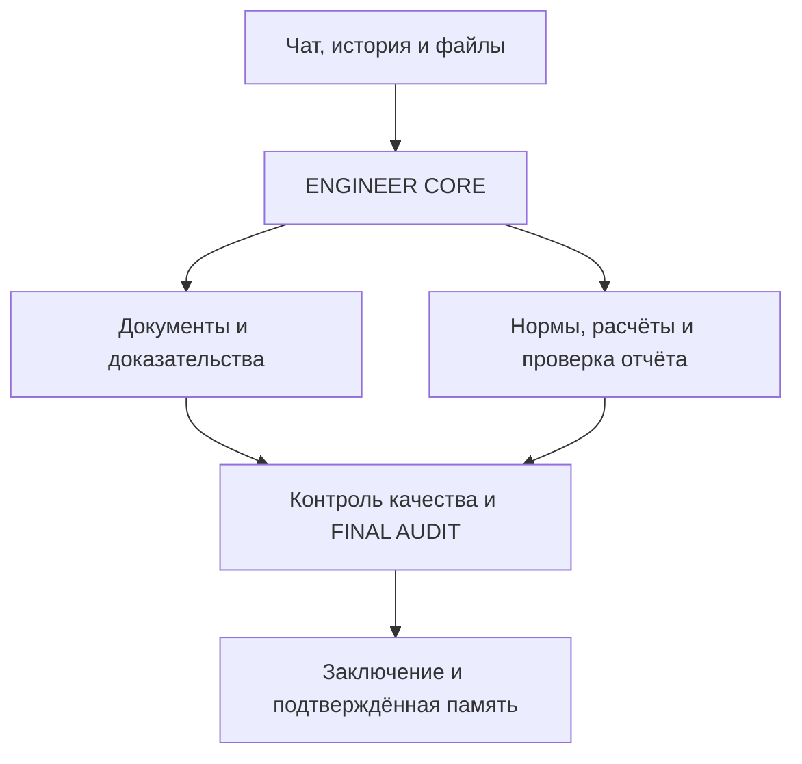

# ENGINEER OS — живая карта проекта

Обновлено: 06.10.2026. Это файл передачи состояния разработки, а не инженерное доказательство и не FINAL AUDIT. После существенного результата обновлять этот же файл; сохранять его имя и историю версий.

Идентичность этой карты: пользовательский файл `libfile_947c39aad11c81918c7887832c1411bb`, имя `ENGINEER_OS_PROJECT_MAP.md`. Для обновления использовать этот же ID и фактическую текущую версию. Правило сопровождения добавлено в `AGENTS.md`, указатель — в `docs/development/project-map-handoff.md` и README. Локальный HEAD отдельного PDF-checkout после нового прогона: `13200ab1a042ff1d4e2835844e275afacbfb13f4`; проверенная PDF-реализация: `e6498854bc8012d698afabb7c62e56db9b900d02`. Эти PDF-коммиты пока не опубликованы в GitHub.

## 1. Новому чату: сначала прочитай это

Мы продолжаем существующий ENGINEER OS пользователя Максима. Проект не начинать заново. Цель — бесплатное локальное инженерное приложение, а не только проверка одного PDF. Фундамент и адаптеры уже есть; первый локальный сценарий чат → файл → фоновая задача → ответ → история реализован и опубликован в PR38. Реальный запуск на Windows с qwen3 и принятый инженерный кейс пока не подтверждены.

Активный результат — локальный кабинет с подготовкой и предварительным исполнением ролей ENGINEER CORE, реестром кандидатов, native координатами, просмотром страницы и журналом проверки источников и импортом оригиналов Drive и раскрытием покрытия извлечения и автоматическим анализом PDF (разделы 18–31); Document Intelligence продолжается отдельно: достоверное извлечение документов объекта «БЦ, ул. Набережная, 28А», прежде чем использовать их как доказательства. Последний полный повторный прогон: **534 страницы, 523 без ошибки нормализации, 11 BLOCK; полностью подтверждённых страниц 0, документ BLOCK, FINAL AUDIT NOT_RUN, acceptance=false**. 523 — UNCERTAINTY, а не ACCEPTED.

Проверенный код восстановления: локальный commit `e6498854bc8012d698afabb7c62e56db9b900d02`, ветка `fix/pdf-completeness-audit`. Эти изменения НЕ опубликованы: автоматическая проверка отклонила push без явного разрешения на публикацию. PR #35 содержит прежний head `d20d8595094f452bd70d28c18f52cb7d0eede665`. Не пытайся воспроизвести новый результат старым кодом.

**Активный план:** девять пунктов, разделы30–34. Пункты1–3 выполнены: проверенный кандидат, оценка OCR/модели и безопасное продолжение больших документов. Main не обновлён, инженерное принятие не выдано. **Следующий — пункт4 «Подключить остальные форматы». Начать с раздела34.** Active checkout `/workspace/scratch/499af82b6df5/engineer-os-local-app`, branch `fix/document-resume-stage3-20261006`; local `a86a63f81bc8d49de40c1faff979bcf81ec08075`, remote `1bab99e7e624901e1b64e685c4a478849825d158`, одинаковое tree `970679286a05b9874ff1f66736c53de7959c6c1c`, draftPR55 на PR54. 362Python/4Node/actualHTTP+DOM PASS. GitHub CI PR55 PASS: push37497252188 и PR37497256126, включая actualHTTP/DOM; test-merge tree совпадает с опубликованным.. Windows — пункт9, последняя. Каждый итог: ✅/❌, затем номер и название следующего пункта.

## 2. Зачем создаём систему

ENGINEER OS должен помогать инженеру обследовать здания и сооружения: читать ТЗ и отчёты, извлекать факты с координатами источника, проверять инженерную логику, нормы и расчёты, работать с ЛИРА/SCAD и DWG, готовить заключения, сохранять историю и подтверждённые знания.

Целевой пользовательский сценарий: локальный запуск → чат и файлы/Drive → проверка извлечения → реестр доказательств → профильные агенты → контроль качества → заключение → FINAL AUDIT → ACCEPTED только при выполненных условиях.

Требования пользователя: бесплатные решения, без обязательных платных API; Windows; один удобный запуск; чат, история, память, фоновые задачи; Google Drive для документов. Open WebUI + Ollama — выбранный локальный путь. Дополнительные модели возможны через адаптеры, но не должны превращаться в обязательную платную зависимость.

## 3. Границы и логическая карта



Схема показывает целевой поток, а не факт завершённой интеграции. ENGINEER OS отвечает за инженерную методологию и договоры данных. Runtime отвечает за запуск агентов, инструменты, сессии, очереди и доступ к файлам. Не переписывать runtime и не импортировать большие сторонние репозитории вместо нужного адаптера.

| Часть | Где код | Фактический статус |
|---|---|---|
| Инженерное ядро | `engineering/core/` | CORE_PLAN и предварительные роли CORE_RUN связаны с worker; контракты укреплены PR44, черновики/ошибки сохраняются PR45; доказательная экспертиза и принятый кейс не выполнены |
| Document Intelligence | `engineering/document_intelligence/`, `scripts/` | Docling, нормализация, provenance, source recovery и реестр; полнота документа не подтверждена |
| Нормативная проверка | `engineering/normative/verification.py`, `skills/normative-check/` | Структура проверки реализована; проверенных актуальных редакций и полного агента ещё нет |
| ЛИРА / SCAD | `engineering/calculation/model_intake.py`, `skills/calculation-review/` | Проверка комплекта и идентичности файлов; семантика моделей и solver-run не проверены |
| Модели | `engineering/model_gateway/openai_compatible.py` | Живая Qwen3-8B CPU: CORE_RUN обе роли COMPLETED за220с, реальная native таблица91,64с, damaged-label fixture48,97с; UNCERTAINTY, acceptance=false — раздел32; OCR/графика остаются |
| Память | `engineering/memory/external_memory.py` | Граница доверия и snapshots; история диалогов/задач нового кабинета сохраняется в SQLite, подтверждённая инженерная память ещё не подключена |
| Хранилище | `engineering/storage/` | Drive-адаптеры; OAuth пользовательского Windows требует отдельной проверки |
| База и acceptance | `supabase/migrations/`, Supabase-адаптеры | Миграции и gates есть; наличие облачных функций не означает воспроизводимость backend из Git |
| Интерфейс | `index.html`, `app.js`, `styles.css`, `auth-recovery.js` | Панель проектов/задач/агентов/аудита; отдельный локальный кабинет engineering/local_app/ui содержит чат, загрузку и историю; просмотр, source review, CORE_PLAN и выбор/результаты предварительных ролей CORE_RUN связаны; полного инженерного принятия нет |
| Локальный запуск | `scripts/run_v4_local.py`, `.cmd`, Docker/runtime | Start_ENGINEER_OS.cmd + scripts/run_local_app.py запускают новый кабинет с worker; запуск CLI здесь проверен, Windows launcher NOT_RUN |
| CAD / отчёт | Договоры ролей, `skills/report-review/`, `skills/final-audit/` | Завершённого DWG/CAD маршрута и принятого итогового отчёта нет |

Состояние облака из `application-status-2026-10-03.md` является наблюдением 03.10, а не свежей проверкой сегодня. Там обнаружен разрыв между облачными функциями и их исходниками в Git. Не повторять старые числа таблиц/функций как текущие без проверки.

## 4. Где работаем и чем пользуемся

| Место | Назначение и ссылка |
|---|---|
| Основной GitHub | https://github.com/maxim505885-jpg/engineer-os |
| Отдельная PDF-ветка | `fix/pdf-completeness-audit`; draft PR https://github.com/maxim505885-jpg/engineer-os/pull/35 |
| Основание PR35 | `fix/pdf-region-ocr-repair`; ветки и PR были последовательными, main не равен последнему рабочему состоянию |
| Текущий локальный checkout | `/workspace/scratch/499af82b6df5/engineer-os` — временный путь этой сессии |
| Восстановленные входные данные | `/workspace/scratch/499af82b6df5/restored-checkpoint/` — распакованный проверочный архив |
| Прежний checkout | `/workspace/scratch/5b79d4619022/engineer-os-pdf-completeness`; здесь нашлись неопубликованные правки; это не постоянный адрес |
| Windows пользователя | Ранее использовались `C:\Users\maxim\engineer-os` и `C:\Users\maxim\engineer-os-docling-smoke`; актуальную папку проверять |
| Локальные модели пользователя | Ранее Open WebUI `http://127.0.0.1:8080`, Ollama и `qwen3:8b` работали; эта Linux-сессия не проверяла нынешний Windows |
| Дополнительные репозитории | `maxim505885-jpg/hermes-agent`, `codex`, `open-webui`, старый `ENGINEER-OS_`; не считать их основным кодом ENGINEER OS |

В этой сессии фактически использовались инструменты GitHub для чтения состояния, файлы проекта и Python/Node для проверки, Google Drive для исходника, сохранённые пользовательские файлы для передачи результатов. Доступность подключений проверять в новом чате. Supabase/Railway — компоненты инфраструктуры; их работа сегодня здесь не переаттестована. Figma/Sites не являются обязательным путём текущего локального приложения.

## 5. Какие документы используем

Основной PDF: `15.09.2026 ТЗК БЦ ул. Набережная 28А V4 сшито с графикой.pdf`, 534 страницы, 74 522 583 байта.

SHA256: `b5d95b660b35bfb6b2441623635cba91c235efd754bc283dfe1405f075834916`.

Drive file ID: `1Ycw-dcevqNSHgvb_y0pVa7B1lM4uhK6g`; ссылка https://drive.google.com/file/d/1Ycw-dcevqNSHgvb_y0pVa7B1lM4uhK6g/view . Полный оригинал также включён в архив продолжения. В архиве лежит `source/v4-drive-source.pdf`.

| Дополнительные источники | Что уже проверяли | Что не считать выполненным |
|---|---|---|
| Исходный полный отчёт DOCX | Нативная инвентаризация таблиц/изображений; выбранные фрагменты сопоставлялись с PDF | Полное соответствие страниц Word/PDF, полная семантическая проверка |
| `Расчет .docx` / `.doc`, `Таблицы.xlsx` | Таблица нагрузок сопоставлялась; 125 ячеек XLSX совпали с выбранной DOCX-таблицей | Применение нагрузок к расчётной модели |
| Координатный XLSX | Четыре формулы пересчитаны | Единицы, система координат и модельные привязки |
| Два файла `.lir` | Идентичность и бинарные заголовки ЛИРА-САПР | Геометрия, материалы, опоры, комбинации и результаты расчёта |
| Геодезия и графика | Оригиналы открывались и визуально инвентаризировались | Все размеры/подписи и полное соответствие V4 |
| Сжатый V3 | Отдельно идентифицирован; изображения ТЗ не дали большей разрешающей способности | Автоматическая эквивалентность V3 и V4 |

Нативный полный отчёт DOCX: пользовательский файл `libfile_10792d9386208191b103ee233d892250`, SHA256 `b253439bdd673a775eaf209ca7d398d766efae5f4a18ac33fa6679f7faae28a5`. Повторные загрузки могут иметь похожие имена и другие ID; выбирать по содержимому и SHA256, а не по дате или имени.

ТЗ на страницах 5–8 содержит трудночитаемые растровые фрагменты. Более качественное подтверждённое ТЗ пока не получено; Word/V3 не являются автоматически более точным источником. Извлечённые строки, OCR-кандидаты и совпадения отдельных таблиц не подтверждают весь документ.

## 6. Проверенное состояние PDF и кода

| Проверка на коде e649885 | Результат |
|---|---|
| Сырые экспорты, SHA источника | 534/534 проверены |
| Нативный текст и размещение изображений | 534/534 повторно сверены с исходником |
| Исходные ошибки нормализации | 126 страниц |
| Ошибки сняты по картам исходника | 115 страниц |
| Без BLOCK нормализации | 523 страницы UNCERTAINTY |
| Остаток BLOCK | 11 страниц |
| Отдельный аудит нативных сеток | 59 таблиц, 6119 ячеек; ограниченный выбранный scope |
| Смешанные визуальные assets | 102 SHA256 проверены |
| Полнота страниц / документа | 0 полностью подтверждённых страниц; документ BLOCK |
| Регрессия разработки | 227 тестов Python, 4 теста Node, синтаксис app.js и diff check прошли |
| Воспроизведение | Архив распакован, 1514 файлов сверены по хешам; повторный полный прогон дал тот же постраничный реестр |
| Инженерный FINAL AUDIT | NOT_RUN; ACCEPTED не выдан |

Это повторная нормализация сохранённых экспортов Docling текущим кодом. Новый полный запуск Docling не выполнялся. PASS привязки к источнику не доказывает полноту физической сетки или смысл извлечённых значений. Короткие/бледные/прерывистые внутренние линии эвристика может пропустить; она не выдаёт сертификат полноты.

Восстановлены ранее неопубликованные адаптеры ручных растровых ячеек и измеренного дрейфа векторных осей. Добавлены исходные одноколоночные панели страниц 57–58 с проверкой подписи по native words, digest целевого экспорта и изображениями исходных ячеек. Исправлены обходы через пропущенные внутренние линии и перезапись исходника через hardlink. Серая заливка без рамки не должна считаться физической сеткой.

История чисел: опубликованный реестр был 498/36; прежний неопубликованный результат 521/13 пересмотрен после усиления проверки; промежуточные 523/11, 515/19 и 513/21 не являются текущим итогом. Новый подтверждённый source-bound прогон — 523/11 на e649885, 177.81 с. Предыдущие 512/22 относятся к 6da5964. Одинаковые числа разных прогонов не означают одинаковые проверки. Не смешивать количество выбранных таблиц, ячеек, страниц и полноту документа.

## 7. На чём остановились и что уже продолжили

BLOCK-страницы: **3, 5, 7, 9, 171, 179, 341, 481, 486, 488, 500**.

Детектор светлых рамок исправлен и проверен на оригинальных пикселях всех просмотренных растровых карт страниц 176–180, 255–257, 338–342. Светлый пиксель должен иметь более светлый фон с обеих сторон в пределах трёх исходных пикселей: яркость <232, контраст >=24. Общий тёмный порог 128 не повышен. Серая заливка без рамки отклоняется; светлые необъявленные разделители тоже отклоняются. Отдельные тесты проверяют рамку в 1–2 пикселях от края изображения и светлый разделитель рядом с чёрной рамкой. Независимое ревью обнаружило близкий разделитель; замечание исправлено и перепроверено.

| Остаток | Подтверждённая причина | Следующее действие |
|---|---|---|
| 179, 341 | Первые две просмотренные растровые таблицы восстановлены; table_index=2 полного экспорта не имеет карты. На исходной странице нижняя часть таблицы продолжается за изображением, замкнутой нижней рамки нет | Восстановить связь с продолжением на следующем листе и явно учитывать незамкнутую границу; не дорисовывать рамку |
| 9 | Правая граница cost-header-price не подтверждается | Отдельно сопоставить незамкнутую структуру с источником |
| 3, 5, 7, 171, 481, 486, 488, 500 | Неоднозначные/пропущенные ячейки; полного применимого восстановления нет | Индивидуальная привязка к исходной странице; ТЗ проверять по читаемому источнику |

На странице 500 отдельно просмотрен исходный графический лист: планы и условные обозначения, нативных слов и embedded images нет. Docling предложил таблицу по графическим объектам/легенде. Это диагностическое наблюдение, а не готовое восстановление текста или разрешение исключить целевой узел.

Текущий полный реестр: `/workspace/scratch/499af82b6df5/v4-contrast-final-recheck-20261005/page-register.json` и CSV. Полный source-bound replay: 534 raw exports, 534 native inventories, 115 устранённых из 126 исходных ошибок; 523 UNCERTAINTY / 11 BLOCK. Результаты recovery сохранены в дополнительном пользовательском архиве **ENGINEER_OS_contrast_checkpoint_2026-10-05.zip**. Он дополняет, а не заменяет исходный checkpoint. Внутри cumulative patch от remote d20d859 до текущего локального HEAD и инструкция воспроизведения.

Промежуточный первый вариант фиксированных флангов дал 515/19; это историческая диагностика, НЕ текущий результат. После регрессий и исправления локального поиска флангов полный прогон дал 523/11. Acceptance=false, 0 полностью подтверждённых страниц, FINAL AUDIT NOT_RUN.

## 8. Как воспроизвести и что читать в коде

Для нового результата 523/11 использовать исходный архив вместе с **ENGINEER_OS_contrast_checkpoint_2026-10-05.zip**: применить cumulative patch к чистому checkout d20d859, затем выполнить команду из CONTINUATION.md дополнительного архива. Старый patch 6da5964 и старый реестр сами по себе дают 512/22, а не текущий результат.

Постоянный архив: **ENGINEER_OS_continuation_2026-10-05.zip**, пользовательский файл `libfile_7408d21eac00819195eba3d01c4f4c91`. 88 147 091 байт, SHA256 `fbd315d683976adcec5d2278268e8110ada7773589d706cc705989706892b4b5`.

Внутри: оригинальный PDF; `checkpoint/` с 534 raw exports, native inventories, картами и изображениями; `review/page-register.json` и CSV; `CONTINUATION.md`; `input-file-sha256.json`. Код и OCR-модели в этот архив не включены. Проверенный код — отдельный локальный commit; патч `ENGINEER_OS_changes_6da5964.patch` находится в `/workspace/scratch/499af82b6df5/deliverables/`. Если локальный checkout исчезнет до публикации, сначала восстановить патч; не выдумывать отсутствующий remote commit.

Отчёт продолжения: `ENGINEER_OS_progress_2026-10-05.md`, пользовательский файл `libfile_2057cf38a8908191a74446569547777c`.

После восстановления исходных данных и проверенного кода, из корня проекта:

```bash
python3 -m pip install -r requirements-pdf-review.txt
python3 -m unittest discover -s tests -q
node --test tests/dashboard_counts.test.cjs
node --check app.js
git diff --check
python3 scripts/recheck_v4_exports.py /absolute/restored/source/v4-drive-source.pdf --checkpoint-dir /absolute/restored/checkpoint --output-dir /absolute/new-recheck
```

Выходная папка должна быть новой, вне `checkpoint`. Установка requirements-пакета не устанавливает полный Docling; повторный реестр использует архивные экспорты. Здесь проверены PyMuPDF 1.26.6 и Pillow 12.3.0; это не аттестация Windows пользователя.

| Файл относительно корня Git | Для чего открыть |
|---|---|
| `AGENTS.md` | Обязательные инженерные договоры и дисциплина работы |
| `docs/ARCHITECTURE.md`, `docs/AGENT_CONTRACTS.md`, `docs/FINAL_AUDIT.md` | Границы системы, роли, условия приёмки |
| `docs/development/application-status-2026-10-03.md` | Фактические ограничения MVP; сведения об инфраструктуре исторические |
| `docs/development/pdf-page-register-2026-10-05.md`, `v4-continuation-summary-2026-10-05.json` | Текущая сводка 523/11 на e649885; code_file_sha256 сверяет реализацию |
| `scripts/recheck_v4_exports.py` | Полный реестр и точная идентичность входов/кода |
| `scripts/recover_reviewed_raster.py` | Растровые ячейки, `_line_fraction`, `_checked_cells`, порог RULING_DARKNESS |
| `scripts/source_pdf_tables.py`, `recover_source_panels.py` | Измеренные оси и одноколоночные панели |
| `scripts/recover_docling_export.py`, `recover_native_pdf_regions.py`, `capture_pdf_grid_assets.py` | Нативные/смешанные карты и проверка source binding |
| `engineering/document_intelligence/docling_adapter.py`, `evidence_validation.py`, `evidence_persistence.py` | Нормализация, доверие кандидатов и persistence gates |
| `tests/test_reviewed_raster.py`, `test_source_panels.py`, `test_source_pdf_tables.py`, `test_recheck_v4_outputs.py` | Регрессии recovery и защиты исходника |
| `docs/development/object-source-audit-2026-10-04.md`, `tor-soil-source-check-2026-10-05.md` | Ограниченные проверки Word/XLSX/LIR и альтернативных источников |
| `docs/development/curated-repositories-catalog-2026-10-04.json` | 100 репозиториев уже просмотрены по README/метаданным; это не доскональный аудит всего кода |

Полный старый `docs/development/pdf-page-register-2026-10-05.json` в Git хранит исторические 498/36. Текущий полный JSON — внутри архива, не этот исторический файл.

## 9. Что ещё нужно довести до приложения

| Приоритет | Работа | Проверяемое условие завершения |
|---|---|---|
| PDF | Детектор исправлен; 11 оставшихся BLOCK, полнота текста/рисунков/связей | Source-bound проверки, постраничное покрытие; отсутствие ошибки нормализации не заменяет полноту |
| Параллельно PDF | Воспроизводимый backend и локальный runtime + Ollama | Один реальный task без обязательного платного ключа; исходники/конфигурация доступны |
| MVP | Чат, upload/Drive, история, review UI и worker | Один запускаемый локальный пользовательский сценарий с историей и очередью |
| Инженерный кейс | Выбранные проверенные evidence → ТЗ → профильные проверки → контроль | Прослеживаемые выводы по одному реальному объекту; разрешённый FINAL AUDIT |
| Расчёты | Семантика ЛИРА/SCAD, нагрузки, опоры, единицы, комбинации, solver | Реальные результаты и логи, соответствие фактической конструкции |
| CAD и выпуск | DWG/CAD и проверяемый отчёт | Подтверждённый графический маршрут и выпуск документа без выдуманных данных |
| Память / обучение | Использование подтверждённых результатов | Кандидаты, чужие сообщения и snapshots не получают статус доказательств автоматически |

Проверка PDF не должна останавливать независимые задачи приложения. При этом полный непроверенный текст нельзя использовать для принятого инженерного вывода. Не заменять интеграцию установкой очередного agent framework: границы runtime уже определены.

## 10. Правила, которые нельзя терять

Факт важнее предположения. ТЗ определяет scope. Различать PROJECT, ACTUAL, MEASURED, TESTED, CALCULATED, ASSUMED, INTERPRETED, UNKNOWN; неизвестное не заполнять «правдоподобным» значением.

Не искать дефекты ради списка замечаний и не объявлять правильный отчёт ошибочным из-за несовпадения с шаблоном системы. «Не видно» не равно «нет». OCR-кандидат, confidence и processed в БД не равны доказательству, полноте или ACCEPTED. Не дорисовывать цифры/рамки, не менять запятые/единицы или строки оригинала молча.

Нормативы: документ → редакция → область применения → пункт → требование → фактическое условие → сравнение → вывод. Проверять действительность и применимость перед использованием. Наличие LIR-файла не означает выполненный расчёт. PASS отдельного теста не означает FINAL AUDIT.

## 11. Как обновлять карту и продолжать в новом чате

При старте: найти **ENGINEER_OS_PROJECT_MAP.md** в пользовательских файлах, прочитать целиком; затем проверить `git status`, HEAD/ветку, текущий PR и SHA источника. Считать временные пути подсказками, а не гарантированными адресами. Если карта расходится с наблюдением, записать расхождение и проверить источник.

После каждого существенного изменения/проверки обновлять в этом же файле: дату, текущую задачу, локальный HEAD и remote HEAD отдельно, выполненные действия, фактические результаты/границы проверки, оставшиеся BLOCK, следующее конкретное действие и расположение новых данных. Исправлять старые текущие числа; историю кратко сохранять отдельно.

Обновлять существующий пользовательский файл с сохранением ID/версий, а не создавать десятки новых карт. Полученный при сохранении ID файла хранить в локальном указателе; не угадывать его. При конфликте версии сначала прочитать актуальную версию и сохранить чужие изменения. Эта карта не обновляется фоновым расписанием сама по себе: её обновляет работающий над проектом агент.

Публикация неопубликованного PDF-кода в GitHub ранее отклонена автоматической проверкой; это не относится к уже разрешённым и опубликованным интеграциям. Не обходить отказ другим инструментом. После явного разрешения — отправить проверенный локальный код в ту же рабочую ветку, обновить draft PR, проверить CI; слияние и развёртывание учитывать как отдельные действия. Сейчас можно продолжать локальные изменения, диагностику и сохранение результатов.

Следующее конкретное действие: проверить исходную третью таблицу страниц 179/341 и её продолжение на 180/342, подготовить source-bound контракт для открытой границы без фиктивной рамки. Независимо от этого продолжать локальный сценарий приложения (Ollama → задача → история). Ограничения инженерного принятия PDF не блокируют разработку приложения. Блок «Работаю дальше» не добавлять в ответы пользователю.

Сообщение для нового чата: «Продолжай ENGINEER OS. Найди и прочитай ENGINEER_OS_PROJECT_MAP.md целиком, проверь фактическое состояние и выполняй раздел “Следующее конкретное действие”. Не начинай проект заново. После результата обновляй эту же карту».

## 12. Краткая история последних действий

- 03.10: зафиксированы фундамент и реальные ограничения приложения; полного MVP нет.
- 04–05.10: полный исходник V4, архивные экспорты и нативные инвентари проверены; исследованы дополнительные Word/XLSX/LIR источники и каталог 100 репозиториев.
- 05.10: восстановлены неопубликованные raster/axis адаптеры; добавлены панели 57–58; после усиления guards подтверждён реестр 512/22 и повторное воспроизведение архива; локальный code commit 6da5964, push отклонён.
- Текущий проход: создана и обновлена живая карта; правило её сопровождения добавлено в AGENTS.md и README отдельным локальным docs-коммитом. Продолжена диагностика 14 отказавших периметров, выделены 13 страниц с зависимостью от абсолютного порога и отдельная незамкнутая граница страницы 9. Хеши проверенной PDF-реализации сохранились; нового полного прогона и исправления детектора в этом проходе пока нет.

## 13. Проверка семи дополнительных репозиториев — 05.10.2026

По запросу Максима выполнен статический выборочный обзор README, лицензий, деревьев и выбранных исходников семи проектов. Полный обзор: `ENGINEER_OS_repository_review_2026-10-05.md`. Это исследование; установки, подключения и runtime-проверок этих инструментов нет.

| Кандидат | Для чего нам нужен | Рекомендация |
|---|---|---|
| browser-use/browser-use | Браузерные процессы и проверка будущего UI; MIT; ChatOllama есть в коде | Пилот после сквозного UI; локально явно выключить ANONYMIZED_TELEMETRY и BROWSER_USE_CLOUD_SYNC, проверить сеть |
| rohitg00/agentmemory | Память локального кодинг-агента; Apache-2.0; Node>=20 + iii engine; BM25 без ключа | Отдельный Windows/русскоязычный пилот; не заменять карту и evidence |
| K-Dense-AI/scientific-agent-skills | SymPy, статистика, графики, при необходимости геоданные; MIT; 177 навыков | Выборочно; scientific-schematics требует OpenRouter; bundled PDF/Office навыки удалены |
| cathrynlavery/diagram-design | Карта архитектуры/доказательств; MIT; 42 типа; HTML/SVG | Для документации; убрать Google Fonts при автономном локальном экспорте |
| mukul975/Anthropic-Cybersecurity-Skills | Проверки API/прав/RAG; Apache-2.0; независимый community-проект | Защитная выборка; адаптировать скрипты и ожидаемые результаты, не запускать весь каталог |
| ai-boost/awesome-harness-engineering | Handoff, checkpoints, трассы, восстановление; LICENSE CC0 | Методики, не новый движок оркестрации |
| volcengine/OpenViking | Большая база ресурсов/памяти/навыков; основной сервер AGPL-3.0 | Отложить до потребности; большой стек, модели и Windows-путь требуют пилота |

Общая граница: память/поиск/браузер/навыки не выдают инженерное принятие вместо нашего ядра. Массового импорта навыков не планировать; не вводить две системы памяти одновременно. Бесплатный код не означает бесплатный облачный браузер/модель/API.

Ни один кандидат не устранил текущую ошибку PDF-рамок. Это историческое состояние до исправления; актуальный результат и следующие действия приведены в разделах 6–7 и 11. Реестр 512 UNCERTAINTY / 22 BLOCK, acceptance=false, HEAD 4743ec4 и проверенная реализация 6da5964 не изменились; нового полного прогона нет.

История: 05.10 — проверены семь дополнительных репозиториев; сформирована выборка для документации, разработки и будущих пилотов, сохранён отдельный обзор. Интеграций и публикации кода не выполнено.

## 14. Размещение карты на GitHub — 05.10.2026

По явному запросу Максима карта добавляется в корень репозитория `maxim505885-jpg/engineer-os`, путь `ENGINEER_OS_PROJECT_MAP.md`. Ветка документации: `docs/project-map-handoff-20261005`; её база — main `88f1b9cb03f6a0f686a1a58884a503bdf1d338d1`. В README добавлена ссылка, в AGENTS.md — правило чтения и сопровождения; указатель находится в `docs/development/project-map-handoff.md`.

Этот коммит содержит документацию. Проверенная PDF-реализация 6da5964 и локальный docs-коммит 4743ec4 в него не входят; прежний draft PR #35 не обновляется. Карта в ветке документации описывает состояние рабочей ветки PDF, а не наличие всех этих изменений в main. Слияние PR и развёртывание приложения не выполнены.

Новый чат может читать карту непосредственно из указанной ветки GitHub. После слияния читать тот же путь в main. Сохранённый пользовательский файл имеет тот же ID; при сопровождении поддерживать обе копии согласованными, сверять фактические refs и не считать опубликованную карту подтверждением инженерного принятия.

## 15. Выбранные upstream-репозитории добавлены локально — 05.10.2026

По запросу «Все репозитории которые нам нужны добавляй» подготовлена отдельная ветка `feat/selected-integrations-20261005` от опубликованного PDF checkpoint `d20d8595094f452bd70d28c18f52cb7d0eede665`. Рабочая копия: `/workspace/scratch/499af82b6df5/engineer-os-integrations`. Коммиты: `23b9393` (исходники/адаптеры) и `cd5a0a1ac640be399a0d3566994a1e3f7157440c` (исправления локальных настроек). Эта ветка не включает неопубликованную PDF-реализацию 6da5964 и её docs-коммит 4743ec4.

Фактически добавлено:
- Шесть git submodules в `third_party/`: Browser Use, Agent Memory, Scientific Agent Skills, Diagram Design, Cybersecurity Skills, Awesome Harness Engineering. Их checkout HEAD сверены с шестью commits из обзора; `.gitmodules` и `integrations/upstreams.json` фиксируют URLs, commits, лицензии и выбранные пути. OpenViking остаётся отложенным.
- `engineering/memory/agentmemory_http.py`: чтение real REST memories endpoint с project/q/latest/limit; чужие, устаревшие, повторные и malformed записи отвергаются. Контекст UNVERIFIED / NOT_EVIDENCE. Генерируемый upstream секрет читается только для loopback destination, явный env имеет приоритет.
- `engineering/integrations/local_http.py`: HTTP только loopback, без proxy/redirects, ответ ограничен 1 MiB, timeout.
- `engineering/integrations/browser_use_local.py`: явно включаемый Browser Use + Ollama; qwen3:8b использует текстовый режим, telemetry/cloud sync/авторасширения/CAPTCHA/downloads отключены; Ollama без env proxy/redirects; ограничение шагов и времени, очистка временных файлов. Domain policy upstream допускает www-вариант корневого домена и не является сетевой песочницей.
- `scripts/integration_tools.py`: status, memory-recall, browser-run. `requirements-integrations.txt`: отдельное optional environment. `integrations/README.md`: Windows-подготовка и выборочное использование научных/диаграммных/защитных методик. Сторонние SKILL.md не импортированы в SkillLoader и не активируются автоматически.

Проверки: baseline этой опубликованной основы — 194 Python tests; после изменения — **201 Python tests и 4 Node tests**, syntax/compileall/diff checks проходят; 6/6 source pins сверены. Транспорт проверен на локальном синтетическом HTTP-сервере, browser constructor/cleanup — на dependency doubles. Независимый review выполнен; настройки text-only модели, авторизации и local proxy исправлены после воспроизводимых failing tests. Это не live-проверка Browser Use, Ollama, iii/AgentMemory или Windows; эти проверки **NOT_RUN**. Качество русского memory retrieval и работы qwen3:8b в браузере не установлено.

**Код опубликован после явного разрешения Максима 05.10.2026:** ветка `feat/selected-integrations-20261005`, remote HEAD `06ed75bddf6bf1849e58d48ae03b9f6ec4240763`, [PR #37](https://github.com/maxim505885-jpg/engineer-os/pull/37) → `fix/pdf-completeness-audit`. PR открыт, не слит. Git tree `c89e6f207a360075120a1d7129b8c9812b8f3d00` совпадает с проверенным локальным payload (18 файлов). Локальные два коммита 23b9393/cd5a0a1 опубликованы одним коммитом с тем же содержимым через подключённый GitHub: CLI push остановился из-за отсутствия локальных учётных данных.

История публикации: первая попытка push была отклонена automatic approval review из-за отсутствия признанного явного разрешения на конкретный payload; после вопроса с описанием изменений пользователь ответил «Да делай разрешаю». Эта блокировка для подготовленного payload снята. Просматриваемый `ENGINEER_OS_selected_integrations.patch` сохраняет исходный diff относительно d20d859.

Это изменение не исправляет PDF и не меняет подтверждённые 512 UNCERTAINTY / 22 BLOCK, document BLOCK, acceptance=false; нового полного PDF-прогона нет. Код PDF 6da5964 с 223 исторически подтверждёнными tests отличается от базы новой ветки; не смешивать эти числа с 201 tests этой поставки.

Следующее действие для подключений — проверить PR #37 и выполнить Windows/local runtime smoke. Слияние PR или развёртывание приложения не выполнялись. Детектор светлых линий уже исправлен в последующем шаге; актуальный остаток и следующий инженерный шаг — в разделах 7 и 11.

## 17. Новый результат исправления светлых рамок — 05.10.2026

Проверенный code commit: e6498854bc8012d698afabb7c62e56db9b900d02. Локальный HEAD после сводки: 13200ab1a042ff1d4e2835844e275afacbfb13f4. Полный replay: 523/11, 177.81 с; код на момент конца прогона clean. Регрессия: 227 Python + 4 Node; compileall, app.js syntax и diff check успешны. Независимое ревью повторно проверило 32 варианта светлых внутренних линий и семь заливок; блокирующих замечаний не осталось.

Сняты ошибки извлечения на 11 страницах: 176, 177, 178, 180, 255, 256, 257, 338, 339, 340, 342. На 179/341 устранена прежняя ошибка рамок, но остаётся третья таблица. Документ остаётся BLOCK для инженерного принятия; это не препятствие независимой работе приложения.

GitHub PDF-ветка и PR35 ещё содержат d20d859; ни старый неопубликованный код 6da5964, ни новый e649885/сводка не отправлены. Предыдущее разрешение публикации шести интеграций уже реализовано в PR37 и не выдаёт старые PDF-коммиты за опубликованные. Документальная ветка карты обновляется отдельно без этих PDF-файлов; актуальный SHA получать из refs/heads/docs/project-map-handoff-20261005. PR36 остаётся открытым, слияние не выполнено. Разделы 13–16 фиксируют историю публикации интеграций; их прежние 512/22 относятся к тому моменту.


## 18. Локальный кабинет опубликован — 06.10.2026

Ветка `feat/local-app-mvp-20261005`, [draft PR38](https://github.com/maxim505885-jpg/engineer-os/pull/38) → `feat/selected-integrations-20261005`. Remote HEAD `98398cda2194fe66582ef6eb8d8516d4879a39de`; локальный HEAD `34bf5a338cb7c010487e550d4c762b4211d8ec74`, worktree `/workspace/scratch/499af82b6df5/engineer-os-local-app`. Опубликованное дерево `2df8960115a44f1ba4d8f5599a9ebb336e684e16` совпадает с проверенным локальным деревом, 23 файла относительно 06ed75b. PR открыт, не слит; main и существующая облачная панель не обновлены. Старые неопубликованные PDF-исправления в эту ветку не входят.

Реализовано:
- `engineering/local_app/store.py`: SQLite/WAL, диалоги, сообщения, оригиналы, очередь QUEUED/RUNNING/SUCCEEDED/FAILED, атомарный claim и одна активная задача на диалог. История сохраняется между запусками; старые RUNNING показываются как прерванные, QUEUED остаются в очереди.
- `files.py`: TXT/MD/PDF до 100 MiB, неизменённый оригинал с SHA256; текст до 100000 символов, PDF первые 20 страниц при наличии PyMuPDF. Скан/ошибка парсера не теряют оригинал. Всё UNVERIFIED/UNAVAILABLE, не доказательство; до 200 видимых вложений в диалоге, превышение явно отклоняется.
- `model.py`, `worker.py`: существующий OpenAI-compatible gateway, локальные Ollama/Open WebUI без env proxy/redirects; qwen3:8b по умолчанию. Ограниченный контекст, однопоточный worker, ошибки видны в задачах. Socket timeout не является доказанным жёстким общим deadline.
- `server.py`, `lock.py`, `ui/`: кабинет только 127.0.0.1, Host/Origin/token, инертный вывод текста, безопасное скачивание оригиналов, exclusive data lock. История/переключение диалогов/выбор вложений/фоновые состояния.
- `Start_ENGINEER_OS.cmd`, `scripts/run_local_app.py`: один локальный запуск при имеющихся Python 3.12+ и Ollama; состояние по умолчанию `.engineer-os/local-app`. Никаких обязательных платных ключей. Инструкции `docs/development/local-app.md`; фактическая проверка `local-app-verification-2026-10-05.md`.

Проверено: **228 Python + 4 Node PASS**, compileall/JavaScript syntax/diff check PASS. Настоящий локальный HTTP и SQLite, но синтетический сервис модели; отдельно DOM integration (jsdom) проверяет запуск CLI, upload-event, source context, worker, chat, инертный markup, reload и session switch. Независимое whole-branch ревью выявило три Important/P2: обход токена неканоническим request target, потерю числового текста PDF, невидимость 201-го файла. Для каждого сначала FAIL тест, затем один проход исправлений и полный PASS. Навигация после отправки также исправлена и защищена DOM регрессией.

Реальный V4 сохранён с исходным SHA256; частичный текст 20/534 страниц явно не проверен. Полнота V4 не перепроверялась: остаётся **523 UNCERTAINTY /11 BLOCK**, acceptance=false, FINAL AUDIT NOT_RUN.

**NOT_RUN:** Windows launcher, настоящий qwen3 inference/Ollama/Open WebUI, визуальный Chromium/layout/CSP. Браузер здесь отклонил loopback URL, доступной настоящей Ollama нет. UI ещё не связан с ENGINEER CORE/evidence gates, Drive OAuth, OCR/Docling review, инженерной памятью, CAD и solver. Любой ответ модели принудительно UNCERTAINTY /NOT_EVIDENCE /acceptance=false /FINAL AUDIT NOT_RUN, даже если текст модели заявляет ACCEPTED.

Дальше: live Windows smoke → задания ENGINEER CORE и видимый evidence register → Drive и подтверждённая память. PDF разбирать отдельно по оставшимся 11 страницам; локальный кабинет не выдавать за завершённую инженерную систему. Новый чат читает эту карту, AGENTS.md и docs/development/project-map-handoff.md, проверяет refs PR38/37/36/35 и продолжает соответствующий checkout без повторной реализации.


## 19. ENGINEER CORE связан с локальными заданиями — 06.10.2026

Пользователь явно поручил выполнять работу самостоятельно локально, проверку Windows оставить последней. Поэтому настоящий Windows/qwen3 smoke больше не является условием продолжения разработки.

Опубликована ветка `feat/local-core-plan-20261006`, [draft PR39](https://github.com/maxim505885-jpg/engineer-os/pull/39) → `feat/local-app-mvp-20261005`. Remote HEAD `a70ec31f77aa652f52c6b9a8d906ae010e37b4c1`; локальный HEAD `14ff51237abd0dcc24619d5d25bf6cefed5f721c` в `/workspace/scratch/499af82b6df5/engineer-os-local-app`. Деревья совпадают: `79274352500a1c366f51c7444a3d79cb8d1ac2ad`, 11 файлов относительно PR38. Все PR остаются открытыми, не слиты; main не обновлён.

Реализовано в существующем сценарии:
- Явный режим «План проверки по ТЗ» в composer. Пользователь выбирает сохранённые оригиналы и вводит ТЗ; обычный чат не превращается в ТЗ автоматически.
- `Store.enqueue(..., mode='CORE_PLAN', requested_checks=...)` сохраняет режим/проверки в очереди, проверяет источники того же диалога и валидность checks. Existing SQLite расширяется без удаления истории; старые задачи остаются CHAT.
- `worker.py` вызывает `core_plan.prepare`, затем реальный `EngineerCore.plan` и сохраняет результат, без запроса к модели. По умолчанию report/normative + обязательный FINAL AUDIT; API также inspection/calculation.
- Раскрываемая карточка плана: специалисты NOT_RUN, оригиналы с ID/SHA256, UNVERIFIED_SOURCE/NOT_EVIDENCE, недостающие извлечение/реестр/проверки/audit. План и ТЗ восстанавливаются после открытия базы/диалога.

**Проверки:** 232 Python +4 Node PASS, compileall/JS syntax/diff check PASS. HTTP queue→worker→plan→SQLite подтверждён без модели. Расширенный DOM smoke проверяет выбор режима, source context, отсутствие лишнего model request, инертный план и восстановление после reload. Первоначальный DOM reload тест выбирал новый пустой диалог; исправлен выбор исходного диалога, повторный PASS. Независимое ревью выявило malformed mode []/{}→500; тест сначала FAIL, после проверки строкового типа API отвечает 400, полный набор PASS. Изоляция, миграция и fail-closed граница замечаний не получили.

**Границы:** это подготовка инженерной проверки, не исполнение специалистов. Никаких evidence_ids или принятого заключения, UNCERTAINTY, acceptance=false, FINAL AUDIT NOT_RUN. Файл/SHA256 подтверждает идентичность сохранённого оригинала, не достоверность его содержания. Реальный Chromium снова ERR_BLOCKED_BY_CLIENT на loopback; layout/CSP не проверены. Windows/live inference оставлены на последний этап. PDF не менялся и не перепроверялся: 523 UNCERTAINTY/11 BLOCK.

Следующий локальный шаг — реестр доказательств с явной фиксацией источника/страницы/фрагмента и проверкой происхождения. Не объявлять реестр подтверждённым только от ввода текста человеком или модели. Затем можно подключать профильное исполнение и Drive; обязательную Windows-проверку выполнить в конце перед заявлением готового пользовательского приложения.


## 20. Реестр кандидатов с привязкой к оригиналу — 06.10.2026

Опубликована ветка `feat/local-evidence-register-20261006`, [draft PR40](https://github.com/maxim505885-jpg/engineer-os/pull/40) → `feat/local-core-plan-20261006`. Remote HEAD `87bee311bacb88033df618308960f595663e7786`; локальный HEAD `a16a1c2bd82b5c905bf2a70d1cec5b1a932381f2`, checkout `/workspace/scratch/499af82b6df5/engineer-os-local-app`. Проверенное локальное и опубликованное дерево совпадают: `30c99e0658a2a8b087ebb69db350a4913f8313f2`, 11 файлов относительно PR39. PR открыт, не слит; main не обновлён.

Состав: `engineering/local_app/evidence.py`, таблица `local_evidence` в Store, защищённый POST `/api/sessions/:id/evidence`, snapshot.evidence и UI-форма «Реестр · непроверенные кандидаты». Пользователь выбирает оригинал, страницу PDF, точную цитату и заявление/интерпретацию.

Перед сохранением сервер проверяет принадлежность оригинала диалогу, размер/SHA256 сохранённых байтов и точное совпадение текста. TXT/MD — UTF-8 оригинал без выдуманных страниц. PDF — native текст указанной страницы, включая страницу 21 за пределами preview первых 20. Ошибочная цитата/страница/чужой файл/изменённые байты отклоняются. При отсутствующем parser/скане/защищённом или повреждённом PDF запись только NOT_CHECKED с явной необходимостью ручной проверки. Лимит 500 на диалог атомарный; все сохранённые записи видны, сохраняются между запусками.

Каждый кандидат имеет UUID, file_id, source_sha256, page, quote, statement, data_class (по умолчанию U), data_class_verified=false, source_match=MATCH/NOT_CHECKED, status=UNVERIFIED, acceptance=false, FINAL AUDIT NOT_RUN. MATCH означает совпадение текста, не подтверждение содержания или измерения. Координаты, полнота и инженерная достоверность ещё не проверены. Кандидаты не передаются как accepted evidence в CORE/Supabase; endpoint принятия отсутствует. Существующий Document Intelligence evidence_validation не подменён более слабой проверкой цитаты.

**Проверки:** 238 Python +4 Node PASS; compileall/JS syntax/diff PASS. Сначала пять module FAIL и DOM missing-form FAIL, затем реализация. HTTP регрессия проверяет token, сохранение, ложную цитату и игнорирование присланного acceptance=true. DOM проверяет инертный markup, восстановление кандидата и изоляцию черновика между диалогами. Независимое ревью воспроизвело перенос quote/statement/page при смене диалога; тест сначала FAIL, после сброса полей PASS. Reviewer отдельно проверил 15 evidence/API тестов и DOM, remaining Critical/Important нет.

Windows, настоящий qwen3 и настоящий визуальный browser остаются NOT_RUN; Windows последний по требованию пользователя. Эта работа не изменяла/не перепроверяла исходный V4: 523 UNCERTAINTY/11 BLOCK, document BLOCK, acceptance=false. Следующий локальный шаг — проверяемая страница/координаты и связь с полным DI evidence workflow; не автоматически принимать текст пользователя или модели.


## 21. Координаты native PDF и связь с DI source binding — 06.10.2026

Ветка `feat/local-evidence-provenance-20261006`, [draft PR41](https://github.com/maxim505885-jpg/engineer-os/pull/41) → `feat/local-evidence-register-20261006`. Remote HEAD `e7ce9b225372c6a6faa7d7069158bfb33ec11324`; локальный HEAD `27d4e9bf2d7c2a3d95f201050d6ad398cb98ad14` в том же checkout `/workspace/scratch/499af82b6df5/engineer-os-local-app`. Дерево `c2dbc213391a60d20f9696c32526ad00e7801dfd` совпало локально и в GitHub, 7 файлов относительно PR40. PR открыт, не слит; main не изменён.

`engineering/local_app/provenance.py` находит native области цитаты. Сохраняются unrotated top-left page points, page_rotation, размер страницы, exact_occurrences, до 100 regions (UI первые 10). UNIQUE требует одного точного вхождения с учётом перекрытий, одного прямоугольника, точного равенства get_textbox этой области и quote, без многострочного фрагмента. Повторы/многострочный или сомнительный результат — AMBIGUOUS, без geometry — NOT_LOCATED; TXT/MD — NOT_APPLICABLE без выдуманного PDF происхождения. Старые записи без новых полей по-прежнему показываются.

Только UNIQUE создаёт частичный `NormalizedDocument(parser=native-quote-partial)` с фактическим текстом/областью и запускает существующие `evidence_candidates` + `validate_evidence_candidate`. Поле `document_validation` имеет scope=SOURCE_BINDING_ONLY, status=VALIDATED/BLOCK и кандидатный DI ID или null. Этот gate проверяет источник/block/page, не полную нормализацию документа, содержание факта, достаточность доказательств или инженерное принятие. Все записи по-прежнему UNVERIFIED, acceptance=false, FINAL AUDIT NOT_RUN; DI ID не отправляется в accepted gates.

Проверки: **245 Python +4 Node PASS**, DOM smoke, compileall/JS syntax/diff PASS. Вначале четыре provenance регрессии FAIL, после реализации PASS; проверены UNIQUE, повторы, multiline, TXT, восстановление, PDF rotation90. Ревью выявило false UNIQUE: abcABC/abc возвращает один объединённый case-insensitive rectangle; ababa/aba имеет два перекрывающихся вхождения, которые str.count пропускал. Обе регрессии сначала FAIL; исправлены одним проходом на подсчёт перекрытий и точную native проверку области, полный набор PASS. Других Critical/Important reviewer не нашёл.

Система координат сверена с официальной документацией https://pymupdf.readthedocs.io/en/latest/page.html. Подсветка/просмотр исходной страницы, OCR, визуальное подтверждение геометрии, инженерное исполнение пока не реализованы. Windows/live qwen3/real-browser validation NOT_RUN, Windows последний. V4 не перепроверялся, прежние 11 BLOCK сохраняются.


## 22. Просмотр исходной PDF-страницы с подсветкой — 06.10.2026

Ветка `feat/local-source-preview-20261006`, [draft PR42](https://github.com/maxim505885-jpg/engineer-os/pull/42) → `feat/local-evidence-provenance-20261006`. Remote HEAD `47ede465869f80b01099e9cbb25ed9b256961811`; локальный HEAD `4f58c0cf9916edcc59903d9ce898d858ef3e85d9` в том же checkout `/workspace/scratch/499af82b6df5/engineer-os-local-app`. Tree `e1235dea74b9d6be6482f39e037ab8e45191e01c` совпало локально и в GitHub, 11 файлов относительно PR41. PR открыт, не слит; main не обновлён.

`preview.py` + Store.get_evidence и GET `/api/sessions/:id/evidence/:candidate/preview`: token/Origin protected, candidate и original того же диалога, повторная проверка байтов/SHA256. PNG до 1601px по любой стороне/10MiB, одновременно 2 рендера (429 при занятости). Native regions обводятся красным только в PDF-копии в памяти, исходник на диске не меняется. Оригинальные аннотации остаются в рендере. Поворот и смещённый CropBox учтены. Limiting PNG не устанавливает жёсткий deadline или сложность PDF decoding.

UI-кнопка «Посмотреть страницу» на PDF-кандидате загружает PNG в отдельную панель через защищённый API/FileReader/data URL. Панель не пропадает от polling; close и смена диалога очищают её и invalidate старые async responses. AMBIGUOUS явно показан как кандидатные области; без geometry отображается страница без выдуманной подсветки. Неисправный/защищённый PDF/нет PyMuPDF дают видимую ошибку; оригинал доступен отдельно.

Проверено: **251 Python +4 Node PASS**, expanded DOM PNG/viewer isolation smoke, compileall/JS syntax/diff PASS. Четыре renderer теста вначале FAIL; проверены size/SHA/original bytes, output bounds, red pixels в нужной rotated области, чужой session/изменённый исходник/TXT/нечитаемый PDF. HTTP проверяет auth, image/png, no-store/nosniff и semaphore429. DOM missing-viewer сначала FAIL, после реализации PNG→image src/caption/switch PASS. Независимое ревью нашло исчезновение outline при offset CropBox+rotation90/180/270; три pixel subtests сначала FAIL, после rotation0 при рисовании и восстановления перед render все PASS. Других Critical/Important не найдено.

Это просмотр, не сохранённая ручная верификация и не принятие. UNVERIFIED/acceptance=false/FINAL AUDIT NOT_RUN неизменны. Реальный Chromium layout/CSP, Windows/live qwen3 остаются NOT_RUN. V4 не перепроверялся: 11 BLOCK сохраняются. Следующий шаг — журнал source review решения с привязкой к конкретному кандидату/исходнику и строгой границей принятия.


## 23. Журнал проверки источников и снимок решений в CORE — 06.10.2026

Ветка `feat/local-source-review-20261006`, [draft PR43](https://github.com/maxim505885-jpg/engineer-os/pull/43) → `feat/local-source-preview-20261006`. Remote HEAD `dd3cb938c6175b7ad368139c9db103801eed1249`; локальный HEAD `bd8916e8db0342d7cdd79fdb475b90c75ac13af0`, checkout `/workspace/scratch/499af82b6df5/engineer-os-local-app`. Опубликованное дерево `899fefac9df2c99e92dc47a06298a8f96f56a9df` совпадает с проверенным локальным деревом; 12 файлов относительно PR42. PR открыт, draft, не слит. Main и развёрнутая облачная панель не обновлены. Старые неопубликованные PDF-изменения не включены.

Что работает:

- `engineering/local_app/review.py`, `store.py`, `server.py`: сохранение append-only событий SOURCE_CONFIRMED / REJECTED / NEEDS_DATA с обязательным примечанием, именем проверяющего и revision. Имя заявлено пользователем, `actor_verified=false`. Изменения и удаления событий через API нет; собственная SQLite не является защищённым от владельца архивом.
- Перед записью повторно проверяются принадлежность диалогу, размер и SHA256 оригинала. SOURCE_CONFIRMED требует MATCH; для PDF дополнительно UNIQUE native provenance. Непроверяемый или неоднозначный источник можно отклонить либо пометить NEEDS_DATA.
- Одновременная запись устаревшей revision возвращает HTTP409. Повторное открытие карточки явно обновляет revision, сохраняя черновик. История ограничена 50 событиями кандидата и 500 событиями диалога; превышение отклоняется явно, история не обрезается незаметно.
- UI показывает историю, автора и примечания как инертный текст; форма находится вне обновляемого списка. Polling сохраняет черновик, смена диалога очищает его. История восстанавливается из SQLite.
- `core_plan.py`: повторно хеширует выбранные оригиналы, фиксирует исторический `source_reviews` снимок максимум 100 кандидатов выбранных файлов. Более позднее review не переписывает старый план; усечение помечается. Изменённый оригинал приводит к FAILED задачи подготовки CORE.

Граница доверия: `SOURCE_REVIEW_ONLY`, `acceptance=false`, без acceptedEvidenceIds. Подтверждение привязки цитаты не подтверждает истинность факта, норму, расчёт или инженерный вывод. FINAL AUDIT остаётся NOT_RUN. Профильные агенты ещё не выполняются.

Проверки: **258 Python PASS, 4 Node PASS, расширенный HTTP/DOM smoke PASS**, compileall, синтаксис JS и diff-check PASS. Новые тесты проверяют долговечную историю, конфликты revision, недопустимые решения, чужой/изменённый оригинал, неоднозначный PDF, исторический снимок CORE и отказ при изменённом файле. DOM проверяет сохранение черновика при polling, изоляцию диалогов, инертность разметки и перезагрузку истории. Независимое ревью: критических/существенных замечаний нет, 18 целевых тестов PASS; гонка 8 писателей сохранила ровно одно событие и вернула 7 конфликтов. DOM использует jsdom и синтетический ответ модели: это не реальный браузер и не живая qwen3. Browser/layout/CSP, Windows и реальный локальный Ollama остаются NOT_RUN.

Следующий шаг: профильное исполнение CORE, затем Drive; Windows последним. PDF V4 не перепроверялся в этом шаге: прежний результат 523 UNCERTAINTY / 11 BLOCK, acceptance=false сохраняется. Актуальная передача состояния — этот же файл карты; обновлять его после следующего существенного результата.


## 24. Проверка и укрепление инженерного ядра — 06.10.2026

Ветка `fix/core-contract-integrity-20261006`, [draft PR44](https://github.com/maxim505885-jpg/engineer-os/pull/44) → `feat/local-source-review-20261006`. Remote HEAD `3f5ca603ac978f05b4bd6c6bf50bc34124187d87`; локальный HEAD `94ff1131880bce9ab38a167a11ca9821f4cde0d9`, checkout `/workspace/scratch/499af82b6df5/engineer-os-local-app`. Дерево `94efbef7e3ebaf18584c150207712ffc7d5b83a0` совпадает локально и в GitHub, 6 файлов относительно PR43. PR draft/open, не слит; main и развёрнутая панель не обновлены. Неопубликованные PDF-изменения не включены.

Подробный отчёт: `docs/development/engineer-core-audit-2026-10-06.md`; актуализирован `engineering/core/README.md`.

| Компонент ядра | Фактически работает | Осталось |
|---|---|---|
| EngineerCore | Планирование inspection/report/normative/calculation и обязательного audit, сбор результатов, итоговый статус и внешнее принятие | Полный проверенный инженерный кейс |
| Runtime | Общая handler-граница, последовательный Codex adapter, ТЗ и ошибки в контексте | Исполнение ролей через локальную бесплатную модель и отображение результатов в кабинете |
| Локальное приложение | CORE_PLAN + source-review снимок + повторный hash оригиналов | Профильное исполнение; роли пока NOT_RUN |
| Нормативный модуль | Проверка полноты цепочки и READY_FOR_EXPERT_VERIFICATION | Истинность ссылки, редакция, применимость и экспертная проверка |
| ЛИРА/SCAD | Комплект ролей артефактов и формат SHA, READY_FOR_SEMANTIC_REVIEW | Реальные байты/семантика модели, solver-run и интерпретация |
| Evidence / acceptance | Существующие DI gates, внешнее auditable принятие | Подтверждение полного источника и инженерной достоверности; source review не равен принятию |

Воспроизведённые и исправленные проблемы:

1. Неизвестный status и строка вместо списка proof IDs могли дойти до ACCEPTED при положительном внешнем gate. Теперь AgentResult/AgentStatus и формы полей проверяются строго.
2. final_status не перепроверял mutable состояние. Теперь повторно проверяются канонический план, task/agent identity, proof shape и дубликаты; неверное состояние даёт BLOCK до gate. Collect проверяет всю будущую пачку атомарно.
3. При прежнем task ID замена ТЗ/материалов и перепланирование позволяли принять старые результаты. Независимое ревью воспроизвело это. CoreState теперь хранит исходные неизменяемые значения ID/ТЗ/материалов/checks; смена требует нового состояния и выполнения. Metadata информационна, не управляет исполнением.
4. Принимающий FINAL AUDIT мог предшествовать профильным результатам. Теперь должен следовать всем специалистам; прежние gates полного покрытия и внешнего принятия сохраняются.
5. Codex prompt не включал управляющее ТЗ и содержал буквальные backslash-n. ТЗ/материалы теперь отдельные JSON task data, доверенные инструкции skill отделены.
6. Исключение последней роли терялось из контекста FINAL AUDIT. Ошибки и недопустимые ответы теперь видны последующим ролям как ERROR.

Материалы требуют MaterialRef с непустыми уникальными ID/kind/name. Три старых fixture передавали строку вместо MaterialRef; исправлены сами fixture. Supabase runtime/SQL/облачные настройки не изменены.

**Проверено: 270 Python PASS, 4 Node PASS, HTTP/DOM smoke PASS, compileall/diff-check PASS.** Добавлено 12 integrity-регрессий, нарушения наблюдались RED до исправлений. Первый полный прогон выявил 3 ошибки старых fixture; итоговый полный прогон после исправлений PASS. Независимое повторное ревью: оставшихся Critical/Important нет; дополнительно изменение списка материалов на месте дало BLOCK.

Это исправление контрактов оркестрации, не доказательство истинности фактов. Внутренний tuple snapshot не защищает от произвольного Python-кода с доступом к приватным полям; proof IDs должны проверяться внешним gate. Codex тесты используют подменённый client, DOM — jsdom и синтетическую модель. Live Ollama/Codex, Windows, browser/layout/CSP и принятый инженерный объект остаются NOT_RUN. PDF V4 не менялся/не перепроверялся: 523 UNCERTAINTY / 11 BLOCK, acceptance=false.

Следующий конкретный этап — исполнение профильных ролей CORE в локальном worker через имеющийся model gateway, с явными результатами, ошибками, ограничениями исходников и сохранением истории. Свободный текст модели не становится Evidence/ACCEPTED. Затем Drive; Windows последним.


## 25. Исполнение предварительных ролей CORE в локальном кабинете — 06.10.2026

Ветка `feat/local-core-run-20261006`, [draft PR45](https://github.com/maxim505885-jpg/engineer-os/pull/45) → `fix/core-contract-integrity-20261006`. Remote HEAD `69af54d5e233471b2cbc5d3ac25fd2ef0ee22e54`; локальный HEAD `c4a261c84fdd33e4cb0eba05a8ce96cc53b8bc68`, checkout `/workspace/scratch/499af82b6df5/engineer-os-local-app`. Проверенное и опубликованное дерево `a4e57a69e8078d32e6f007353f687f7752ec21b8` совпадает, 14 файлов относительно PR44. PR draft/open, не слит; main, облачная панель и пользовательский Windows не обновлены. Старые неопубликованные PDF-изменения не включены.

Документы: `docs/development/local-core-run.md`, обновлённые `local-app.md`, журнал проверок и `engineering/core/README.md`.

Что работает:

- Новый явный режим CORE_RUN: «Профильный анализ по ТЗ». UI позволяет выбрать обследование/отчёт/нормы/расчёты, по умолчанию отчёт и нормы. EngineerCore добавляет последнюю роль предварительной сверки. CHAT и CORE_PLAN сохраняют своё поведение; план по-прежнему не вызывает модель.
- `core_run.py` подготавливает план через существующий CORE, выполняет роли последовательно через LocalModel.chat/Ollama/Open WebUI. Доверенный skill и строгие границы локального режима находятся в system message; ТЗ, текст файлов, кандидаты и prior results — отдельные непроверенные JSON данные. Модель не получает инструментов или acceptance gate.
- Строгий bounded JSON: только status UNCERTAINTY/BLOCK, summary, observations с text/source_ids и limitations. Duplicate keys, чужие поля/источники, принимающие статусы и неверный формат отклоняются. Source IDs могут принадлежать только реально переданным оригиналам/кандидатам, но не доказывают наблюдение. Typed AgentResult собирается через укреплённый CORE с `evidence_ids=[]`.
- Перед и после каждого model call повторно проверяются размер и SHA выбранных оригиналов. Изменение исходника останавливает задачу; ответ текущего вызова не записывается как COMPLETED. Чужие диалоги не входят в контекст.
- SQLite checkpoint сохраняет каждую роль и текущее выполнение. Сбой модели/skill/формата остаётся FAILED/ERROR роли и попадает в последующую сверку; следующие роли продолжаются. Исключения не раскрывают приватные пути/сообщения. При остановке следующие роли не вызываются; завершённые draft остаются. Restart прерывает старый RUNNING job, не удаляя checkpoint; автоматического replay нет.
- В задачах видны execution NOT_RUN/RUNNING/COMPLETED/FAILED/INTERRUPTED, статус, наблюдения и ограничения каждой роли. Итоговая сводка сохраняется в сообщениях. Разметка модели инертна. SUCCEEDED означает сохранение обработки; `core_run.status` отдельно показывает ERROR/BLOCK, не объявляя успешными сломанные роли.
- Сохраняется точный переданный source context с review-event ID, отметками усечения фрагментов/списков. Текст каждого файла до 4000 символов, суммарно до 12000; candidates до 6000 JSON-символов, quote/statement до 500; подробности prior results до 10000, статусы всех прежних ролей передаются отдельно. Ответ до 20000 символов; до 12 наблюдений/ограничений с отдельными лимитами.

**Граница:** все результаты PRELIMINARY_ANALYSIS / NOT_EVIDENCE, acceptance=false, evidence_ids пусты. Последняя модельная роль — предварительная сверка, формальный FINAL AUDIT NOT_RUN. Не выполнены solver-run, подтверждение нормативных редакций, истинности фактов и полный инженерный acceptance. Это рабочий маршрут выполнения черновых ролей, а не готовая автономная экспертиза.

**Проверено: 280 Python PASS, 4 Node PASS, expanded actual HTTP/DOM PASS**, compileall/JS syntax/diff-check PASS. Добавлены 9 CORE_RUN регрессий и actual loopback HTTP-тест. До реализации режим отсутствовал, восемь первоначальных регрессий отклонялись, DOM showed missing mode. После реализации проверены порядок/ТЗ/источники/история, запрет acceptance, чужие ссылки, ошибки модели/JSON, изменённый исходник до/во время вызова, прерывание, бюджет и изоляция. Ревью выявило missing skill вне обработчика роли: новый тест RED→GREEN, ошибка сохранена и preliminary audit продолжился. Повторное независимое ревью: actionable findings нет, 9 целевых тестов PASS.

DOM запускает настоящий launcher/worker с синтетическим model server: всего 4 запроса (1 чат +3 роли), режим/выбор ролей, инертный ответ и восстановление после reload PASS. Это jsdom: live qwen3/Ollama, Windows, real-browser layout/CSP и принятый инженерный кейс остаются NOT_RUN. PDF V4 не менялся/не перепроверялся: прежние 523 UNCERTAINTY /11 BLOCK, acceptance=false.

Следующий локальный этап — Drive импорт с идентичностью оригиналов и изоляцией, затем усиление извлечения/предметных gates. Windows/live model последними. Продолжать с этого checkout/PR45 и этой же карты, не начинать проект заново.

## 26. Локальный импорт оригиналов Drive — 06.10.2026

**Последний активный checkout:** `/workspace/scratch/499af82b6df5/engineer-os-local-app`, ветка `feat/local-drive-import-20261006`, локальный HEAD `af2f56fe883929bfc18b15ed76b2fdbe575eef99`. Опубликован [draft PR46](https://github.com/maxim505885-jpg/engineer-os/pull/46) относительно PR45 (`feat/local-core-run-20261006`, remote base `69af54d5e233471b2cbc5d3ac25fd2ef0ee22e54`). Remote HEAD `e582ffc2767655e59c750a086a2c25aeccf6b183`. Локальное и опубликованное дерево **`1736df68614aa89fd7afac5a75067ee52c72e771` совпадают**, 15 файлов, 456 additions/13 deletions. PR draft/open/unmerged; main, Windows и развёрнутый сайт не обновлены. Старые неопубликованные PDF-изменения отсутствуют.

Что работает:

- Защищённый POST `/api/sessions/:id/drive-import` и форма ссылки/ID + optional expected SHA256. Принятый оригинал сохраняется в текущем диалоге и выбирается для анализа. Навигация заблокирована при импорте; смена диалога очищает Drive drafts. Ошибки видимы, не создают ложный файл. Ручная загрузка остаётся доступной.
- Используются существующие GoogleDriveOAuth/TokenProvider/Client. Локальный сервер читает GOOGLE_DRIVE_CLIENT_ID/GOOGLE_DRIVE_REFRESH_TOKEN (client secret optional) из runtime env. GET `/api/drive/status` различает configured и connection_verified=false; наличие env не означает проверенный доступ. Нет интерактивного login/consent или получения refresh token. Ключи не вводятся в UI/не сохраняются в SQLite/provenance/model prompts.
- Только raw ID или HTTPS drive.google.com/file/d/ID/view, /open?id=ID; пользовательский URL не скачивается. GoogleOnlyTransport разрешает фиксированные HTTPS OAuth/Drive endpoints, запрещает redirects/env proxy, ограничивает OAuth/metadata JSON 1 MiB. Model не получает инструмента импорта.
- Только PDF/TXT/MD оригиналы 1 байт–100 MiB, до 200 вложений диалога, две загрузки одновременно. Google Docs/export, папки, рекурсивная sync и resource-key workflow не реализованы. Нужны явные bool canDownload=true и trashed=false, доступный MD5.
- Метаданные ID/name/MIME/size/MD5/modifiedTime сравниваются до/во время/после скачивания. Размер, recomputed MD5/SHA256, SHA adapter и optional expected SHA256 сверяются с байтами. Изменение файла или несоответствие останавливает импорт. Временный каталог очищается до permanent preserve_file/DB registration. Parser failure сохраняет оригинал по прежнему контракту.
- SQLite source_metadata мигрирует старые базы без потери оригиналов. Provenance хранит Drive ID/имя/MIME/modifiedTime/MD5/SHA256/ожидаемый hash/время импорта. UI отображает его инертным текстом, после reload история сохраняется. Сохранённая копия не синхронизируется автоматически с облаком; повторный импорт создаёт отдельную запись.

**Граница:** SOURCE_IDENTITY_ONLY проверяет идентичность байтов, не истинность, полноту или инженерный смысл. Все исходники UNVERIFIED/NOT_EVIDENCE, acceptance=false; FINAL AUDIT NOT_RUN. OAuth/доступ проверяется только при реальном импорте, **live Google OAuth/Drive в этой среде NOT_RUN**. Никакого принятого инженерного кейса этим PR не создано.

**Проверено: 291 Python +4 Node PASS**, compileall/JS syntax/diff-check PASS. 9 importer tests +2 actual HTTP regression tests: сохранность оригинала/restart, MD5/expected SHA mismatch, source change, запрет доступа/типов/форматов/размера, token/session isolation, общий upload limit, legacy SQLite migration и cleanup failure. Независимое ревью выявило регистрацию до cleanup и bool coercion строковых permissions; обе проблемы воспроизведены RED→GREEN. Повторное ревью обоих исправлений: actionable findings нет, 9 importer +5 adapter tests PASS.

Оба DOM сценария PASS: общий настоящий launcher/worker с 4 synthetic model requests (чат +3 роли), Drive disabled при отсутствующей конфигурации; отдельный actual local HTTP server с существующим GoogleDriveClient/synthetic opener проверяет submit, selected original, provenance reload, отсутствие токена, draft/session isolation и failed SHA без сохранения файла. Test transport существует только в тесте, production fake mode не добавлен. Это **jsdom**, не визуальный браузер и не живой Google. Windows/live qwen3/real-browser layout/CSP остаются NOT_RUN; Windows последними. PDF V4 не перепроверялся: 523 UNCERTAINTY/11 BLOCK, acceptance=false.

Документы: `docs/development/local-drive-import.md`, обновлённые `local-app.md` и `local-app-verification-2026-10-05.md`; тесты `tests/test_local_drive_import.py`, `tests/test_local_app_http.py`, `e2e/local_drive_dom_smoke.cjs`.

Следующий этап — проверка покрытия/полноты извлечения и gates предметных данных. Live OAuth потребует рабочей read-only конфигурации; interactive consent ещё отдельная работа. Не откладывать локальные улучшения ради Windows. Обновлять эту же карту при следующем результате, сохраняя ID/историю и различая local/published/accepted.

## 27. Покрытие извлечения и реально переданного контекста — 06.10.2026

**Последняя активная ветка:** `feat/local-extraction-coverage-20261006`, checkout `/workspace/scratch/499af82b6df5/engineer-os-local-app`, локальный HEAD `53970f4dc8921c2fc3afd2384b1ec341d01b54af`. Опубликован [draft PR47](https://github.com/maxim505885-jpg/engineer-os/pull/47) относительно PR46 (base `feat/local-drive-import-20261006`, remote `e582ffc2767655e59c750a086a2c25aeccf6b183`). Remote HEAD `f2d89996c7f73cfe1e0f899c1580d485e041f69d`; проверенное локальное/опубликованное дерево **`a8d9eaaed92d94064fa67fb996411f2a1e3779d2` совпадает**. 13 файлов, 306 additions/32 deletions. PR draft/open/unmerged; main и установленное приложение пользователя не обновлены. Старые неопубликованные PDF-изменения не включены.

Что работает:

- Отдельный SQLite `files.extraction_coverage` хранит наблюдаемое покрытие, не смешивая его с Drive provenance. Миграция старых записей возвращает UNKNOWN/LEGACY_UNKNOWN без выдуманного числа страниц и без повторного чтения оригинала. Оригинал/SHA256 сохраняются.
- PDF preview по-прежнему первые 20 страниц и максимум 100000 символов с маркерами. Сохраняются total_pages, фактический attempted_pages, pages_with_text, pages_without_text (номера обработанных страниц), unattempted_pages и до 20 page_records с original/stored native chars. TEXT/PARTIAL_TEXT/NO_NATIVE_TEXT относятся к preview, не к качеству документа. Остановка на первой странице из-за char budget не выдаётся за 20 прочитанных страниц.
- Причины PAGE_LIMIT/CHAR_LIMIT раскрываются. NO_NATIVE_TEXT означает отсутствие значимого native get_text результата, а не отсутствие содержания: пустая страница/растр/недоступный текст различаются только последующей проверкой. Whitespace-only preview отбрасывается, все stored counters становятся нулевыми. При parser error coverage UNKNOWN/EXTRACTION_UNAVAILABLE, оригинал остаётся доступным.
- Для TXT/MD записаны UTF8 source_chars/stored_chars, page counts null; счётчики — символы после UTF8-sig декодирования, не байты. RECORDED означает сохранённые счётчики, а не документ, подтверждённый на полноту.
- Карточка каждого файла и материал CORE_PLAN показывают «Покрытие извлечения»: actual native attempts/total, найденный текст, пропущенные страницы, страницы без текста и причины лимита. UI инертен; история после restart сохраняет данные.
- CHAT передаёт coverage summaries и actual context_text_chars/context_text_truncated в user message, сохраняет их в source_coverage результата. Вся attachment message вместе с wrapper/coverage остаётся <=16000 символов; metadata резервируется до slicing, окончательный header содержит реальные counts. История имеет отдельный прежний бюджет.
- CORE_PLAN сохраняет compact coverage snapshot; CORE_RUN передаёт summary без per-page records и реальные числа переданных символов (прежние 4000 на файл/12000 суммарно сохранены). UNKNOWN, stop reason или пропущенный native текст устанавливают context_truncated даже без общего string cut. Полностью представленный native текст всё равно не подтверждает полноту таблиц/рисунков/документа.

**Граница:** TEXT_PREVIEW_ONLY, completeness NOT_CHECKED, OCR NOT_RUN. UNVERIFIED/NOT_EVIDENCE/acceptance=false и FINAL AUDIT NOT_RUN сохранены. Полное извлечение, смысл, нормы, solver и принятый инженерный кейс этим PR не выполнены. Это честное раскрытие ограничений существующего preview.

**Проверено: 301 Python +4 Node PASS**, compileall/JS syntax/diff-check PASS, оба actual HTTP/jsdom smoke PASS. 10 coverage regressions: mixed 23-page PDF/20 attempts/blank page, char limit на первой странице, all-text без ложной полноты, empty/whitespace, broken PDF/UTF8, UTF8 char limit, legacy migration/restart, CORE context и CHAT model-side cut. Первоначальные 9 тестов RED по отсутствию coverage, затем GREEN; DOM сначала RED по отсутствующей карточке. HTTP upload assertions подтверждают JSON coverage.

Независимое ревью нашло отсутствующий actual cut flag в CHAT prompt (сохранённый результат его имел) и whitespace page stored_chars=4 после пустого preview. Оба воспроизведены RED→GREEN; prompt сериализуется после slicing, discarded page counters обнуляются. Повторная независимая проверка: Critical/Important нет, 10 tests PASS, one-file/twenty-file CHAT message <=16k.

Общий DOM сценарий запускает actual launcher/worker с synthetic model (1 chat +3 роли), проверяет UTF8/PDF coverage и прежние функции. Drive smoke использует actual local HTTP/synthetic Google transport. Это jsdom, **live Google OAuth/qwen3, Windows и real-browser layout/CSP NOT_RUN**. Windows последними. PDF V4 не перепроверялся: прежние 523 UNCERTAINTY/11 BLOCK, acceptance=false.

Документы: `docs/development/local-extraction-coverage.md`, обновлённые local-app.md и журнал проверок. Код: files.py/coverage.py/store.py/core_plan.py/core_run.py/worker.py/UI; тесты `tests/test_local_extraction_coverage.py`, HTTP/DOM дополнены.

Следующий этап — существующий DI/Docling в фоновой очереди: полный page journal, продолжение после остановки и явное раскрытие недоступного OCR/таблиц. Не начинать новый runtime и не снимать BLOCK по одному наличию текста. Продолжать с PR47 и этой же карты; Windows/live model последними.

## 28. Фоновое постраничное извлечение PDF и продолжение — 06.10.2026

**Активная ветка:** `feat/local-document-extraction-20261006`, checkout `/workspace/scratch/499af82b6df5/engineer-os-local-app`. Локальный HEAD `ed5a11f429a7e0c4f739b6539e5903bc8a98f588`. Опубликован [draft PR48](https://github.com/maxim505885-jpg/engineer-os/pull/48) относительно PR47 (`feat/local-extraction-coverage-20261006`, remote base `f2d89996c7f73cfe1e0f899c1580d485e041f69d`). Remote HEAD `7a32219808124a2a0d8c64671052bebaf09c9b34`; локальное/remote дерево **`b78c35b3afd0b235267a321aba0e0860dfe4c5ea` совпадает**. 14 файлов, 589 additions/9 deletions. PR draft/open/unmerged; main, live deployment и Windows пользователя не обновлены. Старые неопубликованные PDF-изменения отсутствуют.

Что работает:

- В карточке PDF действия «Все страницы · native без OCR» и «Docling · OCR и таблицы». EXTRACT_NATIVE/EXTRACT_DOCLING используют существующие Store jobs/Worker, не новый runtime. Модель/платный API не вызываются. Один оригинал из текущего диалога на задачу.
- Native обрабатывает native get_text всех страниц в пределах лимитов, а не только preview20. Page number реальный, bbox не выдумывается. Пустой текст сохраняет COMPLETED/BLOCK/NO_NATIVE_TEXT: это зарегистрированная попытка, а не отсутствие содержания или завершённый OCR.
- Docling использует существующий DoclingDocumentParser, page_range=(n,n), нормализованные blocks/provenance/table rows и прежние guards. Converter создаётся один раз на задачу, не загружается заново на каждой странице. Production требует optional Docling/OCR dependencies, DI enabled и локальный artifacts_path. Missing setup/init — видимый FAILED без native fallback.
- **В этой среде docling/onnxruntime/OCR не установлены; live Docling/OCR NOT_RUN.** Contract tests выполняют существующий adapter с synthetic converter. REQUESTED_NOT_VERIFIED значит запрос parser с OCR, не успешное распознавание. Cabinet не запускает installer/download command; полная готовность prefetched OCR weights/offline behavior и скорость живого runtime ещё не проверены.
- SQLite extraction_pages хранит отдельную запись страницы: execution COMPLETED/FAILED, status UNCERTAINTY/BLOCK, blocks/text/provenance, source SHA, limitations/truncation/OCR request flag. Jobs checkpoint компактный: source/backend/page counts/current page/text count/budget. Source texts не раздувают обычный conversation snapshot.
- До/после каждой страницы и перед resume проверяется SHA256 исходной копии. Изменение прекращает работу до регистрации текущего ответа; прежние records сохраняются. Parser failures sanitized, private paths/errors не раскрываются. Чужие job/file/session отклоняются.
- Stop/restart сохраняет промежуточный журнал, автоматического replay нет. Явное resume той же задачи пропускает COMPLETED, повторяет FAILED, не удаляет старые страницы. При другом активном job диалога resume отклоняется. Завершённый цикл с failed pages допускает retry; пустой/усечённый COMPLETED/BLOCK автоматически не переписывается.
- До 5000 страниц, 20000 retained text chars/1000 блоков на страницу, 2000000 text chars на задачу. Clipping — BLOCK/TEXT_LIMIT; достижение общего бюджета прекращает следующие страницы, resume его не обходит. Лимиты относятся к сохранённому тексту, не времени/сложности PDF decoding. Текущий parser нельзя прервать в середине вызова; сохранение после страницы.
- Защищённые POST extraction/resume и GET paginated page journal (<=50 summaries)/page blocks. UI показывает progress/BLOCK/failed counts, журнал с дальнейшими страницами, инертный сохранённый текст и explicit resume. Poll сохраняет загруженное содержимое журнала в рамках диалога.

**Статус:** UNVERIFIED_EXTRACTION / NOT_EVIDENCE, completeness NOT_CHECKED, acceptance=false, FINAL AUDIT NOT_RUN. Processed pages — зарегистрированные попытки, включая FAILED. SUCCEEDED — завершение цикла, даже с BLOCK/errors. Это не принятый инженерный документ или доказанная полнота таблиц/рисунков. Новый результат **пока не заменяет автоматически прежний preview/CHAT/CORE source text**; подключение выбранных извлечённых страниц — следующий этап.

**Проверено: 313 Python +4 Node PASS**, compileall/JS syntax/diff-check PASS, оба actual HTTP/jsdom сценария PASS. 11 extraction regressions +1 actual HTTP workflow: настоящий native 23-page PDF (последняя пустая BLOCK), original hash/bytes, checkpoint/stop/restart/resume, changed source, чужой job/source, page failure/retry, clipping/total budget/no bypass, absent Docling, adapter page_range/provenance/source hash, converter reuse и OCR history. Первые 8 tests RED по missing queue, API RED404, DOM RED missing action → GREEN. Converter reuse uncached RED2 constructions→cached GREEN1.

Независимое ревью выявило OCR history reset при failed Docling retry: prior completed page оставалась, а job начинал показывать NOT_RUN. Regression с существующим adapter/synthetic failure RED→GREEN: request flag перед parse, durable page flag и prior job history сохраняются. Других blocking findings reviewer не обнаружил. После fix полный313PASS.

Expanded DOM запускает actual launcher/worker, native action/journal/saved text PASS. Модельных запросов от extraction нет (4 прежних chat/CORE calls). Drive synthetic transport scenario также PASS. Это jsdom, не настоящий layout/CSP. Live qwen3/Google OAuth/Windows NOT_RUN; Windows последними. PDF V4 не перепроверялся, его прежний 523 UNCERTAINTY/11 BLOCK не снят.

Документы: `docs/development/local-document-extraction.md`, local-app.md/verification journal, design/plan 2026-10-06-local-document-extraction. Код extraction.py и Store/Worker/API/UI; тест `tests/test_local_document_extraction.py`, HTTP/DOM дополнены.

Следующий этап — явный выбор journal pages для непроверенного контекста CHAT/CORE с traceability/budgets, затем source-binding/gates предметных данных. Реальный Docling runtime потребует установленного optional набора и весов; не выдавать synthetic contract за OCR. Продолжать с PR48 и этой же карты, Windows последними.


## 29. Автоматический анализ прикреплённых PDF — 06.10.2026

Пользователь подтвердил единый сценарий: прикрепить документ и отправить задачу; извлечение является внутренней стадией. Предыдущий следующий шаг с ручным выбором journal pages заменён этим требованием.

**Опубликован [draft PR49](https://github.com/maxim505885-jpg/engineer-os/pull/49)** относительно PR48. Ветка `feat/automatic-document-analysis-20261006`; локальный HEAD `478dfe56e27276917f8ed6d305eb178ba8dc40b3`, remote HEAD `22641c3d3dead8f6619fbda2bff2f758705e46bd`. Дерево обоих **`92b593a6c9245725fba621e33431551e46be9c94` совпадает**. 11 файлов, 507 additions/23 deletions. Draft/open/unmerged, main/deployment/Windows не обновлены.

Реализовано:

- CHAT и CORE_RUN автоматически запускают существующий extraction engine для выбранных PDF; CORE_PLAN остаётся без модели. Hidden child jobs не появляются отдельными пользовательскими задачами. Совпадающий завершённый журнал можно использовать повторно после проверки SHA.
- Все доступные сохранённые страницы, включая страницы после preview20, передаются модели по частям: 6000 text chars, до20 refs, общий лимит2000000 chars. Прежние extraction limits остаются. Достижение общего extraction budget прекращает анализ до модели. Пропуски/пустые/усечённые страницы раскрываются; это не доказанная смысловая полнота.
- Каждая часть содержит file/source job/page, page-local start/end, batch start/end и segment SHA. Между страницами есть разделители. SHA оригиналов проверяется перед/после каждого вызова модели.
- SQLite analysis_receipts сохраняет исходные ответы и ошибки отдельно от финальной сводки. Protected GET analysis с offset/limit<=50; чужая сессия/token отклоняются. UI показывает прогресс и «Результаты по частям» инертным текстом. Ручные действия extraction спрятаны в «Дополнительные действия с документом».
- Для больших документов сводки объединяются парами рекурсивно. До4000 chars каждого черновика входит в summary; полный raw до20000 chars остаётся сохранён. Summary compression раскрывается, окончательная сводка может терять детали.
- Каждый CORE ответ проверяется прежним JSON contract. BLOCK части сохраняется при последующих ошибках, summary, остановке и checkpoint failure. Receipt и durable BLOCK marker пишутся атомарно. FAILED/INTERRUPTED execution не скрывается. Planned roles начинаются NOT_RUN; первая завершённая роль не объявляет готовность всего анализа.
- Failure/restart переводит progress в PARTIAL; journals/receipts остаются. Автоматического возобновления модели нет; повторная отправка задачи может повторно использовать завершённое извлечение. Hidden child нельзя public resume.

Ограничения: автоматический полный путь пока **PDF-only**. TXT/MD используют прежний bounded context. Native default читает текст, не сканы/рисунки и не подтверждает структуру таблиц. `ENGINEER_OS_ATTACHMENT_PARSER=docling` выбирает existing optional adapter при установленных dependencies/local artifacts/config; отсутствие setup — FAILED без fallback. **Live Docling/OCR, qwen3, Google OAuth, real-browser layout/CSP и Windows NOT_RUN**. Windows последними.

**329 Python +4 Node PASS**, compileall/JS syntax/diff-check PASS. Actual loopback HTTP/jsdom app и Drive scenarios PASS. 15 новых automatic regressions +HTTP API: page24, multi-batch/receipts/restart, lateCOREpages, bad/blankPDF, mixed native/blank, source mutation, segment mapping, foreign receipt, budget refusal, BLOCK after summary/error/other-role/shutdown/checkpoint failure. Модель synthetic; реальные native PDF. Независимое ревью выявило потерю BLOCK и зависающий active progress; исправлено, финальное ревью без blockers.

Код: `engineering/local_app/automatic_analysis.py`, Store/Worker/core_run/extraction/server/UI; контракт `docs/development/automatic-document-analysis.md`, тесты automatic_document_analysis/local_app_http и DOM. Статус PRELIMINARY_ANALYSIS / NOT_EVIDENCE, FINAL AUDIT NOT_RUN, acceptance=false. V4 не перепроверялся.

Продолжать с PR49. Следующая практическая проверка — representative native/scanned/table PDF на живом локальном OCR и модели, затем предметные source-binding/gates; финальная Windows проверка позже. Не считать завершение очереди инженерным принятием.


## 30. Утверждённый план и порядок отчётов — актуализирован 06.10.2026

# ENGINEER OS — план работы 06.10.2026

> Для следующих агентов: выполнять по этапам самостоятельно; для детальных изменений применять superpowers:executing-plans. Реализацию каждого нового компонента планировать перед изменением кода. Не начинать проект заново.

**Цель:** один воспроизводимый локальный инженерный сценарий: ТЗ и документы → анализ → проверяемые источники → профильные проверки → заключение → FINAL AUDIT.
**Архитектура:** использовать существующие local_app, ENGINEER CORE и Document Intelligence. Сохранять границы исходников, черновиков, доказательств и инженерного принятия.
**Стек:** Python 3.12+, SQLite, локальный HTTP/UI, Ollama/Open WebUI, optional PyMuPDF/Docling.
**Основание:** ENGINEER_OS_PROJECT_MAP.md, разделы 29–30; план пользователя утверждён 06.10.2026.

## Обязательные правила

- Бесплатный локальный путь; платные API не обязательны.
- Windows проверять последней. Проверки живых компонентов сначала выполнять в доступной локальной среде.
- Не снимать BLOCK без проверки основания; не считать SUCCEEDED инженерным принятием.
- Не объединять автоматически старые неопубликованные PDF-изменения с опубликованным кодом.
- Не объявлять synthetic модель/OCR проверкой живой модели/OCR.
- После каждого существенного результата обновлять эту карту и план.
- Каждый итог: ✅ выполнено, ❌ не выполнено; затем «Дальше: пункт N — название».
- Номер пункта сохранять между чатами. Подэтап не означает завершение всего пункта.
- Пользователь поручил самостоятельное выполнение; повторное согласование обычных шагов не требуется. Слияние/развёртывание учитывать отдельно.

## Что проверять на всех этапах

1. Перезапуск/остановка: сохранённые результаты, BLOCK и исходники остаются.
2. Неполный документ: пропуски явно показаны; нет ложной полноты.
3. Чужая сессия/изменённый источник: доступ отклоняется, результаты не принимаются.
4. Ошибка модели/parser/solver: явно отделена от инженерного дефекта объекта.
5. Корректный отчёт: система не создаёт замечания ради замечаний.

## 1. Собрать единую проверенную версию — ВЫПОЛНЕНО (КАНДИДАТ, БЕЗ MERGE)

- [x] Сверить активный local HEAD, опубликованный PR49 и соответствие деревьев.
- [x] Проверить цепочку зависимостей кабинета PR38–49 и состояние PR49: draft/open/unmerged.
- [x] Просмотреть launcher, зависимости, пользовательскую инструкцию и CI.
- [x] Исправить устаревшие инструкции, различить preview и automatic analysis.
- [x] Описать минимальное окружение кабинета и отдельное окружение OCR, закрепить воспроизводимый запуск.
- [x] Проверить интеграционный кандидат и CI на точном commit; подготовить порядок интеграции веток.
- [x] Учесть PDF recovery e649885 отдельно, с повторной проверкой до включения.
- [x] Подготовить reviewable общую версию; не объявлять main обновлённым до фактической интеграции.

Результат: одна воспроизводимая версия, известные зависимости и инструкция; test/CI подтверждены для точного дерева.
Файлы: scripts/run_local_app.py, Start_ENGINEER_OS.cmd, requirements-pdf-review.txt, requirements-integrations.txt, .github/workflows/core-tests.yml, docs/development/local-app.md.

## 2. Проверить настоящий анализ документов — В РАБОТЕ: живые проверки выполнены, блокеры остаются

- [ ] Проверить живую локальную модель и OCR на native PDF, скане, таблице и графическом листе.
- [ ] Сопоставить исходник, извлечение и ответы; записать пропуски, время и память.
- [ ] Зафиксировать качество на небольшом эталонном наборе, затем проверить реальные документы.

Результат: известно, что прочитано/пропущено и какие утверждения модели подтверждаются источником.
Файлы: engineering/local_app/model.py, extraction.py, automatic_analysis.py; engineering/document_intelligence/docling_adapter.py; actual-runtime verification report.

## 3. Довести обработку больших документов — НЕ СДЕЛАНО

- [ ] Сохранять идентичность задания, parser/model/config и обработанных частей для продолжения.
- [ ] Добавить явное возобновление модели и повтор только неудачных частей с hash guards.
- [ ] Проверить budgets, стоимость по времени и потерю деталей summary на эталонном наборе.

Результат: возобновление не дублирует готовые части и не скрывает пропуски.
Файлы: automatic_analysis.py, Store/Worker/API/UI, tests/test_automatic_document_analysis.py.

## 4. Подключить остальные форматы — НЕ СДЕЛАНО

- [ ] DOCX: абзацы и таблицы с привязкой к источнику.
- [ ] XLSX: листы, адреса ячеек, формулы и доступные сохранённые значения.
- [ ] DOC: отдельная контролируемая конвертация с сохранением оригинала.
- [ ] Объединить upload/Drive/parser/analysis через текущий пользовательский сценарий.

Результат: поддержанные форматы анализируются с проверяемой привязкой и явными ограничениями.
Файлы: local_app/files.py, drive_import.py, automatic_analysis.py, UI; новые format adapters/tests.

## 5. Связать анализ с доказательствами и ТЗ — НЕ СДЕЛАНО

- [ ] Построить проверяемый перечень требований ТЗ.
- [ ] Привязать существенные выводы к цитате/месту/типу данных и source review.
- [ ] Подключить предметные evidence gates; раскрывать непроверенные требования и противоречия.

Результат: для каждого вывода видны основание и уровень проверки.
Файлы: local_app/evidence.py, provenance.py, review.py; document_intelligence/evidence_bridge.py и evidence_validation.py; core adapters.

## 6. Довести профильные проверки — НЕ СДЕЛАНО

- [ ] Нормы: подтверждать редакцию, применимость, пункт и сопоставление с фактом.
- [ ] Расчёты: единицы, нагрузки, комбинации, опоры, материалы, результаты и solver logs.
- [ ] ЛИРА/SCAD: реализовать семантический маршрут поверх существующего intake; учитывать доступ к решателю.
- [ ] Проверять результаты роли и передавать ошибки контролю качества.

Результат: реальные предметные проверки, а не только модельные черновики.
Файлы: normative/verification.py, calculation/model_intake.py, профильные skills, core runner/contracts и новые adapters.

## 7. Пройти один реальный инженерный кейс — НЕ СДЕЛАНО

- [ ] Выбрать ограниченную задачу по объекту и проверить комплект/ТЗ.
- [ ] Выполнить цепочку источники → факты → проверки → выводы → контроль качества.
- [ ] Провести FINAL AUDIT с доказательной трассировкой; ACCEPTED только при выполнении gate.

Результат: воспроизводимый инженерный кейс, корректные выводы и отсутствие выдуманных данных.
Файлы: core runner/acceptance gate, evidence persistence, профильные skills и case verification report.

## 8. Подготовить удобный выпуск — НЕ СДЕЛАНО

- [ ] Экспорт заключения DOCX с источниками и статусом проверки.
- [ ] Резервное копирование/восстановление и подтверждённая память.
- [ ] Проверить живой Drive/OAuth, диагностику запуска и восстановления.

Результат: результат можно использовать, восстановить и продолжить в следующей сессии.
Файлы: local_app/store.py и UI/API, memory adapters, storage/google_drive.py; новые export/backup adapters/tests.

## 9. Проверить Windows — НЕ СДЕЛАНО, ПОСЛЕДНИЙ ЭТАП

- [ ] Один запуск, Python/dependencies/Ollama/OCR.
- [ ] Native/scanned files, Drive, большой документ, остановка/восстановление.
- [ ] Проверить пакет/инструкцию на компьютере пользователя.

Результат: полный сценарий подтверждён на Windows.

## Параллельное направление: V4 и CAD

11 BLOCK V4 проверять адресно (продолжения таблиц, неоднозначные ячейки, графика). Не блокировать независимые этапы приложения. CAD/DWG развивать после первого подтверждённого инженерного кейса; не считать генерацию текста реализацией графического маршрута.

## Запись выполнения 06.10.2026

✅ План зафиксирован; начат пункт1. Последний code tree 92b593a6c9245725fba621e33431551e46be9c94; local478dfe5, remote22641c3, PR49.
✅ Ранее проверено 329 Python +4 Node и два HTTP/jsdom scenarios; это baseline, не живой OCR/model.
❌ Пункт1 целиком не закрыт: инструкции устарели (local-app.md говорит «первые20/noOCR»), минимальный dependency набор не оформлен как отдельное окружение кабинета. GitHub Actions runs для head PR49 не обнаружены; локальные тесты не заменяют CI.
❌ Пункты2–9 не выполнены. Main не обновлён.
Дальше: пункт1 — Собрать единую проверенную версию; исправить инструкции и воспроизводимое окружение, затем проверить интеграционный кандидат.


## Выполнение пункта 1 — 06.10.2026, кандидат PR51

✅ [Draft PR50](https://github.com/maxim505885-jpg/engineer-os/pull/50): окружение, инструкции и CI. Local e6e1255ae3a42589717c7b482c5a53e8722c8aa6, remote6de0af404dfe0b691a32fefc3a25ee74f46d1e06, дерево2116797f6c2debec1b47888b748d4ee0bd53fe9c совпадает.
✅ Clean Python3.12 venv: PyMuPDF1.26.6 для кабинета; Pillow12.3.0 только разработки. 329Python+4Node, npmci, actual HTTP/jsdom app/Drive, pipcheck, compileall/JS/YAML/diff PASS. Initial RED3 missingPIL исправлен dependency manifest.
✅ CI push и PR50 success. [Единый draft PR51 относительно main](https://github.com/maxim505885-jpg/engineer-os/pull/51) использует тот же commit; main88f1b9c, ahead211/behind0,207files. Stacked PRs не нужно накладывать сверху этого кандидата повторно. Main/deployment не изменены.
✅ Неопубликованные e649885/13200ab не включены; OCR lock и live модель/сканы — пункт2. V4 не перепроверялся.
✅ CI PR51 success: https://github.com/maxim505885-jpg/engineer-os/actions/runs/37467412452 . Его test merge tree совпадает с candidate tree2116797f6c2debec1b47888b748d4ee0bd53fe9c. Пункт1 завершён как reviewable проверенный кандидат. ❌ Main не слит; Windows/liveOCR/model/OAuth не проверены.
Дальше: пункт2 — Проверить настоящий анализ документов. Подготовить отдельное локальное OCR/model окружение и representative набор; установка/качество ещё не проверены.

Перед пунктом2 проверена доступность: docling/onnxruntime не установлены; команды Ollama нет, loopback11434 закрыт. Это состояние текущей среды, не компьютера пользователя. Windows не требуется для начала следующего этапа.

## 31. Живой runtime, OCR и состояние ядра — актуальная точка продолжения


## Выполнение пункта 2 — 06.10.2026, реальные Linux CPU/OCR проверки

✅ [Draft PR52](https://github.com/maxim505885-jpg/engineer-os/pull/52) относительно PR50: privacy fix, Linux OCR snapshot и QA report. Local ffcdf40916e3fdaff4939b51010e7320cd8cb5cc; remote901582da1c9617a1a91063767ba324a1b6f5be14; одинаковое дерево2f526825c66fd955022f8af65a2ea90e8047179c. 7files/590add/4del. PR51 остаётся прежним интеграционным кандидатом, новый fix в него не включён; main/deployment не изменены.
✅ Отдельная Python3.12.14 venv: Docling2.134.0, RapidOCR3.9.2, ORT1.30.0, torch2.14.1+cpu; 108packages pipcheck PASS. requirements-ocr-linux-cpu.lock — испытанный Linux snapshot, не Windows lock. Ollama0.35.1 CPU, Qwen3-8B-Q4_K_M official Qwen HF revision7c41481f57cb95916b40956ab2f0b139b296d974, SHA d98cdcbd03e17ce47681435b5150e34c1417f50b5c0019dd560e4882c5745785. Alias engineer-qwen3-8b-q4km:stage2; registry qwen3:8b не установлен из-за сетевого ограничения. num_ctx8192/num_predict1024/threads4, /no_think в задаче.
✅ 8 реальных OCR extraction jobs: 7 UNCERTAINTY и графический лист500 BLOCK/PARSE_FAILED, всего231.75s. Контрольные native/scan PDF и таблицы, V4p1 native/raster,p15,p500. Job SUCCEEDED не является успешным чтением каждой страницы. Контрольный scan потерял «Число»; scan table исказил «Этажи»→«ижете», числа4/2/0,50 сохранились. V4p15 пять климатических значений совпали с просмотренной таблицей; применимость СП не проверена. English language игнорируется RapidOCR — подтверждён только русский profile.
✅ 6 реальных model jobs через LocalModel/Store/Worker: простой native CHAT132.18s, native-table CHAT119.82s и scan CHAT152.44s прочли контрольные значения правильно. CORE_RUN360.34s сохранил ERROR: две роли FAILED после model calls180.11/180.12s; FINAL AUDIT NOT_RUN, acceptance=false. Scan-table CHAT190.58s и V4p15 CHAT198.45s FAILED с model wait limit180s; ответы не получены. OOM/oom_kill0 при лимите8GiB, это измерение конкретной среды, не обещание работы на другом hardware.
✅ Первый OCR запуск отклонён auto-review из-за Microsoft telemetry, payload не установлен. Незащищённый повтор не выполнялся. По официальной Privacy.md найден полный non-Windows opt-out ORT_DISABLE_TELEMETRY=1 ДО initialization; adapter задаёт его до imports, вызывает platform API и блокирует preloaded ORT без opt-out. Новый защищённый runtime import и OCR benchmark выполнены. strace/ptrace запрещён: полный сетевой аудит не выполнен, Windows startup event не подтверждён. Regression RED→GREEN, итог332Python/4Node/compileall/diff PASS; независимое read-only privacy review без actionable issues.
❌ Пункт2 целиком не завершён: получить успешные CORE роли и ответы на две таблицы, проверить повреждённые OCR подписи и локализовать исключение графического листа. Весь534-page V4 не прогонялся: старые523UNCERTAINTY/11BLOCK и0подтверждённых страниц не заменяются этими derived-page испытаниями. Ни один новый результат не принят. Windows остаётся пунктом9.

[Подробный QA report](https://github.com/maxim505885-jpg/engineer-os/blob/fix/live-document-runtime-20261006/docs/development/live-document-runtime-2026-10-06.md), [метаданные без полных исходных страниц/prompts](https://github.com/maxim505885-jpg/engineer-os/blob/fix/live-document-runtime-20261006/docs/qa/2026-10-06-live-document-runtime.json).
Дальше: пункт2 — Проверить настоящий анализ документов: сначала проверить CPU-профиль/явный thinking control и успешный ограниченный CORE_RUN, затем табличные таймауты и PARSE_FAILED графического листа. reasoning_effort=none в Ollama — гипотеза для следующего bounded test, не испытанное исправление; не увеличивать timeout и не снимать BLOCK без проверки.

✅ CI PR52 success: https://github.com/maxim505885-jpg/engineer-os/actions/runs/37473429471 (remote901582d, дерево2f526825c66fd955022f8af65a2ea90e8047179c). CI проверяет unit/DOM с synthetic transports, не подменяет вышеописанные live CPU/OCR результаты.


## 32. Пункт2: успешный реальный CORE_RUN и CPU-профиль — 06.10.2026

**Что изменилось:** добавлен явный `ENGINEER_OS_LOCAL_THINK=false/true` для Ollama native `/api/chat`. Пустое/default/не задано сохраняет прежний маршрут. Open WebUI с явной настройкой и ошибочные значения останавливают запуск. Незавершённый/обрезанный native ответ отвергается; thinking не попадает в ответ. Loopback, запрет redirect/proxy, auth, timeout180с, cap2MiB/32000символов и acceptance gates сохранены.

В начале этого продолжения scratch вернулся к прежнему checkpoint: восстановлены17 файлов точного tree PR52, Ollama и те же официальные Qwen3-8B Q4_K_M веса с проверкой SHA. Это не замена модели меньшей. Linux Python3.12.14/PyMuPDF1.26.6/Pillow12.3.0/Ollama0.35.1 CPU. Alias `engineer-qwen3-8b-q4km:stage2`; num_ctx8192, num_predict1024, num_thread4, temperature0, keep_alive0, одна параллельная задача. Веса: Qwen/Qwen3-8B-GGUF revision `7c41481f57cb95916b40956ab2f0b139b296d974`, SHA256 `d98cdcbd03e17ce47681435b5150e34c1417f50b5c0019dd560e4882c5745785`. Docling/ORT заново не запускали.

| Контроль | Факт | Ограничение |
|---|---|---|
| Прямой native diagnostic CORE |210,19с; роли104,58/105,57с; thinking_chars0; SUCCEEDED| Проверка протокола, затем выполнен production repeat |
| Production LocalModel + Store + Worker CORE_RUN |220,19с; report104,79с/final115,36с; обе COMPLETED; UNCERTAINTY, acceptance=false, FINAL AUDIT NOT_RUN| Контрольный PDF:4м/2этажа/кирпич; неизвестный диаметр; предварительное исполнение, не принятый кейс |
| Реальная таблица V4 оригинал page15 |91,64с;5 ожидаемых значений с единицами; автоматическая batch COMPLETED; UNCERTAINTY| Native текстовый слой, OCR NOT_RUN; снег0,50кПа/ветер0,30кПа/min−30°C/max+40°C/промерзание0,40м; редакции норм не проверены |
| Повреждённое название «ижете» |48,97с; модель явно отметила неопределённость, не выдумала этажность| Восстановленный текст прежнего OCR, не новый OCR; prompt явно запрещает угадывать |
| Код |339Python/4Node PASS; compileall/diff PASS; независимый review без actionable findings| Живой прогон отдельно от synthetic HTTP/unit checks; Windows NOT_RUN |

Исходный V4 SHA `b5d95b660b35bfb6b2441623635cba91c235efd754bc283dfe1405f075834916`; derived page15 SHA `3a3813a57b1953ed55b06666057efeb3a6a63a416bba5901a625a49e440a2600`; в одностраничном файле original15 становится derived1. Native и reconstructed-text маршруты отличаются от прошлого Docling прогона: **это не доказательство починки OCR и не сравнение скорости при равных условиях**. Парный OpenAI baseline в этой среде не повторяли, поэтому весь выигрыш времени не приписывать только think=false.

Опубликовано: draft https://github.com/maxim505885-jpg/engineer-os/pull/53, base `fix/live-document-runtime-20261006` / PR52. Remote commit `1fe8ce024021e784519b7599a196fe77f1edcf70`, local `d788cbdda3b0645a89cc42d9477e4ac18b35bca5`, tree идентичен `da3e402a11f4a35821bd8eb81a76e6730d9b7116`. Restore-коммит только локальный; публикация основана на PR52. Main и deploy не изменены. Отчёты: `docs/development/core-cpu-profile-2026-10-06.md`, `docs/qa/2026-10-06-core-cpu-profile.json`; полный реальный исходник/страницы/prompts/веса не опубликованы.

**Дальше — пункт2 «Проверить настоящий анализ документов»:** локализовать PARSE_FAILED графического листа500 и проверить пропуски/подписи OCR в защищённом окружении с отключённой телеметрией; повторить настоящий scanned-table маршрут, сравнить изображение→OCR→ответ. Полное534-страничное покрытие и инженерное принятие не выполнены; stage2 не закрывать. Пункт3 «Довести обработку больших документов» после контроля качества. Windows только пункт9.

CI PR53: push run37484724688 и pull_request run37484965521 SUCCESS; actual HTTP/DOM включены. Test-merge commit10abc5ae0488e5e6a07e6497bcc39d8f9b53e279 проверяет PR53 на PR52.

Зацепка для PARSE_FAILED: прежний восстановленный `full-current/v4-full-check/raw/page-0500.json` содержит59texts/1table/2pictures; это исторический checkpoint другого окружения, а не успешный текущий OCR. Сравнить версии parser/config/resources и сохранить безопасную диагностику текущей ошибки; причины пока не установлены.


## 33. Пункт2 завершён: реальное качество OCR/модели установлено — 06.10.2026

**Смысл завершения:** выполнены три исходных требования пункта2: живые модель/OCR на native PDF/скане/таблице/графическом листе; сопоставление источник→извлечение→ответ с пропусками, временем и памятью; эталонный набор и реальные страницы V4. Это завершение проверки качества, **не починка всех ошибок OCR и не ACCEPTED полного V4**. Ограничения ниже остаются обязательными до source review/доказательств/принятого кейса в пунктах3/5/7. Windows только9.

| Случай | Защищённый OCR/извлечение, с | Фактическое качество |
|---|---:|---|
| controlled native text |8,28|3блока, три исходных строки сохранены; UNCERTAINTY |
| controlled raster text |2,42|4блока; пропало «Число»;4м/2этажа/кирпич/дата сохранились |
| native table |2,94|4блока;3имени/3значения сохранены |
| raster table |3,79|«Этажи»→«ижее»; числа сохранились, имя не подтверждено |
| real V4 page15 / Docling |7,33|25блоков;5климатических значений с единицами совпали |
| real V4 page500 |83,00|raw59texts/1table/2pictures; нормализация FAILED/BLOCK,0 retained blocks |

Queue SUCCEEDED всех6 extraction jobs не означает валидную страницу500. OCR process high-water RSS3108,7MiB. Новый optional LinuxCPU environment соответствует `requirements-ocr-linux-cpu.lock`, uv pip check PASS. Оба прогона6случаев завершены, второй — с системным Linux seccomp запретом socket/connect/sendto/sendmsg/sendmmsg до импортов: socket probe PermissionError;0Python socket-connect attempts. ORT_DISABLE_TELEMETRY=1 и HF opt-out доimports, HF offline, веса локальные. Это защита конкретного QA-процесса, не внедрённый Windows firewall.

**Причина страницы500 установлена:** Docling представил легенду чертежа как14×3 с22ячейками и объединением; validator raises `table cell is missing, merged or ambiguous`. Исторический raw и новый raw дают тот же тип проблемы. Точный label benchmark:9из24ожидаемых кодов легенды встречаются в rawOCR. Это не точность всей страницы и не проверка геометрии/размеров. Страница остаётся BLOCK; не принимать фактические дефекты здания по испорченным надписям.

**Два исправления кода:**
- Safe allowlist таблиц выдаёт `TABLE_STRUCTURE_UNVERIFIED` вместо общегоPARSE_FAILED; произвольные exception messages/секреты/пути не раскрываются. BLOCK/FAILED/emptyblocks/acceptance=false сохранены.
- Живой Qwen обнаружил конфликт: свежий Docling-text и устаревший upload preview OCR_NOT_RUN. CHAT и CORE_RUN теперь передают текущую extraction coverage/backend/OCR и note, CORE сохраняет те же метаданные. Оба regressionRED→GREEN; native blank pages берутся из current journal. Независимый reviewer обнаружил оставшийся CORE-путь, исправлен отдельным RED→GREEN; после исправления full343PythonPASS,4NodePASS,compileall/diffPASS.

| Живая модель после исправления | Секунды | Результат |
|---|---:|---|
| Real scanned text / CHAT |57,52|4контрольных факта; нет ложного «OCRне выполнен» |
| Real scanned table / CHAT |105,86|«ижее» явно неопределённо;2не выдумано как этажность |
| Real V4 table / Docling CHAT |79,12|5значений с единицами; нормы/расчёты не подтверждены |
| Real scanned text / CORE_RUN |250,25|роли119,36/130,84с; обеCOMPLETED,UNCERTAINTY;actualOCRmetadata сохранены |

Все эти preliminary model tasks queueSUCCEEDED; acceptance=false, FINAL AUDITNOT_RUN. Production LocalModel/Store/Worker, та же Qwen3-8B Q4_K_M и think=false, num_ctx8192/num_predict1024/num_thread4/temp0/keep_alive0, timeout180с/вызов. OCR и модель запускались последовательно; используется штатное повторное использование сохранённого successful extraction, а не гарантия одновременной памятиOCR+Qwen. Coreprocess-treeRSS sampler дал неправдоподобно малые0,4MiB и помечен UNRELIABLE: новый modelRSSpeak не установлен. OCRRSS измерен; cgroupoom/oom_kill0. Не выдавать прежние6,1GiB за peak этого повтора.

Первый model attempt прервался из-за полного scratch: временные копии весов занимали место. Удалены только собственные временные download/sync files, проверенные веса/источники сохранены; SQLite integrityok. Опубликованные времена — clean repeat. Не увеличивалиtimeout и не снималиgates.

Публикация: draft https://github.com/maxim505885-jpg/engineer-os/pull/54 наPR53; remote `d49430f5ae82195911bb61746456ae283fabc2e1`, local `7780ff9c88ce4b75620045b341d929dddccfc648`, tree `5d7db7be9b879b35a1327701c26e6cd2d62eb0d7`. Дваreviewable commits: accurateOCRmetadata/safediagnostics и qualityreport. GitHub CI PR54 PASS: push37489666141 и PR37489670188, включая actual HTTP/DOM. Main/deploy не менялись. Отчёт `docs/development/stage2-document-quality-2026-10-06.md`; bounded matrix+SHA `docs/qa/2026-10-06-stage2-quality.json`; полные реальные страницы/raw/prompts/веса не опубликованы. OriginalV4 hash прежнийb5d95b66...; originalpage15/500 соответствуютderivedpage1, hashes записанывматрице.

**Ограничения:** повреждённая подпись таблицы и графическая легенда требуют source review до доказательств; полнота534страниц не подтверждена (прежние523UNCERTAINTY/11BLOCK/0ACCEPTED не заменены этим набором); preferredRussianOCR проверен, bilingual switching/другое оборудование не испытаны; нормативная достоверность/расчёты не проверены.

**Дальше — пункт3 «Довести обработку больших документов»:** сохранить parser/model/config и hash-identity продолжения, повторять только неудачные части, проверить budgets и потери при summary. Пункт5 связывает source review с доказательствами/ТЗ; пункт7 — реальный инженерный accepted case; Windows9последней. Не начинать новый полный534-pageOCR прогон до устранения воспроизводимых coverage/resume ограничений.


## 34. Пункт3 завершён: устойчивое продолжение больших документов — 06.10.2026

**Результат:** кнопка «Продолжить анализ» продолжает тот же job/session/prompt. Готовые source parts и summary nodes не вызывают модель повторно при совпадающих identity/part keys; незавершённые/ошибочные вызовы и parser pages повторяются. История не получает дубликат пользовательского сообщения; итог появляется после завершения. Пункт3 выполнен по контракту продолжения и раскрытия ограничений, не означает прочтение/принятие полного V4.

**Идентичность:** источникSHA, task/session/mode/checks/prompt, имена файлов, snapshots кандидатов/reviews, hashes кода/skills, версии parser/packages, содержимое локальных Docling model artifacts, extraction/analysis budgets. Ollama immutable model digest через tags плюс show parameters/template/system/model_info hash; origin/provider/model/thinking/temp0/timeout180. Keys/show raw не сохраняются. Модель проверяется при подготовке и по границам вызова; неподтверждённая identity и Open WebUI позволяют initial inference, но resume отключён. Старые checkpoints без hashes сохраняются для просмотра, требуют нового задания. CHAT initial context frozen; CORE part keys включают upstream role outcomes: при изменившемся upstream зависимые результаты пересчитываются, даже если прежде completed. Изменённые источники/config/skills/evidence требуют нового job.

**Остановка/бюджеты:** RUNNING receipt сохраняется до inference; terminal update той же записи, responseSHA и dependencies summaries. Аварийный RUNNING не принимается; считается попыткой и консервативно180с в бюджет, model_elapsed_estimated=true. Максимум2048model attempts/86400с времени попыток; проверка между вызовами, timeout180с/вызов сохранён. Это не жёсткий общий walltime с извлечением/очередью. Extraction5000pages/20kchars perpage/2Mchars total и sourceparts6000/aggregate2M сохранены. Resume не сбрасывает накопленные бюджеты; extraction exhaustion распространяется parent. Child остаётся тем же, completed pages/BLOCK не исчезают. ParserFAILED не отправляется модели как прочитанная страница.

**Сводки:** 4000символов/draft в паре; summary_input_clipped и summary_omitted_chars по уровням/ролям видны в UI. Полные draft texts остаются в receipts. Даже без механического clipping semantic completeness NOT_CHECKED. all_batches_completed означает source+summary calls завершены, не ACCEPTED/полноту. Page clipping выставляет text_omitted.

| Контроль | Факт | Граница |
|---|---|---|
| Retry fixture4pages/3parts/2summaries |2calls before failure,4afterresume,6total; готовая первая часть reused1, не повторена |Controlled in-process response, artificial10ms/call; first0,156515с/resume0,061160с, не Qwen performance |
| Summary loss fixture |2068chars clipped;5full drafts содержатTAIL_MARKER,0summaryinputs его содержат |Механическая потеря доказана; сохранность смысла модели не проверена |
| Реальный локальный HTTP + LocalModel/Store/Worker |Token/session/digest/busy/completed-resume guards; changedmodeldigest rejected; source input не повторён |Synthetic model server, не realQwen |
| Actuallauncher + jsdom |secondpart503→UIreload→resumebutton→samejobSUCCEEDED;user message1;cachedinput1 |DOM emulation, не screenshot/Windows |
| Перезапуск и ошибки |partial extraction samechild/failedpagesonly;responsehash tamper rejected;model/parser/config/source/skill/evidence guards;call/timebudgets |Qwen/OCRlive resume здесьне прогонялся; stage2 результаты separate |
| Финальная проверка |362Python/4Node/compileall/JS/diff PASS;actualHTTP/DOM app+Drive PASS |acceptance=false,FINAL AUDITNOT_RUN |

**Review:** один независимый whole-branch read-only reviewer обнаружил дваImportant: прежний BLOCK мог стать ERROR при потере identity до replay; parentresume сбрасывал exhausted extraction budget созданием новогоchild. Оба reproduceRED→GREEN, один fixpass, fullsuite362PASS послеfix; не запускали повторные reviewers. PersistedBLOCK теперь сохраняется независимо от успешногоreplay, exhaustedparentresume запрещён.

**Публикация:** draft https://github.com/maxim505885-jpg/engineer-os/pull/55, basePR54/fix/document-quality-stage2-20261006;remote `1bab99e7e624901e1b64e685c4a478849825d158`,local `a86a63f81bc8d49de40c1faff979bcf81ec08075`,identicaltree `970679286a05b9874ff1f66736c53de7959c6c1c`,14files/614add/25del. GitHub CI PR55 PASS: push37497252188 и PR37497256126, включая actualHTTP/DOM; test-merge tree совпадает с опубликованным.. Main/deployне меняли. Отчёты `docs/development/document-analysis-resume-2026-10-06.md`,`docs/qa/2026-10-06-stage3-resume.json`. Фактические realOCR/Qwen качества остаются в разделе33/PR54; full534pageV4 не запускали, прежний11BLOCK/0ACCEPTED не снят.

**Дальше — пункт4 «Подключить остальные форматы»:** DOCX paragraphs/tables/source refs;XLSX sheets/cell addresses/formulas/cachedvalues;контролируемаяDOCconversion с original preserved;единый upload/Drive/analysis маршрут. Начать с currentPR55tree, а не старого478dfe5: scratch снова был восстановлен из publishedPR54, hashes сверены доизменений. Пункт5—evidence/ТЗ,7—acceptedengineeringcase,9—Windowsпоследней.
