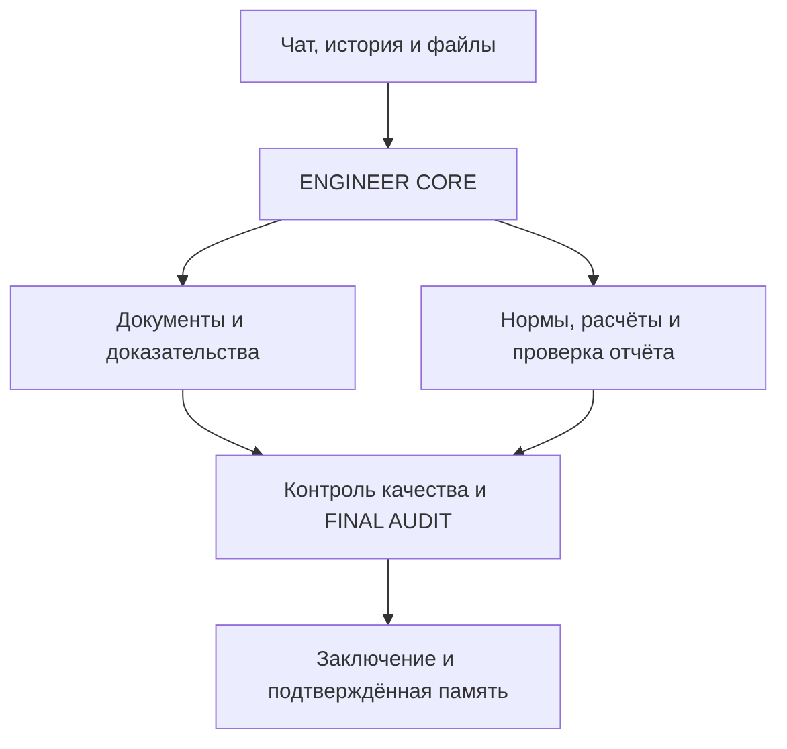

# ENGINEER OS — живая карта проекта

Обновлено: 06.10.2026. Это файл передачи состояния разработки, а не инженерное доказательство и не FINAL AUDIT. После существенного результата обновлять этот же файл; сохранять его имя и историю версий.

Идентичность этой карты: пользовательский файл `libfile_947c39aad11c81918c7887832c1411bb`, имя `ENGINEER_OS_PROJECT_MAP.md`. Для обновления использовать этот же ID и фактическую текущую версию. Правило сопровождения добавлено в `AGENTS.md`, указатель — в `docs/development/project-map-handoff.md` и README. Текущий локальный HEAD после нового прогона: `13200ab1a042ff1d4e2835844e275afacbfb13f4`; проверенная PDF-реализация: `e6498854bc8012d698afabb7c62e56db9b900d02`. Эти PDF-коммиты пока не опубликованы в GitHub.

## 1. Новому чату: сначала прочитай это

Мы продолжаем существующий ENGINEER OS пользователя Максима. Проект не начинать заново. Цель — бесплатное локальное инженерное приложение, а не только проверка одного PDF. Фундамент и адаптеры уже есть; первый локальный сценарий чат → файл → фоновая задача → ответ → история реализован и опубликован в PR38. Реальный запуск на Windows с qwen3 и принятый инженерный кейс пока не подтверждены.

Активный результат — локальный кабинет с подготовкой ENGINEER CORE и реестром кандидатов (разделы 18–20); Document Intelligence продолжается отдельно: достоверное извлечение документов объекта «БЦ, ул. Набережная, 28А», прежде чем использовать их как доказательства. Последний полный повторный прогон: **534 страницы, 523 без ошибки нормализации, 11 BLOCK; полностью подтверждённых страниц 0, документ BLOCK, FINAL AUDIT NOT_RUN, acceptance=false**. 523 — UNCERTAINTY, а не ACCEPTED.

Проверенный код восстановления: локальный commit `e6498854bc8012d698afabb7c62e56db9b900d02`, ветка `fix/pdf-completeness-audit`. Эти изменения НЕ опубликованы: автоматическая проверка отклонила push без явного разрешения на публикацию. PR #35 содержит прежний head `d20d8595094f452bd70d28c18f52cb7d0eede665`. Не пытайся воспроизвести новый результат старым кодом.

**Следующее конкретное действие:** продолжать локально: связать кандидат реестра с проверяемым извлечением страницы и координатами фрагмента, затем профильным исполнением CORE. Локальный реестр уже реализован PR40; MATCH подтверждает только точную цитату, все записи UNVERIFIED. Не передавать эти ID в accepted evidence gate. По прямому указанию Максима Windows и живая qwen3 — в последнюю очередь; не требовать запуска сейчас. 238 Python +4 Node и расширенный DOM smoke PASS; layout/CSP настоящего браузера NOT_RUN. PDF остаётся 523 UNCERTAINTY/11 BLOCK; разбирать отдельно третьи таблицы 179/341 и соседние 180/342 без фиктивного снятия BLOCK.

## 2. Зачем создаём систему

ENGINEER OS должен помогать инженеру обследовать здания и сооружения: читать ТЗ и отчёты, извлекать факты с координатами источника, проверять инженерную логику, нормы и расчёты, работать с ЛИРА/SCAD и DWG, готовить заключения, сохранять историю и подтверждённые знания.

Целевой пользовательский сценарий: локальный запуск → чат и файлы/Drive → проверка извлечения → реестр доказательств → профильные агенты → контроль качества → заключение → FINAL AUDIT → ACCEPTED только при выполненных условиях.

Требования пользователя: бесплатные решения, без обязательных платных API; Windows; один удобный запуск; чат, история, память, фоновые задачи; Google Drive для документов. Open WebUI + Ollama — выбранный локальный путь. Дополнительные модели возможны через адаптеры, но не должны превращаться в обязательную платную зависимость.

## 3. Границы и логическая карта



Схема показывает целевой поток, а не факт завершённой интеграции. ENGINEER OS отвечает за инженерную методологию и договоры данных. Runtime отвечает за запуск агентов, инструменты, сессии, очереди и доступ к файлам. Не переписывать runtime и не импортировать большие сторонние репозитории вместо нужного адаптера.

| Часть | Где код | Фактический статус |
|---|---|---|
| Инженерное ядро | `engineering/core/` | Планирование ролей связано с локальным worker в режиме CORE_PLAN; договоры и gates есть, специалисты и полный инженерный кейс не выполнены |
| Document Intelligence | `engineering/document_intelligence/`, `scripts/` | Docling, нормализация, provenance, source recovery и реестр; полнота документа не подтверждена |
| Нормативная проверка | `engineering/normative/verification.py`, `skills/normative-check/` | Структура проверки реализована; проверенных актуальных редакций и полного агента ещё нет |
| ЛИРА / SCAD | `engineering/calculation/model_intake.py`, `skills/calculation-review/` | Проверка комплекта и идентичности файлов; семантика моделей и solver-run не проверены |
| Модели | `engineering/model_gateway/openai_compatible.py` | Локальный gateway связан с новым кабинетом; синтетический HTTP/DOM сценарий PASS, настоящий qwen3 NOT_RUN |
| Память | `engineering/memory/external_memory.py` | Граница доверия и snapshots; история диалогов/задач нового кабинета сохраняется в SQLite, подтверждённая инженерная память ещё не подключена |
| Хранилище | `engineering/storage/` | Drive-адаптеры; OAuth пользовательского Windows требует отдельной проверки |
| База и acceptance | `supabase/migrations/`, Supabase-адаптеры | Миграции и gates есть; наличие облачных функций не означает воспроизводимость backend из Git |
| Интерфейс | `index.html`, `app.js`, `styles.css`, `auth-recovery.js` | Панель проектов/задач/агентов/аудита; отдельный локальный кабинет engineering/local_app/ui содержит чат, загрузку и историю; evidence review workflow ещё не связан |
| Локальный запуск | `scripts/run_v4_local.py`, `.cmd`, Docker/runtime | Start_ENGINEER_OS.cmd + scripts/run_local_app.py запускают новый кабинет с worker; запуск CLI здесь проверен, Windows launcher NOT_RUN |
| CAD / отчёт | Договоры ролей, `skills/report-review/`, `skills/final-audit/` | Завершённого DWG/CAD маршрута и принятого итогового отчёта нет |

Состояние облака из `application-status-2026-10-03.md` является наблюдением 03.10, а не свежей проверкой сегодня. Там обнаружен разрыв между облачными функциями и их исходниками в Git. Не повторять старые числа таблиц/функций как текущие без проверки.

## 4. Где работаем и чем пользуемся

| Место | Назначение и ссылка |
|---|---|
| Основной GitHub | https://github.com/maxim505885-jpg/engineer-os |
| Текущая ветка | `fix/pdf-completeness-audit`; draft PR https://github.com/maxim505885-jpg/engineer-os/pull/35 |
| Основание PR35 | `fix/pdf-region-ocr-repair`; ветки и PR были последовательными, main не равен последнему рабочему состоянию |
| Текущий локальный checkout | `/workspace/scratch/499af82b6df5/engineer-os` — временный путь этой сессии |
| Восстановленные входные данные | `/workspace/scratch/499af82b6df5/restored-checkpoint/` — распакованный проверочный архив |
| Прежний checkout | `/workspace/scratch/5b79d4619022/engineer-os-pdf-completeness`; здесь нашлись неопубликованные правки; это не постоянный адрес |
| Windows пользователя | Ранее использовались `C:\Users\maxim\engineer-os` и `C:\Users\maxim\engineer-os-docling-smoke`; актуальную папку проверять |
| Локальные модели пользователя | Ранее Open WebUI `http://127.0.0.1:8080`, Ollama и `qwen3:8b` работали; эта Linux-сессия не проверяла нынешний Windows |
| Дополнительные репозитории | `maxim505885-jpg/hermes-agent`, `codex`, `open-webui`, старый `ENGINEER-OS_`; не считать их основным кодом ENGINEER OS |

В этой сессии фактически использовались инструменты GitHub для чтения состояния, файлы проекта и Python/Node для проверки, Google Drive для исходника, сохранённые пользовательские файлы для передачи результатов. Доступность подключений проверять в новом чате. Supabase/Railway — компоненты инфраструктуры; их работа сегодня здесь не переаттестована. Figma/Sites не являются обязательным путём текущего локального приложения.

## 5. Какие документы используем

Основной PDF: `15.09.2026 ТЗК БЦ ул. Набережная 28А V4 сшито с графикой.pdf`, 534 страницы, 74 522 583 байта.

SHA256: `b5d95b660b35bfb6b2441623635cba91c235efd754bc283dfe1405f075834916`.

Drive file ID: `1Ycw-dcevqNSHgvb_y0pVa7B1lM4uhK6g`; ссылка https://drive.google.com/file/d/1Ycw-dcevqNSHgvb_y0pVa7B1lM4uhK6g/view . Полный оригинал также включён в архив продолжения. В архиве лежит `source/v4-drive-source.pdf`.

| Дополнительные источники | Что уже проверяли | Что не считать выполненным |
|---|---|---|
| Исходный полный отчёт DOCX | Нативная инвентаризация таблиц/изображений; выбранные фрагменты сопоставлялись с PDF | Полное соответствие страниц Word/PDF, полная семантическая проверка |
| `Расчет .docx` / `.doc`, `Таблицы.xlsx` | Таблица нагрузок сопоставлялась; 125 ячеек XLSX совпали с выбранной DOCX-таблицей | Применение нагрузок к расчётной модели |
| Координатный XLSX | Четыре формулы пересчитаны | Единицы, система координат и модельные привязки |
| Два файла `.lir` | Идентичность и бинарные заголовки ЛИРА-САПР | Геометрия, материалы, опоры, комбинации и результаты расчёта |
| Геодезия и графика | Оригиналы открывались и визуально инвентаризировались | Все размеры/подписи и полное соответствие V4 |
| Сжатый V3 | Отдельно идентифицирован; изображения ТЗ не дали большей разрешающей способности | Автоматическая эквивалентность V3 и V4 |

Нативный полный отчёт DOCX: пользовательский файл `libfile_10792d9386208191b103ee233d892250`, SHA256 `b253439bdd673a775eaf209ca7d398d766efae5f4a18ac33fa6679f7faae28a5`. Повторные загрузки могут иметь похожие имена и другие ID; выбирать по содержимому и SHA256, а не по дате или имени.

ТЗ на страницах 5–8 содержит трудночитаемые растровые фрагменты. Более качественное подтверждённое ТЗ пока не получено; Word/V3 не являются автоматически более точным источником. Извлечённые строки, OCR-кандидаты и совпадения отдельных таблиц не подтверждают весь документ.

## 6. Проверенное состояние PDF и кода

| Проверка на коде e649885 | Результат |
|---|---|
| Сырые экспорты, SHA источника | 534/534 проверены |
| Нативный текст и размещение изображений | 534/534 повторно сверены с исходником |
| Исходные ошибки нормализации | 126 страниц |
| Ошибки сняты по картам исходника | 115 страниц |
| Без BLOCK нормализации | 523 страницы UNCERTAINTY |
| Остаток BLOCK | 11 страниц |
| Отдельный аудит нативных сеток | 59 таблиц, 6119 ячеек; ограниченный выбранный scope |
| Смешанные визуальные assets | 102 SHA256 проверены |
| Полнота страниц / документа | 0 полностью подтверждённых страниц; документ BLOCK |
| Регрессия разработки | 227 тестов Python, 4 теста Node, синтаксис app.js и diff check прошли |
| Воспроизведение | Архив распакован, 1514 файлов сверены по хешам; повторный полный прогон дал тот же постраничный реестр |
| Инженерный FINAL AUDIT | NOT_RUN; ACCEPTED не выдан |

Это повторная нормализация сохранённых экспортов Docling текущим кодом. Новый полный запуск Docling не выполнялся. PASS привязки к источнику не доказывает полноту физической сетки или смысл извлечённых значений. Короткие/бледные/прерывистые внутренние линии эвристика может пропустить; она не выдаёт сертификат полноты.

Восстановлены ранее неопубликованные адаптеры ручных растровых ячеек и измеренного дрейфа векторных осей. Добавлены исходные одноколоночные панели страниц 57–58 с проверкой подписи по native words, digest целевого экспорта и изображениями исходных ячеек. Исправлены обходы через пропущенные внутренние линии и перезапись исходника через hardlink. Серая заливка без рамки не должна считаться физической сеткой.

История чисел: опубликованный реестр был 498/36; прежний неопубликованный результат 521/13 пересмотрен после усиления проверки; промежуточные 523/11, 515/19 и 513/21 не являются текущим итогом. Новый подтверждённый source-bound прогон — 523/11 на e649885, 177.81 с. Предыдущие 512/22 относятся к 6da5964. Одинаковые числа разных прогонов не означают одинаковые проверки. Не смешивать количество выбранных таблиц, ячеек, страниц и полноту документа.

## 7. На чём остановились и что уже продолжили

BLOCK-страницы: **3, 5, 7, 9, 171, 179, 341, 481, 486, 488, 500**.

Детектор светлых рамок исправлен и проверен на оригинальных пикселях всех просмотренных растровых карт страниц 176–180, 255–257, 338–342. Светлый пиксель должен иметь более светлый фон с обеих сторон в пределах трёх исходных пикселей: яркость <232, контраст >=24. Общий тёмный порог 128 не повышен. Серая заливка без рамки отклоняется; светлые необъявленные разделители тоже отклоняются. Отдельные тесты проверяют рамку в 1–2 пикселях от края изображения и светлый разделитель рядом с чёрной рамкой. Независимое ревью обнаружило близкий разделитель; замечание исправлено и перепроверено.

| Остаток | Подтверждённая причина | Следующее действие |
|---|---|---|
| 179, 341 | Первые две просмотренные растровые таблицы восстановлены; table_index=2 полного экспорта не имеет карты. На исходной странице нижняя часть таблицы продолжается за изображением, замкнутой нижней рамки нет | Восстановить связь с продолжением на следующем листе и явно учитывать незамкнутую границу; не дорисовывать рамку |
| 9 | Правая граница cost-header-price не подтверждается | Отдельно сопоставить незамкнутую структуру с источником |
| 3, 5, 7, 171, 481, 486, 488, 500 | Неоднозначные/пропущенные ячейки; полного применимого восстановления нет | Индивидуальная привязка к исходной странице; ТЗ проверять по читаемому источнику |

На странице 500 отдельно просмотрен исходный графический лист: планы и условные обозначения, нативных слов и embedded images нет. Docling предложил таблицу по графическим объектам/легенде. Это диагностическое наблюдение, а не готовое восстановление текста или разрешение исключить целевой узел.

Текущий полный реестр: `/workspace/scratch/499af82b6df5/v4-contrast-final-recheck-20261005/page-register.json` и CSV. Полный source-bound replay: 534 raw exports, 534 native inventories, 115 устранённых из 126 исходных ошибок; 523 UNCERTAINTY / 11 BLOCK. Результаты recovery сохранены в дополнительном пользовательском архиве **ENGINEER_OS_contrast_checkpoint_2026-10-05.zip**. Он дополняет, а не заменяет исходный checkpoint. Внутри cumulative patch от remote d20d859 до текущего локального HEAD и инструкция воспроизведения.

Промежуточный первый вариант фиксированных флангов дал 515/19; это историческая диагностика, НЕ текущий результат. После регрессий и исправления локального поиска флангов полный прогон дал 523/11. Acceptance=false, 0 полностью подтверждённых страниц, FINAL AUDIT NOT_RUN.

## 8. Как воспроизвести и что читать в коде

Для нового результата 523/11 использовать исходный архив вместе с **ENGINEER_OS_contrast_checkpoint_2026-10-05.zip**: применить cumulative patch к чистому checkout d20d859, затем выполнить команду из CONTINUATION.md дополнительного архива. Старый patch 6da5964 и старый реестр сами по себе дают 512/22, а не текущий результат.

Постоянный архив: **ENGINEER_OS_continuation_2026-10-05.zip**, пользовательский файл `libfile_7408d21eac00819195eba3d01c4f4c91`. 88 147 091 байт, SHA256 `fbd315d683976adcec5d2278268e8110ada7773589d706cc705989706892b4b5`.

Внутри: оригинальный PDF; `checkpoint/` с 534 raw exports, native inventories, картами и изображениями; `review/page-register.json` и CSV; `CONTINUATION.md`; `input-file-sha256.json`. Код и OCR-модели в этот архив не включены. Проверенный код — отдельный локальный commit; патч `ENGINEER_OS_changes_6da5964.patch` находится в `/workspace/scratch/499af82b6df5/deliverables/`. Если локальный checkout исчезнет до публикации, сначала восстановить патч; не выдумывать отсутствующий remote commit.

Отчёт продолжения: `ENGINEER_OS_progress_2026-10-05.md`, пользовательский файл `libfile_2057cf38a8908191a74446569547777c`.

После восстановления исходных данных и проверенного кода, из корня проекта:

```bash
python3 -m pip install -r requirements-pdf-review.txt
python3 -m unittest discover -s tests -q
node --test tests/dashboard_counts.test.cjs
node --check app.js
git diff --check
python3 scripts/recheck_v4_exports.py /absolute/restored/source/v4-drive-source.pdf --checkpoint-dir /absolute/restored/checkpoint --output-dir /absolute/new-recheck
```

Выходная папка должна быть новой, вне `checkpoint`. Установка requirements-пакета не устанавливает полный Docling; повторный реестр использует архивные экспорты. Здесь проверены PyMuPDF 1.26.6 и Pillow 12.3.0; это не аттестация Windows пользователя.

| Файл относительно корня Git | Для чего открыть |
|---|---|
| `AGENTS.md` | Обязательные инженерные договоры и дисциплина работы |
| `docs/ARCHITECTURE.md`, `docs/AGENT_CONTRACTS.md`, `docs/FINAL_AUDIT.md` | Границы системы, роли, условия приёмки |
| `docs/development/application-status-2026-10-03.md` | Фактические ограничения MVP; сведения об инфраструктуре исторические |
| `docs/development/pdf-page-register-2026-10-05.md`, `v4-continuation-summary-2026-10-05.json` | Текущая сводка 523/11 на e649885; code_file_sha256 сверяет реализацию |
| `scripts/recheck_v4_exports.py` | Полный реестр и точная идентичность входов/кода |
| `scripts/recover_reviewed_raster.py` | Растровые ячейки, `_line_fraction`, `_checked_cells`, порог RULING_DARKNESS |
| `scripts/source_pdf_tables.py`, `recover_source_panels.py` | Измеренные оси и одноколоночные панели |
| `scripts/recover_docling_export.py`, `recover_native_pdf_regions.py`, `capture_pdf_grid_assets.py` | Нативные/смешанные карты и проверка source binding |
| `engineering/document_intelligence/docling_adapter.py`, `evidence_validation.py`, `evidence_persistence.py` | Нормализация, доверие кандидатов и persistence gates |
| `tests/test_reviewed_raster.py`, `test_source_panels.py`, `test_source_pdf_tables.py`, `test_recheck_v4_outputs.py` | Регрессии recovery и защиты исходника |
| `docs/development/object-source-audit-2026-10-04.md`, `tor-soil-source-check-2026-10-05.md` | Ограниченные проверки Word/XLSX/LIR и альтернативных источников |
| `docs/development/curated-repositories-catalog-2026-10-04.json` | 100 репозиториев уже просмотрены по README/метаданным; это не доскональный аудит всего кода |

Полный старый `docs/development/pdf-page-register-2026-10-05.json` в Git хранит исторические 498/36. Текущий полный JSON — внутри архива, не этот исторический файл.

## 9. Что ещё нужно довести до приложения

| Приоритет | Работа | Проверяемое условие завершения |
|---|---|---|
| PDF | Детектор исправлен; 11 оставшихся BLOCK, полнота текста/рисунков/связей | Source-bound проверки, постраничное покрытие; отсутствие ошибки нормализации не заменяет полноту |
| Параллельно PDF | Воспроизводимый backend и локальный runtime + Ollama | Один реальный task без обязательного платного ключа; исходники/конфигурация доступны |
| MVP | Чат, upload/Drive, история, review UI и worker | Один запускаемый локальный пользовательский сценарий с историей и очередью |
| Инженерный кейс | Выбранные проверенные evidence → ТЗ → профильные проверки → контроль | Прослеживаемые выводы по одному реальному объекту; разрешённый FINAL AUDIT |
| Расчёты | Семантика ЛИРА/SCAD, нагрузки, опоры, единицы, комбинации, solver | Реальные результаты и логи, соответствие фактической конструкции |
| CAD и выпуск | DWG/CAD и проверяемый отчёт | Подтверждённый графический маршрут и выпуск документа без выдуманных данных |
| Память / обучение | Использование подтверждённых результатов | Кандидаты, чужие сообщения и snapshots не получают статус доказательств автоматически |

Проверка PDF не должна останавливать независимые задачи приложения. При этом полный непроверенный текст нельзя использовать для принятого инженерного вывода. Не заменять интеграцию установкой очередного agent framework: границы runtime уже определены.

## 10. Правила, которые нельзя терять

Факт важнее предположения. ТЗ определяет scope. Различать PROJECT, ACTUAL, MEASURED, TESTED, CALCULATED, ASSUMED, INTERPRETED, UNKNOWN; неизвестное не заполнять «правдоподобным» значением.

Не искать дефекты ради списка замечаний и не объявлять правильный отчёт ошибочным из-за несовпадения с шаблоном системы. «Не видно» не равно «нет». OCR-кандидат, confidence и processed в БД не равны доказательству, полноте или ACCEPTED. Не дорисовывать цифры/рамки, не менять запятые/единицы или строки оригинала молча.

Нормативы: документ → редакция → область применения → пункт → требование → фактическое условие → сравнение → вывод. Проверять действительность и применимость перед использованием. Наличие LIR-файла не означает выполненный расчёт. PASS отдельного теста не означает FINAL AUDIT.

## 11. Как обновлять карту и продолжать в новом чате

При старте: найти **ENGINEER_OS_PROJECT_MAP.md** в пользовательских файлах, прочитать целиком; затем проверить `git status`, HEAD/ветку, текущий PR и SHA источника. Считать временные пути подсказками, а не гарантированными адресами. Если карта расходится с наблюдением, записать расхождение и проверить источник.

После каждого существенного изменения/проверки обновлять в этом же файле: дату, текущую задачу, локальный HEAD и remote HEAD отдельно, выполненные действия, фактические результаты/границы проверки, оставшиеся BLOCK, следующее конкретное действие и расположение новых данных. Исправлять старые текущие числа; историю кратко сохранять отдельно.

Обновлять существующий пользовательский файл с сохранением ID/версий, а не создавать десятки новых карт. Полученный при сохранении ID файла хранить в локальном указателе; не угадывать его. При конфликте версии сначала прочитать актуальную версию и сохранить чужие изменения. Эта карта не обновляется фоновым расписанием сама по себе: её обновляет работающий над проектом агент.

Публикация неопубликованного PDF-кода в GitHub ранее отклонена автоматической проверкой; это не относится к уже разрешённым и опубликованным интеграциям. Не обходить отказ другим инструментом. После явного разрешения — отправить проверенный локальный код в ту же рабочую ветку, обновить draft PR, проверить CI; слияние и развёртывание учитывать как отдельные действия. Сейчас можно продолжать локальные изменения, диагностику и сохранение результатов.

Следующее конкретное действие: проверить исходную третью таблицу страниц 179/341 и её продолжение на 180/342, подготовить source-bound контракт для открытой границы без фиктивной рамки. Независимо от этого продолжать локальный сценарий приложения (Ollama → задача → история). Ограничения инженерного принятия PDF не блокируют разработку приложения. Блок «Работаю дальше» не добавлять в ответы пользователю.

Сообщение для нового чата: «Продолжай ENGINEER OS. Найди и прочитай ENGINEER_OS_PROJECT_MAP.md целиком, проверь фактическое состояние и выполняй раздел “Следующее конкретное действие”. Не начинай проект заново. После результата обновляй эту же карту».

## 12. Краткая история последних действий

- 03.10: зафиксированы фундамент и реальные ограничения приложения; полного MVP нет.
- 04–05.10: полный исходник V4, архивные экспорты и нативные инвентари проверены; исследованы дополнительные Word/XLSX/LIR источники и каталог 100 репозиториев.
- 05.10: восстановлены неопубликованные raster/axis адаптеры; добавлены панели 57–58; после усиления guards подтверждён реестр 512/22 и повторное воспроизведение архива; локальный code commit 6da5964, push отклонён.
- Текущий проход: создана и обновлена живая карта; правило её сопровождения добавлено в AGENTS.md и README отдельным локальным docs-коммитом. Продолжена диагностика 14 отказавших периметров, выделены 13 страниц с зависимостью от абсолютного порога и отдельная незамкнутая граница страницы 9. Хеши проверенной PDF-реализации сохранились; нового полного прогона и исправления детектора в этом проходе пока нет.

## 13. Проверка семи дополнительных репозиториев — 05.10.2026

По запросу Максима выполнен статический выборочный обзор README, лицензий, деревьев и выбранных исходников семи проектов. Полный обзор: `ENGINEER_OS_repository_review_2026-10-05.md`. Это исследование; установки, подключения и runtime-проверок этих инструментов нет.

| Кандидат | Для чего нам нужен | Рекомендация |
|---|---|---|
| browser-use/browser-use | Браузерные процессы и проверка будущего UI; MIT; ChatOllama есть в коде | Пилот после сквозного UI; локально явно выключить ANONYMIZED_TELEMETRY и BROWSER_USE_CLOUD_SYNC, проверить сеть |
| rohitg00/agentmemory | Память локального кодинг-агента; Apache-2.0; Node>=20 + iii engine; BM25 без ключа | Отдельный Windows/русскоязычный пилот; не заменять карту и evidence |
| K-Dense-AI/scientific-agent-skills | SymPy, статистика, графики, при необходимости геоданные; MIT; 177 навыков | Выборочно; scientific-schematics требует OpenRouter; bundled PDF/Office навыки удалены |
| cathrynlavery/diagram-design | Карта архитектуры/доказательств; MIT; 42 типа; HTML/SVG | Для документации; убрать Google Fonts при автономном локальном экспорте |
| mukul975/Anthropic-Cybersecurity-Skills | Проверки API/прав/RAG; Apache-2.0; независимый community-проект | Защитная выборка; адаптировать скрипты и ожидаемые результаты, не запускать весь каталог |
| ai-boost/awesome-harness-engineering | Handoff, checkpoints, трассы, восстановление; LICENSE CC0 | Методики, не новый движок оркестрации |
| volcengine/OpenViking | Большая база ресурсов/памяти/навыков; основной сервер AGPL-3.0 | Отложить до потребности; большой стек, модели и Windows-путь требуют пилота |

Общая граница: память/поиск/браузер/навыки не выдают инженерное принятие вместо нашего ядра. Массового импорта навыков не планировать; не вводить две системы памяти одновременно. Бесплатный код не означает бесплатный облачный браузер/модель/API.

Ни один кандидат не устранил текущую ошибку PDF-рамок. Это историческое состояние до исправления; актуальный результат и следующие действия приведены в разделах 6–7 и 11. Реестр 512 UNCERTAINTY / 22 BLOCK, acceptance=false, HEAD 4743ec4 и проверенная реализация 6da5964 не изменились; нового полного прогона нет.

История: 05.10 — проверены семь дополнительных репозиториев; сформирована выборка для документации, разработки и будущих пилотов, сохранён отдельный обзор. Интеграций и публикации кода не выполнено.

## 14. Размещение карты на GitHub — 05.10.2026

По явному запросу Максима карта добавляется в корень репозитория `maxim505885-jpg/engineer-os`, путь `ENGINEER_OS_PROJECT_MAP.md`. Ветка документации: `docs/project-map-handoff-20261005`; её база — main `88f1b9cb03f6a0f686a1a58884a503bdf1d338d1`. В README добавлена ссылка, в AGENTS.md — правило чтения и сопровождения; указатель находится в `docs/development/project-map-handoff.md`.

Этот коммит содержит документацию. Проверенная PDF-реализация 6da5964 и локальный docs-коммит 4743ec4 в него не входят; прежний draft PR #35 не обновляется. Карта в ветке документации описывает состояние рабочей ветки PDF, а не наличие всех этих изменений в main. Слияние PR и развёртывание приложения не выполнены.

Новый чат может читать карту непосредственно из указанной ветки GitHub. После слияния читать тот же путь в main. Сохранённый пользовательский файл имеет тот же ID; при сопровождении поддерживать обе копии согласованными, сверять фактические refs и не считать опубликованную карту подтверждением инженерного принятия.

## 15. Выбранные upstream-репозитории добавлены локально — 05.10.2026

По запросу «Все репозитории которые нам нужны добавляй» подготовлена отдельная ветка `feat/selected-integrations-20261005` от опубликованного PDF checkpoint `d20d8595094f452bd70d28c18f52cb7d0eede665`. Рабочая копия: `/workspace/scratch/499af82b6df5/engineer-os-integrations`. Коммиты: `23b9393` (исходники/адаптеры) и `cd5a0a1ac640be399a0d3566994a1e3f7157440c` (исправления локальных настроек). Эта ветка не включает неопубликованную PDF-реализацию 6da5964 и её docs-коммит 4743ec4.

Фактически добавлено:
- Шесть git submodules в `third_party/`: Browser Use, Agent Memory, Scientific Agent Skills, Diagram Design, Cybersecurity Skills, Awesome Harness Engineering. Их checkout HEAD сверены с шестью commits из обзора; `.gitmodules` и `integrations/upstreams.json` фиксируют URLs, commits, лицензии и выбранные пути. OpenViking остаётся отложенным.
- `engineering/memory/agentmemory_http.py`: чтение real REST memories endpoint с project/q/latest/limit; чужие, устаревшие, повторные и malformed записи отвергаются. Контекст UNVERIFIED / NOT_EVIDENCE. Генерируемый upstream секрет читается только для loopback destination, явный env имеет приоритет.
- `engineering/integrations/local_http.py`: HTTP только loopback, без proxy/redirects, ответ ограничен 1 MiB, timeout.
- `engineering/integrations/browser_use_local.py`: явно включаемый Browser Use + Ollama; qwen3:8b использует текстовый режим, telemetry/cloud sync/авторасширения/CAPTCHA/downloads отключены; Ollama без env proxy/redirects; ограничение шагов и времени, очистка временных файлов. Domain policy upstream допускает www-вариант корневого домена и не является сетевой песочницей.
- `scripts/integration_tools.py`: status, memory-recall, browser-run. `requirements-integrations.txt`: отдельное optional environment. `integrations/README.md`: Windows-подготовка и выборочное использование научных/диаграммных/защитных методик. Сторонние SKILL.md не импортированы в SkillLoader и не активируются автоматически.

Проверки: baseline этой опубликованной основы — 194 Python tests; после изменения — **201 Python tests и 4 Node tests**, syntax/compileall/diff checks проходят; 6/6 source pins сверены. Транспорт проверен на локальном синтетическом HTTP-сервере, browser constructor/cleanup — на dependency doubles. Независимый review выполнен; настройки text-only модели, авторизации и local proxy исправлены после воспроизводимых failing tests. Это не live-проверка Browser Use, Ollama, iii/AgentMemory или Windows; эти проверки **NOT_RUN**. Качество русского memory retrieval и работы qwen3:8b в браузере не установлено.

**Код опубликован после явного разрешения Максима 05.10.2026:** ветка `feat/selected-integrations-20261005`, remote HEAD `06ed75bddf6bf1849e58d48ae03b9f6ec4240763`, [PR #37](https://github.com/maxim505885-jpg/engineer-os/pull/37) → `fix/pdf-completeness-audit`. PR открыт, не слит. Git tree `c89e6f207a360075120a1d7129b8c9812b8f3d00` совпадает с проверенным локальным payload (18 файлов). Локальные два коммита 23b9393/cd5a0a1 опубликованы одним коммитом с тем же содержимым через подключённый GitHub: CLI push остановился из-за отсутствия локальных учётных данных.

История публикации: первая попытка push была отклонена automatic approval review из-за отсутствия признанного явного разрешения на конкретный payload; после вопроса с описанием изменений пользователь ответил «Да делай разрешаю». Эта блокировка для подготовленного payload снята. Просматриваемый `ENGINEER_OS_selected_integrations.patch` сохраняет исходный diff относительно d20d859.

Это изменение не исправляет PDF и не меняет подтверждённые 512 UNCERTAINTY / 22 BLOCK, document BLOCK, acceptance=false; нового полного PDF-прогона нет. Код PDF 6da5964 с 223 исторически подтверждёнными tests отличается от базы новой ветки; не смешивать эти числа с 201 tests этой поставки.

Следующее действие для подключений — проверить PR #37 и выполнить Windows/local runtime smoke. Слияние PR или развёртывание приложения не выполнялись. Детектор светлых линий уже исправлен в последующем шаге; актуальный остаток и следующий инженерный шаг — в разделах 7 и 11.

## 17. Новый результат исправления светлых рамок — 05.10.2026

Проверенный code commit: e6498854bc8012d698afabb7c62e56db9b900d02. Локальный HEAD после сводки: 13200ab1a042ff1d4e2835844e275afacbfb13f4. Полный replay: 523/11, 177.81 с; код на момент конца прогона clean. Регрессия: 227 Python + 4 Node; compileall, app.js syntax и diff check успешны. Независимое ревью повторно проверило 32 варианта светлых внутренних линий и семь заливок; блокирующих замечаний не осталось.

Сняты ошибки извлечения на 11 страницах: 176, 177, 178, 180, 255, 256, 257, 338, 339, 340, 342. На 179/341 устранена прежняя ошибка рамок, но остаётся третья таблица. Документ остаётся BLOCK для инженерного принятия; это не препятствие независимой работе приложения.

GitHub PDF-ветка и PR35 ещё содержат d20d859; ни старый неопубликованный код 6da5964, ни новый e649885/сводка не отправлены. Предыдущее разрешение публикации шести интеграций уже реализовано в PR37 и не выдаёт старые PDF-коммиты за опубликованные. Документальная ветка карты обновляется отдельно без этих PDF-файлов; актуальный SHA получать из refs/heads/docs/project-map-handoff-20261005. PR36 остаётся открытым, слияние не выполнено. Разделы 13–16 фиксируют историю публикации интеграций; их прежние 512/22 относятся к тому моменту.


## 18. Локальный кабинет опубликован — 06.10.2026

Ветка `feat/local-app-mvp-20261005`, [draft PR38](https://github.com/maxim505885-jpg/engineer-os/pull/38) → `feat/selected-integrations-20261005`. Remote HEAD `98398cda2194fe66582ef6eb8d8516d4879a39de`; локальный HEAD `34bf5a338cb7c010487e550d4c762b4211d8ec74`, worktree `/workspace/scratch/499af82b6df5/engineer-os-local-app`. Опубликованное дерево `2df8960115a44f1ba4d8f5599a9ebb336e684e16` совпадает с проверенным локальным деревом, 23 файла относительно 06ed75b. PR открыт, не слит; main и существующая облачная панель не обновлены. Старые неопубликованные PDF-исправления в эту ветку не входят.

Реализовано:
- `engineering/local_app/store.py`: SQLite/WAL, диалоги, сообщения, оригиналы, очередь QUEUED/RUNNING/SUCCEEDED/FAILED, атомарный claim и одна активная задача на диалог. История сохраняется между запусками; старые RUNNING показываются как прерванные, QUEUED остаются в очереди.
- `files.py`: TXT/MD/PDF до 100 MiB, неизменённый оригинал с SHA256; текст до 100000 символов, PDF первые 20 страниц при наличии PyMuPDF. Скан/ошибка парсера не теряют оригинал. Всё UNVERIFIED/UNAVAILABLE, не доказательство; до 200 видимых вложений в диалоге, превышение явно отклоняется.
- `model.py`, `worker.py`: существующий OpenAI-compatible gateway, локальные Ollama/Open WebUI без env proxy/redirects; qwen3:8b по умолчанию. Ограниченный контекст, однопоточный worker, ошибки видны в задачах. Socket timeout не является доказанным жёстким общим deadline.
- `server.py`, `lock.py`, `ui/`: кабинет только 127.0.0.1, Host/Origin/token, инертный вывод текста, безопасное скачивание оригиналов, exclusive data lock. История/переключение диалогов/выбор вложений/фоновые состояния.
- `Start_ENGINEER_OS.cmd`, `scripts/run_local_app.py`: один локальный запуск при имеющихся Python 3.12+ и Ollama; состояние по умолчанию `.engineer-os/local-app`. Никаких обязательных платных ключей. Инструкции `docs/development/local-app.md`; фактическая проверка `local-app-verification-2026-10-05.md`.

Проверено: **228 Python + 4 Node PASS**, compileall/JavaScript syntax/diff check PASS. Настоящий локальный HTTP и SQLite, но синтетический сервис модели; отдельно DOM integration (jsdom) проверяет запуск CLI, upload-event, source context, worker, chat, инертный markup, reload и session switch. Независимое whole-branch ревью выявило три Important/P2: обход токена неканоническим request target, потерю числового текста PDF, невидимость 201-го файла. Для каждого сначала FAIL тест, затем один проход исправлений и полный PASS. Навигация после отправки также исправлена и защищена DOM регрессией.

Реальный V4 сохранён с исходным SHA256; частичный текст 20/534 страниц явно не проверен. Полнота V4 не перепроверялась: остаётся **523 UNCERTAINTY /11 BLOCK**, acceptance=false, FINAL AUDIT NOT_RUN.

**NOT_RUN:** Windows launcher, настоящий qwen3 inference/Ollama/Open WebUI, визуальный Chromium/layout/CSP. Браузер здесь отклонил loopback URL, доступной настоящей Ollama нет. UI ещё не связан с ENGINEER CORE/evidence gates, Drive OAuth, OCR/Docling review, инженерной памятью, CAD и solver. Любой ответ модели принудительно UNCERTAINTY /NOT_EVIDENCE /acceptance=false /FINAL AUDIT NOT_RUN, даже если текст модели заявляет ACCEPTED.

Дальше: live Windows smoke → задания ENGINEER CORE и видимый evidence register → Drive и подтверждённая память. PDF разбирать отдельно по оставшимся 11 страницам; локальный кабинет не выдавать за завершённую инженерную систему. Новый чат читает эту карту, AGENTS.md и docs/development/project-map-handoff.md, проверяет refs PR38/37/36/35 и продолжает соответствующий checkout без повторной реализации.


## 19. ENGINEER CORE связан с локальными заданиями — 06.10.2026

Пользователь явно поручил выполнять работу самостоятельно локально, проверку Windows оставить последней. Поэтому настоящий Windows/qwen3 smoke больше не является условием продолжения разработки.

Опубликована ветка `feat/local-core-plan-20261006`, [draft PR39](https://github.com/maxim505885-jpg/engineer-os/pull/39) → `feat/local-app-mvp-20261005`. Remote HEAD `a70ec31f77aa652f52c6b9a8d906ae010e37b4c1`; локальный HEAD `14ff51237abd0dcc24619d5d25bf6cefed5f721c` в `/workspace/scratch/499af82b6df5/engineer-os-local-app`. Деревья совпадают: `79274352500a1c366f51c7444a3d79cb8d1ac2ad`, 11 файлов относительно PR38. Все PR остаются открытыми, не слиты; main не обновлён.

Реализовано в существующем сценарии:
- Явный режим «План проверки по ТЗ» в composer. Пользователь выбирает сохранённые оригиналы и вводит ТЗ; обычный чат не превращается в ТЗ автоматически.
- `Store.enqueue(..., mode='CORE_PLAN', requested_checks=...)` сохраняет режим/проверки в очереди, проверяет источники того же диалога и валидность checks. Existing SQLite расширяется без удаления истории; старые задачи остаются CHAT.
- `worker.py` вызывает `core_plan.prepare`, затем реальный `EngineerCore.plan` и сохраняет результат, без запроса к модели. По умолчанию report/normative + обязательный FINAL AUDIT; API также inspection/calculation.
- Раскрываемая карточка плана: специалисты NOT_RUN, оригиналы с ID/SHA256, UNVERIFIED_SOURCE/NOT_EVIDENCE, недостающие извлечение/реестр/проверки/audit. План и ТЗ восстанавливаются после открытия базы/диалога.

**Проверки:** 232 Python +4 Node PASS, compileall/JS syntax/diff check PASS. HTTP queue→worker→plan→SQLite подтверждён без модели. Расширенный DOM smoke проверяет выбор режима, source context, отсутствие лишнего model request, инертный план и восстановление после reload. Первоначальный DOM reload тест выбирал новый пустой диалог; исправлен выбор исходного диалога, повторный PASS. Независимое ревью выявило malformed mode []/{}→500; тест сначала FAIL, после проверки строкового типа API отвечает 400, полный набор PASS. Изоляция, миграция и fail-closed граница замечаний не получили.

**Границы:** это подготовка инженерной проверки, не исполнение специалистов. Никаких evidence_ids или принятого заключения, UNCERTAINTY, acceptance=false, FINAL AUDIT NOT_RUN. Файл/SHA256 подтверждает идентичность сохранённого оригинала, не достоверность его содержания. Реальный Chromium снова ERR_BLOCKED_BY_CLIENT на loopback; layout/CSP не проверены. Windows/live inference оставлены на последний этап. PDF не менялся и не перепроверялся: 523 UNCERTAINTY/11 BLOCK.

Следующий локальный шаг — реестр доказательств с явной фиксацией источника/страницы/фрагмента и проверкой происхождения. Не объявлять реестр подтверждённым только от ввода текста человеком или модели. Затем можно подключать профильное исполнение и Drive; обязательную Windows-проверку выполнить в конце перед заявлением готового пользовательского приложения.


## 20. Реестр кандидатов с привязкой к оригиналу — 06.10.2026

Опубликована ветка `feat/local-evidence-register-20261006`, [draft PR40](https://github.com/maxim505885-jpg/engineer-os/pull/40) → `feat/local-core-plan-20261006`. Remote HEAD `87bee311bacb88033df618308960f595663e7786`; локальный HEAD `a16a1c2bd82b5c905bf2a70d1cec5b1a932381f2`, checkout `/workspace/scratch/499af82b6df5/engineer-os-local-app`. Проверенное локальное и опубликованное дерево совпадают: `30c99e0658a2a8b087ebb69db350a4913f8313f2`, 11 файлов относительно PR39. PR открыт, не слит; main не обновлён.

Состав: `engineering/local_app/evidence.py`, таблица `local_evidence` в Store, защищённый POST `/api/sessions/:id/evidence`, snapshot.evidence и UI-форма «Реестр · непроверенные кандидаты». Пользователь выбирает оригинал, страницу PDF, точную цитату и заявление/интерпретацию.

Перед сохранением сервер проверяет принадлежность оригинала диалогу, размер/SHA256 сохранённых байтов и точное совпадение текста. TXT/MD — UTF-8 оригинал без выдуманных страниц. PDF — native текст указанной страницы, включая страницу 21 за пределами preview первых 20. Ошибочная цитата/страница/чужой файл/изменённые байты отклоняются. При отсутствующем parser/скане/защищённом или повреждённом PDF запись только NOT_CHECKED с явной необходимостью ручной проверки. Лимит 500 на диалог атомарный; все сохранённые записи видны, сохраняются между запусками.

Каждый кандидат имеет UUID, file_id, source_sha256, page, quote, statement, data_class (по умолчанию U), data_class_verified=false, source_match=MATCH/NOT_CHECKED, status=UNVERIFIED, acceptance=false, FINAL AUDIT NOT_RUN. MATCH означает совпадение текста, не подтверждение содержания или измерения. Координаты, полнота и инженерная достоверность ещё не проверены. Кандидаты не передаются как accepted evidence в CORE/Supabase; endpoint принятия отсутствует. Существующий Document Intelligence evidence_validation не подменён более слабой проверкой цитаты.

**Проверки:** 238 Python +4 Node PASS; compileall/JS syntax/diff PASS. Сначала пять module FAIL и DOM missing-form FAIL, затем реализация. HTTP регрессия проверяет token, сохранение, ложную цитату и игнорирование присланного acceptance=true. DOM проверяет инертный markup, восстановление кандидата и изоляцию черновика между диалогами. Независимое ревью воспроизвело перенос quote/statement/page при смене диалога; тест сначала FAIL, после сброса полей PASS. Reviewer отдельно проверил 15 evidence/API тестов и DOM, remaining Critical/Important нет.

Windows, настоящий qwen3 и настоящий визуальный browser остаются NOT_RUN; Windows последний по требованию пользователя. Эта работа не изменяла/не перепроверяла исходный V4: 523 UNCERTAINTY/11 BLOCK, document BLOCK, acceptance=false. Следующий локальный шаг — проверяемая страница/координаты и связь с полным DI evidence workflow; не автоматически принимать текст пользователя или модели.
